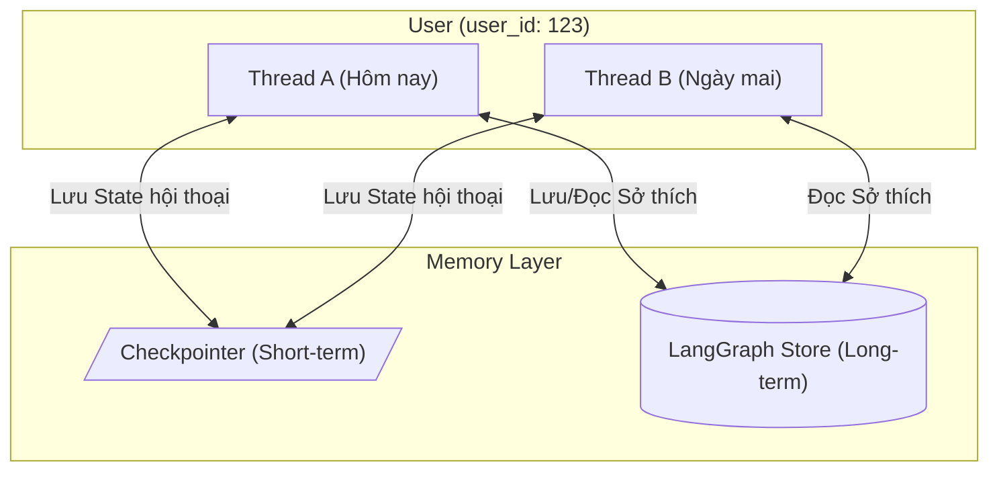

# Bài 1.8 — Long-term Memory: Bộ Nhớ Cho Nhiều Session

## Agenda

**Thời gian đọc ước tính:** ~10 phút

### Learning outcome:
- **Hiểu** được sự khác biệt giữa Short-term Memory và Long-term Memory, và tại sao Agent cần lưu trữ thông tin dài hạn.
- **Giải thích** được cơ chế hoạt động của LangGraph Stores và cách dữ liệu được tổ chức (Namespace, Key-Value).
- **Tự tay** tích hợp được `InMemoryStore` và cấu hình Vector Search (Semantic Search) cho Agent.
- **Phân biệt** được khi nào nên dùng Checkpointer và khi nào nên dùng Store.

## Glossary & Vocabulary

**1. Technical Terms (Thuật ngữ kỹ thuật):**
| Term | Vietnamese Meaning & Quick Explain |
| :--- | :--- |
| **Long-term Memory** | Bộ nhớ dài hạn. Khả năng lưu trữ và truy xuất thông tin xuyên suốt nhiều cuộc hội thoại khác nhau (across threads/sessions). |
| **Namespace** | Không gian tên. Một định dạng phân cấp (giống như thư mục) để nhóm các dữ liệu liên quan lại với nhau (ví dụ: nhóm theo `user_id`). |
| **Semantic Search** | Tìm kiếm theo ngữ nghĩa. Sử dụng Vector Embeddings để tìm kiếm các dữ liệu có ý nghĩa tương tự thay vì chỉ khớp từ khóa (exact match). |
| **Checkpointer** | Trình lưu trạng thái. Cơ chế lưu trữ toàn bộ graph state của một thread cụ thể (dùng cho Short-term memory). |
| **Store** | Nơi lưu trữ Key-Value độc lập với thread, cho phép Agent lưu giữ những preferences hoặc facts dài hạn. |

**2. Vocabulary Support (Từ vựng học thuật/B1+):**
| Word | Meaning in Context (Nghĩa trong ngữ cảnh) |
| :--- | :--- |
| **Persist (v)** | Lưu trữ lâu dài, tồn tại xuyên suốt. |
| **Arbitrary (adj)** | Bất kỳ, tùy ý (dữ liệu có cấu trúc tự do). |
| **Truncate (v)** | Cắt bỏ, rút ngắn (khi vượt quá giới hạn). |

## 1. WHY — Tại sao cần Long-term Memory?

Trong thực tế, khi xây dựng AI Agent, một vấn đề lớn sẽ phát sinh nếu chúng ta chỉ dựa vào Short-term Memory (thông qua Checkpointer):

1. **Giới hạn của Thread:** Short-term memory bị ràng buộc vào một `thread_id` duy nhất. Nếu người dùng bắt đầu một phiên làm việc mới (thread mới), Agent sẽ "quên" sạch mọi thứ về họ (sở thích, thông tin cá nhân đã nói trước đó).
2. **Nguy cơ tràn Context Window:** Nếu cố gắng giữ một thread tồn tại mãi mãi, số lượng token sẽ ngày càng tăng. Dù có dùng kỹ thuật Trim (*Cắt bỏ*) hoặc Summarize (*Tóm tắt*), thông tin chi tiết quan trọng (facts, user preferences) vẫn dễ bị mất đi.
3. **Thiếu tính cá nhân hóa:** Một trợ lý ảo thực thụ cần phải "nhớ" rằng bạn bị dị ứng với hải sản, hay bạn thích code bằng TypeScript thay vì Python, ngay cả khi bạn nói chuyện với nó sau 1 tháng ở một thiết bị khác.

**Giải pháp:** 
LangGraph cung cấp **Stores** — một cơ chế lưu trữ độc lập với luồng hội thoại. Nó đóng vai trò như Long-term Memory (*Bộ nhớ dài hạn*), cho phép Agent lưu trữ và truy xuất các facts, knowledge, hoặc preferences của người dùng xuyên suốt mọi sessions/threads.

## 2. WHAT — Long-term Memory và Stores là gì?

Long-term memory là khả năng ghi nhớ thông tin vượt qua ranh giới của một cuộc trò chuyện. Trong LangGraph, điều này được hiện thực hóa thông qua **LangGraph Stores**.

### 2.1. Definition Anatomy (Giải phẫu định nghĩa)

> **LangGraph Stores hold arbitrary key-value data organized by namespace, accessible from any thread.**

- **arbitrary key-value data** (*dữ liệu key-value tùy ý*): Store lưu dữ liệu dưới dạng JSON document. Bạn có thể lưu bất cứ cấu trúc dữ liệu nào.
- **organized by namespace** (*tổ chức theo không gian tên*): Dữ liệu không vứt lộn xộn mà được gom nhóm theo một tuple (mảng), ví dụ `["user_123", "memories"]`. Giống hệt như cách bạn sắp xếp file vào các thư mục.
- **accessible from any thread** (*truy cập được từ bất kỳ thread nào*): Khác với state chỉ sống trong một thread, dữ liệu trong Store là global đối với người dùng (user-scoped).

### 2.2. Trực quan hóa Kiến trúc (Architecture)

Hãy xem sơ đồ dưới đây để thấy sự khác biệt giữa Checkpointer (Short-term) và Store (Long-term):


*Sơ đồ: Short-term memory (Checkpointers) được đóng gói trong từng Thread riêng biệt, trong khi Long-term memory (Stores) là một lớp dữ liệu chung có thể được truy cập bởi nhiều Thread khác nhau.*



## 3. HOW — Triển khai Long-term Memory

Để minh họa, chúng ta sẽ xây dựng một Agent có khả năng lưu trữ sở thích của người dùng và sử dụng Semantic Search (*Tìm kiếm theo ngữ nghĩa*) để truy xuất dữ liệu đó.

### 3.1. Cấu hình InMemoryStore với Semantic Search

Thay vì chỉ tìm kiếm chính xác (exact match), chúng ta gắn thêm `OpenAIEmbeddings` vào Store để Agent có thể tìm kiếm dữ liệu dựa trên ý nghĩa câu hỏi.

```typescript
// filename: store-setup.ts
import { InMemoryStore } from "@langchain/langgraph";
import { OpenAIEmbeddings } from "@langchain/openai";

// Khởi tạo model nhúng (Embedding model) để chuyển đổi text thành vector
const embeddings = new OpenAIEmbeddings({ model: "text-embedding-3-small" });

// Khởi tạo Store và cấu hình index cho Semantic Search
export const store = new InMemoryStore({
  index: {
    embeddings,
    dims: 1536, // Số chiều của text-embedding-3-small
  },
});

// Giả lập lưu trước một vài dữ liệu dài hạn cho user_123
await store.put(["user_123", "memories"], "mem_01", { text: "I love pizza and Italian cuisine" });
await store.put(["user_123", "memories"], "mem_02", { text: "I code primarily in TypeScript" });
```

### 3.2. Truy cập Store bên trong Agent Node

Khi Compile Graph, bạn truyền `store` vào. Trong các Node, LangGraph sẽ tự động inject (tiêm) `store` vào biến `runtime`.

```typescript
// filename: agent.ts
import { ChatOpenAI } from "@langchain/openai";
import { StateGraph, StateSchema, MessagesValue, GraphNode, START, MemorySaver } from "@langchain/langgraph";
import { store } from "./store-setup";

// Định nghĩa State chứa lịch sử tin nhắn
const State = new StateSchema({
  messages: MessagesValue,
});

const model = new ChatOpenAI({ model: "gpt-4o-mini" });

const chatNode: GraphNode<typeof State> = async (state, runtime) => {
  // Lấy user_id từ context được truyền vào lúc invoke
  const userId = runtime.context?.userId;
  const namespace = [userId, "memories"];

  // 1. Tìm kiếm semantic memory dựa trên tin nhắn cuối cùng của user
  const lastMessage = state.messages.at(-1)?.content as string;
  const items = await runtime.store?.search(namespace, { 
    query: lastMessage, 
    limit: 2 
  });
  
  // Tổng hợp thông tin lấy được từ Store
  const memoriesText = items?.map(item => item.value.text).join("\n") || "";
  const systemMsg = `You are a helpful assistant.\n${memoriesText ? `## User Context\n${memoriesText}` : ""}`;

  // 2. Nếu user yêu cầu "remember", lưu thêm memory mới
  if (lastMessage.toLowerCase().includes("remember")) {
    await runtime.store?.put(namespace, crypto.randomUUID(), { text: lastMessage });
  }

  // 3. Gọi LLM với System Message đã được nhúng Context
  const response = await model.invoke([
    { role: "system", content: systemMsg },
    ...state.messages,
  ]);

  return { messages: [response] };
};

// Compile Graph kết hợp CẢ Checkpointer (Short-term) VÀ Store (Long-term)
const checkpointer = new MemorySaver();
const builder = new StateGraph(State)
  .addNode("chat", chatNode)
  .addEdge(START, "chat");

export const graph = builder.compile({ 
  checkpointer, 
  store 
});
```

### 3.3. Thực thi và Kiểm chứng

Chúng ta sẽ test thử bằng cách gọi Agent trong 2 Thread khác nhau nhưng cùng một User.

```typescript
// filename: run.ts
import { graph } from "./agent";

const userId = "user_123";

// Thread 1: Hỏi một câu hỏi cần Semantic Search
console.log("--- THREAD 1 ---");
const config1 = { 
  configurable: { thread_id: "thread_A" }, 
  context: { userId } // Truyền userId vào context cho runtime
};

const res1 = await graph.invoke(
  { messages: [{ role: "user", content: "What should I have for dinner?" }] },
  config1
);
console.log(res1.messages.at(-1).content);
// Output mong đợi: "Since you love pizza and Italian cuisine, maybe you could try a Margherita pizza or some pasta!"

// Thread 2: Một thread hoàn toàn mới, nhưng Agent vẫn NHỚ sở thích
console.log("--- THREAD 2 ---");
const config2 = { 
  configurable: { thread_id: "thread_B" }, 
  context: { userId } 
};

const res2 = await graph.invoke(
  { messages: [{ role: "user", content: "What language should I use for my next project?" }] },
  config2
);
console.log(res2.messages.at(-1).content);
// Output mong đợi: "Since you code primarily in TypeScript, it would be a great choice for your next project!"
```

**Tại sao viết thế này?**
- Chúng ta truyền `store` lúc `compile()`.
- Chúng ta truyền `userId` vào `context` lúc `invoke()`.
- Bên trong `chatNode`, ta dùng `runtime.store.search` để thực hiện Semantic Search, mang lại Context có giá trị cao nhất ghép vào System Prompt.

## 4. Discussion Questions

1. **Trade-off (Đánh đổi):** Việc luôn luôn tìm kiếm (search) Store và nhét dữ liệu vào System Prompt ở mỗi Node sẽ ảnh hưởng thế nào đến chi phí (Token cost) và độ trễ (Latency) của Agent? Có cách nào tối ưu hơn không? (Hint: Agentic RAG).
2. **Data Privacy:** Khi triển khai trên môi trường Production với hàng ngàn Users, làm sao để đảm bảo an toàn, tránh việc Agent truy xuất nhầm `namespace` của User khác?
3. Khi nào chúng ta chỉ nên dùng Exact Match (`filter`) thay vì Semantic Search (`query`) trong LangGraph Stores?

## 5. References

- [LangChain JS Docs - Long-term memory](https://docs.langchain.com/oss/javascript/langchain/long-term-memory)
- [LangChain JS Docs - Stores Persistence](https://docs.langchain.com/oss/javascript/langgraph/stores)
- [LangChain JS Docs - Add Memory](https://docs.langchain.com/oss/javascript/langgraph/add-memory)

---

*Made by Anh Tu - Share to be share*
