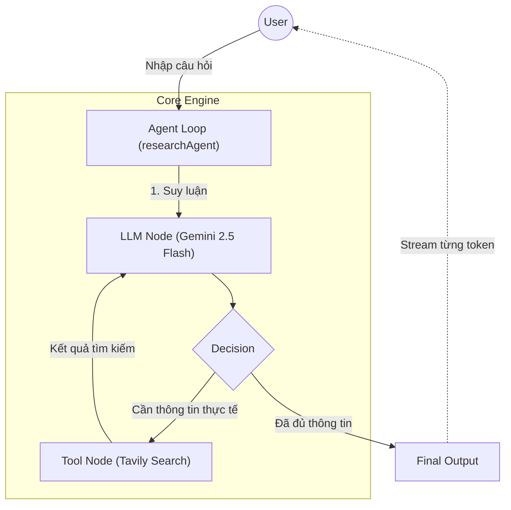

# Bài 1.9 — Project: Research Assistant (Capstone Phase 1)

## Agenda

**Thời gian đọc ước tính:** ~15 phút

### Learning outcome:
- **Hiểu** được cách kết nối các mảnh ghép rời rạc (LLM, Tools, Memory, Streaming) thành một ứng dụng thực tế.
- **Tự tay** setup và cấu hình công cụ tìm kiếm (Tavily Search Tool) cho Agent.
- **Tự tay** thiết kế kiến trúc Agent Loop bằng Functional API để tự động hóa quá trình tra cứu.
- **Áp dụng** kỹ thuật Streaming để trả về kết quả theo thời gian thực cho người dùng.

## Glossary & Vocabulary

**1. Technical Terms (Thuật ngữ kỹ thuật):**
| Term | Vietnamese Meaning & Quick Explain |
| :--- | :--- |
| **Capstone Project** | Dự án chốt chặng. Bài thực hành tổng hợp toàn bộ kiến thức của một giai đoạn (Phase). |
| **Search Engine Tool** | Công cụ tìm kiếm. Trong ngữ cảnh Agent, đây là một function cho phép LLM "tra cứu" Google/Tavily để lấy thông tin mới nhất. |
| **Streaming** | Truyền dữ liệu luồng. Gửi từng mảnh dữ liệu (token) về cho người dùng ngay khi LLM vừa tạo ra nó. |

**2. Vocabulary Support (Từ vựng học thuật/B1+):**
| Word | Meaning in Context (Nghĩa trong ngữ cảnh) |
| :--- | :--- |
| **Progressive (adj)** | Lũy tiến, dần dần từng bước (Vd: hiển thị kết quả dần dần). |
| **Hallucination (n)** | Hiện tượng "ảo giác", khi AI tự bịa ra thông tin sai lệch do thiếu dữ liệu thật. |

## 1. WHY — Bài toán thực tế

Khi xây dựng các ứng dụng AI cơ bản, chúng ta thường gặp phải 2 "nỗi đau" (pain points) lớn:

1. **Knowledge Cutoff (Giới hạn tri thức):** LLM không thể trả lời các câu hỏi về sự kiện vừa diễn ra (ví dụ: "Tình hình giá vàng hôm nay?").
2. **Hallucination (Ảo giác):** Khi gặp câu hỏi khó, LLM có xu hướng "tự bịa" thông tin nghe rất hợp lý nhưng sai sự thật.

**Solution:** 
Để giải quyết triệt để, chúng ta sẽ xây dựng một **Research Assistant**. Đây là một Agent được trang bị "mắt" (Search Tool) để nhìn ra Internet và "trí nhớ" (Memory) để giữ ngữ cảnh. Đặc biệt, ta sẽ thêm tính năng **Streaming** để giải quyết bài toán UI/UX — không bắt người dùng phải chờ đợi màn hình loading quá lâu.

## 2. WHAT — Kiến trúc của Research Assistant

Dự án này là sự kết tinh của toàn bộ Phase 1. Hãy cùng "giải phẫu" ứng dụng trước khi bắt tay vào code.

### 2.1. System Architecture (Trực quan hóa luồng dữ liệu)



### 2.2. File Structure (Cấu trúc thư mục)

Để dự án gọn gàng và dễ mở rộng, chúng ta chia logic thành 3 file riêng biệt:
- `assistant-setup.ts`: Nơi khởi tạo mô hình AI và cài đặt các Tools.
- `agent.ts`: Nơi định nghĩa "Não bộ" (Graph / Loop) của Agent.
- `run.ts`: File thực thi chính (Entry point) và xử lý giao diện Console (Streaming).

## 3. HOW — Từng bước thực hành (Step-by-step Implementation)

### Bước 0: Prerequisites (Chuẩn bị môi trường)

Bạn cần cài đặt các thư viện cần thiết và lấy API Key từ `tavily.com` và `aistudio.google.com`.

```bash
npm install @langchain/langgraph @langchain/google-genai @langchain/community
```

### Bước 1: Setup Tools & LLM (`assistant-setup.ts`)

Đầu tiên, chúng ta khai báo Tool tìm kiếm và "bind" (gắn) nó vào mô hình `gemini-2.5-flash`.

```typescript
// filename: assistant-setup.ts
import { ChatGoogleGenerativeAI } from "@langchain/google-genai";
import { TavilySearchResults } from "@langchain/community/tools/tavily_search";

// 1. Khởi tạo LLM với gemini-2.5-flash (Nhanh, rẻ, phù hợp làm core reasoning)
// Temperature = 0 để Agent tập trung vào sự thật thay vì sáng tạo bay bổng
const model = new ChatGoogleGenerativeAI({
  modelName: "gemini-2.5-flash",
  temperature: 0, 
});

// 2. Khởi tạo Search Tool (Yêu cầu biến môi trường TAVILY_API_KEY)
const searchTool = new TavilySearchResults({
  maxResults: 3, // Giới hạn lấy 3 kết quả tốt nhất để tránh tràn Context Window
});

// 3. Bind tool vào LLM để mô hình biết nó có quyền sử dụng công cụ này
const toolsByName = {
  [searchTool.name]: searchTool,
};
export const tools = Object.values(toolsByName);
export const modelWithTools = model.bindTools(tools);
export { toolsByName };
```

### Bước 2: Build the Agent Logic (`agent.ts`)

Chúng ta sẽ dùng **Functional API** của LangGraph để thiết lập vòng lặp suy luận (Agent Loop).

```typescript
// filename: agent.ts
import { task, entrypoint, addMessages } from "@langchain/langgraph";
import { SystemMessage, type BaseMessage } from "@langchain/core/messages";
import type { ToolCall } from "@langchain/core/messages/tool";
import { modelWithTools, toolsByName } from "./assistant-setup";

// Task 1: Gọi LLM (não bộ của Agent)
const callLlm = task({ name: "callLlm" }, async (messages: BaseMessage[]) => {
  return modelWithTools.invoke([
    new SystemMessage(
      "You are an expert Research Assistant. Use the search tool to find current, accurate information. Always cite your sources."
    ),
    ...messages,
  ]);
});

// Task 2: Gọi Tool (chân tay của Agent)
const callTool = task({ name: "callTool" }, async (toolCall: ToolCall) => {
  const tool = toolsByName[toolCall.name];
  return tool.invoke(toolCall); 
});

// Vòng lặp điều phối chính (Agent Loop)
export const researchAgent = entrypoint({ name: "researchAgent" }, async (messages: BaseMessage[]) => {
  let modelResponse = await callLlm(messages);

  // Lặp lại cho đến khi LLM tự nhận thấy ĐÃ ĐỦ dữ liệu và không gọi tool nữa
  while (true) {
    if (!modelResponse.tool_calls?.length) {
      break; 
    }

    // Execute toàn bộ tool calls song song (Tối ưu hiệu suất)
    const toolResults = await Promise.all(
      modelResponse.tool_calls.map((toolCall) => callTool(toolCall))
    );
    
    // Nối kết quả từ Internet vào lịch sử cuộc trò chuyện
    messages = addMessages(messages, [modelResponse, ...toolResults]);
    modelResponse = await callLlm(messages);
  }

  return addMessages(messages, [modelResponse]);
});
```

### Bước 3: Run & Stream Kết quả (`run.ts`)

Thay vì dùng `invoke()` bắt người dùng đợi mòn mỏi, ta sẽ dùng `stream()` để truyền từng chữ (token) về màn hình console.

```typescript
// filename: run.ts
import { HumanMessage } from "@langchain/core/messages";
import { researchAgent } from "./agent";

async function main() {
  const question = "Ai là người vô địch CKTG LMHT năm 2024?";
  console.log(`User: ${question}\n`);
  
  // Kích hoạt Agent với chế độ "messages" để bắt từng token
  const stream = await researchAgent.stream(
    [new HumanMessage(question)],
    { streamMode: "messages" } 
  );

  process.stdout.write("Agent: ");
  
  // Bóc tách từng chunk được gửi về theo thời gian thực
  for await (const [token, metadata] of stream) {
    // Chỉ lấy token từ quá trình suy luận cuối cùng của LLM (callLlm node)
    if (metadata.langgraph_node === "callLlm" && token.contentBlocks) {
      const textBlocks = token.contentBlocks.filter((b: any) => b.type === "text");
      if (textBlocks.length > 0) {
        process.stdout.write(textBlocks[0].text); 
      }
    }
  }
}

main();
```

> **Tại sao lại có `metadata.langgraph_node === "callLlm"`?**
> Bởi vì trong quá trình Agent chạy, nó sẽ stream ra cả những lúc đang gọi Tool (`callTool`). Bằng cách filter metadata, ta chỉ in ra những câu chữ "thành phẩm" cuối cùng mà LLM giao tiếp với người dùng.

## 4. Discussion Questions

1. **Trade-off (Đánh đổi):** Vòng lặp `while(true)` có rủi ro gì nếu Tavily liên tục trả về kết quả rác, khiến LLM cứ search đi search lại vô tận? Làm thế nào để giới hạn số vòng lặp tối đa (Max Recursion)?
2. **UX Improvement:** Trong lúc Agent đang gọi Search Tool (mất khoảng 2-3 giây), màn hình user sẽ im lìm không có chữ nào hiện ra. Bạn sẽ làm thế nào để hiển thị thông báo kiểu *"Đang tìm kiếm trên Google..."*? (Hint: Đọc lại phần `config.writer` của bài Streaming).

## 5. References

- [LangChain JS Docs - Tools](https://docs.langchain.com/oss/javascript/langchain/tools)
- [LangGraph JS Docs - Quickstart Functional API](https://docs.langchain.com/oss/javascript/langgraph/quickstart)
- [LangChain JS Docs - Streaming](https://docs.langchain.com/oss/javascript/langchain/streaming)

---

*Made by Anh Tu - Share to be share*
