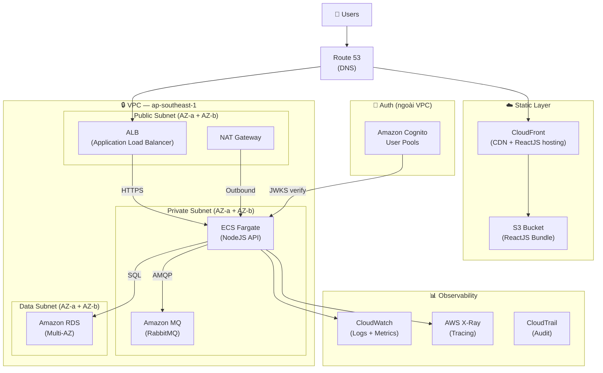
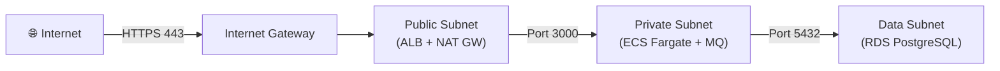
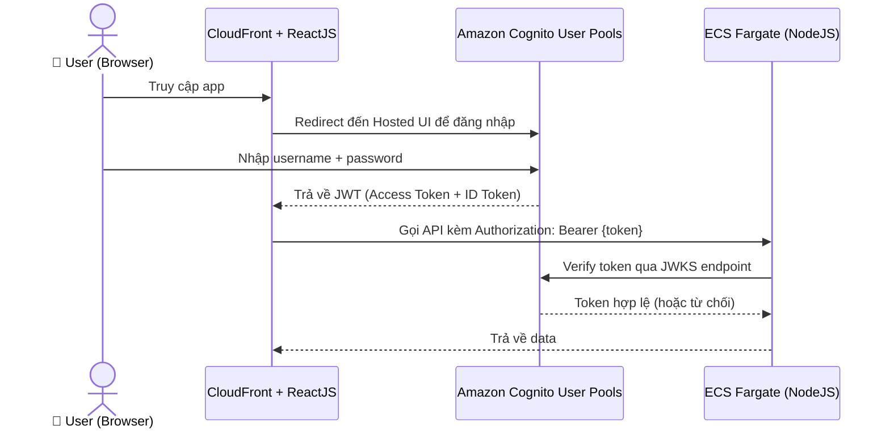
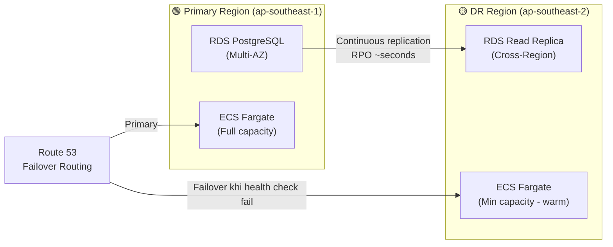
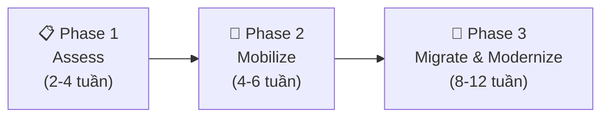
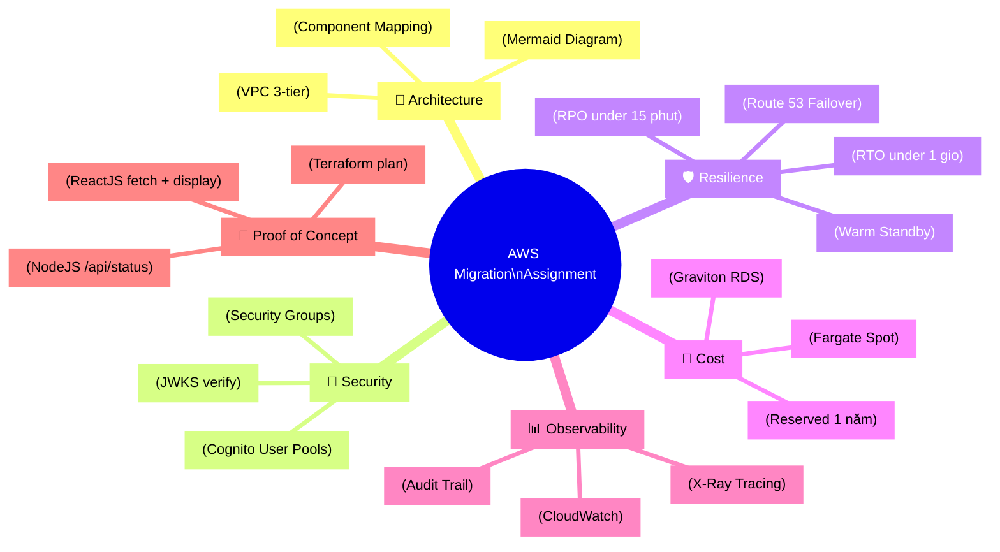

# Assignment: Migrate On-Premises lên AWS

## 📋 Agenda

**Thời gian đọc ước tính:** ~25 phút

### Sau bài này, bạn sẽ:
- ✅ **Thiết kế** được Solution Architecture cho bài toán Migration thực tế
- ✅ **Vẽ** Architecture Diagram chuẩn bằng Mermaid.js
- ✅ **Viết** code Terraform cơ bản để dựng hạ tầng VPC + ECS + RDS
- ✅ **Phân biệt** khi nào dùng Cognito User Pools, khi nào dùng IAM Identity Center

### Yêu cầu đầu vào (Prerequisites):
- 🔹 Đã đọc qua các khái niệm cơ bản: VPC, EC2, S3, IAM
- 🔹 Cài đặt AWS CLI và Terraform CLI trên máy
- 🔹 Có tài khoản AWS (Free Tier là đủ để `terraform plan`)

---

## ❓ Vấn đề & Mục tiêu Assignment

**Bối cảnh bài toán:**
- Một công ty có hệ thống On-Premises đang chạy với **2 Data Center** (Active + DR).
- Hệ thống gồm: RabbitMQ (message queue), SQL Server (database), Node.js API (backend), ReactJS (frontend).
- Yêu cầu: **Migrate 100% lên AWS**, đồng thời **refactor** Frontend sang ReactJS, Backend sang NodeJS, Infrastructure dùng Terraform.

**Mục tiêu cuối bài assignment:**

| Câu hỏi | Nội dung cần trả lời |
|---------|---------------------|
| **Q1** | Architecture Diagram trực quan |
| **Q2** | Component Mapping: On-Prem → AWS |
| **Q3** | Network Design (VPC, Subnet, Security) |
| **Q4** | Authentication với Cognito |
| **Q5** | Disaster Recovery (RTO &lt; 1h, RPO &lt; 15 phút) |
| **Q6** | Cost Optimization |
| **Q7** | Monitoring & Operations |
| **Q8** | Migration Strategy (lộ trình thực hiện) |

---

## 📖 Bức tranh tổng thể: Kiến trúc đích (Target Architecture)

Trước khi đi vào từng bước, hãy nắm bức tranh toàn cảnh:



> 💡 **Đọc sơ đồ từ trên xuống:** User → DNS → Tầng CDN (React) hoặc API (Node) → Logic xử lý (ECS) → Dữ liệu (RDS) + Queue (MQ).

---

## 🌟 Bước 1 — Thiết kế Solution Architecture & Trả lời Q2–Q8

### Component Mapping (Q2)

Đây là bảng "phiên dịch" từ hệ thống On-Prem sang dịch vụ AWS tương đương:

| Thành phần On-Prem | Dịch vụ AWS | Lý do chọn |
|--------------------|-----------|-----------  |
| **RabbitMQ** | Amazon MQ (RabbitMQ engine) | Managed service, tương thích AMQP protocol 100% — không cần sửa code |
| **SQL Server** | Amazon RDS (PostgreSQL) | Chuyển sang PostgreSQL để tối ưu chi phí (open-source), RDS quản lý backup/patching tự động |
| **VM chạy Node.js API** | ECS Fargate | Serverless container — không cần quản lý EC2, tự scale theo traffic |
| **ReactJS Frontend** | S3 + CloudFront | Static file hosting với CDN global, chi phí gần như bằng 0 |
| **Active-Passive DC** | Multi-AZ (RDS) + Multi-Region (DR) | Tái tạo mô hình DR native trên AWS |
| **Load Balancer** | Application Load Balancer (ALB) | Layer 7, hỗ trợ path-based routing, tích hợp với ECS |

### Network Design (Q3)

**Nguyên tắc thiết kế: Defense in Depth (bảo mật theo lớp)**



**Phân tầng Subnet:**
- **Public Subnet:** Chỉ chứa ALB và NAT Gateway. ALB nhận traffic từ ngoài vào.
- **Private Subnet:** ECS Fargate và Amazon MQ. Không có Public IP, chỉ ra ngoài được qua NAT.
- **Data Subnet:** RDS Multi-AZ. Cô lập hoàn toàn — chỉ nhận kết nối từ Private Subnet.

**Security Group Rules (tối thiểu cần có):**

| Security Group | Inbound | Outbound |
|---------------|---------|----------|
| `sg-alb` | 443 từ `0.0.0.0/0` | Port 3000 đến `sg-ecs` |
| `sg-ecs` | Port 3000 từ `sg-alb` | Port 5432 đến `sg-rds`, Port 5671 đến `sg-mq` |
| `sg-rds` | Port 5432 từ `sg-ecs` | Không có |
| `sg-mq` | Port 5671 từ `sg-ecs` | Không có |

### Authentication (Q4)

> ⚠️ **Hiểu đúng trước khi làm:** AWS có nhiều dịch vụ auth, chọn sai là câu hỏi sai.
>
> - **IAM Identity Center / Directory Service** → Dùng cho *nhân viên nội bộ* đăng nhập vào AWS Console, không phải cho app user.
> - **Amazon Cognito User Pools** → Đúng choice cho ReactJS/NodeJS app phát JWT token cho **end-user**.

**Luồng Authentication với Cognito:**



**Cấu hình Cognito cơ bản cần có:**
- User Pool (quản lý danh sách user)
- App Client (cấp cho ReactJS)
- Hosted UI (trang đăng nhập do Cognito host)
- JWKS Endpoint tự động được cấp: `https://cognito-idp.{region}.amazonaws.com/{userPoolId}/.well-known/jwks.json`

### Disaster Recovery (Q5)

**Mục tiêu đã xác định: RTO &lt; 1 giờ, RPO &lt; 15 phút**

Với mục tiêu này, chiến lược phù hợp là **Warm Standby**:

| Chiến lược | RTO | RPO | Chi phí | Đáp ứng? |
|-----------|-----|-----|---------|----------|
| Backup & Restore | Giờ → Ngày | Giờ | Thấp nhất | ❌ |
| Pilot Light | 1-4 giờ | Phút | Thấp | ❌ RTO vượt |
| **Warm Standby** | **Phút → &lt;1 giờ** | **&lt;15 phút** | Trung bình | **✅** |
| Active-Active | ~0 | ~0 | Cao nhất | ✅ nhưng overkill |

**Triển khai Warm Standby:**



**Quy trình Failover:**
1. Route 53 Health Check phát hiện Primary region không phản hồi.
2. Route 53 tự động chuyển traffic sang DR region (Failover routing policy).
3. RDS Read Replica ở DR được promote thành Primary (thủ công hoặc tự động với RDS Proxy).
4. ECS DR scale up từ minimum capacity lên full capacity.

### Cost Optimization (Q6)

| Chiến lược | Áp dụng vào | Tiết kiệm ước tính |
|-----------|------------|---------------------|
| **ECS Fargate Spot** | NodeJS API workload | 40-70% so với On-Demand |
| **Graviton (ARM) instances** | RDS `db.t4g.micro` | ~20% so với x86 cùng class |
| **S3 Intelligent-Tiering** | Static assets ít truy cập | Tự động giảm 40-68% với cold data |
| **Auto Scaling** | ECS Fargate theo CPU/Memory metric | Chỉ trả tiền khi cần |
| **Reserved Instances (1 năm)** | RDS (workload ổn định) | Tiết kiệm 30-40% so với On-Demand |
| **CloudFront caching** | ReactJS bundle, API response | Giảm số request đến ALB và ECS |

### Monitoring & Operations (Q7)

| Dịch vụ | Use case cụ thể |
|--------|----------------|
| **CloudWatch Logs** | Thu thập stdout/stderr từ ECS container, log query từ RDS |
| **CloudWatch Metrics + Alarms** | Alert khi CPU ECS &gt; 80%, RDS connections &gt; 80% max, ALB 5xx &gt; 1% |
| **CloudWatch Dashboard** | Màn hình tổng quan: Request count, Latency, Error rate |
| **AWS X-Ray** | Tracing toàn bộ request từ ALB → ECS → RDS để tìm bottleneck |
| **CloudTrail** | Audit trail: Ai đã tạo/xoá resource? Khi nào? Từ IP nào? |
| **AWS Cost Explorer + Budgets** | Alert khi chi phí tháng vượt ngưỡng đã đặt |

### Migration Strategy (Q8)

**Lộ trình 3 giai đoạn theo AWS CAF (Cloud Adoption Framework):**



**Phase 1 — Assess:**
- Kiểm kê toàn bộ thành phần On-Prem
- Đánh giá dependency giữa các service
- Xác định RTO/RPO cho từng module
- Lựa chọn migration strategy (rehost/replatform/refactor)

**Phase 2 — Mobilize:**
- Thiết lập môi trường AWS (VPC, IAM, Landing Zone)
- Viết Terraform code cho infrastructure
- Setup CI/CD pipeline (GitHub Actions → ECR → ECS)
- Training team về AWS services

**Phase 3 — Migrate & Modernize:**
- **Migrate Database:** Dùng AWS Database Migration Service (DMS) để sync SQL Server → RDS PostgreSQL
- **Migrate Backend:** Build Docker image NodeJS → push ECR → deploy ECS Fargate
- **Migrate Frontend:** Build ReactJS → deploy lên S3 + CloudFront
- **Cutover:** Đổi DNS Route 53 từ On-Prem sang AWS (zero downtime với weighted routing)
- **Decommission:** Tắt dần On-Prem sau khi verify AWS hoạt động ổn định

---

## 🌟 Bước 2 — Vẽ Architecture Diagram (Q1)

Hãy copy prompt sau và gửi cho AI (ChatGPT/Claude) để lấy Mermaid code:

```
Dựa vào kiến trúc AWS Migration bên dưới, hãy giúp tôi viết mã Mermaid.js (graph TD) để vẽ Architecture Diagram.

Quy tắc bắt buộc:
- Dùng `graph TD` (Top Down direction).
- Label node dùng tên AWS service, ví dụ: ALB["ALB (Application Load Balancer)"].
- KHÔNG dùng icon, emoji trong node label để tránh parse error.
- Nhóm thành phần bằng subgraph theo tầng: Internet, Public Subnet, Private Subnet, Data Subnet.
- Mũi tên phải có label giao thức: HTTPS, AMQP, SQL, etc.

Luồng cần thể hiện:
1. Users → Route 53 → CloudFront (ReactJS từ S3) và ALB.
2. ALB → ECS Fargate (NodeJS API) trong Private Subnet.
3. ECS Fargate → Amazon MQ (AMQP) và Amazon RDS PostgreSQL (SQL).
4. Amazon Cognito (ngoài VPC) ↔ ECS Fargate (JWKS verify JWT).
5. CloudWatch và X-Ray giám sát ECS và RDS.
```

**Kết quả mong đợi:** Dán mã vào [Mermaid Live Editor](https://mermaid.live) để xem và export PNG nộp bài.

---

## 🌟 Bước 3 — Code Terraform & Dummy App (Thực hành)

### Nhiệm vụ 1: Terraform Code

Hãy copy prompt sau và gửi cho AI để lấy code:

```
Hãy viết Terraform code gồm 3 file: provider.tf, main.tf, variables.tf để tạo hạ tầng AWS cơ bản.

Yêu cầu:
- provider.tf: AWS provider (region = ap-southeast-1), backend local.
- variables.tf: Khai báo biến aws_region, vpc_cidr, project_name.
- main.tf: Tạo các resource sau (có comment WHY cho mỗi block):
  * 1 VPC (CIDR từ variable vpc_cidr)
  * 1 Public Subnet + 1 Private Subnet (khác AZ)
  * 1 Internet Gateway gắn vào VPC
  * 1 Elastic IP + 1 NAT Gateway trong Public Subnet
  * Route Table cho Public Subnet (route 0.0.0.0/0 → IGW)
  * Route Table cho Private Subnet (route 0.0.0.0/0 → NAT GW)
  * 1 ECS Cluster (Fargate)
  * 1 RDS PostgreSQL (db.t3.micro, trong Private Subnet)

Lưu ý: Code đủ để chạy terraform init và terraform plan thành công.
Giả định máy đã cài AWS CLI và configure credentials với quyền EC2, ECS, RDS.
```

**Cách chạy sau khi có code:**

```bash
# Bước 1: Khởi tạo Terraform (tải provider plugins)
terraform init

# Bước 2: Kiểm tra plan — xem AWS sẽ tạo những gì (chưa tốn tiền)
terraform plan

# Bước 3 (optional): Thực sự tạo resource — CHỈ làm nếu muốn deploy thật
# terraform apply
```

> ⚠️ **Lưu ý chi phí:** `terraform plan` hoàn toàn miễn phí. Chỉ `terraform apply` mới tạo resource và phát sinh chi phí. Sau khi nộp bài, nhớ `terraform destroy` nếu đã apply.

### Nhiệm vụ 2: Dummy App (PoC)

Hãy copy prompt sau để lấy code app mẫu:

```
Hãy viết 2 file code để demo Proof of Concept cho hệ thống đã migrate lên AWS:

1. server.js (NodeJS/Express):
   - Endpoint GET /api/status trả về JSON: { status: "Migrated to AWS successfully!", db: "connected", queue: "connected" }
   - Thêm CORS header để ReactJS có thể fetch được (Access-Control-Allow-Origin: *)
   - Port: 3001

2. App.js (ReactJS):
   - Fetch data từ http://localhost:3001/api/status khi component mount
   - Hiển thị data lên màn hình
   - Xử lý trạng thái: loading (đang tải), error (lỗi kết nối), success (hiển thị data)
```

**Cách chạy để test local:**

```bash
# Terminal 1: Chạy NodeJS backend
node server.js
# → Server listening on http://localhost:3001

# Terminal 2: Chạy ReactJS frontend (trong thư mục react app)
npm start
# → App chạy trên http://localhost:3000
# → Màn hình hiển thị: "Migrated to AWS successfully!"
```

---

## 🚀 Checklist Nộp Bài

Trước khi nộp, kiểm tra đủ các hạng mục sau:

- [ ] **Q1:** Có file PNG/diagram từ Mermaid Live Editor
- [ ] **Q2:** Bảng Component Mapping đủ 6 thành phần On-Prem → AWS
- [ ] **Q3:** Mô tả VPC design với phân tầng Public/Private/Data Subnet + Security Groups
- [ ] **Q4:** Giải thích luồng Cognito User Pools + JWT (không dùng sai IAM Identity Center)
- [ ] **Q5:** Nêu rõ RTO/RPO mục tiêu và lý do chọn Warm Standby
- [ ] **Q6:** Liệt kê ít nhất 3 chiến lược Cost Optimization với số liệu ước tính
- [ ] **Q7:** Liệt kê 4 dịch vụ monitoring với use case cụ thể
- [ ] **Q8:** Lộ trình 3 giai đoạn Assess → Mobilize → Migrate & Modernize
- [ ] **Bonus:** Screenshot `terraform plan` chạy thành công (không cần `apply`)
- [ ] **Bonus:** Screenshot app React hiển thị data từ NodeJS endpoint

---

## ⚠️ Pitfalls — Các lỗi hay gặp

**1. Nhầm dịch vụ Authentication**
> ❌ Dùng IAM Identity Center / Directory Service để xác thực user cho ReactJS app.
> ✅ Chỉ dùng **Cognito User Pools** cho end-user authentication.

**2. Thiếu RTO/RPO trong DR section**
> Nếu không nêu RTO/RPO, giám khảo sẽ hỏi: "Tại sao anh chọn Warm Standby mà không phải Active-Active?" — Không có số liệu thì không có câu trả lời thuyết phục.

**3. Terraform `apply` mà quên `destroy`**
> RDS PostgreSQL `db.t3.micro` tốn ~$0.018/giờ. Nếu quên tắt sau 1 tháng = ~$13 tốn thêm vào bill.

**4. Vẽ diagram quá phức tạp**
> Mermaid có giới hạn về cú pháp. Tránh dùng emoji/icon trong node label — dễ bị `Parse error`. Ưu tiên sơ đồ đơn giản, rõ ý hơn là phức tạp, khó đọc.

---

## 🧩 Tổng kết (MECE Mindmap)



---

> ✍️ *Made by Anh Tu - Share to be share*
