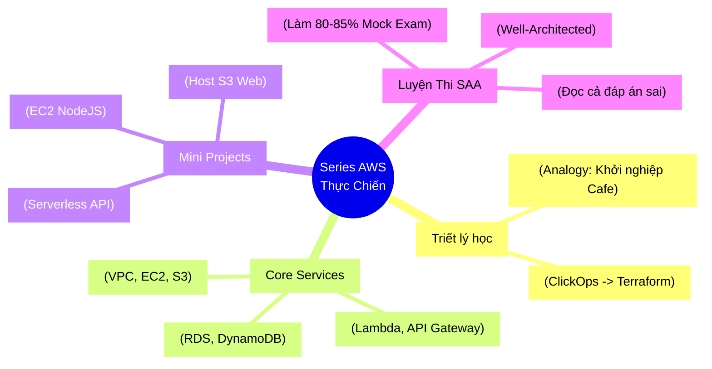

# Lộ trình 3 tháng thực chiến AWS: Từ Nền tảng đến Kiến trúc sư (SAA-C03)

Học AWS rất dễ bị "ngợp" vì có quá nhiều dịch vụ. Nếu chỉ đọc tài liệu, bạn sẽ nhanh chóng rơi vào trạng thái buồn ngủ và quên sạch sau 1 tuần. 

Series này được thiết kế theo đúng triết lý: **Học qua Ẩn dụ (Analogy) & Thực hành qua Usecase thực tế**. Mục tiêu cuối cùng không chỉ là lấy chứng chỉ **AWS Solutions Architect Associate (SAA-C03)**, mà là có thể tự tin thiết kế và xây dựng một hệ thống thật.

> 💡 **Core Analogy (Sợi chỉ đỏ xuyên suốt):**
> Hãy tưởng tượng việc xây dựng hệ thống trên AWS giống như việc **Khởi nghiệp và Vận hành một chuỗi nhà hàng Cafe**. 
> - **Tháng 1:** Đi tìm mặt bằng (VPC), xây nhà hàng (EC2), xây nhà kho (S3) và cấp quyền cho nhân sự (IAM).
> - **Tháng 2:** Mua sổ sách kế toán (RDS), sắm robot pha chế tự động (Lambda), và thuê bảo vệ (WAF).
> - **Tháng 3:** Tổng duyệt PCCC và diễn tập khai trương (Mock Exams).

---

## 🛠 Bộ công cụ học tập: ClickOps trước, Terraform sau

Một kỹ sư hiện đại cần biết tự động hóa (IaC - Infrastructure as Code), và **Terraform** là lựa chọn số 1.
Tuy nhiên, để tránh "độ dốc học phí" quá cao ở giai đoạn đầu:
- **Tháng 1:** Chủ yếu sử dụng giao diện web của AWS (ClickOps) để hiểu bản chất luồng màn hình.
- **Từ Tháng 2 trở đi:** Bắt đầu chuyển dần toàn bộ thao tác Click "chuột" thành Code Terraform (Tự động hoá tái sử dụng).

---

## 📅 Lộ trình chi tiết (Curriculum)

### Tháng 1: Xây nền móng & Dựng bộ khung (Core Infrastructure)

Giai đoạn chập chững: Xây dựng cửa hàng đầu tiên của bạn trên mảnh đất AWS.

- **Tuần 1: IAM, S3 (Tuyển nhân viên & Xây nhà kho)**
  - **Lý thuyết:** Quản lý User/Policy với IAM. Lưu trữ S3 (Glacier, Versioning).
  - **Usecase thực chiến:** Dùng S3 để host một trang web CV/Portfolio cá nhân tĩnh.
  - **Mẹo thi:** Lưu trữ file rác/log lâu dài siêu rẻ -> chọn Glacier. Phân quyền luôn luôn theo nguyên tắc "Least Privilege".

- **Tuần 2: Mạng lưới VPC (Khoanh vùng mảnh đất xây quán)**
  - **Lý thuyết:** VPC, Subnets (Public/Private), Route Tables, Internet Gateway, Security Groups & NACL.
  - **Usecase thực chiến:** Tự tay tạo một VPC custom hoàn chỉnh, đặt cổng bảo vệ (Security Group) cấu hình "Chỉ cho phép khách vào từ cửa chính".

- **Tuần 3 & 4: Compute & Đầu bếp song sinh (EC2, ELB, ASG)**
  - **Lý thuyết:** Máy ảo EC2 (On-demand/Spot). Ổ cứng EBS. Load Balancer (ALB) và Auto Scaling Group (ASG).
  - **Usecase thực chiến:** Deploy một Web Server Backend đơn giản (NodeJS/Python) lên EC2. Test thử khả năng tự nhân đôi server khi nhà hàng "quá đông khách" (Cắm tải thử vào ASG).
  - **Mẹo thi:** Cặp bài trùng "High Availability" + "Fault Tolerance" = Luôn luôn là ELB + ASG.

---

### Tháng 2: Lưu trữ dữ liệu, Năng lực phân tán & Tự động hoá (Data, Decoupling & Serverless)

Giai đoạn tối ưu vận hành: Hệ thống bắt đầu có lượng khách lớn, đòi hỏi lưu trữ chuyên nghiệp và "nhân viên robot" để giảm chi phí bảo trì.

- **Tuần 5: Databases (Hệ thống sổ sách kế toán quy mô lớn)**
  - **Lý thuyết:** Database quan hệ RDS & Aurora (Multi-AZ dự phòng). Database NoSQL siêu tốc DynamoDB. ElastiCache.
  - **Usecase thực chiến:** Chạy thử code Terraform nâng cấp Web Server EC2 (Từ Tuần 4) để thực sự cắm và đọc/ghi dữ liệu vào RDS MySQL.

- **Tuần 6: Decoupling & Nhốt lệnh (SQS, SNS, Kinesis)**
  - **Lý thuyết:** SQS (Hàng đợi), SNS (Thông báo) giúp luồng làm việc không bị nghẽn cục bộ.
  - **Usecase thực chiến:** Giả lập hệ thống đặt đơn hàng: Đơn quăng vào Queue (SQS), hệ thống xử lý tà tà không sợ chết server.
  - **Mẹo thi:** Nhìn thấy từ khoá "Decouple" (giảm tính phụ thuộc) + "Asynchronous" (bất đồng bộ) -> Nhắm mắt chọn SQS ngay.

- **Tuần 7: Serverless & Trạm điều phối DNS (Lambda, API Gateway, Route53)**
  - **Lý thuyết:** Lambda (Chạy siêu ngắn tối đa 15p, tính tiền theo mili-giây). API Gateway điều phối. Route53 DNS.
  - **Usecase thực chiến:** Viết API tạo form "Liên hệ" tự động gửi email mà KHÔNG phải thuê EC2 (Tận dụng sức mạnh Serverless từ Lambda).

- **Tuần 8: Vận hành, Giám sát & An ninh (CloudWatch, KMS, WAF)**
  - **Lý thuyết:** Nhịp tim hệ thống CloudWatch vs Báo cáo lịch sử CloudTrail. WAF chặn mã độc.
  - **Usecase thực chiến:** Bật CloudWatch gửi email/Slack tự động cho Dev khi CPU đụng trần 80%.

---

### Tháng 3: Tổng ôn, Vá Lỗ hổng và Luyện đề SAA-C03

Giai đoạn luyện công: Tập dượt cho kỳ thi.

- **Tuần 9: Các mảng dịch vụ "lâu lâu xài" & Cẩn trọng cấu trúc**
  - **Lý thuyết:** Lướt qua AWS Organizations, AWS Cognito.
  - **Thiết kế:** Nghiền ngẫm **AWS Well-Architected Framework** (5 cột trụ Thiết kế xịn). Câu hỏi tính huống thi SAA toàn xoay quanh 5 cột trụ này.

- **Tuần 10, 11 & 12: Đấu trường (Mock Exams)**
  - **Đấu trường:** Luyện thủ tục thi trên *Tutorials Dojo* trong 130 phút tĩnh tâm.
  - ⚠️ **Kỷ luật sinh tử:** Nằm gai nếm mật đọc kỹ tờ giải thích từng câu hỏi, kể cả câu ĐÃ CHỌN ĐÚNG. Phải hiểu vì sao 3 đáp án kia sai.
  - **Điều kiện xuống núi:** Điểm thi thử liên tục đạt ngưỡng **80% - 85%**, lúc đó bạn đã sẵn sàng cầm thẻ tín dụng cà $150 cho chứng chỉ SAA-C03.

---

## 🧩 Tổng kết tư duy lộ trình (MECE Mindmap)

