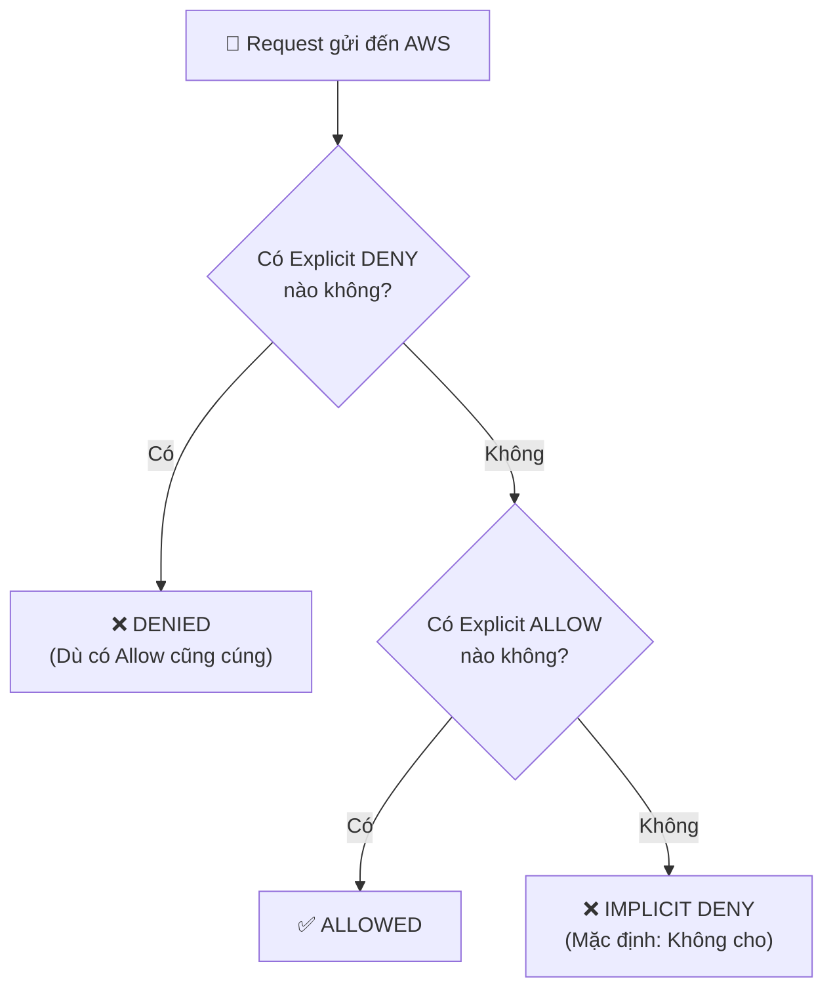
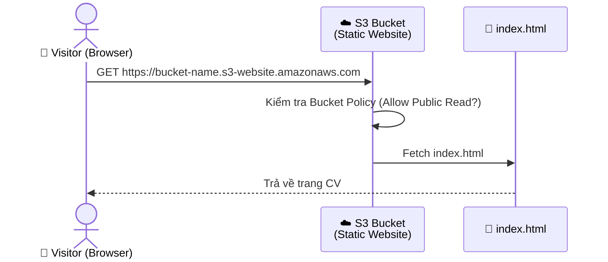
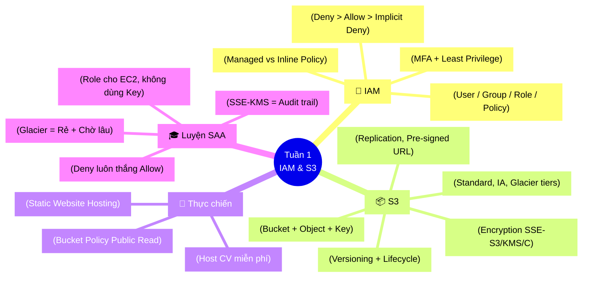

# Tuần 1: IAM & S3 — Tuyển nhân sự và Xây nhà kho

Chào mừng bạn đến với **Tuần 1** của chuỗi series *Khởi nghiệp với AWS*. Bước đầu tiên khi mở chuỗi nhà hàng Cafe không phải là nhập hạt cà phê, mà là **Tuyển nhân viên bảo vệ (IAM)** và **Xây dựng một cái nhà kho chứa đồ (S3)**.

Mục tiêu cuối bài: Host được trang CV cá nhân miễn phí lên AWS. Trên đường đi, bạn sẽ hiểu tại sao hai dịch vụ này xuất hiện trong hầu hết mọi câu hỏi thi SAA-C03.

---

## Phần 1: IAM (Identity and Access Management) 🔐

### 🍔 Analogy: Hệ thống thẻ từ của một toà nhà văn phòng

Tưởng tượng AWS là một **toà nhà văn phòng 100 tầng**. Bạn là **Chủ toà nhà (Root User)** — bạn có chìa khoá vạn năng, mở tất cả các cửa từ tầng hầm đến tầng thượng.

Tuy nhiên, bạn không thể tự tay xử lý mọi thứ mỗi ngày (và nếu làm vậy, ai đó lấy được chìa khoá của bạn là xong). Vì vậy, bạn xây dựng **hệ thống thẻ từ (IAM)**:

- **User (Nhân viên):** Mỗi người một thẻ từ. Nguyễn Văn A, Trần Thị B.
- **Group (Phòng ban):** Nhóm thẻ từ có quyền giống nhau. Cả phòng Kế toán đều vào được tầng 5 (Phòng tài chính).
- **Role (Mũ bảo hộ tạm thời):** Khi nhân viên A cần xuống kho lấy hàng, họ "đội mũ thủ kho" → có quyền vào kho. Ra khỏi kho, bỏ mũ, mất quyền ngay. Role không gắn với người — nó gắn với **tình huống**.
- **Policy (Sổ tay nội quy chi tiết):** Một tờ JSON ghi rõ: *"Được/Không được (Allow/Deny) làm hành động gì (Action) trên tài nguyên nào (Resource) với điều kiện gì (Condition)"*.

### 🔬 Deep Dive 1: Cấu trúc một Policy

Một IAM Policy thực chất chỉ là một file JSON. Đừng sợ:

```json title="example-s3-read-policy.json"
{
  "Version": "2012-10-17",
  "Statement": [
    {
      "Sid": "AllowReadS3Bucket",
      "Effect": "Allow",
      "Action": [
        "s3:GetObject",
        "s3:ListBucket"
      ],
      "Resource": [
        "arn:aws:s3:::my-company-bucket",
        "arn:aws:s3:::my-company-bucket/*"
      ]
    }
  ]
}
```

Đọc theo ngữ nghĩa: *"Được phép (`Allow`) đọc file (`s3:GetObject`) và liệt kê (`s3:ListBucket`) trong cái kho tên là `my-company-bucket`"*.

**Các trường quan trọng:**
| Trường | Ý nghĩa | Ví dụ |
|--------|---------|-------|
| `Effect` | Cho phép hay từ chối | `Allow` / `Deny` |
| `Action` | Hành động được phép | `s3:GetObject`, `ec2:StartInstances` |
| `Resource` | ARN (địa chỉ) tài nguyên | `arn:aws:s3:::my-bucket/*` |
| `Condition` | Điều kiện kèm theo | Chỉ được làm nếu dùng MFA |

### 🔬 Deep Dive 2: Policy Evaluation Logic (Luồng xét quyền)

Khi bạn gửi 1 request đến AWS (ví dụ: đọc file S3), AWS kiểm tra quyền theo thứ tự cố định. Hiểu luồng này, bạn sẽ không bao giờ nhầm khi gán policy:



> 💡 **Quy tắc vàng:** `Explicit Deny > Explicit Allow > Implicit Deny`
>
> Nghĩa là: Dù bạn có 10 cái Policy cho phép, chỉ cần 1 cái Policy từ chối (Deny) là **xong ngay**. Không có cạnh tranh, không có ngoại lệ.

### 🔬 Deep Dive 3: Managed Policy vs Inline Policy

Có hai cách đính Policy vào User/Group/Role:

| | **Managed Policy** | **Inline Policy** |
|--|--|--|
| **Là gì?** | Tờ nội quy in sẵn, dùng chung được | Tờ nội quy viết tay, chỉ dùng cho 1 người |
| **Tái sử dụng?** | ✅ Dùng cho nhiều User/Role | ❌ Chỉ dùng cho 1 entity |
| **Quản lý?** | Dễ — sửa 1 lần áp dụng cho tất cả | Khó — mỗi người phải sửa riêng |
| **Khi nào dùng?** | Hầu hết mọi trường hợp | Khi quyền nằm trong phạm vi 1 entity, không muốn vô tình tái sử dụng |

> ⚠️ **Trade-off:** Managed Policy tiện lợi nhưng cần cẩn thận khi đính `AWS managed policies` (AWS viết sẵn) — một số cái cấp quyền khá rộng như `AdministratorAccess`. Nguyên tắc vẫn là Least Privilege.

### 🔬 Deep Dive 4: IAM Role — Danh tính không phải là người

Role là khái niệm nhiều Newbie hay nhầm nhất. Điểm mấu chốt: **Role không phải là tài khoản người dùng — nó là một danh tính tạm thời ai cũng có thể "mặc" vào**.

Các use case quan trọng của Role:
1. **EC2 Instance cần đọc S3:** Thay vì nhét `Access Key` vào code (cực kỳ nguy hiểm), bạn tạo Role → đính Policy S3 vào Role → gán Role cho EC2. EC2 tự lấy credential tạm thời.
2. **Cross-account access:** Tài khoản AWS của công ty A muốn truy cập tài nguyên của công ty B → tạo Role và Trust Policy.
3. **Federation / SSO:** Nhân viên đăng nhập bằng Gmail công ty → assume một IAM Role → có quyền làm việc trên AWS.

> 🎓 **Mẹo thi SAA-C03:** Câu hỏi "Cách an toàn nhất để ứng dụng trên EC2 truy cập S3 là?" → **IAM Role**, không phải Access Key. Câu hỏi nào có chữ "**temporary credentials**" → đó là Role + STS (Security Token Service).

### 🔒 MFA: Lớp giáp thứ hai

**MFA (Multi-Factor Authentication)** là ép người dùng xác thực bằng 2 thứ: *mật khẩu + mã OTP*. Dù hacker lấy được mật khẩu, không có điện thoại vẫn vào không được.

**Bắt buộc bật MFA cho:**
- Tài khoản Root (tuyệt đối).
- Các IAM User có quyền Admin.

---

## Phần 2: S3 (Simple Storage Service) 📦

### 🍔 Analogy: Trung tâm logistics không giới hạn

**S3** giống như một trung tâm logistics khổng lồ với vô số kho hàng, không giới hạn sức chứa, có hệ thống phân loại kho (lạnh, thường, siêu lạnh) tương ứng với chi phí khác nhau.

- **Bucket (Kho hàng):** Nơi chứa dữ liệu. Tên Bucket phải **duy nhất toàn cầu** (như domain name).
- **Object (Kiện hàng):** File bạn tải lên. Tối đa 5TB/file. Mỗi Object có thêm **metadata (nhãn mác)**.
- **Key (Mã vận đơn):** Đường dẫn đầy đủ đến Object trong Bucket. Ví dụ: `images/profile/avatar.jpg`.

### 🔬 Deep Dive 1: Các lớp lưu trữ (Storage Classes)

AWS tính tiền dựa trên tần suất truy cập dữ liệu. Chọn đúng lớp lưu trữ giúp tiết kiệm chi phí đáng kể:

| Storage Class | Dùng khi nào | Thời gian lấy ra | Chi phí lưu trữ |
|---------------|-------------|-------------------|-----------------|
| **Standard** | Truy cập hàng ngày (profile ảnh, web assets) | Tức thì | Cao nhất |
| **Standard-IA** | Truy cập < 1 lần/tháng (backup định kỳ) | Tức thì | Thấp hơn, có retrieval fee |
| **Intelligent-Tiering** | Không biết pattern truy cập | Tức thì | Tự động tối ưu chi phí |
| **Glacier Instant** | Archive nhưng cần lấy ra nhanh | Vài mili-giây | Rất thấp |
| **Glacier Flexible** | Archive dài hạn, thỉnh thoảng lấy | 1–12 tiếng | Cực thấp |
| **Glacier Deep Archive** | Hồ sơ thuế 10 năm, log audit | Lên đến 48 tiếng | Rẻ như cho |

> 🎓 **Mẹo thi:** Keyword "**lowest cost**" + truy cập hiếm → Glacier Deep Archive. Keyword "**unknown access patterns**" → Intelligent-Tiering. Keyword "**millisecond retrieval**" nhưng archive → Glacier Instant Retrieval.

### 🔬 Deep Dive 2: S3 Versioning

**Versioning** giống như tính năng "Track Changes" của Google Docs — mọi lần bạn ghi đè hoặc xoá file, phiên bản cũ vẫn còn đó.

Khi `Versioning: Enabled`:
- Upload `logo.png` lần 2 → S3 giữ cả 2 phiên bản, mỗi cái có ID riêng.
- "Xoá" file → Thực chất là đặt một **Delete Marker** (Dấu xoá), chứ không phải xoá vật lý.
- Xoá nhầm? → Xoá cái Delete Marker là phục hồi được.

> ⚠️ **Trade-off:** Versioning bảo vệ dữ liệu tốt nhưng **tốn tiền lưu trữ** (vì giữ mọi phiên bản cũ). Kết hợp với **Lifecycle Policy** để tự động chuyển phiên bản cũ sang Glacier sau X ngày.

### 🔬 Deep Dive 3: S3 Encryption (Mã hoá dữ liệu at-rest)

Dữ liệu trong S3 nên luôn được mã hoá. AWS cung cấp 3 phương thức chính:

| Phương thức | Ai giữ khoá? | Khi nào dùng? |
|-------------|-------------|----------------|
| **SSE-S3** | AWS tự quản lý hoàn toàn | Mặc định — dùng khi không có yêu cầu đặc biệt |
| **SSE-KMS** | AWS KMS (bạn kiểm soát + audit được) | Cần audit log xem ai dùng khoá, hoặc cần rotate khoá |
| **SSE-C** | Bạn tự cung cấp khoá, AWS chỉ dùng rồi quên | Compliance cực kỳ cao, tự quản lý khoá hoàn toàn |

> 🎓 **Mẹo thi:** "Cần audit trail xem ai đã decrypt dữ liệu" → **SSE-KMS**. "Đơn giản nhất, không cần thêm gì" → **SSE-S3 (AES-256)**.

### 🔬 Deep Dive 4: Lifecycle Policy & Replication

**S3 Lifecycle Policy** là robot tự dọn rác cho kho của bạn:
```
Sau 30 ngày   → Chuyển object sang Standard-IA
Sau 90 ngày   → Chuyển xuống Glacier Flexible
Sau 365 ngày  → Xoá hẳn
```

**S3 Cross-Region Replication (CRR):** Tự động sao chép mọi object sang một Bucket ở Region khác. Dùng cho:
- **Disaster Recovery (DR):** Region A sập → Region B vẫn có data.
- **Giảm latency:** User ở Mỹ đọc từ bucket US, user Việt Nam đọc từ bucket Singapore.

> ⚠️ **Lưu ý:** CRR yêu cầu bật **Versioning** ở cả 2 đầu (source và destination bucket).

### 🔬 Deep Dive 5: Pre-signed URLs

Đây là tính năng thực chiến cực hay: Cho phép bạn tạo ra một **URL có hạn sử dụng** để ai có URL đó có thể đọc/upload file — mà không cần cấp quyền IAM cho họ.

**Use case thực tế:** Người dùng muốn download hợp đồng PDF của mình. Thay vì mở public cả bucket, backend generate pre-signed URL có hạn 15 phút → gửi cho user → user click download.

```
https://my-bucket.s3.amazonaws.com/hop-dong-123.pdf?
  X-Amz-Algorithm=AWS4-HMAC-SHA256&
  X-Amz-Expires=900&           ← Hết hạn sau 900 giây (15 phút)
  X-Amz-Signature=abc123...    ← Chữ ký bảo mật
```

---

## Phần 3: 🚀 Usecase Thực Chiến — Host Web CV Tĩnh Bằng S3

Thay vì tốn tiền mua hosting, bạn có thể biến S3 thành web server tĩnh với giá **gần bằng 0 đồng**.

### Kiến trúc (Architecture Diagram)



### Bước 1: Tạo S3 Bucket

1. Đăng nhập **AWS Console** → Tìm dịch vụ **S3** → Nhấn **Create bucket**.
2. Đặt tên bucket (VD: `cv-nguyenvana-2026`). Tên này phải **unique toàn cầu**.
3. Chọn **Region** gần bạn nhất (ap-southeast-1 = Singapore, thấp latency cho VN).
4. Bỏ tick ô **Block all public access** → Confirm → Nhấn **Create bucket**.

### Bước 2: Bật Static Website Hosting

1. Vào bucket vừa tạo → Tab **Properties**.
2. Cuộn xuống **Static website hosting** → Edit → **Enable**.
3. Index document: `index.html` → Save.

### Bước 3: Gán Bucket Policy (Cấp quyền đọc cho mọi người)

Tab **Permissions** → **Bucket Policy** → Edit → Paste nội dung sau:

```json title="bucket-policy.json"
{
  "Version": "2012-10-17",
  "Statement": [
    {
      "Sid": "PublicReadGetObject",
      "Effect": "Allow",
      "Principal": "*",
      "Action": "s3:GetObject",
      "Resource": "arn:aws:s3:::cv-nguyenvana-2026/*"
    }
  ]
}
```
> *(Nhớ đổi `cv-nguyenvana-2026` thành tên bucket của bạn).*

### Bước 4: Upload file index.html

Nếu chưa có sẵn CV HTML, dùng đoạn code sau để test ngay:

```html title="index.html"
<!DOCTYPE html>
<html lang="vi">
<head>
  <meta charset="UTF-8">
  <meta name="viewport" content="width=device-width, initial-scale=1.0">
  <title>CV - Nguyễn Văn A</title>
  <style>
    body { font-family: Arial, sans-serif; max-width: 800px; margin: 50px auto; padding: 0 20px; }
    h1 { color: #232F3E; } /* Màu xanh đen của AWS */
    .tag { background: #FF9900; color: white; padding: 4px 10px; border-radius: 4px; margin: 2px; font-size: 14px; }
  </style>
</head>
<body>
  <h1>Nguyễn Văn A</h1>
  <p>📍 Hồ Chí Minh | 📧 vana@email.com | 🔗 github.com/vana</p>
  <h2>Kỹ năng</h2>
  <span class="tag">AWS S3</span>
  <span class="tag">IAM</span>
  <span class="tag">Đang học AWS SAA</span>
  <h2>Mục tiêu</h2>
  <p>Trở thành AWS Solutions Architect trong 6 tháng tới. 🚀</p>
</body>
</html>
```

Upload file này lên S3 qua nút **Upload** trong bucket.

### Bước 5: Xem kết quả

1. Vào Tab **Properties** → cuộn xuống **Static website hosting**.
2. Click vào **Bucket website endpoint** (URL dạng `http://cv-nguyenvana-2026.s3-website-ap-southeast-1.amazonaws.com`).
3. 🎉 CV của bạn đã lên mây!

---

## Phần 4: 💸 Free Tier & Quản lý Chi phí

Học AWS mà không biết kiểm soát chi phí → **Nguy hiểm**. AWS Free Tier cho phép bạn dùng miễn phí 12 tháng đầu:

| Dịch vụ | Free Tier hàng tháng |
|---------|---------------------|
| **S3** | 5 GB lưu trữ, 20.000 GET, 2.000 PUT |
| **IAM** | Miễn phí hoàn toàn, không giới hạn |

**Bắt buộc: Tạo Billing Alarm ngay khi lập tài khoản:**
1. Vào **CloudWatch** → **Alarms** → **Create alarm**.
2. Chọn metric: **Billing → Total Estimated Charge**.
3. Ngưỡng cảnh báo: **$5** (Nếu tháng này dùng quá $5, AWS gửi email ngay).

> ❌ **Pitfall thực tế:** Quên tắt EC2 sau khi thực hành. Dù S3 rẻ, nhưng EC2 chạy 24/7 cộng thêm data transfer vẫn có thể thổi bay vài chục đô. Billing Alarm là mạng lưới an toàn của bạn.

---

## Phần 5: ⚠️ Pitfalls — Góc Cảnh Báo Sập Hầm

- ❌ **Push IAM Access Key lên GitHub:** Bot hacker quét GitHub 24/7. Key lộ → Sáng ngủ dậy hacker cày EKS cluster, bill $10,000. Đã xảy ra thật. Giải pháp: Dùng **IAM Role** thay Access Key, và cài **git-secrets** để chặn push.
- ❌ **Lưu file hot vào Glacier Flexible:** User click download file → phải chờ 4-12 tiếng + bị tính Retrieval fee cao. Rule: Glacier chỉ dành cho dữ liệu mà ngay cả bạn cũng gần như quên đi sự tồn tại của nó.
- ❌ **Không bật Versioning trước khi thao tác:** Xoá nhầm một folder? Không có Versioning → vĩnh viễn không khôi phục được.
- ❌ **Bucket Policy quá rộng (`Principal: "*"` + `Action: "s3:*"`):** Cho phép mọi người làm MỌI thứ với bucket là thảm hoạ. Public bucket chỉ cần `s3:GetObject`, không hơn.

---

## 🧩 Tổng kết Tuần 1 (MECE Mindmap)



---

> ✍️ *Made by Anh Tu - Share to be share*
