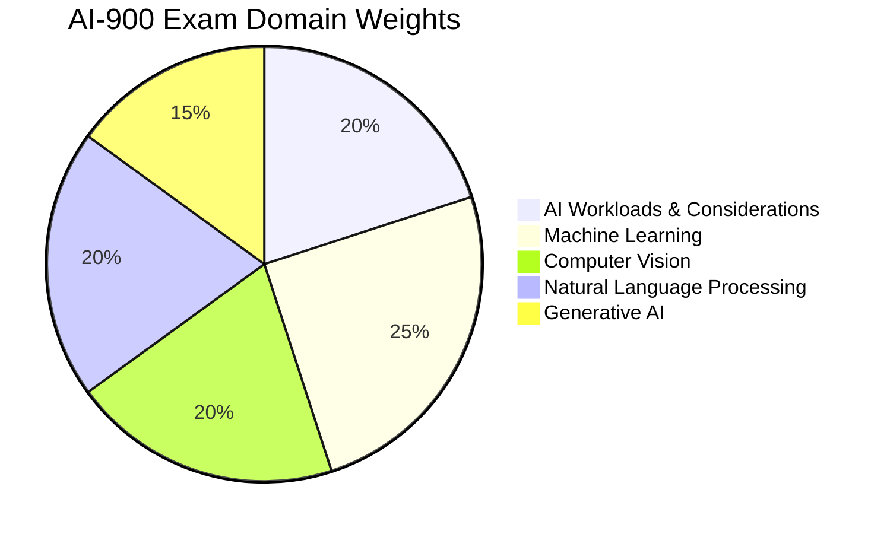
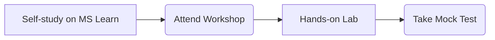

# 1. AI-900 Course Overview and Learning Path

## Agenda

**Estimated reading time:** ~5 minutes

### Learning outcomes:
- **Understand** the core purpose of the AI-900 certification and its value.
- **Explain** the structure of the 5 main domains in the exam.
- **Apply** the Flipped Classroom learning model in practice.
- **Set up** the Azure practice environment independently.

## Glossary

| Term | Quick Explanation |
| :--- | :--- |
| **AI-900** | Microsoft Azure AI Fundamentals certification, validating foundational knowledge of machine learning and AI concepts on Azure. |
| **Flipped Classroom** | An instructional strategy where students study the theoretical concepts at home before attending the workshop for hands-on practice and Q&A. |
| **Domain** | The core pillars or knowledge areas that make up a certification exam. |

---

## 1. WHY - The Problem and Solution of AI-900

**Problem Statement:**
- There is a severe knowledge gap between business teams and technical teams in Artificial Intelligence projects.
- Project managers and Business Analysts (BAs) often do not fully understand the actual limitations and capabilities of AI, leading to misaligned expectations.
- Beginners lack a clear roadmap when starting with the vast AI ecosystem on the Microsoft Cloud platform.

**Solution:**
The AI-900 certification provides a standardized foundational knowledge base, enabling anyone (without requiring programming skills) to understand and apply AI. The ultimate focus of AI-900 is to answer the core question: *Given a specific problem, which Azure AI service should be used to solve it?*

---

## 2. WHAT - The AI-900 Exam Structure

**Definition:** AI-900 is a multiple-choice exam that assesses foundational knowledge of Machine Learning, Computer Vision, Natural Language Processing, and Generative AI on the Microsoft Azure platform.

**Core Architecture (The 5 Domains):**

1. **AI Workloads & Considerations (15-20%):** Identifying basic AI workloads and the 6 principles of Responsible AI.
2. **Machine Learning (20-25%):** Foundational concepts of Regression, Classification, and Clustering.
3. **Computer Vision (15-20%):** Image recognition, video analysis, and document extraction (OCR).
4. **Natural Language Processing (15-20%):** Sentiment analysis, automated translation, and speech recognition.
5. **Generative AI (15-20%):** Generative Artificial Intelligence, Azure OpenAI.

---

## 3. HOW - Implementing the Learning Path

### 3.1. Applying the Flipped Classroom Model

To pass AI-900 within an optimal timeframe (49 hours over 8 weeks), the learning process must follow this flow:

- **Self-study:** Complete the theoretical modules on Microsoft Learn before attending the class.
- **Workshop:** The instructor focuses on dissecting confusing concepts rather than repeating basic theory.
- **Hands-on:** Independently deploy services on the Azure Portal for deep retention.

### 3.2. Setting Up the Lab Environment

1. Access [Microsoft Learn](https://learn.microsoft.com/) and sign in with a personal account.
2. Register for an [Azure Portal](https://portal.azure.com/) account. It is highly recommended to use the **Azure for Students** subscription (requires a `.edu` email) to receive $100 in free credits without needing a credit card.

---

## 4. Discussion Questions

1. Why do you think Microsoft recently introduced **Generative AI** as a separate domain in the AI-900 exam?
2. In the Flipped Classroom model, what is the biggest risk that could lead to students losing their direction, and how can it be mitigated?

---
*Made by Anh Tu - Share to be share*
