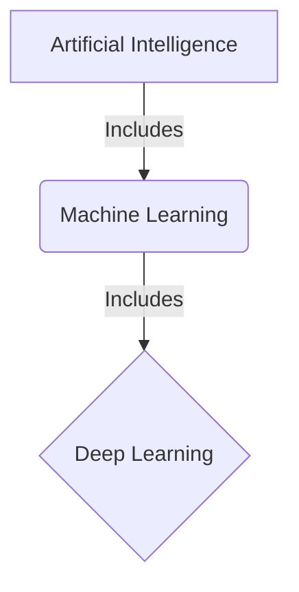

# 2. Anatomy of AI, Machine Learning, and Deep Learning

## Agenda

**Estimated reading time:** ~7 minutes

### Learning outcomes:
- **Understand** the precise definitions and hierarchical boundaries of AI, ML, and DL.
- **Explain** the core reasons why Deep Learning has exploded in the past decade.
- **Distinguish** when to use traditional Machine Learning versus when Deep Learning is absolutely necessary.

## Glossary

| Term | Quick Explanation |
| :--- | :--- |
| **Artificial Intelligence (AI)** | Computer systems that mimic human cognitive capabilities. |
| **Machine Learning (ML)** | A subset of AI that uses mathematics to allow computers to find patterns from data automatically. |
| **Deep Learning (DL)** | A subset of ML that uses multi-layered Artificial Neural Networks. |
| **Neural Network** | An algorithmic architecture that simulates how neurons connect in the human brain. |

---

## 1. WHY - The Boundary Definition Problem

**Problem Statement:**
- The term "AI" is heavily abused in marketing, causing confusion about the true capabilities of a system.
- Engineers and BAs often confuse using rule-based systems (`if-else` rules) with Machine Learning.
- Choosing the wrong technology (e.g., using Deep Learning for an overly simple problem) leads to a massive waste of computing resources.

**Solution:**
Clearly defining and distinguishing these 3 concept layers (AI, ML, DL) helps software architects choose the right tools, accurately calculate hardware costs (CPU vs GPU), and prepare the correct amount of data required.

---

## 2. WHAT - Definition Anatomy

**Core Hierarchical Architecture:**

### 2.1. Artificial Intelligence
**Definition:** Any software capable of **mimicking** intelligent human behaviors.

**Definition Anatomy:**
- **Mimic:** The system does not necessarily have to be truly "intelligent" or capable of self-learning. A chess program operating based on millions of static `if-else` statements written by programmers is also called AI.

### 2.2. Machine Learning
**Definition:** A subset of AI that uses statistical algorithms to allow systems to **learn from data** instead of being explicitly programmed.

**Definition Anatomy:**
- **Learn from data:** Programmers do not write `if-else` rules (e.g., "If it contains the word 'discount', it is spam"). Instead, the computer reads 10,000 emails and derives statistical rules to identify spam automatically.

### 2.3. Deep Learning
**Definition:** A subset of ML that solves complex problems using **Artificial Neural Networks** with multiple hidden layers.

**Definition Anatomy:**
- **Neural Networks:** A mathematical architecture simulating the human brain.
- **Multiple (Deep) layers:** The word "Deep" implies that the data passes through many filtering layers. Each layer extracts a more complex feature (e.g., Identifying pixels -> lines -> shapes -> faces).

---

## 3. HOW - Applications and Trade-offs

AI theories have been around since the 1950s, but Deep Learning only truly boomed recently due to three core factors: **Big Data**, **Cloud Computing**, and **GPUs** (Graphics Processing Units for parallel matrix processing).

### 3.1. When to use ML versus DL?

The biggest difference lies in scalability with data.

| Criteria | Traditional Machine Learning | Deep Learning |
| :--- | :--- | :--- |
| **Data Volume** | Works well with a few thousand rows of data (Excel/SQL). | Requires millions of images/texts to be effective. |
| **Hardware** | Requires only a standard CPU. | Strictly requires expensive GPUs to optimize speed. |
| **Transparency** | Highly explainable (e.g., Decision Tree anatomy). | A "Black Box" - It is impossible to explain exactly why the machine made a specific decision. |
| **Problem Types** | Predicting house prices, credit risk classification. | Facial recognition, autonomous driving, Generative AI. |

---

## 4. Discussion Questions

1. In healthcare systems (like cancer diagnosis), Explainability is crucial. In your opinion, what ethical risks arise from using "black box" Deep Learning in the medical field?
2. If your enterprise only has 5 years of sales data with about 50,000 rows, would you choose to implement Machine Learning or Deep Learning to forecast next month's sales? Why?

---
*Made by Anh Tu - Share to be share*
