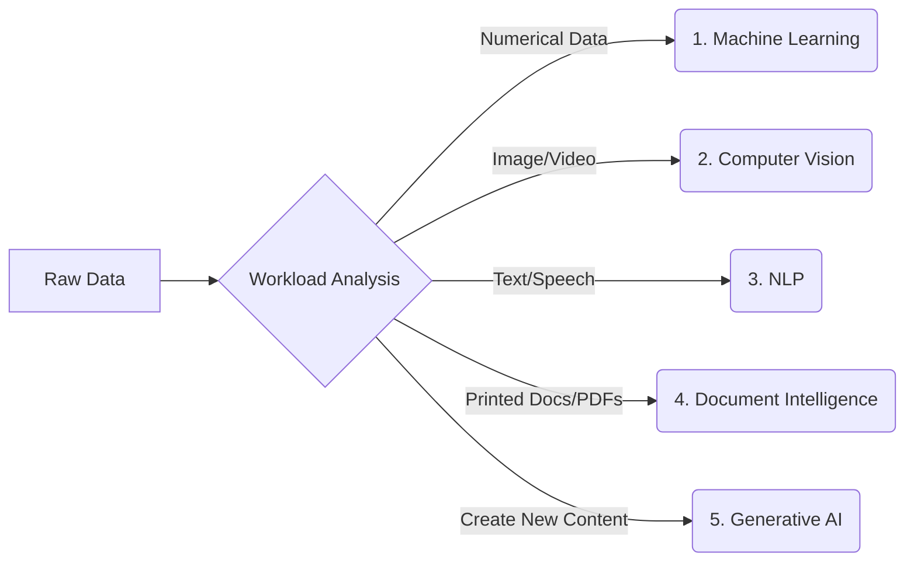

# 3. The Five (5) Core AI Workloads

## Agenda

**Estimated reading time:** ~8 minutes

### Learning outcomes:
- **Understand** the concept of a "Workload" in Cloud Computing.
- **Explain** the purpose and applications of the 5 core workloads in Azure AI.
- **Distinguish** which problems require Vision, and which require NLP or Document Intelligence.
- **Apply** the Input/Output classification mindset to solve real-world scenario questions in the AI-900 exam.

## Glossary

| Term | Quick Explanation |
| :--- | :--- |
| **Workload** | A specific amount of work or type of problem that a system needs to solve. |
| **Computer Vision (CV)** | The capability of AI to process and analyze images/videos. |
| **Natural Language Processing (NLP)** | The capability to process, analyze, and generate human language (text/speech). |
| **Generative AI (GenAI)** | Artificial intelligence capable of generating new content based on learned data. |

---

## 1. WHY - The Problem of Categorizing AI Tasks

**Problem Statement:**
- Clients often describe requirements very vaguely: "I want an AI that scans contracts and translates them into English." Engineers struggle to know which service to start with.
- Microsoft Azure has dozens of separate APIs and services. Choosing the wrong service not only fails to solve the problem but also causes massive financial waste.

**Solution:**
Breaking down the massive AI world into standard **Workloads** helps structure the thinking process. By looking at the client's "Input," an engineer can instantly narrow down the required service. This is also the backbone of the AI-900 exam.

---

## 2. WHAT - What Are the 5 Core Workloads?

The AI world on Azure is divided into 5 main task groups.

### 2.1. Machine Learning
Uses historical data to predict the future or categorize entities.
- **Example:** Forecasting next month's inventory based on 3 years of sales data.

### 2.2. Computer Vision
The "sight" capability of the system. Analyzes pixels to understand the physical world.
- **Example:** A system identifying whether workers are wearing safety helmets via construction site cameras.

### 2.3. Natural Language Processing (NLP)
The "hearing" and "speaking" capabilities of the system.
- **Example:** Analyzing thousands of customer feedback emails to determine the negative/positive sentiment ratio.

### 2.4. Document Intelligence
A hybrid branch combining visual text recognition (Vision/OCR) and structural understanding (NLP).
- **Example:** Automatically extracting Full Name and Date of Birth from a scanned PDF ID card.

### 2.5. Generative AI
The ability to "create" entirely new content that never existed before based on a text input (Prompt).
- **Example:** Generating a company logo image or writing a Python code snippet automatically.

---

## 3. HOW - Identifying Workloads in Practice

To pass the AI-900 exam and provide accurate consulting in reality, train your reflexes to categorize based on "Input."

1. **Input:** An Excel file containing 100,000 customer records. Requirement: Group them for targeted advertising.
   - -> **Workload:** Machine Learning (Clustering).
2. **Input:** A video stream from a traffic camera. Requirement: Count the number of trucks.
   - -> **Workload:** Computer Vision (Object Detection).
3. **Input:** Call center audio recordings. Requirement: Summarize the call content.
   - -> **Workload:** NLP (Speech to Text & Summarization).
4. **Input:** A wrinkled photo of a supermarket receipt. Requirement: Extract the total amount.
   - -> **Workload:** Document Intelligence.
5. **Input:** The prompt "Please write a polite email rejecting a candidate."
   - -> **Workload:** Generative AI.

---

## 4. Discussion Questions

1. In your opinion, how does a **Document Intelligence** system extracting data from a PDF Form differ from traditional Optical Character Recognition (OCR) technology? Why does traditional OCR fail when the form layout changes?
2. In an app that allows a visually impaired person to take a picture of a street sign and have the phone read its content aloud, which Workloads is the system combining?

---
*Made by Anh Tu - Share to be share*
