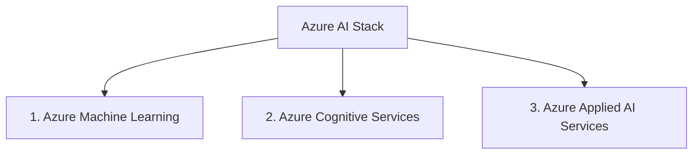

# 1. The Azure AI Services Landscape

## Agenda

**Estimated reading time:** ~8 minutes

### Learning outcomes:
- **Understand** the overall architecture of Azure AI Services.
- **Explain** the difference between custom Machine Learning and pre-built Cognitive Services.
- **Distinguish** between Azure Applied AI Services and standard API endpoints.

## Glossary

| Term | Quick Explanation |
| :--- | :--- |
| **Azure Machine Learning (AML)** | A platform for data scientists to build, train, and deploy custom AI models from scratch. |
| **Azure Cognitive Services** | Pre-built AI models accessible via API calls for vision, speech, language, and decision-making. |
| **Azure Applied AI Services** | Task-specific AI solutions that combine multiple Cognitive Services with business logic (e.g., Azure Bot Service, Form Recognizer). |

---

## 1. WHY - The Problem of Fragmentation

**Problem Statement:**
- When a company decides to integrate AI, developers are bombarded with hundreds of different services, SDKs, and tools on the Azure platform.
- Building an AI application from scratch takes months, requires scarce data scientist talent, and consumes significant computational resources.
- Developers often try to train complex models for simple tasks (like reading text from an image), which wastes time because Microsoft has already solved and optimized it.

**Solution:**
Microsoft Azure organizes its AI ecosystem into distinct layers based on the level of customization required. Understanding this landscape allows architects to choose the path of least resistance: using pre-built APIs for common tasks and reserving custom model training only for highly specialized business logic.

---

## 2. WHAT - Anatomy of the Azure AI Stack

**The 3-Tier Architecture:**

### 2.1. Azure Machine Learning (The Foundation)
**Definition:** A cloud-based environment used to train, deploy, automate, and manage custom machine learning models.

**Definition Anatomy:**
- **Custom models:** You must provide your own data, select your own algorithm, and manage the training pipeline.
- **Target Audience:** Data Scientists and ML Engineers.

### 2.2. Azure Cognitive Services (The Building Blocks)
**Definition:** Cloud-based APIs that bring AI capabilities to applications without requiring machine learning expertise.

**Definition Anatomy:**
- **Pre-built APIs:** Microsoft has already trained these models on massive datasets. You simply send an HTTP request (Input) and receive a JSON response (Output).
- **Core Pillars:** Vision (Image analysis), Speech (Text-to-Speech), Language (Translation, Sentiment), and Decision (Anomaly detection).

### 2.3. Azure Applied AI Services (The Business Solutions)
**Definition:** High-level services that combine Cognitive Services, task-specific AI, and business logic to solve common scenarios.

**Definition Anatomy:**
- **Task-specific:** Instead of just providing an OCR API (Cognitive Service), Applied AI provides a "Form Recognizer" that specifically understands receipts, invoices, and ID cards out of the box.

---

## 3. HOW - Applying the Right Layer

When designing a cloud architecture, always follow the rule: **Use the highest level of abstraction that meets your requirements.**

1. **Scenario 1: Extracting totals from restaurant receipts.**
   - -> **Choice:** Azure Applied AI (Document Intelligence / Form Recognizer). It has a pre-built receipt model.
2. **Scenario 2: Translating a user's chat message from Spanish to English.**
   - -> **Choice:** Azure Cognitive Services (Translator API). It is a standard building block.
3. **Scenario 3: Predicting equipment failure in a highly specific manufacturing plant based on proprietary sensor data.**
   - -> **Choice:** Azure Machine Learning. No pre-built model exists for your specific machines, so you must train your own.

---

## 4. Discussion Questions

1. If you are a startup with no data scientists on your team, which layer of the Azure AI stack should you focus on to integrate AI into your mobile app? Why?
2. Azure Cognitive Services are charged per API call. What are the potential financial risks of this pricing model for a high-traffic consumer application, and how might you mitigate them?

---
*Made by Anh Tu - Share to be share*
