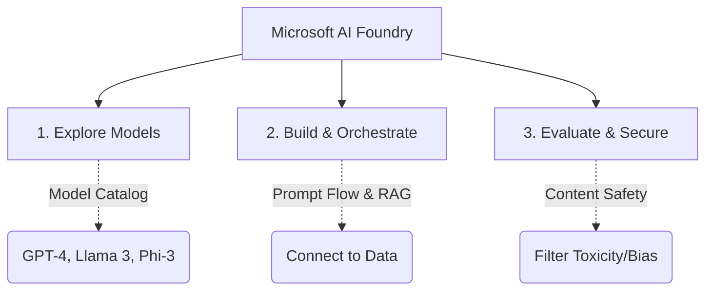

# 2. Deep Dive into Microsoft AI Foundry

## Agenda

**Estimated reading time:** ~9 minutes

### Learning outcomes:
- **Understand** the core concept and purpose of Microsoft AI Foundry.
- **Explain** how AI Foundry unifies the previously fragmented AI development lifecycle.
- **Identify** the key components of the Foundry platform (Models, Tools, Safety).
- **Apply** basic concepts of Prompt Flow within the Foundry environment.

## Glossary

| Term | Quick Explanation |
| :--- | :--- |
| **Microsoft AI Foundry** | A unified portal (formerly Azure AI Studio) designed specifically for building Generative AI applications and custom copilots. |
| **Model Catalog** | A library within Foundry containing thousands of pre-trained models from OpenAI, Meta, HuggingFace, and Microsoft. |
| **Prompt Flow** | A visual tool in Foundry for orchestrating LLM workflows, connecting prompts to Python code and databases. |
| **RAG** | Retrieval-Augmented Generation. A technique to ground an AI model on your private company data without retraining it. |

---

## 1. WHY - The Chaos of Generative AI Development

**Problem Statement:**
- Building a Generative AI application (like a custom chatbot) is highly fragmented. Developers have to use one portal to provision the OpenAI model, another tool to write prompts, a separate database for vector search, and yet another service for content moderation.
- Switching between different environments (Azure Portal, Azure OpenAI Studio, Machine Learning Studio) causes friction and slows down deployment.
- Ensuring AI safety (preventing the bot from swearing or leaking data) is difficult to implement manually from scratch.

**Solution:**
Microsoft AI Foundry was created to be the **"One-Stop Shop"** for GenAI development. It brings together models, data, prompt engineering tools, and safety guardrails into a single, cohesive interface. Developers can prototype, evaluate, and deploy a complete Copilot without leaving the Foundry portal.

---

## 2. WHAT - Anatomy of Microsoft AI Foundry

**Definition:** Microsoft AI Foundry is a comprehensive platform designed to streamline the lifecycle of building Generative AI applications, integrating state-of-the-art foundation models with enterprise-grade tooling.

**Core Architecture (The 3 Pillars):**

### 2.1. Explore Models (Model Catalog)
**Definition Anatomy:**
- **Catalog:** It is not limited to just Microsoft's proprietary models. It is an open ecosystem featuring thousands of open-source and proprietary models (OpenAI, Meta's Llama, Mistral, HuggingFace). You can compare their performance metrics directly in the portal.

### 2.2. Build & Orchestrate (Prompt Flow & RAG)
**Definition Anatomy:**
- **Orchestrate:** An LLM rarely works alone. It needs context. AI Foundry provides "Prompt Flow," a visual graph where you can link an LLM node to a Python script node, and then to a database search node.
- **RAG Integration:** Built-in tools allow you to easily upload your company's PDFs, chunk them, and connect them to the LLM so the bot can answer questions based on your private data.

### 2.3. Evaluate & Secure (Azure AI Content Safety)
**Definition Anatomy:**
- **Secure:** Built-in filters analyze both the user's input (prompt) and the model's output (completion) to block hate speech, self-harm content, sexual material, or jailbreak attempts before they reach the user.

---

## 3. HOW - The Development Lifecycle in Foundry

To build a secure corporate chatbot in AI Foundry, you follow a standardized lifecycle:

1. **Select a Model:** Go to the Model Catalog and deploy `gpt-4o`.
2. **Add Your Data:** Upload your company HR policy PDFs. Foundry automatically processes them into a searchable vector index.
3. **Draft Prompts:** Use the "Playground" to test system messages like: *"You are an HR assistant. Only answer using the provided documents."*
4. **Orchestrate:** Use Prompt Flow to connect the user input -> search the PDF index -> send data to GPT-4o -> return answer.
5. **Evaluate:** Run an automated evaluation to test if the bot hallucinates.
6. **Deploy:** Click deploy to generate an API endpoint, fully protected by Content Safety filters.

---

## 4. Discussion Questions

1. AI Foundry supports both OpenAI's proprietary models and Open-Source models like Meta's Llama 3. Why would a large enterprise choose an open-source model over GPT-4 for a specific internal task?
2. If Prompt Flow visually orchestrates code and prompts, how does this change the traditional role of a software engineer when building AI applications?

---
*Made by Anh Tu - Share to be share*
