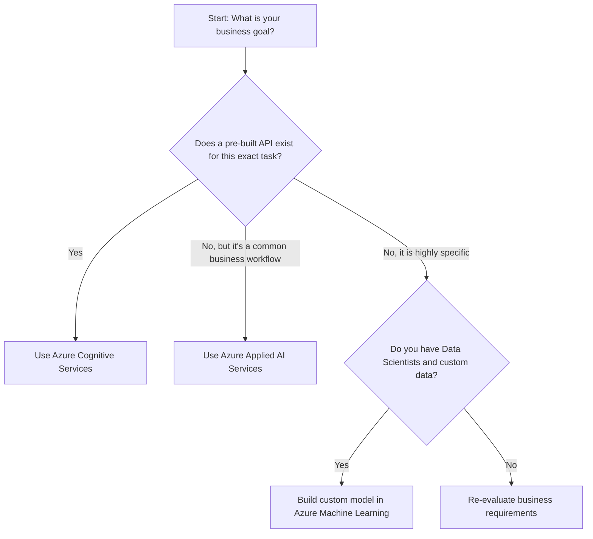

# 3. Choosing the Right AI Service

## Agenda

**Estimated reading time:** ~6 minutes

### Learning outcomes:
- **Understand** the core trade-offs between customization and convenience in cloud AI.
- **Explain** the decision-making framework for selecting an Azure AI service.
- **Apply** the framework to resolve real-world business scenarios.

## Glossary

| Term | Quick Explanation |
| :--- | :--- |
| **Time-to-market** | The amount of time it takes to develop a product and make it available to users. |
| **Customization** | The degree to which an AI model can be altered or trained specifically on private, niche data. |
| **Black Box** | A system where the internal workings are hidden; you only see the inputs and outputs (typical of pre-built APIs). |

---

## 1. WHY - The Paradox of Choice

**Problem Statement:**
- Azure offers multiple ways to achieve the exact same goal. For example, if you want to classify images of cats and dogs, you could use the pre-built Computer Vision API, use Custom Vision to train a model, or write PyTorch code from scratch in Azure Machine Learning.
- Junior engineers often default to the most complex solution (building from scratch) because it feels "more technical."
- This leads to blown budgets, delayed project launches, and unmaintainable codebases.

**Solution:**
A structured decision-making framework is essential. By evaluating the trade-off between **Customization** and **Convenience**, architects can select the service that delivers the fastest ROI (Return on Investment) with the lowest technical debt.

---

## 2. WHAT - The Decision-Making Framework

**Definition:** The framework is a logical flow that forces you to evaluate if Microsoft has already solved your problem before you attempt to solve it yourself.

**The Decision Tree:**

### 2.1. The Trade-off Anatomy

When moving from Cognitive Services down to Machine Learning, you are trading convenience for control.

- **High Convenience (Cognitive Services):** 
  - *Pros:* Ready in 5 minutes. No ML expertise needed. Pay-per-use.
  - *Cons:* Black box. You cannot tweak the underlying neural network.
- **High Control (Azure Machine Learning):**
  - *Pros:* Ultimate flexibility. You own the model IP. Can handle extremely niche data.
  - *Cons:* Requires PhD/Senior Data Scientists. Takes months to train and tune. High computing costs (GPUs).

---

## 3. HOW - Scenario-Based Applications

Let's apply the decision tree to exam-style scenarios:

**Scenario A:** A retail app needs to translate user product reviews from French to English in real-time.
- **Analysis:** Translation is a standard, universally solved problem.
- -> **Decision:** Azure Cognitive Services (Translator API).

**Scenario B:** A hospital needs an AI to analyze X-Ray images and detect a rare, newly discovered bone disease that only exists in their private medical database.
- **Analysis:** This is highly specific. Microsoft's pre-built APIs do not know about this rare disease. The hospital has private data and experts.
- -> **Decision:** Azure Machine Learning (Custom model training).

**Scenario C:** A law firm wants to automatically extract the "Tenant Name" and "Monthly Rent" from thousands of PDF rental contracts.
- **Analysis:** It's a common business workflow (document processing), but the specific fields are custom.
- -> **Decision:** Azure Applied AI (Document Intelligence - Custom Extraction Model).

---

## 4. Discussion Questions

1. Imagine a scenario where a Cognitive Service API works with 85% accuracy, but a custom Azure Machine Learning model could achieve 92% accuracy after 6 months of training. How would you justify which path to choose to your business stakeholders?
2. Why is "Time-to-market" often considered more critical than "Ultimate Customization" in modern software development?

---
*Made by Anh Tu - Share to be share*
