# Lựa Chọn Hướng Phát Triển: Prompt Agents vs Hosted Agents

## Agenda

**Thời gian đọc ước tính:** ~25 phút

### Learning outcome:
- **Hiểu** được bản chất sự khác biệt giữa Prompt Agents (quản lý bằng cấu hình) và Hosted Agents (tự lưu trữ mã nguồn).
- **Phân biệt** được các giao thức kết nối (Protocols) như Responses, Invocations và Invocations WebSocket để phục vụ đúng loại client.
- **Giải thích** được cơ chế cấp phát tài nguyên (Sandbox) và cách lưu trữ trạng thái tệp tin dài hạn (`$HOME`) của Hosted Agent.
- **Tự tin ra quyết định** kiến trúc (Trade-off) xem bài toán hiện tại của doanh nghiệp nên chọn hướng tiếp cận nào.

---

## Glossary & Vocabulary

**1. Technical Terms (Thuật ngữ kỹ thuật):**

| Term | Vietnamese Meaning & Quick Explain |
| :--- | :--- |
| **Prompt Agent** | Đặc vụ cấu hình bằng Prompt. Bạn không viết code ứng dụng, chỉ viết câu lệnh chỉ thị. Mọi thứ do nền tảng Foundry chạy. |
| **Hosted Agent** | Đặc vụ lưu trữ mã nguồn (đang Preview). Bạn tự viết code bằng LangGraph, Semantic Kernel, đóng gói thành Container (Docker) và đưa lên Foundry chạy. |
| **Protocol (Giao thức)** | Cách thức mà Agent giao tiếp với thế giới bên ngoài. Foundry hỗ trợ nhiều giao thức như Responses (chuẩn OpenAI) hoặc Invocations (chuẩn JSON tự do). |
| **Sandbox** | Hộp cát cô lập. Một môi trường máy ảo thu nhỏ, bảo mật và tách biệt hoàn toàn dành riêng cho mỗi phiên làm việc của người dùng. |

**2. Vocabulary Support (Từ vựng học thuật/B1+):**

| Word | Meaning in Context (Nghĩa trong ngữ cảnh) |
| :--- | :--- |
| **Heterogeneous (adj)** | Hỗn mang, không đồng nhất. Chỉ các môi trường điện toán đám mây gồm nhiều loại server, ngôn ngữ và nền tảng khác nhau chắp vá lại. |
| **Immutable (adj)** | Bất biến. Khi một phiên bản (version) của Agent được tạo ra, nó không thể bị chỉnh sửa nữa. Muốn sửa phải tạo version mới. |
| **Deprovision (v)** | Thu hồi tài nguyên. Hệ thống tự động lấy lại RAM/CPU khi Agent không hoạt động (idle) để tiết kiệm chi phí. |
| **Cross-cutting concerns (n)** | Các vấn đề cắt ngang. Những việc kỹ thuật nền tảng mà dự án nào cũng phải làm (ví dụ: bảo mật, logging, setup server) thay vì tập trung vào tính năng nghiệp vụ. |

---

## 1. WHY — Tại Sao Không Chỉ Có Một Cách Làm?

Nếu Microsoft Foundry Agent Service đã rất tuyệt vời trong việc bao bọc các độ phức tạp của LLM, tại sao họ không tạo ra một giao diện kéo thả (Drag-and-Drop) duy nhất rồi bắt mọi người dùng chung?

Bởi vì thế giới phần mềm là một môi trường không đồng nhất (Heterogeneous).
1. **Sự đa dạng của Data Payload (Định dạng dữ liệu):** Một Webhook gửi từ GitHub khi có Pull Request mới sẽ mang định dạng JSON hoàn toàn khác với định dạng Chat Message chuẩn của hệ thống OpenAI. Nếu nền tảng chỉ hỗ trợ 1 kiểu, bạn không thể tích hợp GitHub vào Agent.
2. **Nhu cầu Custom Orchestration (Điều phối phức tạp):** Chatbot cơ bản chỉ có luồng: User hỏi → Agent nghĩ → Agent trả lời. Nhưng với hệ thống duyệt hợp đồng, luồng có thể là: Agent 1 đọc file → Gửi cho Agent 2 dịch thuật → Chờ con người duyệt → Gửi cho Agent 3 ký số. Prompt Agent cơ bản không thể gánh vác luồng đa tác vụ rối rắm này.
3. **Nỗi ám ảnh mang tên "Cross-cutting concerns":** Khi bạn tự build các hệ thống phức tạp trên, bạn lại rơi vào cái bẫy phải tự setup Docker, cấu hình Web Server, viết code tự động thu hồi RAM (Deprovision) khi rảnh rỗi.

Để giải bài toán này, Microsoft Foundry chia cách phát triển thành 2 hướng: **Prompt Agents** cho những tác vụ nhanh, tiêu chuẩn; và **Hosted Agents** (đang ở giai đoạn Preview) cho những tác vụ tự viết code phức tạp (Bring-your-own-code) nhưng vẫn được hưởng ké hạ tầng bảo mật và tự động mở rộng từ Foundry.

---

## 2. WHAT — Bản Chất Của Từng Hướng Trải Nghiệm

### 2.1. Prompt Agents

**Định nghĩa:** Prompt agents are defined entirely through configuration — instructions, model selection, and tools. Foundry runs the agent for you.

#### Giải phẫu định nghĩa (Definition Anatomy):
- **entirely through configuration** (*hoàn toàn qua cấu hình*): Không hề có khái niệm hàm `main()` hay vòng lặp `while`. Bạn cấu hình trên file YAML hoặc click chuột trên Portal.
- **runs the agent for you** (*chạy hộ bạn*): Bạn không sở hữu tiến trình (process) nào trên RAM của máy chủ.

**Cơ chế hoạt động:**
Bạn có 2 con đường:
- **Portal-first:** Lên web Foundry, gõ prompt, chọn Model GPT-4o, add thêm Tool Web Search -> Xong.
- **Code-first:** Dùng Python SDK, gọi hàm `create_version(...)` truyền vào chuỗi Prompt. Code này chỉ dùng để *khai báo* cho Foundry biết, chứ bản thân code Python của bạn không lưu trữ (host) cái Agent đó.

### 2.2. Hosted Agents

**Định nghĩa:** Hosted agents are containerized agentic AI applications that run on Agent Service. It is your own code packaged as a container image.

#### Giải phẫu định nghĩa:
- **containerized** (*được đóng gói vào container*): Mã nguồn của bạn (ví dụ dùng thư viện LangGraph) sẽ được gói thành Docker Image.
- **your own code** (*code của chính bạn*): Bạn có toàn quyền định nghĩa luồng rẽ nhánh `if/else`, vòng lặp vô tận, hoặc logic kết nối Database nội bộ.

**Cơ chế hoạt động:**
Thay vì viết Prompt, bạn viết code Python/C#. Bạn nén file `.zip` mã nguồn hoặc đẩy Docker Image lên Azure Container Registry. Khi bạn ấn Deploy, Foundry sẽ kéo Image đó về, cấp cho nó một môi trường cách ly (Sandbox), gắn cho nó một thẻ căn cước (Microsoft Entra ID) và hứng các Request từ bên ngoài để đẩy vào cho code của bạn xử lý.

```mermaid
architecture-beta
    group prompt(cloud)["Prompt Agent Approach"]
    service p_config(document)["Configuration (YAML / Portal)"] in prompt
    service p_runtime(server)["Foundry Managed Runtime"] in prompt
    
    group hosted(cloud)["Hosted Agent Approach"]
    service h_code(document)["Custom Code (LangGraph / C#)"] in hosted
    service h_container(server)["Foundry Sandbox Container"] in hosted

    p_config:R -- L:p_runtime
    h_code:R -- L:h_container
```

---

## 3. HOW — Đi Sâu Vào Hosted Agent (Kiến Trúc Container)

Vì Prompt Agent rất đơn giản, chúng ta sẽ dành phần HOW này để "mổ xẻ" cơ chế hoạt động thực tế của Hosted Agents.

### 3.1. Sandbox và Cơ Chế Lưu Trữ Trạng Thái (State Persistence)

Mỗi khi một người dùng (Session) bắt đầu chat với Hosted Agent của bạn, Foundry KHÔNG chạy chung tất cả người dùng vào 1 máy ảo. Hệ thống tự động tạo ra một Sandbox (Máy ảo cô lập) riêng biệt cho Session đó.

- **Dung lượng:** Mỗi Sandbox có ngân sách ổ cứng lên đến **20 GiB** (trừ đi khoảng 20% cho hệ thống).
- **Lưu trữ tệp:** Sandbox sở hữu thư mục `$HOME` và `/files`. Nếu code của bạn tải một file PDF từ mạng về lưu vào `$HOME`, file đó sẽ tồn tại xuyên suốt phiên làm việc.
- **Idle Timeout (Ngủ đông):** Nếu người dùng ngưng chat quá 15 phút, Foundry sẽ thu hồi CPU/RAM để tiết kiệm tiền (Scale-to-zero). Nhưng nó sẽ **đóng băng và lưu lại** toàn bộ thư mục `$HOME`. Hôm sau người dùng chat lại, Sandbox thức dậy và file PDF vẫn còn nguyên đó. Sandbox chỉ bị xóa vĩnh viễn sau 30 ngày không hoạt động.

### 3.2. Đa Dạng Giao Thức (Protocols)

Code của bạn bên trong Container giao tiếp với thế giới bằng cách nào? Bạn phải "mở cửa" (Expose) các Protocols. Foundry hỗ trợ nhiều "cửa" cho các mục đích khác nhau:

| Giao thức | Đầu vào/Đầu ra | Mục đích sử dụng tốt nhất |
| :--- | :--- | :--- |
| **Responses** | Chuẩn OpenAI `/responses` | Tích hợp vào các ứng dụng Chat UI, tự động quản lý lịch sử (Conversation). |
| **Invocations** | JSON tự do (Arbitrary JSON) | Làm Webhook nhận sự kiện từ GitHub/Stripe, hoặc trả về dữ liệu Data dạng bảng thay vì hội thoại. |
| **Invocations (WebSocket)** | Real-time Stream | Đang Preview. Dùng để làm Agent nhận diện Giọng nói (Voice agent) cần kết nối mở liên tục. |
| **Activity** | Chuẩn Microsoft | Dùng để cầu nối (bridge) Agent của bạn vào Microsoft Teams mà không cần sửa code. |

Bạn hoàn toàn có thể cấu hình Container của mình mở cùng lúc 2 cửa: Cửa **Responses** để chat với user, và cửa **Invocations** để hứng Webhook từ hệ thống khác.

### 3.3. Định Danh Và Phân Quyền (Agent Identity)

Bạn viết code kết nối với Azure SQL Database, làm sao để xác thực an toàn?
Tuyệt đối KHÔNG gán cứng (hard-code) mật khẩu trong file `.env`.
Thay vào đó, khi Container của bạn chạy lên, Foundry tự động tiêm vào đó một **Agent Identity** (định danh Entra ID). Code của bạn chỉ cần gọi `DefaultAzureCredential()` — hệ thống tự biết Container này là ai và nó được cấp phép đọc Database nào (RBAC).

---

## 4. WHAT IF — Lựa Chọn Bằng Trade-off Matrix

Hãy đối chiếu nhu cầu của dự án với Bảng đánh đổi (Trade-off Matrix) sau để đưa ra quyết định chuẩn xác.

| Tiêu chí | Chọn Prompt Agents | Chọn Hosted Agents |
| :--- | :--- | :--- |
| **Nền tảng / Mã nguồn** | No-code / Low-code. Quản lý hoàn toàn bằng cấu hình. | Pro-code. Tự do xài LangGraph, Semantic Kernel. |
| **Thời gian ra mắt (Time-to-market)** | Cực nhanh. Thiết lập 5 phút trên Portal là chạy. | Chậm hơn. Phải viết code, Build Docker, cấu hình biến môi trường. |
| **Mô hình tính phí (Cost)** | Chỉ tính tiền Token LLM và số lần gọi Tool. | Trả tiền Token + Gọi Tool + **Phí duy trì Sandbox (CPU/RAM)** theo giờ. |
| **Bảo trì Hệ Điều Hành** | Không bận tâm. | Không bận tâm HĐH, nhưng phải tự lo cập nhật thư viện `pip` hoặc `npm` trong code. |
| **Lưu trữ Tệp cục bộ** | Không hỗ trợ xử lý file tùy biến sâu. | Quản lý chủ động qua `$HOME` và `/files` với 20GB dung lượng. |

### Kịch bản minh họa:

**Kịch bản 1: AI Trực Tổng Đài Bệnh Viện**
*Yêu cầu:* Trả lời câu hỏi bệnh nhân dựa trên file Word Cẩm nang, hẹn lịch khám cơ bản.
👉 **Quyết định:** Chọn **Prompt Agent**. Chỉ cần viết Prompt hướng dẫn cách xưng hô, add Tool Azure AI Search để đọc cẩm nang, add OpenAPI Tool để gọi hàm đặt lịch. Không cần tự gánh vác chi phí Sandbox vì lượng truy vấn ban đêm rất thấp.

**Kịch bản 2: AI Code Reviewer**
*Yêu cầu:* Khi có Push event lên GitHub, tải toàn bộ mã nguồn về (hàng ngàn file), chạy tool phân tích bảo mật SonarQube cục bộ (local binary), tự viết code sửa lỗi, sau đó push commit mới.
👉 **Quyết định:** Chọn **Hosted Agent**. Prompt Agent không thể chạy file `.exe` cục bộ. Bạn phải đóng gói SonarQube vào Docker Container, lắng nghe qua giao thức **Invocations**, lưu đống code vào `$HOME`, và dùng logic rẽ nhánh phức tạp của Python để tự động hóa toàn bộ.

---

## 5. TL;DR — Ôn Tập Nhanh

- **Prompt Agents** là giải pháp "Serverless" đúng nghĩa cho AI: Bạn cung cấp Luật lệ (Instructions), Foundry lo mọi thứ từ máy chủ đến mở rộng. Nhanh, gọn, rẻ.
- **Hosted Agents** mang đến sức mạnh vô hạn: Bạn viết code bằng bất kỳ Framework nào, đóng gói thành Container. Foundry cấp cho bạn môi trường máy ảo cách ly (Sandbox), dung lượng 20GB, khả năng đóng băng trạng thái khi rảnh rỗi và 1 định danh bảo mật riêng.
- Về Giao tiếp, **Responses Protocol** ưu việt cho làm Chatbot vì nó tự lưu lịch sử, trong khi **Invocations Protocol** là vua khi cần nhận Webhook từ bên thứ 3 bằng JSON tùy ý.
- Nếu không chắc chắn, hãy bắt đầu bằng Prompt Agents. Chỉ chuyển sang Hosted khi bạn vấp phải giới hạn về việc cần luồng điều phối phức tạp (multi-agent orchestration) hoặc cần xử lý định dạng dữ liệu dị biệt.

---

### Discussion Questions
1. Nếu bạn đang thiết kế một ứng dụng Hosted Agent, vì sao việc Foundry tự động thu hồi CPU (Deprovision) sau 15 phút không có tương tác lại là một "tính năng đáng giá" thay vì là một điểm bất lợi? Cơ chế nào giúp trải nghiệm người dùng không bị gián đoạn?
2. Pitfall bảo mật: Hosted Agent cho phép bạn viết bất cứ dòng code Python nào. Giả sử mã nguồn của bạn có lỗi bảo mật (như lỗ hổng tải file tùy ý), điều gì sẽ ngăn chặn hacker dùng lỗi này để thâm nhập vào các Agent của các dự án khác đang chạy trên cùng nền tảng Foundry? Gợi ý: Hãy nghĩ đến từ khóa "Sandbox".

---

## 6. References (Nguồn tài liệu)

Bài viết được tổng hợp, phân tích và giải phẫu chi tiết dựa trên các tài liệu chuyên sâu (Documentations) từ Microsoft:
- **Tài liệu gốc:** [Hosted agents in Foundry Agent Service - Microsoft Learn](https://learn.microsoft.com/en-us/azure/foundry/agents/concepts/hosted-agents)
- Bảng phân tích Protocols (Responses vs Invocations) và Bảng so sánh giới hạn tài nguyên (Sandbox 20GiB, CPU/RAM limits) được trích dẫn và chuẩn hóa trực tiếp từ tài liệu kỹ thuật của Hosted Agents.
- Kiến trúc lưu trữ trạng thái với cơ chế Lifecycle (Active -> Idle -> Resumed) và thư mục `$HOME` được tham chiếu nhằm tránh rủi ro hallucinate kiến thức hệ thống.

---
*Made by Anh Tu - Share to be share*
