# Microsoft Foundry Agent Service: Kiến Trúc Runtime & Responses API

## Agenda

**Thời gian đọc ước tính:** ~20 phút

### Learning outcome:
- **Hiểu** được vai trò của 3 thành phần Runtime cốt lõi: Agent, Conversation, và Response.
- **Giải thích** được cách Responses API hoạt động như một điểm trung chuyển trung tâm cho mọi truy vấn.
- **Tự tay** viết được đoạn code Python đơn giản để khởi tạo Agent và thực thi một chuỗi hội thoại (Conversation).
- **Phân biệt** được khi nào nên lưu trữ lịch sử (Stateful) và khi nào nên dùng truy vấn không lưu trữ (Stateless).

---

## Glossary & Vocabulary

**1. Technical Terms (Thuật ngữ kỹ thuật):**

| Term | Vietnamese Meaning & Quick Explain |
| :--- | :--- |
| **Agent Runtime** | Môi trường thực thi của Agent. Nơi cung cấp tài nguyên điện toán để duy trì vòng đời, quản lý lịch sử hội thoại và tự động mở rộng (autoscale) khi có nhiều truy vấn. |
| **Conversation** | Đối tượng lưu trữ lịch sử hội thoại xuyên suốt nhiều lượt tương tác. Nó giúp Agent nhớ lại ngữ cảnh của câu hỏi trước đó. |
| **Responses API** | Cổng giao tiếp API hợp nhất. Bạn chỉ cần gọi API này để kích hoạt Agent, kết nối Model và gọi Tools mà không cần quan tâm đến hạ tầng phức tạp phía dưới. |
| **Memory Store** | Kho lưu trữ bộ nhớ dài hạn, giúp Agent nhớ được sở thích người dùng hoặc tóm tắt các cuộc hội thoại cũ. |

**2. Vocabulary Support (Từ vựng học thuật/B1+):**

| Word | Meaning in Context (Nghĩa trong ngữ cảnh) |
| :--- | :--- |
| **Stateful (adj)** | Có trạng thái. Hệ thống có khả năng lưu lại dữ liệu (ví dụ lịch sử chat) từ phiên làm việc trước để sử dụng cho phiên tiếp theo. |
| **Stateless (adj)** | Không trạng thái. Mỗi yêu cầu gửi đi hoàn toàn độc lập, hệ thống không nhớ gì về các yêu cầu trước đó. |
| **Persist (v)** | Lưu trữ vĩnh viễn hoặc duy trì trạng thái dữ liệu qua các vòng đời khởi động lại. |
| **Incrementally (adv)** | Từng chút một. Việc trả về kết quả từng phần (streaming) thay vì đợi phản hồi toàn bộ. |

---

## 1. WHY — Tại Sao Cần Agent Runtime?

Khi bạn mới bắt đầu học về AI, bạn thường viết những đoạn mã ngắn để gọi API của OpenAI. Logic thường rất đơn giản: gửi một chuỗi văn bản (Prompt) và nhận lại một chuỗi văn bản (Response).

Tuy nhiên, khi đưa ứng dụng vào môi trường doanh nghiệp thực tế, bạn sẽ đối mặt với các vấn đề kỹ thuật khổng lồ (Pain points):
1. **Quản lý lịch sử hội thoại (Conversation History):** Nếu người dùng hỏi 20 câu liên tiếp, độ dài ngữ cảnh (context window) của Model sẽ bị đầy. Bạn phải tự viết code cắt gọt, lưu trữ database và nhúng lại lịch sử chat vào từng request.
2. **Quản lý chuỗi công cụ (Tool Orchestration):** Khi Agent cần gọi web search, file search, hoặc API nội bộ, vòng lặp "LLM trả về JSON → Ứng dụng phân tích (parse) JSON → Gọi API → Trả kết quả về cho LLM" rất dễ sinh lỗi và cực kỳ khó duy trì tính ổn định.
3. **Mở rộng quy mô (Scalability):** Nếu ứng dụng có 100,000 người dùng đồng thời, việc quản lý hàng trăm ngàn phiên chat (sessions) đang giữ kết nối sẽ đánh sập máy chủ cá nhân của bạn.

**Giải pháp:** **Microsoft Foundry Agent Service** ra đời để gánh vác toàn bộ hạ tầng này. Nó cung cấp một **Agent Runtime** (Môi trường thực thi) được quản lý hoàn toàn (fully managed), giúp bạn chỉ tập trung vào logic nghiệp vụ thay vì loay hoay thiết kế cơ sở dữ liệu lưu lịch sử hay xử lý vòng lặp gọi Tools.

---

## 2. WHAT — Kiến Trúc Runtime Của Foundry

Agent Runtime trong Microsoft Foundry được thiết kế xoay quanh 3 thành phần cốt lõi tạo thành một chu trình khép kín: **Agent**, **Conversation**, và **Response**.

### 2.1. Định nghĩa 3 thành phần cốt lõi

**Định nghĩa:** Microsoft Foundry Agent Service uses three core runtime components—agents, conversations, and responses—to power stateful, multi-turn interactions.

#### Giải phẫu định nghĩa (Definition Anatomy):
- **stateful** (*có trạng thái*): Hệ thống nhớ được bạn là ai và bạn vừa nói gì ở lượt trò chuyện trước.
- **multi-turn interactions** (*tương tác nhiều lượt*): Không chỉ là hỏi-đáp một lần, mà là một chuỗi hội thoại dài hơi có tính kế thừa ngữ cảnh.

**1. Agent:**
Định nghĩa cấu hình cốt lõi (Bao gồm Model, Instructions, Tools). Agent là thực thể vô tri cho đến khi được cung cấp đầu vào. Trong Foundry, Agent được định danh bằng Tên và Phiên bản (Version) thay vì một ID cố định, giúp dễ dàng kiểm soát phiên bản (Version control).

**2. Conversation (Phiên hội thoại):**
Một đối tượng lưu trữ (Durable object) mang tính lâu dài. Nó chứa một danh sách các "items" (không chỉ có tin nhắn, mà còn bao gồm lịch sử gọi tool, kết quả tool). Conversation là bộ não ngắn hạn của Agent.

**3. Response (Phản hồi):**
Quá trình Agent xử lý đầu vào từ Conversation và sinh ra đầu ra. Response chính là hành động kết xuất kết quả cuối cùng.

```mermaid
architecture-beta
    group user_space(internet)[Client Application]
    group foundry_runtime(cloud)[Foundry Agent Runtime]

    service request(document)[User Input] in user_space
    service response_output(document)[Response Output] in user_space
    
    service conv(database)[Conversation Items] in foundry_runtime
    service agent_def(server)[Agent Definition] in foundry_runtime
    service responses_api(server)[Responses API] in foundry_runtime

    request:R -- L:responses_api
    responses_api:B -- T:agent_def
    responses_api:B -- T:conv
    responses_api:R -- L:response_output
```




**Workflow:** Khi có một yêu cầu mới, Responses API sẽ nạp định nghĩa của Agent (Model gì, Tool gì) và kết hợp với toàn bộ dữ liệu lịch sử trong Conversation. Agent sẽ xử lý, tự động bổ sung kết quả mới vào Conversation, và cuối cùng trả Response về cho người dùng.

---

## 3. HOW — Triển Khai Thực Tế Với Python SDK

Để hiểu rõ sự liên kết của 3 thành phần trên, chúng ta sẽ xem cách khởi tạo và thực thi một Agent bằng **Python SDK** (`azure-ai-projects`).

### 3.1. Khởi tạo Agent

Logic cốt lõi: Bạn cần một Project Client để xác thực với Azure, sau đó định nghĩa Prompt Agent.

```python
# filename: src/create_agent.py
from azure.identity import DefaultAzureCredential
from azure.ai.projects import AIProjectClient
from azure.ai.projects.models import PromptAgentDefinition

PROJECT_ENDPOINT = "your_project_endpoint"

# Bước 1: Khởi tạo client kết nối với Foundry
project = AIProjectClient(
    endpoint=PROJECT_ENDPOINT,
    credential=DefaultAzureCredential(),
)

# Bước 2: Tạo Agent với cấu hình mong muốn
agent = project.agents.create_version(
    agent_name="my-geography-agent",
    definition=PromptAgentDefinition(
        model="gpt-4o",
        instructions="Bạn là một trợ lý ảo am hiểu về địa lý.",
    ),
)
print(f"Đã tạo Agent: {agent.name}, Version: {agent.version}")
```
*Ghi chú WHY:* Chúng ta dùng `DefaultAzureCredential()` để xác thực không cần mật khẩu thông qua cơ chế Microsoft Entra ID tích hợp trong môi trường Azure, giảm rủi ro lộ API Key.

### 3.2. Quản lý Conversation và Sinh Response

Đây là lúc Responses API tỏa sáng. Chúng ta sẽ lấy `openai_client` từ Foundry project để tận dụng chuẩn giao tiếp quen thuộc của thư viện OpenAI, nhưng sức mạnh thực thi lại nằm ở hạ tầng Azure.

```python
# filename: src/multi_turn_chat.py
# (Giả định đã khởi tạo project client như trên)

# Lấy OpenAI client được bọc bởi Foundry
openai = project.get_openai_client()

# Khởi tạo một Conversation lưu trữ trạng thái dài hạn
conversation = openai.conversations.create()

# Lượt chat 1
response = openai.responses.create(
    conversation=conversation.id,
    extra_body={
        "agent_reference": {
            "name": "my-geography-agent",
            "type": "agent_reference",
        }
    },
    input="Thành phố lớn nhất nước Pháp là gì?",
)
print("[Lượt 1]:", response.output_text) 
# Output mong đợi: Paris là thành phố lớn nhất.

# Lượt chat 2 (Follow-up) - KHÔNG CẦN TRUYỀN LẠI CÂU HỎI TRƯỚC
follow_up = openai.responses.create(
    conversation=conversation.id, # Vẫn dùng chung ID conversation
    extra_body={
        "agent_reference": {
            "name": "my-geography-agent",
            "type": "agent_reference",
        }
    },
    input="Dân số của nó là bao nhiêu?", # Agent tự hiểu "nó" là Paris
)
print("[Lượt 2]:", follow_up.output_text)
# Output mong đợi: Dân số Paris khoảng hơn 2.1 triệu người...
```
*Ghi chú WHY:* Việc gán `conversation=conversation.id` giải phóng bạn khỏi vòng lặp nhồi nhét mảng (array) các tin nhắn cũ vào request. Foundry tự động nối dài chuỗi lịch sử trên máy chủ.

---

## 4. WHAT IF — Các Kịch Bản Linh Hoạt & Đánh Đổi

### 4.1. Kịch Bản Stateless (Không lưu trữ)
**Vấn đề:** Nếu bạn xây dựng một API chấm điểm bài luận học sinh có hàng ngàn lượt gọi mỗi phút, việc tạo hàng ngàn đối tượng Conversation trên server Foundry sẽ gây thừa thãi (overhead) tài nguyên, và bạn không có nhu cầu "nhớ" bài luận của học sinh này cho học sinh khác.

**Giải pháp:** Tắt chế độ lưu trữ bằng tham số `store=False`. Lúc này Responses API hoạt động như một endpoint Stateless thuần túy. Bạn tự chủ động chuyển toàn bộ lịch sử (nếu cần) lên client.

```python
# filename: src/stateless_chat.py
response = openai.responses.create(
    # KHÔNG gọi conversation.id
    extra_body={"agent_reference": {"name": "my-agent", "type": "agent_reference"}},
    input="Chấm điểm câu văn sau: 'Con mèo đang chèo cạy'",
    store=False, # Tắt lưu trữ server-side
)
```

### 4.2. Response Stream vs Background
Phụ thuộc vào trải nghiệm người dùng, Foundry hỗ trợ 2 cơ chế sinh kết quả dị biệt:

- **Streaming (`stream=True`):** Kết quả được đẩy về client từng chữ một (Incrementally). Phù hợp cho giao diện UI để người dùng thấy Agent đang gõ chữ ngay lập tức, không bị cảm giác chờ đợi quá lâu.
- **Background (`background=True`):** Đẩy Job vào hàng đợi chạy ngầm. Phù hợp cho các Agent thực hiện tính toán khổng lồ (ví dụ đọc 10 file PDF tài chính để làm báo cáo). Ứng dụng của bạn chỉ cần thỉnh thoảng (poll) kiểm tra trạng thái (`response.status == "completed"`) thay vì giữ kết nối HTTP quá lâu dễ gây đứt gãy.

### 4.3. Quản lý Trí nhớ Dài Hạn (Memory Store)
**Kịch bản:** Conversation chỉ lưu lịch sử hội thoại trong 1 session. Nếu 3 ngày sau người dùng quay lại và muốn Agent nhớ rằng họ bị dị ứng đậu phộng, Conversation sẽ không đáp ứng được.

**Giải pháp:** Microsoft Foundry cung cấp tính năng **Memory Store** (đang Preview). Bằng cách đính kèm Memory Store vào Agent, hệ thống sẽ chạy ngầm một luồng rút trích sở thích cá nhân, tóm tắt các cuộc nói chuyện cũ và tự động tiêm (inject) vào context mỗi khi khởi tạo Response, giúp Agent mang trải nghiệm cá nhân hóa tối đa.

| Tính năng | Tính chất | Thời gian tồn tại | Phù hợp cho |
| :--- | :--- | :--- | :--- |
| **Conversation** | Lưu toàn bộ log chi tiết (100% text, tool calls) | Trong phạm vi một phiên tác vụ | Giữ mạch câu chuyện trực tiếp, sửa lỗi logic ngắn hạn. |
| **Memory Store** | Lưu thông tin tóm tắt và hồ sơ cá nhân (User Profile) | Vĩnh viễn (cho đến khi chủ động xóa) | Trợ lý cá nhân hóa dài hạn (VD: Trợ lý Y tế, Trợ lý Tài chính). |

---

## 5. TL;DR — Ôn Tập Nhanh

- **Agent Runtime** của Foundry bao bọc sự phức tạp của việc tương tác với AI Models, tự động quản lý lịch sử (Conversation) và điều phối công cụ (Tools) thông qua **Responses API**.
- **Conversation** là đối tượng lưu trữ trạng thái lâu dài trên máy chủ. Bạn chỉ cần truyền ID Conversation, Foundry tự biết các lượt tương tác trước đó.
- **Responses API** linh hoạt: có thể chạy Stateful (lưu trữ) hoặc Stateless (không lưu), sinh kết quả kiểu Streaming (trực tiếp) hoặc Background (chạy ngầm).
- **Memory Store** (Trí nhớ) là giải pháp cao cấp hơn Conversation, giúp Agent giữ lại cấu hình cá nhân hóa (User Profile) và tóm tắt nội dung xuyên suốt nhiều tháng sử dụng.

---

### Discussion Questions
1. Khi Agent của bạn gặp một tập lệnh (instructions) phải thực thi qua 15 bước tìm kiếm thông tin và phân tích số liệu tài chính kéo dài khoảng 2 phút. Bạn sẽ cấu hình Responses API gọi hàm theo kiểu `stream=True` hay `background=True`? Tại sao?
2. Pitfall bảo mật: Mặc dù Conversation giúp lập trình viên nhàn hơn bằng cách lưu trữ toàn bộ chuỗi hội thoại trên máy chủ Foundry. Vậy rủi ro gì sẽ xảy ra nếu người dùng vô tình gõ mã thẻ tín dụng hoặc mật khẩu vào hệ thống? Theo bạn, chúng ta nên xử lý việc này trước khi truyền dữ liệu vào Responses API hay sau đó?

---

## 6. References (Nguồn tài liệu)

Bài viết được tổng hợp, phân tích và giải phẫu chi tiết dựa trên tài liệu gốc (Documentations) từ Microsoft:
- **Tài liệu gốc:** [Build with agents, conversations, and responses in Foundry Agent Service - Microsoft Learn](https://learn.microsoft.com/en-us/azure/foundry/agents/concepts/runtime-components)
- Các cấu trúc code mẫu (Python SDK), định nghĩa Runtime Components và cơ chế Stateful/Stateless được tham chiếu trực tiếp từ tài liệu kỹ thuật Foundry.
- Hình ảnh mô tả "Vòng lặp Agent Runtime" được giữ nguyên URL gốc từ Microsoft để đảm bảo tính toàn vẹn (Integrity) kiến thức.

---
*Made by Anh Tu - Share to be share*
