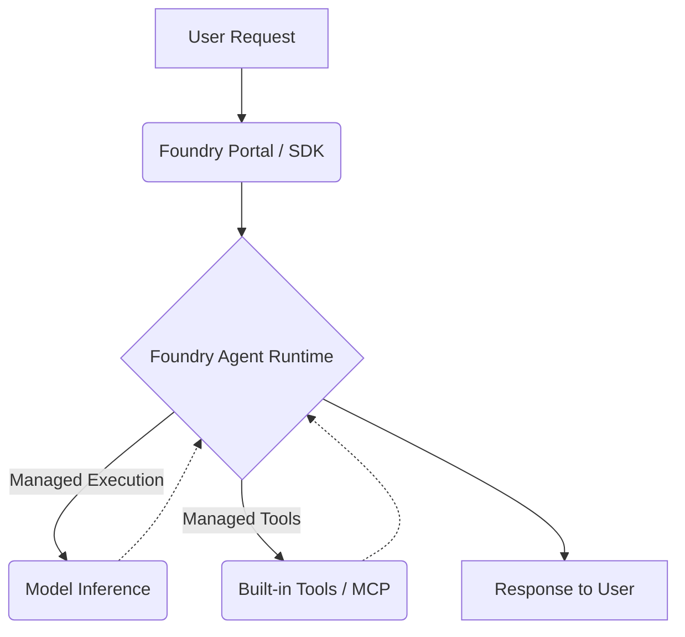

# AI Agent là gì? Toàn cảnh về Microsoft Foundry Agent Service

## Agenda

**Thời gian đọc ước tính:** ~20 phút

### Learning outcome:
- **Hiểu** được khái niệm AI Agent là gì và sự khác biệt căn bản so với các thế hệ Chatbot trước đây.
- **Giải thích** được 3 thành phần cốt lõi cấu tạo nên một AI Agent (Model, Instructions, Tools).
- **Phân biệt** được 3 hướng tiếp cận phát triển (Prompt Agent, Hosted Agent, Responses API) và khi nào nên dùng loại nào.
- **Nắm bắt** được vòng đời phát triển 7 bước (Development Lifecycle) của một Agent trên Microsoft Foundry.
- **Áp dụng** được các nguyên tắc bảo mật và quản lý định danh (Identity & Security) ở cấp độ doanh nghiệp.

---

## Glossary & Vocabulary

**1. Technical Terms (Thuật ngữ kỹ thuật):**

| Term | Vietnamese Meaning & Quick Explain |
| :--- | :--- |
| **AI Agent** | Đặc vụ Trí tuệ nhân tạo. Hệ thống AI có khả năng tự chủ đưa ra quyết định, phân tích yêu cầu phức tạp và gọi công cụ bên ngoài để thực hiện hành động. |
| **Microsoft Foundry Agent Service** | Nền tảng do Microsoft quản lý toàn diện giúp xây dựng, triển khai và mở rộng (scale) các AI agents. |
| **Prompt Agent** | Đặc vụ cấu hình bằng Prompt. Agent chạy hoàn toàn trên server do Foundry quản lý, bạn không cần viết và bảo trì code ứng dụng, chỉ cần cấu hình luật lệ. |
| **Hosted Agent** | Đặc vụ tự lưu trữ mã nguồn. Agent mà bạn viết code logic tuỳ chỉnh (bằng Python, C#), đóng gói thành container và để Foundry quản lý việc chạy container đó. |
| **Responses API** | Cổng giao tiếp duy nhất (Single entry point) của Foundry, cho phép gọi mọi mô hình và công cụ từ một điểm duy nhất. |
| **MCP (Model Context Protocol)** | Giao thức tiêu chuẩn giúp các AI models kết nối với các nguồn dữ liệu và công cụ bên ngoài một cách an toàn. |

**2. Vocabulary Support (Từ vựng học thuật/B1+):**

| Word | Meaning in Context (Nghĩa trong ngữ cảnh) |
| :--- | :--- |
| **Autonomous (adj)** | Tự chủ. Khả năng tự đưa ra quyết định nhiều bước để hoàn thành mục tiêu mà không cần con người hướng dẫn từng chi tiết. |
| **Orchestration (n)** | Sự điều phối. Quá trình kiểm soát, sắp xếp nhiều Agent hoặc nhiều Tool phối hợp với nhau theo một quy trình logic. |
| **Observability (n)** | Khả năng quan sát. Trong phần mềm, đây là khả năng theo dõi luồng thực thi (tracing), phân tích số liệu (metrics) để hiểu hệ thống đang làm gì. |
| **Overhead (n)** | Chi phí phát sinh (về tài nguyên hệ thống, hoặc công sức bảo trì của lập trình viên). |
| **Passthrough (n)** | Cơ chế truyền xuyên. Ví dụ Identity passthrough là việc truyền nguyên vẹn định danh của người dùng từ hệ thống này qua hệ thống khác để uỷ quyền. |

---

## 1. WHY — Tại Sao Cần Biết Điều Này?

Trong những năm qua, chúng ta đã quá quen thuộc với các ứng dụng Chatbot sinh văn bản. Tuy nhiên, khi đưa AI vào giải quyết các bài toán doanh nghiệp phức tạp, Chatbot truyền thống lộ rõ những điểm yếu chí mạng:

1. **Khuyết thiếu dữ liệu thời gian thực (Static Data Limitation):** Các Large Language Models (LLM) chỉ biết những gì có trong dữ liệu huấn luyện của chúng. Chúng mù tịt về số liệu doanh thu hôm nay hay trạng thái server hiện tại của công ty bạn.
2. **Khuyết thiếu năng lực hành động (No Actionability):** Nếu bạn yêu cầu Chatbot "Reset mật khẩu cho tài khoản X", nó chỉ có thể sinh ra hướng dẫn bằng chữ để bạn tự làm, thay vì thực sự tự động truy cập vào hệ thống Active Directory để reset.
3. **Mù mờ trong suy luận nhiều bước:** Để hoàn thành một quy trình nghiệp vụ (ví dụ: cấp phép nghỉ phép), cần phải tra cứu chính sách HR, kiểm tra ngày phép còn lại, và gọi API gửi thông báo. Chatbot sinh văn bản một chiều không thể đảm đương chuỗi logic này.

Đó là lý do **AI Agent** ra đời. Thay vì là một cỗ máy trả lời câu hỏi thụ động, AI Agent là một "thực thể phần mềm" chủ động. Nó được cấp quyền truy cập vào các công cụ (Tools), có khả năng phân tích yêu cầu lớn thành các bước nhỏ, và tự quyết định hành động để đạt được kết quả cuối cùng. Bằng cách sử dụng **Microsoft Foundry Agent Service**, các đội ngũ kỹ thuật có thể xây dựng thế hệ ứng dụng AI tự chủ (autonomous applications) một cách an toàn, quản lý tập trung và dễ dàng mở rộng.

---

## 2. WHAT — Khái Niệm Cốt Lõi Về AI Agent Và Foundry

### 2.1. Định nghĩa AI Agent

**Định nghĩa:** An agent is an AI application that uses a model from the Foundry model catalog to reason about user requests and take autonomous actions to fulfill them.

#### Giải phẫu định nghĩa (Definition Anatomy):
- **AI application** (*Ứng dụng AI*): Agent không chỉ là một model trần trụi (như việc bạn gọi thẳng API của OpenAI). Nó là một phần mềm hoàn chỉnh bao bọc lấy model, quản lý trạng thái và bộ nhớ.
- **reason** (*suy luận*): Khả năng phân tích bài toán. Model được dùng như một "động cơ suy nghĩ" (reasoning engine) để lập kế hoạch.
- **autonomous actions** (*hành động tự chủ*): Điểm mấu chốt. Agent được cấp quyền tự động gọi API, tìm kiếm trên web, chạy mã code (Python) mà không đợi con người ra lệnh cho từng thao tác.

### 2.2. Ba Thành Phần Cốt Lõi Của Một AI Agent

Dù phức tạp đến đâu, mỗi AI Agent trên Microsoft Foundry luôn cấu thành từ 3 thành phần cốt lõi:

1. **Model (Não bộ):** Động cơ ngôn ngữ và suy luận, được chọn từ danh mục Foundry model catalog (như GPT-4o, Llama, DeepSeek). Bạn có thể dễ dàng thay đổi (swap) model khác mà không cần sửa đổi mã nguồn của Agent.
2. **Instructions (Chỉ thị / Luật lệ):** Xác định mục tiêu, các ràng buộc (constraints), và hành vi cốt lõi của Agent. Đối với hệ thống do Foundry quản lý, Instructions là các câu lệnh Prompt. Đối với hệ thống tự lưu trữ, Instructions nằm trong chính các dòng code logic do lập trình viên thiết kế.
3. **Tools (Kỹ năng):** Các công cụ cung cấp quyền truy cập vào dữ liệu và hành động. Chúng có thể là tính năng tìm kiếm web, thao tác với tệp tin (File Search), thông dịch mã (Code Interpreter), hoặc gọi API của bạn thông qua các máy chủ MCP (Model Context Protocol).

```mermaid
architecture-beta
    group agent(server)[AI Agent]

    service model(database)[Model] in agent
    service instructions(document)[Instructions] in agent
    service tools(disk)[Tools] in agent

    model:R -- L:instructions
    model:B -- T:tools
```

**Workflow:** Khi người dùng gửi yêu cầu, Não bộ sẽ đọc Instructions để biết quyền hạn, sau đó suy luận và quyết định sử dụng các Tools tương ứng để thu thập dữ liệu hoặc thực hiện hành động. Chu trình này có thể lặp lại nhiều vòng cho đến khi nhiệm vụ hoàn thành.

### 2.3. Microsoft Foundry Agent Service: Nền Tảng Chạy Agent

Microsoft Foundry Agent Service là nền tảng quản lý (*managed platform*) toàn diện. Bạn không cần tự thiết lập server từ đầu, nền tảng đã cung cấp các dịch vụ hạ tầng tiêu chuẩn doanh nghiệp.

Các thành phần hạ tầng cốt lõi:
- **Responses API:** Một điểm vào duy nhất (Single entry point) cho mọi loại Agent. API này cho phép các framework bất kỳ (LangGraph, Semantic Kernel, hay code tuỳ chỉnh) có thể kết nối với Foundry models và platform tools (web search, file search, MCP servers).
- **Agent Runtime:** Máy chủ lưu trữ (Host) và tự động mở rộng (scale). Nó tự động quản lý trạng thái hội thoại (conversation state), quá trình gọi tool, và vòng đời của Agent.
- **Tools Framework:** Cung cấp sẵn các Built-in tools và cho phép gắn kết custom functions. Hỗ trợ xác thực danh tính service-managed credentials và cơ chế On-Behalf-Of (OBO) passthrough (*uỷ quyền thay mặt người dùng*).
- **Observability:** Khả năng quan sát end-to-end. Tích hợp với Application Insights để theo dõi (tracing) mọi quyết định, số liệu (metrics) mà Agent đưa ra.
- **Identity & Security:** Áp dụng hệ sinh thái bảo mật Microsoft Entra (Azure AD), Role-Based Access Control (RBAC), bộ lọc nội dung (content filters), và cấu hình mạng nội bộ ảo (Virtual Network isolation).
- **Publishing:** Phiên bản hoá các Agent (Versioning), xuất bản thành các endpoint ổn định, và phân phối trực tiếp tới Microsoft Teams, Microsoft 365 Copilot, và Entra Agent Registry.

---

## 3. HOW — Các Lựa Chọn Thiết Kế Và Xây Dựng Agent

Microsoft Foundry không ép bạn phải sử dụng một quy chuẩn viết code duy nhất. Nó hỗ trợ từ việc không cần viết dòng code nào (No-code) đến việc bạn tự viết mọi logic tuỳ chỉnh (Pro-code). Bạn lựa chọn mức độ can thiệp vào nền tảng thông qua 3 hướng tiếp cận chính: Prompt Agents, Hosted Agents, và việc gọi thẳng Responses API.

### Lựa chọn 1: Prompt Agents (Đặc vụ dựa trên Prompt)

Prompt Agents là những Agent mà bạn định nghĩa hoàn toàn thông qua việc khai báo cấu hình: Chọn model, viết instructions, và đính kèm công cụ. Toàn bộ quá trình thực thi được Foundry quản lý. Bạn không cần bảo trì mã nguồn ứng dụng (No application code to maintain), không phải trả tiền cho compute (tài nguyên điện toán) chạy máy chủ, và không cần lo về việc vá lỗi bảo mật hệ điều hành.

- **Portal-first:** Tạo agent tương tác trực tiếp bằng giao diện Foundry portal. Phù hợp để làm nhanh (Getting started fast).
- **Code-first:** Định nghĩa Agent qua SDK (ví dụ Python SDK) hoặc REST API. Phù hợp tích hợp vào quy trình CI/CD để kiểm soát phiên bản (version control).

Prompt Agents thích hợp nhất cho các công cụ nội bộ, các ứng dụng không cần các logic điều phối riêng biệt (custom orchestration logic) và các đội ngũ không muốn bị đè nặng bởi chi phí vận hành máy chủ (infrastructure overhead).

### Lựa chọn 2: Hosted Agents (Đặc vụ Tự Lưu Trữ - Preview)

Đây là những mã nguồn do chính bạn tự viết (code-based agents). Bạn có thể sử dụng các framework nổi tiếng thế giới như Agent Framework, LangGraph, OpenAI Agents SDK, Anthropic Agent SDK, hoặc tự viết code tuỳ chỉnh hoàn toàn.

**Cơ chế hoạt động:**
1. Bạn viết code logic cho Agent. Bạn điều khiển chính xác khi nào Agent gọi Tool, lặp bao nhiêu lần.
2. Bạn đóng gói mã nguồn thành một Docker Container (hoặc nén zip mã nguồn và để Foundry tự build image).
3. Foundry nhận image này và thiết lập môi trường chạy. Foundry cấp cho ứng dụng của bạn một Managed Endpoint, một định danh Microsoft Entra riêng biệt (Dedicated Identity), khả năng bảo lưu trạng thái theo từng session, và giám sát toàn diện.
4. Bên trong code, bạn vẫn phải gọi ngược lại **Foundry Responses API** để sử dụng Model và các công cụ có sẵn.

Hosted Agents sinh ra để giải quyết các hệ thống cần logic đặc thù (custom orchestration), tương tác nhiều agent với nhau (multi-agent systems), hoặc kết nối với các giao thức độc quyền (webhook, voice protocol).

### Lựa chọn 3: Sử Dụng Responses API Trực Tiếp

Nếu bạn đã có một server hoặc hệ thống ứng dụng khổng lồ đang chạy bên ngoài Foundry, và bạn chỉ muốn "mượn" trí thông minh của Model cùng các Tools sẵn có của Foundry (như Sharepoint search, Web search). Bạn không cần tạo Agent resource trên Foundry, chỉ cần tích hợp lời gọi Responses API trực tiếp vào hệ thống hiện tại của bạn.

### Bảng So Sánh Chi Tiết (Trade-off Matrix)

Việc ra quyết định dựa trên các giới hạn sau đây:

| Yếu tố so sánh | Prompt agents | Hosted agents (preview) |
| :--- | :--- | :--- |
| **Bề mặt tác nghiệp** | Portal, SDK, REST API | Viết code bằng Framework (Agent Framework, LangGraph, Copilot SDK...) |
| **Bảo trì mã nguồn Agent** | KHÔNG. Hoàn toàn dùng cấu hình. | CÓ. Mã nguồn ứng dụng là trách nhiệm của bạn. |
| **Quản lý máy chủ (Compute)** | KHÔNG. Microsoft quản lý hoàn toàn. | Container compute, nhưng do Foundry quản lý việc tự động scale lên/xuống. |
| **Scale tự động** | Tự động dựa trên lượng request. | Tự động mở rộng số lượng container instances tuỳ theo session và lượng request. |
| **Mô hình tính phí** | Tính tiền theo lượng token (Per-call) + phí gọi Tools. | Tính tiền token + phí gọi Tools + **Phí duy trì Container compute**. |
| **Hệ thống Tool** | Hỗ trợ đầy đủ Built-in và Custom tools. | Code của bạn gọi ra Responses API để sử dụng công cụ. |

### Vòng Đời Phát Triển Agent (Development Lifecycle)

Bất kể bạn chọn Prompt Agent hay Hosted Agent, Foundry định hình quy trình chuẩn công nghiệp (Enterprise workflow) với 7 bước:

1. **Create (Tạo):** Định nghĩa Prompt Agent trên portal hoặc lập trình Hosted Agent gọi Responses API.
2. **Test (Kiểm thử):** Tương tác với Agent trên Agents Playground hoặc chạy thử dưới local. Đảm bảo MCP server và custom function kết nối thành công.
3. **Trace (Theo vết):** Theo dõi mọi thao tác gọi model, gọi tool và quyết định của Agent thông qua Agent Tracing (dựa trên Application Insights).
4. **Evaluate (Đánh giá):** Chạy các bộ dữ liệu đánh giá để đo lường chất lượng, chống sự cố hồi quy (regressions).
5. **Optimize (Tối ưu):** Sử dụng tính năng Agent Optimizer để tự động tinh chỉnh bộ chỉ thị (instructions) của Agent tốt hơn.
6. **Publish (Xuất bản):** Xúc tiến Agent (Promote) thành một tài nguyên được quản lý với Endpoint ổn định.
7. **Monitor (Giám sát):** Xem xét hiệu suất hoạt động thông qua các Service Metrics trên Dashboard.

---

## 4. WHAT IF — Ứng Dụng Thực Tế & Công Nghệ Đi Kèm

### Vấn đề cấu hình Tool hàng loạt: Chào đón Toolbox (Toolbox Concept)

**Kịch bản:** Bạn có 10 Agents khác nhau trong cùng một dự án. Mỗi Agent đều cần gọi Tool là Azure DevOps MCP Server và một OpenAPI Tool chuyên truy vấn cơ sở dữ liệu khách hàng. Việc cấu hình từng Tool, cấp quyền xác thực cho 10 Agent khác nhau là một cơn ác mộng bảo trì (maintenance nightmare).

**Giải pháp với Foundry:** Sử dụng **Toolbox**.
Toolbox là một gói tổng hợp (curated bundle) các tools. Bạn chỉ cần cấu hình kết nối, API Keys, định danh một lần duy nhất vào một Toolbox. Nền tảng sẽ biến Toolbox này thành một điểm cuối tương thích với giao thức MCP (MCP-compatible endpoint). Bất kỳ Agent nào trong dự án cũng có thể kết nối tới duy nhất Endpoint của Toolbox này để thừa hưởng toàn bộ danh sách tools bên trong. Khi Toolbox có phiên bản mới, nó sẽ tự động lan truyền bản cập nhật (promote to default) cho mọi Agent đang kết nối mà không cần sửa code.

### Hạ tầng bảo mật doanh nghiệp (Enterprise Infrastructure)

Một điểm đáng giá khi đưa các Open-source Agent framework lên chạy trên Foundry chính là lớp giáp bảo mật có sẵn. Khi tự xây dựng hệ thống, bạn phải tự thiết lập bảo vệ dữ liệu. Khi dùng Foundry, bạn có:

- **Agent Identity:** Mỗi Agent được cấp một tài khoản nội bộ riêng gọi là Microsoft Entra ID. Việc xác thực vào các hệ thống bên ngoài (như Azure SQL, KeyVault, hoặc MCP servers) sẽ dùng chính định danh này thay vì gán cứng (hard-code) chuỗi mật khẩu vào mã nguồn.
- **Mạng nội bộ ảo (Private Networking):** Bạn có thể đưa Agent chạy ngầm hẳn trong VNet (Virtual Network) riêng của công ty. Với Hosted Agent, chức năng BYO VNet (Bring-your-own VNet) cho phép vùng cách ly (sandbox) của Agent nằm khép kín, tuyệt đối không truy cập internet công cộng, đáp ứng chuẩn dữ liệu Data Residency.
- **Content Safety Guardrails:** Các Agent được tích hợp sẵn lớp màng lọc chặn rủi ro tiêm nhiễm mã độc qua câu lệnh (Prompt Injection), đặc biệt là Cross-Prompt Injection Attacks (XPIA) khi Agent đọc dữ liệu nhiễm độc từ file PDF do hacker tải lên.

### Đa dạng các giao thức phân phối (Distribution Protocols)

Sau khi hoàn thiện, quá trình đưa Agent đến tay người dùng cuối được thực hiện thông qua nhiều chuẩn giao tiếp:
- **Teams & M365 Copilot:** Publish Agent trực tiếp vào kho ứng dụng Teams hoặc giao diện Copilot để nhân viên sử dụng ngay trong luồng làm việc.
- Hỗ trợ các chuẩn giao tiếp nội bộ như **OpenResponses** và **Activity Protocols** cho hệ sinh thái M365.
- Giao thức tích hợp tuỳ biến **Invocations protocol**.
- Đỉnh cao của làm việc nhóm: **A2A protocol (Agent-to-Agent)**, đang ở dạng Preview, cho phép Agent của bộ phận Kế toán có thể kết nối và trò chuyện trực tiếp với Agent của bộ phận Nhân sự thông qua endpoint chung mà vẫn bảo đảm xác thực an toàn.

---

## 5. TL;DR — Ôn Tập Nhanh

- **AI Agent** khác biệt so với Chatbot ở ba trụ cột cốt lõi: Nó không chỉ có **Model** (não bộ) hay **Instructions** (định hướng), mà còn sở hữu **Tools** (công cụ), cho phép nó gọi API và thực hiện các hành động tự chủ.
- Microsoft Foundry Agent Service cung cấp một cổng giao tiếp duy nhất gọi là **Responses API**, đảm bảo hạ tầng quản lý cho cả vòng đời của ứng dụng.
- Bạn có thể xây dựng **Prompt Agent** (chỉ viết cấu hình, không lo máy chủ, do nền tảng tự quản lý) hoặc **Hosted Agent** (tự viết code điều phối phức tạp bằng LangGraph/Agent Framework, nhưng để Foundry lo phần container và bảo mật).
- Nền tảng đem đến các công nghệ doanh nghiệp cao cấp như **Toolbox** (quản lý tập trung công cụ), **Agent Identity** (định danh bảo mật Entra ID), và **A2A Protocol** (giao tiếp chéo giữa các Agent).
- Quy trình phát triển một Agent chuyên nghiệp bao gồm 7 bước: Create, Test, Trace, Evaluate, Optimize, Publish, Monitor.

---

### Discussion Questions
1. Theo bạn, rủi ro an ninh mạng nào là nguy hiểm nhất khi cấp quyền hành động tự chủ (autonomous actions) cho một Agent sử dụng mô hình LLM mạnh như GPT-4o? Và lớp bảo mật nào của Foundry (Content safety, Entra ID, hay VNet) sẽ giúp giảm thiểu rủi ro này hiệu quả nhất?
2. Hãy phân tích tính đánh đổi (Trade-off) của việc tự thuê một máy ảo Linux (VM) để host đoạn mã Python chạy LangGraph, so với việc dùng tính năng **Hosted Agent** của Microsoft Foundry. Điểm chí mạng nào sẽ khiến doanh nghiệp của bạn sẵn sàng trả thêm phí để dùng dịch vụ Managed thay vì tự làm (Self-host)?
3. Việc sử dụng **Toolbox** thay vì cấu hình từng Tool cho mỗi Agent giúp giảm thiểu vấn đề gì trong môi trường có đến hàng chục Agents hoạt động đồng thời? Lợi ích của việc Toolbox là một điểm cuối tương thích giao thức MCP là gì?

---

## 6. References (Nguồn tài liệu)

Bài viết được tổng hợp, phân tích và giải phẫu chi tiết dựa trên tài liệu gốc (Documentations) từ Microsoft:
- **Tài liệu gốc:** [What is Microsoft Foundry Agent Service? - Microsoft Learn](https://learn.microsoft.com/en-us/azure/foundry/agents/overview)
- Các số liệu, định nghĩa (Definition Anatomy), và bảng so sánh (Trade-off Matrix) được trích dẫn và đối chiếu trực tiếp từ kiến trúc của Foundry Agent Service.
- Hình ảnh "AI Agent Components" được giữ nguyên URL gốc từ Microsoft để đảm bảo tính toàn vẹn (Integrity) của luồng kiến thức.

---
*Made by Anh Tu - Share to be share*
