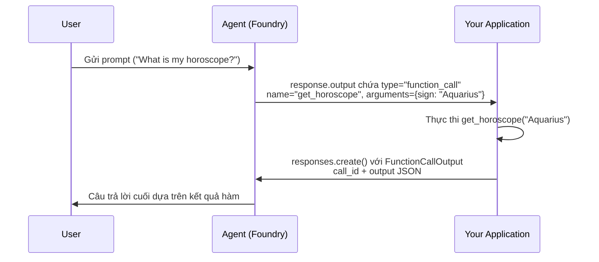
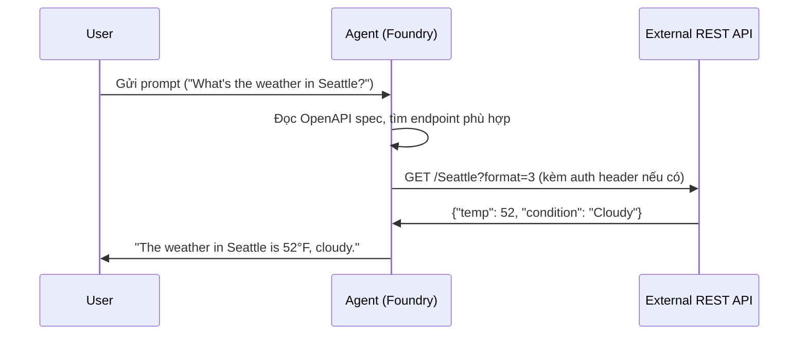
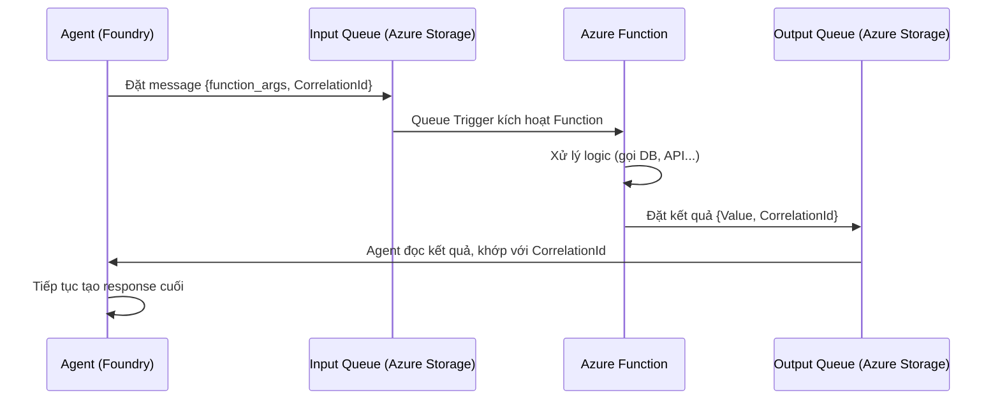

# Cách Tích Hợp Custom Tools

## Agenda

**Thời gian đọc ước tính:** ~20 phút

### Learning outcome:
- **Vẽ được** sequenceDiagram của Function Calling Flow và OpenAPI Flow từ đầu đến cuối.
- **Lập trình được** vòng lặp xử lý Function Call đúng chuẩn, bao gồm submit tool output trở lại Agent.
- **Hiểu** sự khác biệt giữa Azure Functions Queue-based và MCP khi dùng với Agent, biết khi nào chọn loại nào.
- **Nhận diện** các lỗi phổ biến (JSON schema sai, run hết hạn, API key không được inject).

---

## Glossary & Vocabulary

**1. Technical Terms (Thuật ngữ kỹ thuật):**

| Term | Vietnamese Meaning & Quick Explain |
| :--- | :--- |
| **Function Calling Flow** | Luồng gọi hàm. Vòng lặp giữa Agent và ứng dụng: Agent đề xuất gọi hàm → App thực thi → App trả kết quả → Agent tiếp tục. |
| **Tool Output** | Kết quả công cụ. Dữ liệu ứng dụng của bạn trả lại cho Agent sau khi thực thi function. |
| **CorrelationId** | ID tương quan. Chuỗi định danh dùng để Agent khớp kết quả trả về đúng với lời gọi hàm ban đầu (quan trọng khi dùng Azure Functions). |
| **Queue-based Tool** | Công cụ dựa trên hàng đợi. Cơ chế tích hợp qua Azure Queue Storage: Agent gửi message vào queue → Function xử lý → Trả kết quả qua output queue. |
| **operationId** | Định danh thao tác. Trường bắt buộc trong OpenAPI spec để Agent biết tên của từng endpoint. |
| **securitySchemes** | Sơ đồ bảo mật. Phần trong OpenAPI spec mô tả cách xác thực (API key, Bearer token...). |

**2. Vocabulary Support (Từ vựng học thuật/B1+):**

| Word | Meaning in Context (Nghĩa trong ngữ cảnh) |
| :--- | :--- |
| **Asynchronous (adj)** | Bất đồng bộ. Không chờ kết quả ngay; xử lý ở nền và thông báo khi xong. |
| **Serverless (adj)** | Không máy chủ. Mô hình điện toán theo yêu cầu, trả phí theo lần chạy, tự động scale. |
| **Separation of concerns** | Tách biệt mối quan tâm. Nguyên tắc thiết kế: mỗi thành phần chỉ chịu trách nhiệm một việc. |

---

## 1. WHY — Tại Sao Cần Hiểu Luồng Tích Hợp?

Biết tên các loại Custom Tool là chưa đủ. Khi triển khai thực tế, kỹ sư cần hiểu rõ **luồng dữ liệu đi qua đâu, ai chịu trách nhiệm thực thi, và khi nào vòng lặp kết thúc**.

Hai lỗi phổ biến nhất khi tích hợp Custom Tools:
1. **Không submit lại Tool Output:** Agent trả về function call nhưng ứng dụng không gửi kết quả trở lại — Agent chờ mãi, conversation bị treo.
2. **Run hết hạn 10 phút:** Function của bạn xử lý quá lâu, response bị expire trước khi bạn kịp submit output.

---

## 2. WHAT — Hai Luồng Tích Hợp Chính

### 2.1. Function Calling Flow

Luồng Function Calling gồm 5 bước, tạo thành một vòng lặp:



**Quy tắc bắt buộc:**
- Agent chỉ *đề xuất* gọi hàm — ứng dụng của bạn phải tự thực thi và gửi lại kết quả.
- Một response có thể chứa nhiều `function_call` — bạn phải xử lý **tất cả** và gửi lại trong **một lần** `responses.create()`.

### 2.2. OpenAPI Flow

Luồng OpenAPI đơn giản hơn — Foundry tự động gọi API thay cho bạn:



**Điểm khác biệt quan trọng:** Ứng dụng của bạn không có trong vòng lặp — Foundry gọi API trực tiếp. Bạn chỉ cần cung cấp spec và cấu hình xác thực.

### 2.3. Azure Functions Queue-based Flow

Azure Functions cho phép tách biệt hoàn toàn logic tool ra khỏi code Agent:



---

## 3. HOW — Code Tích Hợp Từng Approach

### 3.1. Implement Function Calling (Python SDK)

```python
# filename: function_calling_loop.py
import json
from azure.ai.projects import AIProjectClient
from azure.ai.projects.models import PromptAgentDefinition, FunctionTool
from azure.identity import DefaultAzureCredential
from openai.types.responses.response_input_param import FunctionCallOutput

project = AIProjectClient(
    endpoint="your_project_endpoint",
    credential=DefaultAzureCredential(),
)
openai = project.get_openai_client()

# Hàm Python thực sự xử lý logic
def get_horoscope(sign: str) -> str:
    return f"{sign}: Next Tuesday you will befriend a baby otter."

# Khai báo schema để Agent hiểu hàm này nhận gì, trả gì
func_tool = FunctionTool(
    name="get_horoscope",
    description="Get today's horoscope for an astrological sign.",
    parameters={
        "type": "object",
        "properties": {
            "sign": {
                "type": "string",
                "description": "An astrological sign like Taurus or Aquarius",
            },
        },
        "required": ["sign"],
        "additionalProperties": False,
    },
    strict=True,
)

agent = project.agents.create_version(
    agent_name="HoroscopeAgent",
    definition=PromptAgentDefinition(
        model="gpt-4.1-mini",
        instructions="You are a helpful assistant that can check horoscopes.",
        tools=[func_tool],
    ),
)

# Bước 1: Gửi prompt — Agent sẽ trả về function_call thay vì text
conversation = openai.conversations.create()
response = openai.responses.create(
    input="What is my horoscope? I am an Aquarius.",
    conversation=conversation.id,
    extra_body={"agent_reference": {"name": agent.name, "type": "agent_reference"}},
)

# Bước 2: Xử lý TẤT CẢ function calls trong response
input_list = []
for item in response.output:
    if item.type == "function_call":
        args = json.loads(item.arguments)
        if item.name == "get_horoscope":
            result = get_horoscope(**args)
        # Đóng gói kết quả với call_id — để Agent biết result này thuộc về call nào
        input_list.append(
            FunctionCallOutput(
                type="function_call_output",
                call_id=item.call_id,
                output=json.dumps({"horoscope": result}),
            )
        )

# Bước 3: Submit toàn bộ kết quả trong MỘT lần gọi — Agent tạo câu trả lời cuối
final_response = openai.responses.create(
    input=input_list,
    conversation=conversation.id,
    extra_body={"agent_reference": {"name": agent.name, "type": "agent_reference"}},
)
print(f"Agent response: {final_response.output_text}")
# Output: "Your horoscope for Aquarius: Next Tuesday you will befriend a baby otter."

# Dọn dẹp tài nguyên
project.agents.delete_version(agent_name=agent.name, agent_version=agent.version)
openai.conversations.delete(conversation_id=conversation.id)
```

### 3.2. Implement OpenAPI Tool với Anonymous Auth (Python SDK)

```python
# filename: openapi_tool_integration.py
import jsonref
from azure.ai.projects import AIProjectClient
from azure.ai.projects.models import (
    PromptAgentDefinition,
    OpenApiTool,
    OpenApiFunctionDefinition,
    OpenApiAnonymousAuthDetails,
)
from azure.identity import DefaultAzureCredential

project = AIProjectClient(
    endpoint="your_project_endpoint",
    credential=DefaultAzureCredential(),
)
openai = project.get_openai_client()

# Đọc spec từ file — mỗi endpoint trong spec PHẢI có operationId
with open("weather_openapi.json", "r") as f:
    openapi_spec = jsonref.loads(f.read())

# Foundry tự gọi API khi Agent cần — không cần vòng lặp xử lý thủ công
weather_tool = OpenApiTool(
    openapi=OpenApiFunctionDefinition(
        name="get_weather",
        spec=openapi_spec,
        description="Retrieve weather information for a location.",
        auth=OpenApiAnonymousAuthDetails(),  # API không yêu cầu xác thực
    )
)

agent = project.agents.create_version(
    agent_name="WeatherAgent",
    definition=PromptAgentDefinition(
        model="gpt-4.1-mini",
        instructions="You are a helpful weather assistant.",
        tools=[weather_tool],
    ),
)

# Gửi prompt — Agent tự gọi API, không cần ứng dụng can thiệp
response = openai.responses.create(
    input="What's the weather in Seattle?",
    extra_body={"agent_reference": {"name": agent.name, "type": "agent_reference"}},
)
print(response.output_text)
# Output: "The weather in Seattle is currently cloudy with a temperature of 52°F (11°C)..."

project.agents.delete_version(agent_name=agent.name, agent_version=agent.version)
```

**Lưu ý bắt buộc về OpenAPI spec khi dùng API Key Auth:**
File spec phải có cả hai phần sau, nếu thiếu một trong hai thì API Key sẽ không được inject:

```json
{
  "components": {
    "securitySchemes": {
      "apiKeyHeader": {
        "type": "apiKey",
        "name": "x-api-key",
        "in": "header"
      }
    }
  },
  "security": [{ "apiKeyHeader": [] }]
}
```

### 3.3. Azure Functions — Queue-based Tool (Python)

```python
# filename: function_app.py (code chạy trên Azure Functions)
import azure.functions as func
import json

app = func.FunctionApp()

@app.queue_trigger(
    arg_name="msg",
    queue_name="get-weather-input-queue",
    connection="STORAGE_CONNECTION",
)
@app.queue_output(
    arg_name="outputQueue",
    queue_name="get-weather-output-queue",
    connection="STORAGE_CONNECTION",
)
def queue_trigger(msg: func.QueueMessage, outputQueue: func.Out[str]):
    payload = json.loads(msg.get_body().decode("utf-8"))
    location = payload.get("function_args", {}).get("location")

    # Thay bằng logic thực tế — gọi API thời tiết, query DB...
    weather_result = f"Sunny and 25°C in {location}"

    # CorrelationId bắt buộc — Agent dùng để khớp kết quả với đúng tool call
    response_message = {
        "Value": weather_result,
        "CorrelationId": payload["CorrelationId"],
    }
    outputQueue.set(json.dumps(response_message))
```

---

## 4. WHAT IF — Khi Nào Chọn Azure Functions thay vì Function Calling?

| Tiêu chí | Function Calling | Azure Functions |
| :--- | :--- | :--- |
| **Logic nằm ở đâu** | Trong ứng dụng Agent | Tách biệt, deploy độc lập |
| **Dùng chung nhiều Agent** | Khó | Dễ (nhiều Agent gọi cùng queue) |
| **Xử lý lâu (>10 phút)** | Không phù hợp | Phù hợp (async queue) |
| **External dependencies nặng** | Có thể | Phù hợp hơn |
| **Retry khi lỗi** | Tự implement | Queue tự retry |
| **Độ phức tạp setup** | Thấp | Trung-cao |

Theo tài liệu gốc Microsoft, Azure Functions phù hợp khi cần **Separation of Concerns** (tách logic ra khỏi Agent code), **Centralized Management** (nhiều Agent dùng chung tool), hoặc **Asynchronous Processing** (tác vụ không cần phản hồi tức thì).

---

## Discussion Questions

1. Tình huống: Response từ Agent chứa 3 `function_call` khác nhau (lấy thông tin người dùng, kiểm tra đơn hàng, gửi email). Ứng dụng của bạn phải xử lý như thế nào? Gọi `responses.create()` bao nhiêu lần?
2. OpenAPI Tool yêu cầu `operationId` cho mỗi endpoint. Nếu API bên thứ ba bạn cần dùng không có `operationId` trong spec, bạn sẽ xử lý thế nào?

---

## References

- **Function calling:** [Microsoft Learn](https://learn.microsoft.com/en-us/azure/foundry/agents/how-to/tools/function-calling)
- **OpenAPI tools:** [Microsoft Learn](https://learn.microsoft.com/en-us/azure/foundry/agents/how-to/tools/openapi)
- **Azure Functions integration:** [Microsoft Learn](https://learn.microsoft.com/en-us/azure/foundry/agents/how-to/tools/azure-functions)

---
*Made by Anh Tu - Share to be share*
