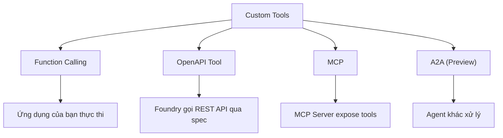

# Các Lựa Chọn Custom Tools

## Agenda

**Thời gian đọc ước tính:** ~20 phút

### Learning outcome:
- **Phân biệt** được 4 loại Custom Tool trong Foundry Agent Service theo cơ chế hosting, xác thực và use case.
- **Chọn** được loại Tool phù hợp dựa trên Decision Framework từ tài liệu gốc Microsoft.
- **Hiểu** cơ chế xác thực (Authentication) của từng loại: từ key-based đến Managed Identity và OAuth.
- **Nhận diện** được các giới hạn và rủi ro kỹ thuật khi tích hợp Custom Tool.

---

## Glossary & Vocabulary

**1. Technical Terms (Thuật ngữ kỹ thuật):**

| Term | Vietnamese Meaning & Quick Explain |
| :--- | :--- |
| **Function Calling** | Gọi hàm. Cơ chế Agent mô tả một function cần gọi (tên, tham số), ứng dụng của bạn thực thi, rồi trả kết quả lại. |
| **OpenAPI Tool** | Công cụ OpenAPI. Kết nối Agent với REST API bên ngoài thông qua tài liệu đặc tả chuẩn OpenAPI 3.0/3.1. |
| **MCP (Model Context Protocol)** | Giao thức ngữ cảnh mô hình. Chuẩn mở cho phép Agent kết nối với tool server bên ngoài qua một giao thức thống nhất. |
| **A2A (Agent-to-Agent)** | Giao thức agent-to-agent. Cho phép một Agent gọi sang một Agent khác như gọi một công cụ. |
| **Managed Identity** | Danh tính được quản lý. Cơ chế Azure tự động xoay vòng thông tin xác thực, không cần lưu trữ secret thủ công. |
| **OAuth OBO (On-Behalf-Of)** | OAuth ủy quyền. Cơ chế chuyển tiếp danh tính người dùng thực qua Agent để gọi API bên ngoài với quyền của người dùng đó. |

**2. Vocabulary Support (Từ vựng học thuật/B1+):**

| Word | Meaning in Context (Nghĩa trong ngữ cảnh) |
| :--- | :--- |
| **Invoke (v)** | Kích hoạt, gọi đến một hàm hoặc tool. |
| **Specification (n)** | Đặc tả. Tài liệu mô tả chuẩn cấu trúc API (ví dụ: OpenAPI spec). |
| **Passthrough (n/adj)** | Xuyên suốt. Chuyển tiếp thông tin (như token xác thực) mà không thay đổi. |

---

## 1. WHY — Tại Sao Cần Hiểu Sâu Từng Loại?

Bài trước (`custom-tools-why.md`) đã trả lời câu hỏi "khi nào cần Custom Tool". Bài này đi sâu vào câu hỏi tiếp theo: **Chọn loại nào trong 4 loại Custom Tool, và dựa trên tiêu chí gì?**

Mỗi loại Tool có cơ chế hoạt động, yêu cầu xác thực (Authentication), và giới hạn kỹ thuật hoàn toàn khác nhau. Chọn sai loại dẫn đến:

- **Nợ kỹ thuật (Technical Debt):** Logic bị phân tán, khó bảo trì về sau.
- **Lỗ hổng bảo mật:** Chuyển secret qua kênh không phù hợp.
- **Giới hạn vận hành:** Ví dụ Function Calling có giới hạn thời gian chờ cứng là **10 phút** — nếu function của bạn chạy lâu hơn, response sẽ bị hết hạn.

---

## 2. WHAT — Bốn Loại Custom Tool

Foundry Agent Service (*Dịch vụ Agent của Foundry*) cung cấp bốn lựa chọn mở rộng Agent bằng Custom Tool:



### 2.1. Function Calling — Giao thức gọi hàm cục bộ

**Definition Anatomy** từ tài liệu gốc:

> *"Define a function with its name, parameters, and description, and the agent's Foundry model can request your app to call it. Your app executes the function and returns the output."*

- **Define** (*Định nghĩa*): Bạn khai báo hàm bằng JSON Schema — tên, tham số, mô tả.
- **request your app to call it** (*yêu cầu ứng dụng của bạn gọi nó*): Agent không tự chạy hàm — nó chỉ đề xuất. Ứng dụng của bạn là người thực thi.
- **returns the output** (*trả về kết quả*): Ứng dụng submit kết quả trả về qua API, Agent dùng kết quả đó để tiếp tục.

**Giới hạn cứng quan trọng:** Runs expire (*Response hết hạn*) sau **10 phút** kể từ khi tạo. Bạn phải submit tool output trước thời hạn này.

### 2.2. OpenAPI Tool — Kết nối REST API qua đặc tả

Agent đọc tài liệu đặc tả OpenAPI 3.0 hoặc 3.1 do bạn cung cấp. Từ spec đó, Agent tự động hiểu các endpoints có sẵn và tự gọi API khi người dùng có nhu cầu phù hợp. Không cần ứng dụng trung gian xử lý.

OpenAPI Tool hỗ trợ ba phương thức xác thực:
- **Anonymous** (*Không xác thực*): Dùng khi API không yêu cầu credentials.
- **API Key** (*Khóa API*): Lưu key trong Project Connection của Foundry, tham chiếu qua `project_connection_id`.
- **Managed Identity** (*Danh tính được quản lý*): Dùng Azure Managed Identity để xác thực, không cần quản lý secret.

### 2.3. MCP — Giao thức chuẩn mở cho Tool Server

MCP (*Model Context Protocol*) là giao thức cho phép Agent kết nối với một server bên ngoài vốn phơi bày (expose) nhiều Tool theo chuẩn chung. Có hai loại MCP Server:

- **Remote MCP Server**: Publisher tự host server và cung cấp endpoint tĩnh hoặc động. Bạn chỉ cần cấu hình endpoint và thông tin xác thực.
- **Local MCP Server**: Bạn tự host server, sau đó kết nối vào Foundry bằng cách cung cấp endpoint của server đó.

MCP hỗ trợ ba phương thức xác thực: Key-based (API key/token), Microsoft Entra (Managed Identity), và OAuth cho passthrough danh tính người dùng (per-user auth).

### 2.4. A2A (Agent-to-Agent) — Gọi Agent như Tool

A2A (*Preview*) cho phép một Agent "tổng hợp" (Orchestrator) gọi sang một Agent "chuyên biệt" (Specialist) thông qua giao thức A2A-compatible. Phù hợp cho kiến trúc Multi-Agent khi cần phân công nhiệm vụ theo chuyên môn.

---

## 3. HOW — Bảng So Sánh Đa Chiều

### 3.1. Bảng so sánh 4 loại theo các tiêu chí kỹ thuật

| Tiêu chí | Function Calling | OpenAPI Tool | MCP | A2A |
| :--- | :--- | :--- | :--- | :--- |
| **Hosting** | Ứng dụng của bạn | Foundry thay mặt | MCP Server (remote/local) | Agent khác |
| **Ai thực thi logic?** | Ứng dụng của bạn | Foundry gọi API | MCP Server | Agent đích |
| **Xác thực** | Không cần (app tự xử lý) | Anonymous / API Key / Managed Identity | Key / Entra / OAuth OBO | Theo cấu hình Agent đích |
| **Cần code riêng?** | Có (vòng lặp xử lý) | Không (có spec là đủ) | Không bắt buộc | Không bắt buộc |
| **Chia sẻ nhiều Agent** | Khó (logic nằm trong app) | Có thể (cùng spec) | Dễ (một server, nhiều agent connect) | Có |
| **Chuẩn mở** | Không | Có (OpenAPI 3.0/3.1) | Có (MCP Protocol) | Có (A2A Protocol) |
| **Trạng thái** | GA | GA | GA | Preview |
| **Độ phức tạp triển khai** | Thấp | Thấp–Trung | Trung | Cao |
| **Giới hạn thời gian** | 10 phút/run | Theo timeout API | Theo timeout server | Theo cấu hình |

### 3.2. Cấu hình xác thực Function Tool (Python SDK)

```python
# filename: agent_with_function_tool.py
import json
from azure.ai.projects import AIProjectClient
from azure.ai.projects.models import PromptAgentDefinition, FunctionTool
from azure.identity import DefaultAzureCredential

project = AIProjectClient(
    endpoint="your_project_endpoint",
    credential=DefaultAzureCredential(),
)
openai = project.get_openai_client()

# Định nghĩa FunctionTool theo JSON Schema — Agent sẽ dùng schema này để biết cách gọi
func_tool = FunctionTool(
    name="get_weather",
    description="Get the current weather in a location.",
    parameters={
        "type": "object",
        "properties": {
            "location": {
                "type": "string",
                "description": "The city and state, e.g. San Francisco, CA",
            },
            "unit": {"type": "string", "enum": ["c", "f"]},
        },
        "required": ["location"],
        "additionalProperties": False,
    },
    strict=True,  # Buộc Agent tạo JSON arguments khớp chính xác với schema trên
)

agent = project.agents.create_version(
    agent_name="WeatherAgent",
    definition=PromptAgentDefinition(
        model="gpt-4.1-mini",
        instructions="You are a weather assistant.",
        tools=[func_tool],
    ),
)
```

### 3.3. Cấu hình xác thực OpenAPI Tool — API Key (Python SDK)

```python
# filename: agent_with_openapi_tool.py
from azure.ai.projects.models import (
    OpenApiTool,
    OpenApiFunctionDefinition,
    OpenApiKeyAuthDetails,
)

# Đọc OpenAPI spec từ file JSON/YAML
with open("weather_api_spec.json") as f:
    openapi_spec = json.load(f)

# OpenApiKeyAuthDetails tham chiếu tới Project Connection — key không bao giờ đi qua code
api_tool = OpenApiTool(
    openapi=OpenApiFunctionDefinition(
        name="get_weather_api",
        spec=openapi_spec,
        description="Retrieve current weather information for a location.",
        auth=OpenApiKeyAuthDetails(
            project_connection_id="my-weather-api-connection"
        ),
    )
)
```

### 3.4. Cấu hình MCP Tool với Key-based Auth (Python SDK)

```python
# filename: agent_with_mcp_tool.py
from azure.ai.projects.models import MCPTool

# MCPTool kết nối Agent với MCP Server qua endpoint
# project_connection_id lưu API key — không hardcode trong code
mcp_tool = MCPTool(
    server_label="github",
    server_url="https://api.githubcopilot.com/mcp",
    require_approval="always",  # Yêu cầu phê duyệt thủ công trước mỗi lần gọi tool
    project_connection_id="my-github-connection",
)
```

---

## 4. WHAT IF — Giới Hạn và Rủi Ro Cần Biết

### 4.1. Security — Treat Tool Output as Untrusted Input

Tài liệu gốc Microsoft khuyến cáo rõ ràng:

- Treat tool arguments and tool outputs as **untrusted input** (*đầu vào không đáng tin*). Validate và sanitize trước khi sử dụng.
- Không truyền secrets (API keys, tokens, connection strings) qua tool output. Chỉ trả về data mà model cần.
- Với MCP tools từ bên thứ ba: Chỉ kết nối server do **trusted publishers** (nhà cung cấp đáng tin cậy) host trực tiếp, không qua proxy.

### 4.2. Function Calling — 10-Minute Expiration

Nếu function của bạn cần xử lý lâu (ví dụ: gọi một API ngoài bị chậm), hãy thiết kế theo pattern:
- Trả về **status ngay lập tức** (ví dụ: `{"status": "processing", "job_id": "xxx"}`).
- Implement một cơ chế **polling riêng** để client kiểm tra kết quả sau.

### 4.3. Non-Microsoft MCP Servers

Khi kết nối MCP server của bên thứ ba, dữ liệu prompt có thể được gửi đến server đó. Điều này đồng nghĩa với:
- Dữ liệu có thể nằm ngoài ranh giới compliance của Azure.
- Bạn chịu trách nhiệm về việc sử dụng và mọi chi phí phát sinh từ Non-Microsoft services.

---

## Discussion Questions

1. Bạn đang xây dựng Agent hỗ trợ kế toán. Mỗi lần Agent cần tra cứu số dư tài khoản, nó phải gọi API nội bộ mà đội Backend đang quản lý và đã có OpenAPI spec đầy đủ. Agent cũng phải gọi thêm một API của ngân hàng không có spec. Với 2 API này, bạn sẽ chọn loại Custom Tool nào cho từng trường hợp?
2. Theo tài liệu gốc, Function Calling có thể dùng nhiều function tools trong một agent và nhận nhiều function call trong một response. Điều này dẫn đến pattern gì trong vòng lặp xử lý của ứng dụng?

---

## References

- **Agent tools overview (tool-catalog):** [Microsoft Learn](https://learn.microsoft.com/en-us/azure/foundry/agents/concepts/tool-catalog)
- **Function calling:** [Microsoft Learn](https://learn.microsoft.com/en-us/azure/foundry/agents/how-to/tools/function-calling)
- **OpenAPI tools:** [Microsoft Learn](https://learn.microsoft.com/en-us/azure/foundry/agents/how-to/tools/openapi)
- **MCP authentication:** [Microsoft Learn](https://learn.microsoft.com/en-us/azure/foundry/agents/how-to/mcp-authentication)

---
*Made by Anh Tu - Share to be share*
