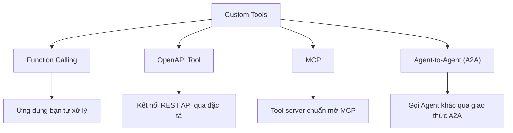
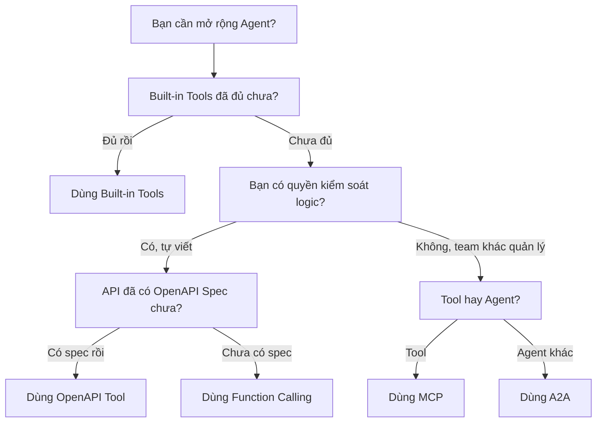

# Tại Sao Cần Custom Tools?

## Agenda

**Thời gian đọc ước tính:** ~15 phút

### Learning outcome:
- **Hiểu rõ** ranh giới năng lực của Built-in Tools và tình huống nào chúng không đủ để đáp ứng.
- **Phân tích** được 4 loại Custom Tool phổ biến và so sánh theo bảng Trade-off.
- **Nhận diện** được Decision Flowchart: khi nào nên dùng Built-in, khi nào cần Custom.

---

## Glossary & Vocabulary

**1. Technical Terms (Thuật ngữ kỹ thuật):**

| Term | Vietnamese Meaning & Quick Explain |
| :--- | :--- |
| **Built-in Tool** | Công cụ tích hợp sẵn. Tập hợp các khả năng được Microsoft cung cấp, chỉ cần bật lên là dùng, không cần viết code. |
| **Custom Tool** | Công cụ tùy chỉnh. Khả năng do bạn tự đưa vào Agent — kết nối với API riêng, hệ thống nội bộ, hoặc Agent khác. |
| **Function Calling** | Gọi hàm. Cơ chế Agent đề xuất gọi một hàm, ứng dụng của bạn thực thi, rồi trả kết quả về cho Agent. |
| **MCP (Model Context Protocol)** | Giao thức chuẩn mở để kết nối Agent với các Tool server bên ngoài, tương tự USB-C cho phần cứng. |
| **OpenAPI Tool** | Công cụ kết nối REST API thông qua tài liệu đặc tả OpenAPI 3.0/3.1. |

**2. Vocabulary Support (Từ vựng học thuật/B1+):**

| Word | Meaning in Context (Nghĩa trong ngữ cảnh) |
| :--- | :--- |
| **Extend (v)** | Mở rộng. Thêm khả năng vượt ngoài những gì có sẵn. |
| **Invoke (v)** | Kích hoạt, gọi đến. (VD: Agent invokes a tool - Agent kích hoạt một công cụ). |
| **Proprietary (adj)** | Độc quyền, nội bộ. Dữ liệu/hệ thống không được chia sẻ ra công khai. |

---

## 1. WHY — Giới Hạn Của Built-in Tools

Mỗi Agent trong Foundry đều có thể được trang bị các Built-in Tools — các công cụ được Microsoft xây dựng sẵn và quản lý:

- **Web Search** — Tìm kiếm thông tin thời sự từ Internet.
- **Code Interpreter** — Viết và chạy code Python trong môi trường cô lập.
- **File Search** — Tìm kiếm ngữ nghĩa (Semantic Search) trong tài liệu bạn tải lên.
- **Function Calling** — Định nghĩa hàm mà Agent có thể đề xuất gọi.

Đây là bộ công cụ mạnh mẽ cho nhiều tình huống phổ thông. Tuy nhiên, trong bối cảnh doanh nghiệp thực tế, bạn sẽ sớm gặp các giới hạn:

> **Kịch bản thực tế:** Bạn xây dựng Agent hỗ trợ kỹ thuật nội bộ. Agent cần tra cứu lịch sử ticket trong hệ thống JIRA, kiểm tra trạng thái server trong Datadog, và tạo báo cáo trong hệ thống ERP riêng của công ty. **Không có Built-in Tool nào** trong danh sách của Microsoft có thể làm điều này.

Đây là lý do Custom Tools ra đời: để lấp đầy khoảng trống giữa các công cụ tiêu chuẩn và nhu cầu đặc thù của từng doanh nghiệp.

---

## 2. WHAT — Bốn Loại Custom Tool Phổ Biến

Theo tài liệu chính thức của Microsoft Foundry, có 4 hình thức Custom Tool mà bạn có thể tích hợp vào Agent:

### 2.1. Function Calling
Agent định nghĩa một "hàm ảo" (schema), khi cần, Agent đề xuất gọi hàm đó, **ứng dụng của bạn** thực thi logic thực tế và trả kết quả về. Đây là cách linh hoạt nhất vì mọi logic nằm trong tay bạn.

### 2.2. OpenAPI Tool
Bạn cung cấp tài liệu đặc tả API theo chuẩn OpenAPI 3.0 hoặc 3.1. Agent đọc spec đó, tự hiểu có những endpoint nào, và tự động gọi khi cần. Phù hợp khi bạn đã có REST API có sẵn.

### 2.3. Model Context Protocol (MCP)
MCP là giao thức mở cho phép Agent kết nối với một **MCP Server** — một server phơi bày các Tools theo chuẩn chung. Phù hợp khi Tools được chia sẻ giữa nhiều Agent, hoặc được quản lý bởi một team khác.

### 2.4. Agent-to-Agent (A2A) — Preview
Cho phép một Agent gọi một Agent khác thông qua giao thức A2A. Mở ra kiến trúc Multi-Agent phức tạp: Agent tổng hợp phân công việc cho các Agent chuyên biệt.

---

## 3. HOW — Bảng So Sánh & Decision Flowchart

### Bảng so sánh 4 loại Custom Tool

| Tiêu chí | Function Calling | OpenAPI Tool | MCP | A2A |
| :--- | :--- | :--- | :--- | :--- |
| **Nơi xử lý** | Ứng dụng của bạn | Foundry gọi API | MCP Server | Agent khác |
| **Cần code?** | Có (logic tự viết) | Không (có spec) | Không bắt buộc | Không bắt buộc |
| **Chia sẻ giữa nhiều Agent** | Khó | Có thể | Dễ dàng | Có |
| **Chuẩn mở** | Không | Có (OpenAPI) | Có (MCP Protocol) | Có (A2A) |
| **Độ phức tạp** | Thấp | Thấp–Trung | Trung | Cao |
| **Use case tiêu biểu** | Gọi hàm logic đơn giản | API bên ngoài có sẵn spec | Tool dùng chung, Team khác quản lý | Multi-Agent orchestration |

### Decision Flowchart — Khi Nào Dùng Gì?

---

## 4. WHAT IF — Trade-off Khi Chọn Custom Tool

Việc chọn sai loại Custom Tool sẽ dẫn đến nợ kỹ thuật (Technical Debt) về sau:

- **Function Calling nhưng nhiều Agent cần dùng?** → Bạn sẽ phải copy-paste logic sang từng ứng dụng. Nên chuyển sang **MCP** để tập trung hóa.
- **MCP nhưng không có server?** → Chi phí vận hành thêm một server. Nếu chỉ có 1 Agent dùng, **OpenAPI Tool** hoặc **Function Calling** đơn giản hơn nhiều.
- **OpenAPI Tool nhưng API không có spec?** → Phải tự viết OpenAPI spec trước, tốn công sức. Nếu API đơn giản, cân nhắc **Function Calling**.

---

## 5. TL;DR — Ôn Tập Nhanh

- **Built-in Tools** bao gồm Web Search, Code Interpreter, File Search, Function Calling — tiện nhưng có giới hạn với hệ thống nội bộ doanh nghiệp.
- **Custom Tools** gồm 4 loại: Function Calling, OpenAPI Tool, MCP, A2A — mỗi loại có Use case và độ phức tạp khác nhau.
- **Quy tắc chọn:** Bắt đầu với cái đơn giản nhất đáp ứng được nhu cầu; chuyển sang MCP khi cần chia sẻ Tool giữa nhiều Agent.

---

### Discussion Questions
1. Công ty bạn có một REST API Inventory Management đã có sẵn tài liệu OpenAPI. Bạn chọn loại Custom Tool nào để kết nối Agent, và tại sao?
2. Kịch bản: Team AI và Team Backend là hai team khác nhau, Team Backend tự host và quản lý một tập hợp công cụ dùng chung cho toàn tổ chức. Loại Custom Tool nào phù hợp nhất cho kịch bản này?

---

## 6. References (Nguồn tài liệu)

- **Agent tools overview:** [Microsoft Learn](https://learn.microsoft.com/en-us/azure/foundry/agents/concepts/tool-catalog)

---
*Made by Anh Tu - Share to be share*
