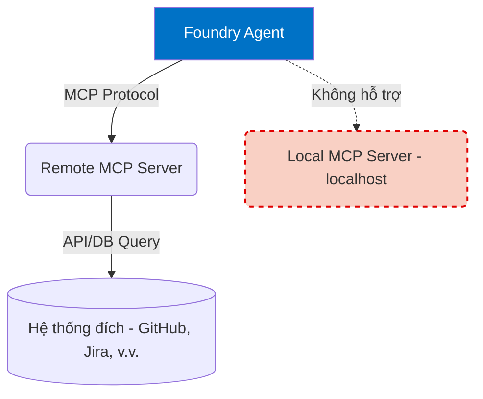
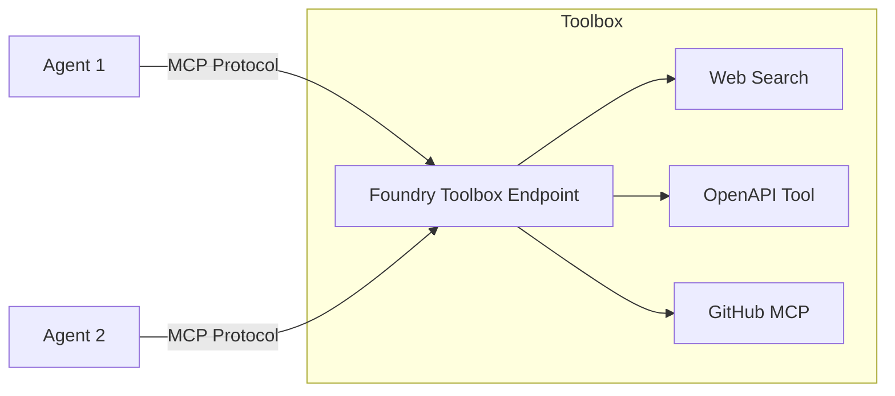

# Khám Phá Model Context Protocol (MCP)

## Agenda

**Thời gian đọc ước tính:** ~15 phút

### Learning outcome:
- **Định nghĩa** được MCP và vai trò của nó trong hệ sinh thái Agent.
- **Phân biệt** được kiến trúc Remote MCP Server và Local MCP Server.
- **Hiểu** cách Foundry hỗ trợ Public và Private Endpoints cho MCP.
- **Nắm bắt** khái niệm Foundry Toolboxes — cách đóng gói (bundle) nhiều công cụ thành một endpoint duy nhất.

---

## Glossary & Vocabulary

**1. Technical Terms (Thuật ngữ kỹ thuật):**

| Term | Vietnamese Meaning & Quick Explain |
| :--- | :--- |
| **Model Context Protocol (MCP)** | Giao thức ngữ cảnh mô hình. Chuẩn mở định nghĩa cách các ứng dụng cung cấp tools và context data cho LLMs một cách nhất quán. |
| **Local MCP Server** | MCP Server chạy cục bộ (trên máy dev hoặc localhost). Foundry không kết nối trực tiếp được với loại này. |
| **Remote MCP Server** | MCP Server được host trên cloud (Azure, AWS, GitHub...). Foundry Agent Service yêu cầu remote endpoint để kết nối. |
| **Foundry Toolboxes** | Hộp công cụ Foundry. Tính năng (preview) cho phép gom nhóm nhiều loại tools (Web Search, MCP, OpenAPI) vào một endpoint MCP duy nhất. |

**2. Vocabulary Support (Từ vựng học thuật/B1+):**

| Word | Meaning in Context (Nghĩa trong ngữ cảnh) |
| :--- | :--- |
| **Standardize (v)** | Chuẩn hóa. Đưa các kết nối công cụ khác nhau về một giao thức chung (MCP). |
| **Bundle (v/n)** | Đóng gói, gom nhóm. Gom nhiều công cụ thành một gói (Toolbox) để dễ quản lý. |
| **Isolation (n)** | Sự cách ly. Mạng lưới được bảo vệ khỏi internet công cộng (Network Isolation). |

---

## 1. WHY — Tại Sao Cần Model Context Protocol?

Trước đây, mỗi khi muốn AI Agent kết nối với một hệ thống (GitHub, Jira, Database nội bộ), lập trình viên phải viết code tích hợp riêng cho từng hệ thống đó (custom API client, custom function calling). Điều này tạo ra nợ kỹ thuật (Technical Debt) khổng lồ khi số lượng công cụ tăng lên.

**Model Context Protocol (MCP)** ra đời để giải quyết vấn đề này. Nó là một **chuẩn mở (open standard)**. Thay vì Agent phải biết cách nói chuyện với 10 hệ thống khác nhau, Agent chỉ cần biết nói chuyện qua giao thức MCP. Các hệ thống (MCP Servers) sẽ tự translate ngôn ngữ của mình sang chuẩn MCP.

---

## 2. WHAT — Kiến Trúc MCP Trong Foundry

**Definition Anatomy** từ tài liệu Microsoft:

> *"The Agent Service runtime only accepts a remote MCP server endpoint. If you want to add tools from a local MCP server, you need to self-host it on Azure Container Apps or Azure Functions to get a remote MCP server endpoint."*

- **Only accepts a remote MCP server endpoint** (*Chỉ chấp nhận endpoint từ xa*): Agent của bạn chạy trên cloud của Azure, nên nó không thể gọi về `http://localhost:3000` trên máy tính của bạn.
- **Self-host it on Azure Container Apps...** (*Tự host trên ACA*): Để đưa một Local MCP Server nguồn mở lên dùng với Foundry, bạn phải containerize nó và host lên cloud.

### 2.1. Public vs Private Endpoints

Foundry Agent Service hỗ trợ hai loại Endpoint cho MCP:

1. **Public Endpoints**: Kết nối đến các MCP Server công khai trên internet (ví dụ: `https://api.githubcopilot.com/mcp`). Hoạt động trên cả mô hình Basic và Standard Agent Setup.
2. **Private Endpoints**: Kết nối đến các MCP Server nằm trong mạng nội bộ (Virtual Network) của bạn, không expose ra internet.
   - Bắt buộc dùng **Standard Agent Setup** với Private Networking.
   - MCP Server (thường host trên Azure Container Apps) phải được đặt trong một subnet chuyên dụng (`delegated to Microsoft.App/environments`).

### 2.2. Foundry Toolboxes (Preview)

Thay vì cấu hình từng công cụ (Web Search, OpenAPI, MCP Server riêng lẻ) cho từng Agent, Foundry cung cấp tính năng **Toolboxes**.

**Đặc điểm:**
- Toolbox gom nhiều tools thành **một endpoint MCP duy nhất**.
- Agent kết nối vào Toolbox thông qua `mcp` tool configuration.
- Bất kỳ client nào hỗ trợ MCP (Agent Framework, LangGraph, GitHub Copilot) đều có thể kết nối vào Toolbox này.

---

## 3. HOW — Các Điểm Cần Lưu Ý Khi Tự Host MCP Server

Nếu bạn lấy một Local MCP Server từ cộng đồng (ví dụ: mã nguồn mở trên GitHub) và muốn đưa lên Azure để Foundry gọi được, hãy chú ý các khác biệt sau (dựa trên bảng so sánh của Microsoft):

| Đặc điểm | Host trên Azure Container Apps (ACA) | Host trên Azure Functions |
| :--- | :--- | :--- |
| **Giao thức mạng** | Hỗ trợ HTTP POST/GET. | Yêu cầu HTTP streamable (chunked transfer encoding cho SSE). |
| **Ngôn ngữ** | Mọi ngôn ngữ chạy được Linux container. | Giới hạn: Python, Node.js, TS, Java, .NET. |
| **Hệ điều hành / OS deps** | Hỗ trợ cài các OS dependencies (ví dụ Playwright). | Không hỗ trợ (không phải containerized server). |
| **Trạng thái (State)** | Stateless. | Stateless. |

**Lời khuyên (Best Practice):** Việc sử dụng **Azure Container Apps** mang lại độ linh hoạt cao hơn khi host các MCP Servers mã nguồn mở vì bạn có toàn quyền kiểm soát môi trường container, cài đặt các CLI tools nội bộ (như `npx` hoặc `uvx`).

---

## 4. WHAT IF — Các Rủi Ro Khi Dùng MCP của Bên Thứ Ba

Tài liệu gốc Microsoft nhấn mạnh:

- *Third parties, not Microsoft, create the remote MCP servers... Microsoft doesn't test or verify these servers.* (Bên thứ ba tạo ra các server này, Microsoft không kiểm chứng).
- Khi kết nối, bạn **đang gửi prompt data** của người dùng sang server của bên thứ ba.
- Bạn hoàn toàn chịu trách nhiệm về compliance, rò rỉ dữ liệu, và chi phí phát sinh từ hệ thống của bên thứ ba.

**Cách giải quyết (Mitigation):**
- **Dùng Private Network**: Host MCP Server của riêng bạn trong Azure VNet.
- **Dùng allowed_tools**: Giới hạn chính xác những tool nào Agent được phép gọi (sẽ học chi tiết ở bài 10).
- **Yêu cầu phê duyệt (require_approval)**: Thiết lập chính sách phải có sự đồng ý của con người trước khi gọi tool nhạy cảm.

---

## Discussion Questions

1. Team của bạn tìm thấy một MCP Server mã nguồn mở viết bằng ngôn ngữ Rust giúp query database nội bộ. Bạn nên chọn host nó trên Azure Container Apps hay Azure Functions? Tại sao?
2. Tại sao Foundry lại cung cấp tính năng Toolboxes trong khi bản thân MCP đã là một cách để expose tools? Toolboxes giải quyết vấn đề quản trị (governance) như thế nào?

---

## References

- **Connect to Model Context Protocol servers:** [Microsoft Learn](https://learn.microsoft.com/en-us/azure/foundry/agents/how-to/tools/model-context-protocol)
- **Agent tools with network isolation:** [Microsoft Learn](https://learn.microsoft.com/en-us/azure/foundry/how-to/configure-private-link#agent-tools-with-network-isolation)

---
*Made by Anh Tu - Share to be share*
