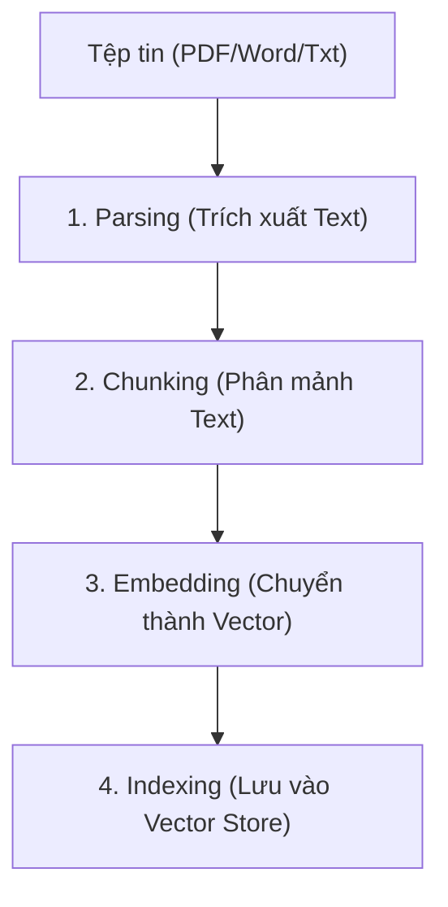

---
sidebar_position: 1
description: "Cơ chế hoạt động của Vector Stores và File Search, bao gồm Ingestion, giới hạn Quota và chiến lược quản trị vòng đời dữ liệu."
tags: [azure-ai, foundry, vector-stores, file-search, rag, knowledge]
---
# Vector Stores & File Search

## Agenda

**Thời gian đọc ước tính:** ~20 phút

### Learning outcome:

- **Hiểu rõ** tại sao Agent cần Vector Store để đọc hiểu tài liệu thông qua cơ chế RAG (Retrieval-Augmented Generation).
- **Nắm vững** các thông số giới hạn kỹ thuật (Quotas & Limits) của Vector Store trên Microsoft Foundry.
- **Biết cách** triển khai File Search và liên kết dữ liệu vào Agent bằng Python SDK.
- **Nhận thức** được các vấn đề về vòng đời dữ liệu (Data Lifecycle) và chính sách hết hạn (Expiration policy).

---

## Glossary & Vocabulary

**1. Technical Terms (Thuật ngữ kỹ thuật):**

| Term                        | Vietnamese Meaning & Quick Explain                                                                                                                                                   |
| :-------------------------- | :----------------------------------------------------------------------------------------------------------------------------------------------------------------------------------- |
| **Vector Store**      | Kho lưu trữ Vector. Nơi chứa nội dung tệp tin đã được chia nhỏ (chunks) và chuyển đổi thành dạng số (embeddings) để phục vụ cho tìm kiếm (Semantic Search). |
| **Ingestion**         | Quá trình nạp dữ liệu. Bao gồm các bước tự động: Parsing (phân tách), Chunking (chia nhỏ), Embedding (nhúng véc-tơ), và Indexing (đánh chỉ mục).              |
| **Expiration Policy** | Chính sách hết hạn. Một cơ chế dọn dẹp vòng đời tự động, xóa Vector Store sau một khoảng thời gian không hoạt động.                                           |
| **Chunking**          | Phân mảnh dữ liệu. Kỹ thuật chia một tài liệu lớn thành các khối văn bản nhỏ (chunks) để đưa vào Vector Store.                                                  |

**2. Vocabulary Support (Từ vựng học thuật/B1+):**

| Word                        | Meaning in Context (Nghĩa trong ngữ cảnh)                                                                 |
| :-------------------------- | :----------------------------------------------------------------------------------------------------------- |
| **Augment (v)**       | Gia tăng, bổ sung. (VD: Augments agents with knowledge - Bổ sung kiến thức cho agent).                  |
| **Proprietary (adj)** | Thuộc bản quyền, độc quyền. Ám chỉ các tài liệu nội bộ, bí mật kinh doanh của doanh nghiệp. |

---

## 1. WHY — Tại Sao LLM Cần Vector Store?

Mỗi mô hình LLM (như GPT-4) đều có một giới hạn nhất định về lượng kiến thức mà nó được huấn luyện (Model Knowledge). Tuy nhiên, khi xây dựng Agent cho doanh nghiệp, bạn sẽ đối mặt với các nhu cầu:

- Agent cần trả lời dựa trên tài liệu **nội bộ, bí mật (Proprietary)** mà mô hình gốc không hề biết.
- Tài liệu quá dài (hàng trăm trang PDF), vượt quá giới hạn ngữ cảnh (Context Window) của LLM nếu đưa trực tiếp vào Prompt.

Để giải quyết vấn đề này, Microsoft Foundry cung cấp công cụ **File Search** kết hợp với **Vector Store**. Thay vì nhồi nhét toàn bộ tệp tin vào não LLM, hệ thống sẽ số hóa tài liệu vào một Vector Database. Khi người dùng đặt câu hỏi, Agent chỉ trích xuất những mảnh thông tin (chunks) liên quan nhất để đưa vào câu trả lời. Đây là nền tảng của cơ chế **Retrieval-Augmented Generation (RAG)**.

---

## 2. WHAT — Kiến Trúc và Các Giới Hạn Cốt Lõi

Khi tải một tệp (ví dụ: `.pdf`, `.md`, `.docx`) lên Vector Store, một quá trình **Ingestion** tự động sẽ diễn ra:



### 2.1. Cài đặt mặc định của quá trình Ingestion (Retrieval Settings)

Theo tài liệu chính thức từ Microsoft, hệ thống sử dụng các thiết lập mặc định sau:

- **Chunk size:** `800 tokens`
- **Chunk overlap:** `400 tokens` (Mức độ gối đầu giữa các khối văn bản để giữ mạch văn).
- **Embedding model:** `text-embedding-3-large` (256 dimensions).
- **Max chunks in context:** `20` (Tối đa 20 mảnh thông tin được thêm vào ngữ cảnh để Agent sinh câu trả lời).

### 2.2. Giới hạn tài nguyên (Quotas & Limits)

Các giới hạn cứng bạn **bắt buộc phải tuân thủ**:

1. **Dung lượng tệp:** Tối đa `512 MB` cho mỗi tệp.
2. **Tokens:** Tối đa `5,000,000 tokens` cho một tệp.
3. **Số lượng tệp:** Một Vector Store chứa tối đa `10,000 files`.
4. **Giới hạn đính kèm (Attachments):**
   - Bạn chỉ có thể đính kèm **tối đa 1 Vector Store** cho một Agent.
   - Bạn chỉ có thể đính kèm **tối đa 1 Vector Store** cho một cuộc trò chuyện (Conversation).

### 2.3. Cấu hình kiến trúc (Agent Setup)

Microsoft Foundry cung cấp 2 chế độ lưu trữ:

- **Basic agent setup:** Sử dụng hệ thống Search và Storage do Microsoft quản lý.
- **Standard agent setup:** Kết nối trực tiếp vào tài khoản Azure Blob Storage và Azure AI Search của doanh nghiệp bạn. Chế độ này đảm bảo dữ liệu không bao giờ rời khỏi môi trường Storage của bạn.

---

## 3. HOW — Triển Khai Bằng Python SDK

Quá trình cấp kiến thức cho Agent thông qua File Search bao gồm 3 bước cốt lõi.

### Bước 1: Tạo Vector Store và Upload Tệp

Sử dụng hàm `upload_and_poll` để đẩy tệp lên và chờ đợi quá trình Ingestion hoàn tất.

```python
from pathlib import Path
from azure.ai.projects import AIProjectClient
from azure.identity import DefaultAzureCredential

PROJECT_ENDPOINT = "your_project_endpoint"
asset_file_path = (Path(__file__).parent / "product_info.md").resolve()

project = AIProjectClient(
    endpoint=PROJECT_ENDPOINT,
    credential=DefaultAzureCredential(),
)
openai = project.get_openai_client()

# Tạo Vector Store
vector_store = openai.vector_stores.create(name="ProductInfoStore")

# Upload file và đợi hệ thống Ingest xong (Polling)
with asset_file_path.open("rb") as file_handle:
    vector_store_file = openai.vector_stores.files.upload_and_poll(
        vector_store_id=vector_store.id,
        file=file_handle,
    )
print(f"Trạng thái Ingestion: {vector_store_file.status}")
```

### Bước 2: Tạo Agent với File Search Tool

Gắn mã ID của Vector Store vào tham số `vector_store_ids` bên trong công cụ `FileSearchTool`.

```python
from azure.ai.projects.models import FileSearchTool, PromptAgentDefinition

agent = project.agents.create_version(
    agent_name="MyKnowledgeAgent",
    definition=PromptAgentDefinition(
        model="gpt-4o-mini",
        instructions="Bạn là một trợ lý ảo. Hãy sử dụng file search để trả lời câu hỏi dựa trên tài liệu được cung cấp.",
        tools=[FileSearchTool(vector_store_ids=[vector_store.id])],
    )
)
```

### Bước 3: Tạo Conversation và Truy vấn

Agent sẽ tự động dịch câu hỏi, trích xuất thông tin từ Vector Store, và trả lời kèm theo trích dẫn (Citations).

```python
conversation = openai.conversations.create()

response = openai.responses.create(
    conversation=conversation.id,
    input="Tóm tắt về các sản phẩm của Contoso trong tài liệu?",
    extra_body={"agent_reference": {"name": agent.name, "type": "agent_reference"}},
)
print(response.output_text)
```

---

## 4. WHAT IF — Bẫy Quản Trị Vòng Đời Dữ Liệu

Khi làm việc với Vector Store, có hai vấn đề kỹ thuật phổ biến bạn sẽ gặp phải:

### 4.1. Vấn đề "Đang xử lý" (In Progress)

**Kịch bản:** Ngay sau khi gọi API upload 100 tệp PDF, bạn lập tức yêu cầu Agent trả lời câu hỏi. Agent trả về kết quả rỗng.
**Nguyên nhân & Khắc phục:** Quá trình Ingestion là bất đồng bộ (Asynchronous). Nếu Vector Store vẫn đang ở trạng thái `in_progress`, tài liệu chưa thể được tìm kiếm. Đối với Vector Store gắn vào *Conversation*, hệ thống có cơ chế fallback tự động chờ tối đa `60 giây`. Tuy nhiên, với Vector Store gắn vào *Agent*, **bạn phải tự lập trình (Poll) chờ đợi** đến khi trạng thái chuyển sang `completed` thì mới tiến hành truy vấn.

### 4.2. Vấn đề "Dữ liệu bốc hơi" (Expiration Policies)

**Kịch bản:** User tải lên một tệp hợp đồng vào luồng chat (Conversation). Ba tuần sau, user mở lại luồng chat đó hỏi tiếp thì hệ thống báo lỗi không tìm thấy tài liệu.
**Nguyên nhân & Khắc phục:** Các Vector Store được tạo bởi các helper của cuộc trò chuyện (Conversation) sẽ có **chính sách tự động hết hạn (Expiration policy) mặc định là 7 ngày** tính từ thời điểm cuối cùng được sử dụng để sinh câu trả lời.
Nếu Vector Store đã hết hạn, cuộc hội thoại đó sẽ thất bại (fails). Để khắc phục, ứng dụng của bạn phải phát hiện lỗi này, tự động tạo lại một Vector Store mới với các file gốc, và gắn lại vào Conversation.

### 4.3. Quản lý File tập trung

Nếu bạn gọi lệnh xóa một đối tượng File nền tảng (underlying file object), tệp đó sẽ **bị xóa khỏi mọi cấu hình Vector Store** trên toàn bộ các Agents và Conversations trong tổ chức của bạn.

---

## 5. TL;DR — Ôn Tập Nhanh

- **File Search & Vector Store** là nền tảng để Agent thực hiện RAG, biến LLM thành chuyên gia về tài liệu nội bộ.
- **1 Agent = 1 Vector Store**, chứa tối đa 10,000 files. Default chunk: 800 tokens.
- **Trạng thái (Readiness):** Luôn sử dụng hàm `upload_and_poll` hoặc cơ chế chờ cho đến khi Vector Store có trạng thái `completed`.
- **Hạn sử dụng:** Conversation Vector Stores tự động bị hủy sau 7 ngày không thao tác.

---

### Discussion Questions

1. Theo bạn, sự khác biệt chính yếu về mặt "Bảo mật và Quyền sở hữu dữ liệu" (Data Ownership) giữa **Basic agent setup** và **Standard agent setup** là gì?
2. Giả sử bạn đang xây dựng một ứng dụng Legal Chatbot cho phép luật sư tra cứu hồ sơ vụ án cũ từ năm ngoái. Theo kiến thức về "Expiration Policies", ứng dụng của bạn sẽ gặp lỗi gì khi luật sư mở lại cuộc trò chuyện từ tháng trước, và giải pháp kiến trúc để xử lý là gì?

---

## 6. References (Nguồn tài liệu)

- **Vector stores for file search:** [Microsoft Learn](https://learn.microsoft.com/en-us/azure/foundry/agents/concepts/vector-stores)
- **File search tool for agents:** [Microsoft Learn](https://learn.microsoft.com/en-us/azure/foundry/agents/how-to/tools/file-search)

---

*Made by Anh Tu - Share to be share*
