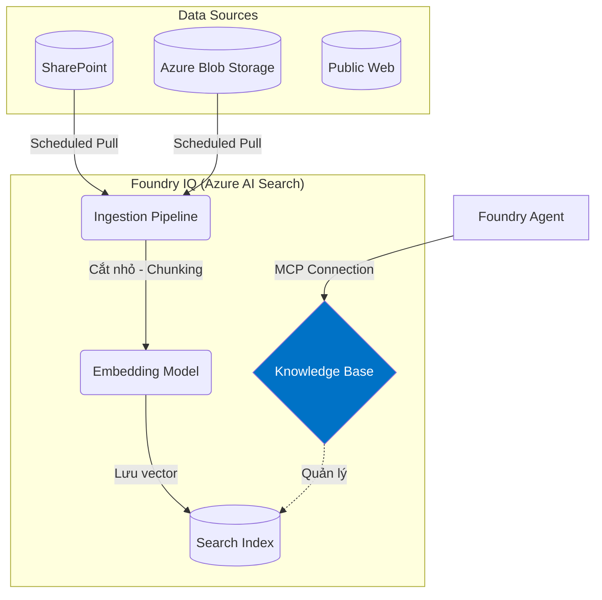

# Cấu Hình Data Sources Cho Foundry IQ

## Agenda

**Thời gian đọc ước tính:** ~15 phút

### Learning outcome:
- **Liệt kê** được các loại Data Sources được hỗ trợ bởi Foundry IQ.
- **Trình bày** được luồng kết nối an toàn (Project Connection) từ Agent đến Knowledge Base.
- **Giải thích** quá trình Ingestion và tầm quan trọng của Chunking Strategies.
- **Thiết lập** được `RemoteTool` connection qua REST API/Python.

---

## Glossary & Vocabulary

**1. Technical Terms (Thuật ngữ kỹ thuật):**

| Term | Vietnamese Meaning & Quick Explain |
| :--- | :--- |
| **Data Source (Knowledge Source)** | Nguồn dữ liệu. Nơi lưu trữ gốc của tài liệu doanh nghiệp (SharePoint, Azure Blob, SQL...). |
| **Ingestion** | Nạp dữ liệu. Quá trình tự động kéo data từ Source, chia nhỏ (chunk) và lưu vào Index. |
| **Project Connection** | Kết nối dự án. Cấu hình bảo mật cấp Project trong Foundry để liên kết an toàn tới hệ thống bên ngoài (như Azure AI Search). |
| **Managed Identity** | Danh tính được quản lý. Một "tài khoản ảo" tự động do Azure cấp để các dịch vụ nói chuyện với nhau không cần password/API key. |

**2. Vocabulary Support (Từ vựng học thuật/B1+):**

| Word | Meaning in Context (Nghĩa trong ngữ cảnh) |
| :--- | :--- |
| **Orchestrate (v)** | Điều phối. Knowledge base đóng vai trò nhạc trưởng điều phối các bước tìm kiếm. |
| **Decompose (v)** | Phân rã. Chia một câu hỏi phức tạp thành nhiều câu hỏi nhỏ (subqueries). |

---

## 1. WHY — Tại Sao Không Trỏ Trực Tiếp Agent Vào Nguồn Data?

Một câu hỏi thường gặp: *"Tại sao Agent không tự gọi API của SharePoint để lấy file, mà phải thông qua Foundry IQ làm trung gian?"*

- **Lý do 1: Tải trọng (Payload limit).** Agent không thể đọc nổi một file PDF 500 trang trong một lần chat. Data phải được chia nhỏ (Chunking).
- **Lý do 2: Định dạng (Format).** SharePoint trả về file Word, PDF. Agent (LLM) chỉ đọc được Text thô.
- **Lý do 3: Search Engine.** SharePoint API tìm kiếm rất chậm và kém thông minh. Foundry IQ đẩy data vào **Azure AI Search** để thực hiện truy vấn Vector (Semantic Search) tốc độ cao.

---

## 2. WHAT — Kiến Trúc Data Source Vào Knowledge Base

Một Knowledge Base trong Foundry IQ không tự chứa dữ liệu, nó đóng vai trò "Orchestrator" (người điều phối) trên nền tảng **Azure AI Search**.



### Các Data Sources Hỗ Trợ
Foundry IQ hỗ trợ 2 loại Knowledge Sources chính:
1. **Indexed Content (Cần Ingestion):** Dữ liệu tĩnh như Azure Blob Storage, SharePoint, OneLake. Dữ liệu này sẽ được quét định kỳ, bóc tách text, và lưu thành Index.
2. **Remote Content (Tra cứu trực tiếp):** Dữ liệu tra cứu realtime như Public Web (thông qua Bing Search) hoặc Azure AI Search có sẵn.

---

## 3. HOW — Khai Báo Connection Bằng ProjectManagedIdentity

Để Agent có quyền gọi Knowledge Base của bạn, bạn PHẢI tạo một **Project Connection** kiểu `RemoteTool`. Cách an toàn nhất (và được Microsoft khuyến nghị) là dùng `ProjectManagedIdentity`.

```python
# filename: create_connection.py
import requests
from azure.identity import DefaultAzureCredential, get_bearer_token_provider

credential = DefaultAzureCredential()

# Thông tin endpoint của Knowledge Base (chuẩn MCP)
mcp_endpoint = "https://your-search-service.search.windows.net/knowledgebases/hr-policy-kb/mcp?api-version=2026-05-01-preview"

# Lấy token để gọi API của Azure Resource Manager
bearer_token = get_bearer_token_provider(credential, "https://management.azure.com/.default")()

# Payload tạo Connection
payload = {
    "name": "my-kb-mcp-connection",
    "type": "Microsoft.MachineLearningServices/workspaces/connections",
    "properties": {
        "authType": "ProjectManagedIdentity", # 👈 Rất quan trọng: Không dùng API Key
        "category": "RemoteTool",             # 👈 Bắt buộc cho MCP Server
        "target": mcp_endpoint,
        "isSharedToAll": True,                # Mọi Agent trong project đều thấy
        "audience": "https://search.azure.com/"
    }
}

# Code gửi HTTP PUT request để tạo resource (giản lược)...
print("Đã tạo Connection bằng Managed Identity an toàn.")
```

**Tại sao lại dùng Managed Identity?**
- Không có API Key nào bị lưu trong source code.
- Azure tự động cấp quyền cho Project gọi sang Azure AI Search. Bạn chỉ cần vào Azure Portal, gán quyền `Search Index Data Reader` cho Identity của Project là xong.

---

## 4. WHAT IF — Ingestion Fails (Nạp Dữ Liệu Lỗi)

Một trong những vấn đề đau đầu nhất khi làm RAG doanh nghiệp là cấu hình Ingestion (Nạp dữ liệu) sai chiến lược.

**Tình huống:** Bạn cấu hình Foundry IQ kéo tài liệu từ SharePoint. File báo cáo tài chính rất lớn có chứa rất nhiều **bảng biểu (Tables)**. Khi Agent đọc dữ liệu, nó trả lời sai bét các con số trong bảng.

**Nguyên nhân:**
Quá trình Chunking mặc định cắt văn bản theo số lượng Token (ví dụ: cứ 800 token thì chặt đứt). Nếu nó chặt đúng vào giữa một cái bảng, dữ liệu hàng và cột sẽ bị mất cấu trúc (mất hàng tiêu đề). Vector sinh ra sẽ không hiểu ý nghĩa của các con số rời rạc.

**Cách khắc phục (Mitigation):**
- Trong cấu hình Ingestion của Foundry IQ (hoặc Azure AI Search), cần chọn chiến lược **Semantic Chunking** thay vì Token-based chunking.
- Đảm bảo định dạng file gốc rõ ràng (hạn chế file scan PDF kém chất lượng, ưu tiên markdown hoặc HTML).

---

## Discussion Questions

1. Nếu bạn thay đổi nội dung một file Word trên SharePoint, mất bao lâu để Agent có thể trả lời kiến thức mới đó? (Gợi ý: Dữ liệu này là Indexed Content hay Remote Content?)
2. Khi khai báo Connection, tại sao phải chỉ định `category: "RemoteTool"`? Chữ "Remote" ở đây có liên quan gì đến kiến trúc MCP (Model Context Protocol) đã học ở Bài 8?

---

## References

- **Connect Agents to Foundry IQ Knowledge Bases:** [Microsoft Learn](https://learn.microsoft.com/en-us/azure/foundry/agents/how-to/foundry-iq-connect)
- **Agentic retrieval pipeline example:** [GitHub Azure Samples](https://github.com/Azure-Samples/azure-search-python-samples/tree/main/agentic-retrieval-pipeline-example)

---
*Made by Anh Tu - Share to be share*
