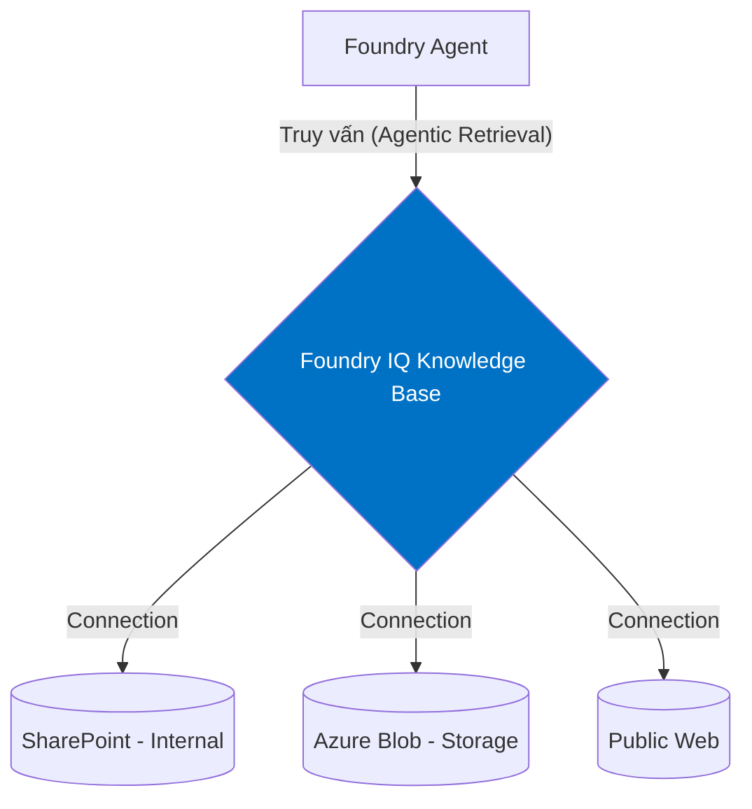
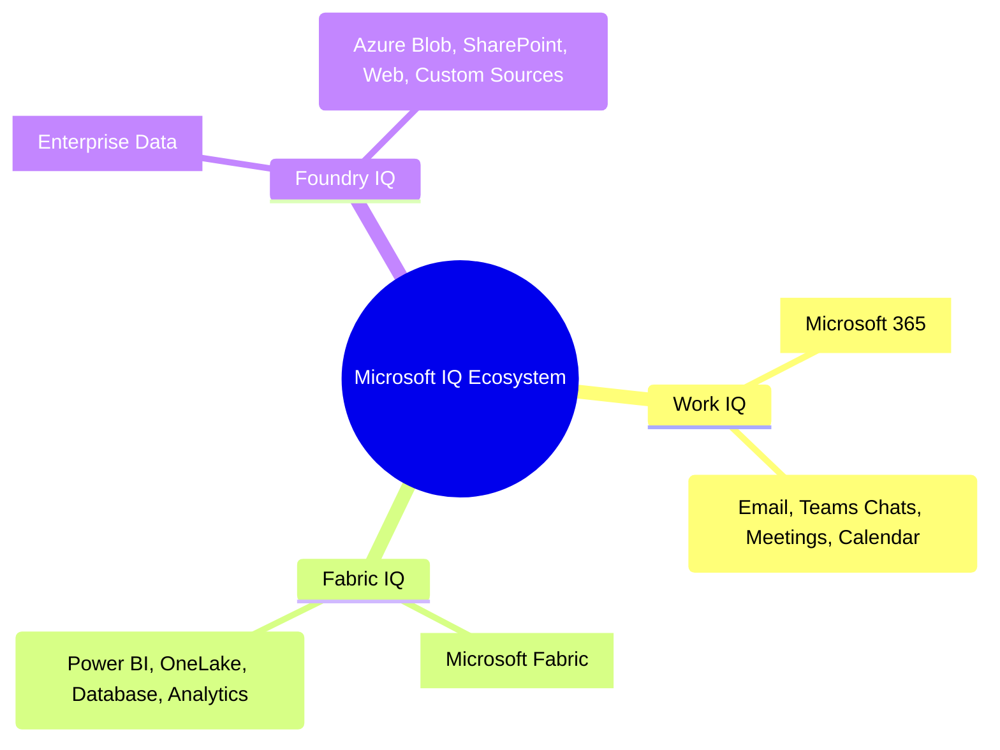

# Foundry IQ Là Gì?

## Agenda

**Thời gian đọc ước tính:** ~15 phút

### Learning outcome:
- **Định nghĩa** được Foundry IQ và vai trò của nó trong Azure ecosystem.
- **Phân biệt** được Foundry IQ với tính năng File Search (Vector Store) cơ bản.
- **Nắm bắt** bộ 3 sản phẩm IQ của Microsoft (Work IQ, Fabric IQ, Foundry IQ).
- **Hiểu** tầm quan trọng của việc đồng bộ quyền truy cập (ACLs) trong Enterprise RAG.

---

## Glossary & Vocabulary

**1. Technical Terms (Thuật ngữ kỹ thuật):**

| Term | Vietnamese Meaning & Quick Explain |
| :--- | :--- |
| **Foundry IQ** | Lớp kiến thức được quản lý (managed knowledge layer). Hệ thống kết nối và quản lý dữ liệu doanh nghiệp an toàn cho AI Agents. |
| **Work IQ** | Lớp tri thức ngữ cảnh cho Microsoft 365. Cung cấp dữ liệu từ email, Teams chat, lịch họp. |
| **Fabric IQ** | Lớp tri thức ngữ nghĩa cho Microsoft Fabric. Cung cấp dữ liệu phân tích từ Power BI, OneLake. |
| **ACLs (Access Control Lists)** | Danh sách kiểm soát truy cập. Cơ chế xác định user nào được phép xem/sửa tài liệu nào. |

**2. Vocabulary Support (Từ vựng học thuật/B1+):**

| Word | Meaning in Context (Nghĩa trong ngữ cảnh) |
| :--- | :--- |
| **Orchestrate (v)** | Điều phối. Quản lý và liên kết nhiều thành phần hệ thống làm việc với nhau. |
| **Scattered (adj)** | Rải rác, phân tán. Dữ liệu công ty thường nằm rải rác ở nhiều nơi (SharePoint, Blob, Web). |
| **Extractive (adj)** | Có tính trích xuất. Trả về dữ liệu gốc kèm theo trích dẫn (citation) để Agent lý luận. |

---

## 1. WHY — Tại Sao File Search Là Chưa Đủ?

Ở bài trước, chúng ta đã tìm hiểu Vector Store và File Search. Tuy nhiên, File Search có một giới hạn lớn: **Nó là kho lưu trữ tĩnh và biệt lập.**

Giả sử công ty bạn có 10,000 tài liệu nhân sự đang nằm trên SharePoint.
- Với **File Search**, bạn phải tải thủ công 10,000 file đó về máy, rồi upload ngược lên Vector Store của Agent. Khi SharePoint có file mới, bạn lại phải làm thủ công.
- Tệ hơn nữa, một số file trên SharePoint chỉ dành cho Manager. Nhưng khi đưa vào Vector Store, Agent không biết ai là Manager, nó sẽ đọc và trả lời cho *tất cả* mọi người. Đây là thảm họa bảo mật.

Đó là lý do Microsoft tạo ra **Foundry IQ**.

---

## 2. WHAT — Kiến Trúc Foundry IQ

**Foundry IQ** là một nền tảng quản trị tri thức (knowledge base management platform). Nó không tự lưu trữ file, mà nó **kết nối (connect)** trực tiếp đến các nguồn dữ liệu có sẵn của bạn (SharePoint, Azure Blob, OneLake, Web).

**Các đặc điểm cốt lõi (Definition Anatomy):**
- **Multi-source (Đa nguồn):** Một Knowledge Base (KB) có thể link tới nhiều Knowledge Sources khác nhau.
- **Automated Ingestion:** Tự động lên lịch (schedule) để quét lại SharePoint/Blob để cập nhật dữ liệu mới (Incremental data refresh).
- **Access Control (Bảo mật):** Đồng bộ ACLs (Quyền truy cập) từ nguồn. Nghĩa là, khi Agent truy vấn, Foundry IQ sẽ hỏi *"User đang chat là ai?"* và chỉ tìm kiếm trong những file mà user đó có quyền đọc ở hệ thống gốc.

### Sự khác biệt: Foundry IQ vs File Search

| Tiêu chí | File Search (Vector Store) | Foundry IQ |
| :--- | :--- | :--- |
| **Nguồn dữ liệu** | Upload file thủ công. | Kết nối tự động đến Enterprise Data. |
| **Tính cập nhật** | Tĩnh. Phải upload lại khi có update. | Động. Tự động đồng bộ theo lịch trình. |
| **Quản lý quyền (ACLs)** | Không. Ai dùng Agent cũng xem được hết. | Có. Honor Microsoft Purview & Entra Identity. |
| **Use case** | Phân tích file cá nhân, tài liệu nhỏ gọn. | Hệ thống RAG cấp doanh nghiệp, dữ liệu nhạy cảm. |

---

## 3. HOW — Bộ Ba Sản Phẩm IQ Của Microsoft

Dữ liệu doanh nghiệp không chỉ có file văn bản. Microsoft chia bài toán tri thức thành 3 mảng lớn, gọi là **IQ Workloads**, để Agent có bức tranh toàn cảnh:

1. **Work IQ (Contextual Intelligence):** Lớp tri thức ngữ cảnh. Giúp Agent biết bạn vừa họp gì, sếp vừa gửi email gì. Nó thu thập tín hiệu cộng tác từ môi trường Microsoft 365.
2. **Fabric IQ (Semantic Intelligence):** Lớp tri thức ngữ nghĩa cho dữ liệu số. Giúp Agent hiểu các biểu đồ Power BI, truy vấn kho dữ liệu OneLake để trả lời các câu hỏi về tài chính, kinh doanh.
3. **Foundry IQ (Managed Knowledge):** Lớp tri thức cấu trúc và phi cấu trúc. Kết nối các tài liệu, wiki, và dữ liệu đám mây chung.

*Ba lớp IQ này hoạt động độc lập nhưng có thể gắn cùng lúc vào một Agent để tạo ra một siêu trợ lý (Super Assistant).*

---

## 4. WHAT IF — Chi Phí Và Hạ Tầng Ẩn Sau Foundry IQ

Khi bạn tạo một Knowledge Base trong Foundry IQ, hệ thống không chạy "chùa". Đằng sau nó, Azure sẽ tự động provisioning (khởi tạo) một resource mang tên **Azure AI Search**.

- **Trade-off:** Mặc dù portal cung cấp Free Tier cho Azure AI Search để test POC (Proof of Concept), khi đưa lên Production, bạn phải trả phí cho dung lượng lưu trữ index và phí xử lý (Agentic Retrieval tokens).
- Nếu ứng dụng của bạn không cần bảo mật cấp user (ACLs) và dữ liệu ít thay đổi, sử dụng File Search (như bài 11) sẽ tiết kiệm và đơn giản hơn rất nhiều.

---

## Discussion Questions

1. Giám đốc yêu cầu tạo một Agent để hỗ trợ nhân viên mới (Onboarding). Agent cần đọc sổ tay nhân viên (PDF) và lấy dữ liệu ngày nghỉ phép của từng người từ SharePoint. Bạn sẽ thiết kế giải pháp kết hợp các công cụ nào? (Gợi ý: Vector Store, Foundry IQ, Custom Tool).
2. Khi Foundry IQ thực hiện "Agentic Retrieval", nó dùng một mô hình LLM (Azure OpenAI) để làm "Query planning" (Lập kế hoạch truy vấn) trước khi thực sự tìm kiếm. Theo bạn, Query planning giúp giải quyết nhược điểm gì so với việc ném thẳng câu hỏi của User vào công cụ tìm kiếm?

---

## References

- **What is Foundry IQ?:** [Microsoft Learn](https://learn.microsoft.com/en-us/azure/foundry/agents/concepts/what-is-foundry-iq)

---
*Made by Anh Tu - Share to be share*
