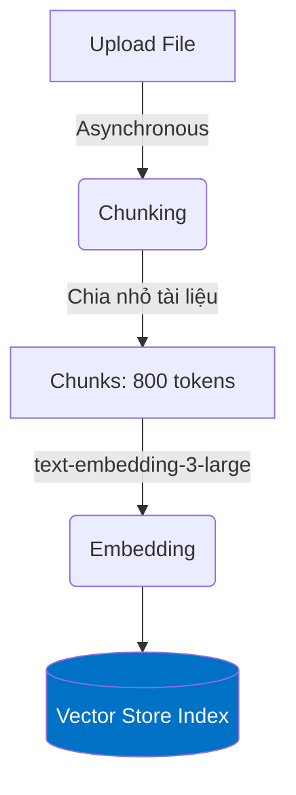

# RAG Cho AI Agents

## Agenda

**Thời gian đọc ước tính:** ~15 phút

### Learning outcome:
- **Định nghĩa** được RAG và giải thích lý do tại sao AI Agent cần nó.
- **Phân biệt** được khi nào nên dùng RAG và khi nào nên Fine-tuning.
- **Trình bày** được quá trình Ingestion (Chunking & Embedding) của Vector Store.
- **Nắm bắt** các giới hạn quan trọng của Vector Store trong Foundry (số lượng file, token, thời hạn).

---

## Glossary & Vocabulary

**1. Technical Terms (Thuật ngữ kỹ thuật):**

| Term | Vietnamese Meaning & Quick Explain |
| :--- | :--- |
| **RAG (Retrieval-Augmented Generation)** | Tạo văn bản có tăng cường truy xuất. Kỹ thuật giúp LLM tìm kiếm thông tin từ dữ liệu bên ngoài trước khi sinh ra câu trả lời. |
| **Vector Store** | Kho lưu trữ Vector. Nơi lưu trữ văn bản đã được chuyển đổi thành chuỗi số (vector) để máy tính có thể so sánh độ tương đồng (Semantic Search). |
| **Chunking** | Chia nhỏ. Quá trình cắt một tài liệu dài thành nhiều đoạn ngắn (chunk) để đưa vào Vector Store. |
| **Embedding** | Nhúng. Biến đổi một đoạn văn bản (chunk) thành một mảng số học nhiều chiều. |

**2. Vocabulary Support (Từ vựng học thuật/B1+):**

| Word | Meaning in Context (Nghĩa trong ngữ cảnh) |
| :--- | :--- |
| **Hallucination (n)** | Ảo giác (của AI). Trạng thái AI bịa ra thông tin sai lệch nhưng trả lời với thái độ rất tự tin. |
| **Proprietary (adj)** | Độc quyền, nội bộ. Ví dụ: *Proprietary data* (Dữ liệu nội bộ của công ty). |
| **Asynchronous (adj)** | Bất đồng bộ. Quá trình xử lý chạy ngầm, không block luồng chính. |

---

## 1. WHY — Tại Sao AI Agents Cần RAG?

Một mô hình AI (như GPT-4) được huấn luyện trên lượng dữ liệu khổng lồ từ Internet. Tuy nhiên, nó có hai nhược điểm chí mạng khi đưa vào doanh nghiệp:
1. **Knowledge Cutoff (Giới hạn thời gian):** Mô hình không biết các sự kiện xảy ra sau khi nó được huấn luyện xong.
2. **Proprietary Data (Dữ liệu nội bộ):** Mô hình hoàn toàn "mù tịt" về tài liệu nội bộ, chính sách nhân sự, hay mã nguồn của riêng công ty bạn.

Khi được hỏi những thông tin này, AI thường mắc hội chứng **Hallucination (Ảo giác)** — bịa ra câu trả lời sai.

**Giải pháp:** RAG (Retrieval-Augmented Generation).
> 💡 **Analogy (Ví von):** Hãy tưởng tượng Agent là một vị Thám tử tài ba (LLM). Tuy rất thông minh, nhưng Thám tử không thể biết chi tiết một vụ án vừa xảy ra sáng nay. RAG chính là hành động cung cấp cho Thám tử một tập **"Hồ sơ vụ án"** (Retrieved Documents) để họ đọc trước khi đưa ra kết luận.

### RAG vs Fine-tuning (Đánh đổi quan trọng)

Nhiều người mới thường nghĩ: *"Tại sao không đưa luôn tài liệu công ty vào huấn luyện lại mô hình (Fine-tuning)?"*

| Tiêu chí | RAG (Nên dùng) | Fine-tuning (Tránh lạm dụng) |
| :--- | :--- | :--- |
| **Mục đích chính** | Cập nhật kiến thức mới, tra cứu thông tin cụ thể. | Thay đổi văn phong, định dạng output (giọng điệu, cấu trúc JSON). |
| **Chi phí & Tốc độ** | Rẻ, cập nhật dữ liệu realtime (chỉ cần upload file mới). | Đắt đỏ, mất thời gian train lại mỗi khi có dữ liệu mới. |
| **Trích dẫn nguồn** | **Có**. Biết chính xác câu trả lời lấy từ trang nào. | **Không**. Mô hình chỉ "nhớ mang máng" kiến thức. |
| **Bảo mật (Permissions)** | Có thể lọc kết quả theo quyền của user. | Không thể. Mô hình đã học thì ai hỏi nó cũng trả lời. |

---

## 2. WHAT — Vector Stores & Quá Trình Ingestion

Trong Foundry Agent Service, công cụ trực tiếp thực hiện RAG cho file tĩnh (PDF, Word, TXT) gọi là **File Search**, và nó sử dụng **Vector Store** làm bộ não lưu trữ.

**Definition Anatomy của quá trình Ingestion (Nạp dữ liệu):**
Khi bạn upload một file, hệ thống sẽ thực hiện ngầm 4 bước:
1. **Parses (Phân tích):** Bóc tách text ra khỏi PDF, Word.
2. **Chunks (Chia nhỏ):** Cắt text thành từng đoạn nhỏ. Mặc định trong Foundry:
   - Chunk size: **800 tokens** (~600 từ).
   - Chunk overlap: **400 tokens** (giữ lại một phần đoạn trước để không mất ngữ cảnh).
3. **Embeds (Nhúng):** Dùng mô hình `text-embedding-3-large` (256 chiều) biến chữ thành số.
4. **Indexes (Lập chỉ mục):** Lưu vào cơ sở dữ liệu Vector để tối ưu hóa việc tìm kiếm.

---

## 3. HOW — Các Giới Hạn (Limits) Bắt Buộc Phải Nhớ

Tài liệu Microsoft nhấn mạnh: *"Vector stores are often the first place retrieval workflows fail in production"* (Vector store thường là nơi quy trình bị sập đầu tiên trong môi trường thực tế). Lý do là vì kỹ sư không nắm được các giới hạn (Hard Limits).

### 3.1. Giới hạn số lượng
- **1 Vector Store / Agent:** Mỗi Agent chỉ được đính kèm tối đa MỘT vector store.
- **1 Vector Store / Conversation:** Mỗi cuộc hội thoại (Thread) được đính tối đa MỘT vector store riêng.
- **10,000 Files / Vector Store:** Một vector store chứa tối đa 10 ngàn file.

### 3.2. Lifecycle & Expiration Policy (Chính sách hết hạn)
Các vector store được tạo ra tự động trong một Conversation (do người dùng upload file vào khung chat) có mặc định **thời hạn sống là 7 ngày** kể từ lần cuối tương tác.
- **Lỗi phổ biến:** Nếu user mở lại đoạn chat sau 10 ngày và hỏi tiếp, response sẽ bị lỗi (fail) do vector store đã bị xóa.
- **Cách fix:** Ứng dụng của bạn phải tự catch lỗi, tạo lại vector store mới với các file cũ và gắn lại vào conversation.

### 3.3. Trạng thái Ingestion
Bởi vì việc xử lý file là bất đồng bộ (Asynchronous), Vector Store sẽ có trạng thái `in_progress`.
> **[!WARNING] Quan trọng**
> Bạn BẮT BUỘC phải viết code để "poll" (hỏi liên tục) xem trạng thái đã chuyển sang `completed` chưa TRƯỚC KHI yêu cầu Agent trả lời. Nếu không, Agent sẽ tìm kiếm trên một kho dữ liệu trống rỗng.

---

## 4. WHAT IF — Hybrid Search (Tìm kiếm lai)

Mô hình Vector Search dựa trên Semantic (Ngữ nghĩa) rất tốt để hiểu đồng nghĩa (Ví dụ: "Chó" và "Cún"). Nhưng nếu user tìm chính xác một mã số hợp đồng `"HD-2023-A9X"`, Semantic Search có thể bỏ sót.

Foundry hỗ trợ cơ chế **Hybrid Search**: Chạy song song cả Keyword Search (như tìm kiếm trên Google) và Semantic Search, sau đó kết hợp lại (Reranking) để chọn ra 20 chunks tốt nhất (Maximum chunks added to context = 20) trước khi đưa cho LLM đọc.

---

## Discussion Questions

1. Tại sao Foundry lại thiết lập `Chunk overlap` lên đến 400 tokens (chiếm 50% của `Chunk size` 800 tokens)? Điều này giải quyết rủi ro gì khi cắt văn bản?
2. Trong ứng dụng Agent hỗ trợ khách hàng, người dùng upload một file PDF (hóa đơn) lên cửa sổ chat. File này nên được đưa vào Agent Vector Store hay Conversation Vector Store? Tại sao?

---

## References

- **Vector stores for file search:** [Microsoft Learn](https://learn.microsoft.com/en-us/azure/foundry/agents/concepts/vector-stores)

---
*Made by Anh Tu - Share to be share*
