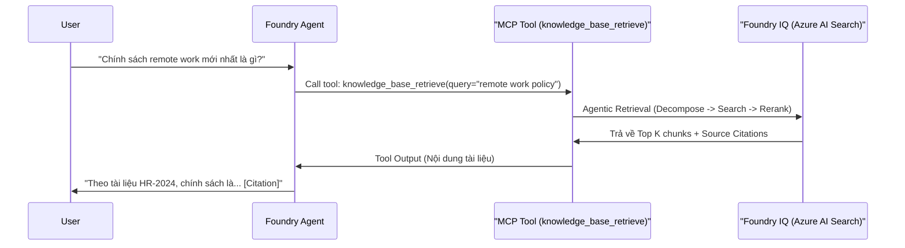

# Cấu Hình Retrieval Với Foundry IQ

## Agenda

**Thời gian đọc ước tính:** ~15 phút

### Learning outcome:
- **Định nghĩa** được Agentic Retrieval và luồng hoạt động phân rã câu hỏi.
- **Tích hợp** được Knowledge Base vào Agent thông qua `MCPTool` bằng Python SDK.
- **Tối ưu hóa** System Prompt để bắt buộc Agent sử dụng kiến thức nội bộ và trích dẫn nguồn.
- **Cấu hình** được cơ chế truyền Identity (Quyền truy cập) từ người dùng sang Knowledge Base (Permissions at query time).

---

## Glossary & Vocabulary

**1. Technical Terms (Thuật ngữ kỹ thuật):**

| Term | Vietnamese Meaning & Quick Explain |
| :--- | :--- |
| **Agentic Retrieval** | Truy xuất kiểu đặc vụ. Phương pháp tìm kiếm thông minh: Dùng LLM để phân tích câu hỏi, sinh ra nhiều câu lệnh tìm kiếm nhỏ (subqueries), và kết hợp kết quả. |
| **Semantic Reranking** | Xếp hạng lại theo ngữ nghĩa. Quá trình chấm điểm và sắp xếp lại các đoạn văn bản (chunks) tìm được xem đoạn nào sát nghĩa nhất với câu hỏi. |
| **System Prompt (Instructions)** | Chỉ thị hệ thống. Lệnh gốc thiết lập "tính cách" và "quy tắc bất di bất dịch" cho Agent. |
| **Citation / Attribution** | Trích dẫn / Ghi công. Hành động đính kèm nguồn gốc (đường link file, trang số mấy) vào sau mỗi câu trả lời của AI. |

**2. Vocabulary Support (Từ vựng học thuật/B1+):**

| Word | Meaning in Context (Nghĩa trong ngữ cảnh) |
| :--- | :--- |
| **Synthesize (v)** | Tổng hợp. Lắp ráp các mẩu thông tin từ nhiều nguồn khác nhau thành một câu trả lời duy nhất. |
| **Fall back (v)** | Chuyển về phương án dự phòng. Ví dụ: Nếu không tìm thấy file gốc, hệ thống sẽ fallback về URL của MCP. |

---

## 1. WHY — Agentic Retrieval Khác Gì Search Bình Thường?

Khi một user hỏi: *"So sánh chính sách nghỉ phép của năm 2023 và 2024"*, nếu dùng Search truyền thống (Keyword Search), hệ thống sẽ đem nguyên câu văn đó đi tìm. Kết quả trả về thường rất kém vì hiếm có tài liệu nào chứa nguyên văn câu so sánh đó.

**Agentic Retrieval** trong Foundry IQ giải quyết vấn đề này bằng cách:
1. LLM nhận câu hỏi phức tạp.
2. Nó **Decompose (Phân rã)** thành 2 truy vấn nhỏ:
   - *Search 1:* "Chính sách nghỉ phép 2023"
   - *Search 2:* "Chính sách nghỉ phép 2024"
3. Hệ thống chạy 2 truy vấn này song song vào Knowledge Base.
4. Nó thu thập kết quả, **Rerank (Xếp hạng)** lại, và cuối cùng LLM **Synthesize (Tổng hợp)** thành bảng so sánh.

---

## 2. WHAT — Kiến Trúc Tích Hợp Foundry IQ Vào Agent

Một Knowledge Base trong Foundry IQ được expose (mở ra) cho Agent dưới dạng một công cụ (Tool) tuân theo chuẩn **Model Context Protocol (MCP)**. Cụ thể, tool đó mang tên `knowledge_base_retrieve`.



---

## 3. HOW — Thực Hành Code Tích Hợp

Để ráp nối mọi thứ lại với nhau, bạn cần 2 yếu tố quyết định sự thành bại của Agent:
1. **System Prompt (Instructions)** cực kỳ chặt chẽ.
2. Khai báo **MCPTool** với danh sách `allowed_tools`.

### Bước 1: Viết System Prompt Tối Ưu

Tài liệu Microsoft nhấn mạnh việc phải cung cấp "Explicit directives" (Chỉ thị rõ ràng) để ép LLM không được dùng kiến thức ảo (hallucinate).

```python
instructions = """
You are a helpful assistant that must use the knowledge base to answer all the questions from user. 
You must never answer from your own knowledge under any circumstances.

Every answer must always provide annotations for using the MCP knowledge base tool and render them as: `【message_idx:search_idx†source_name】`

If you cannot find the answer in the provided knowledge base you must respond with "I don't know".
"""
```

**Mục tiêu của prompt trên:**
- **Higher MCP tool invocation rates:** Ép LLM ưu tiên gọi Tool thay vì tự bịa.
- **Clear source attribution:** Định dạng trích dẫn cụ thể để Frontend UI dễ dàng bắt và biến thành Link.

### Bước 2: Gắn MCPTool Vào Agent

Dùng class `MCPTool` và giới hạn bằng `allowed_tools`:

```python
from azure.ai.projects import AIProjectClient
from azure.ai.projects.models import PromptAgentDefinition, MCPTool

# ... (Khởi tạo project_client) ...

mcp_kb_tool = MCPTool(
    server_label="knowledge-base",
    server_url="{search_endpoint}/knowledgebases/{kb_name}/mcp?api-version=2026-05-01-preview",
    require_approval="never", # Đọc dữ liệu nội bộ không cần con người duyệt từng câu
    allowed_tools=["knowledge_base_retrieve"], # CHỈ cho phép dùng tool tìm kiếm
    project_connection_id="my-kb-mcp-connection" # Đã tạo ở Bài 13
)

agent = project_client.agents.create_version(
    agent_name="hr-assistant",
    definition=PromptAgentDefinition(
        model="gpt-4.1-mini",
        instructions=instructions,
        tools=[mcp_kb_tool]
    )
)
```

---

## 4. WHAT IF — Bài Toán Bảo Mật: Quyền Của Ai?

**Tình huống (Rủi ro kinh điển):** Bạn làm một Agent tra cứu SharePoint. Giám đốc có quyền đọc file "Báo Cáo Lương.pdf". Nhân viên thực tập (Intern) không có quyền đọc file này trên SharePoint.
Tuy nhiên, Agent được cấu hình với quyền Admin (ProjectManagedIdentity). Khi Intern chat với Agent hỏi *"Lương của anh A là bao nhiêu?"*, Agent lấy quyền Admin đọc file và trả lời cho Intern. 👉 **Lộ dữ liệu!**

**Giải pháp của Foundry IQ:**
Sử dụng tính năng **Permissions at query time (Ủy quyền tại thời điểm truy vấn)**.
Bạn phải đẩy Identity của người dùng cuối (Intern) từ Frontend xuống Backend, lấy token của Intern, và truyền nó vào HTTP Header `x-ms-query-source-authorization` của MCP Tool.

```python
from azure.identity import get_bearer_token_provider

# intern_credential là danh tính của user đang chat (được pass từ UI)
intern_token_provider = get_bearer_token_provider(intern_credential, "https://search.azure.com/.default")

mcp_kb_tool = MCPTool(
    # ... (các cấu hình khác) ...
    headers={
        # Truyền token của Intern vào để Azure AI Search filter file
        "x-ms-query-source-authorization": intern_token_provider()
    }
)
```
Khi này, Azure AI Search sẽ đối chiếu Token của Intern với ACLs của file trên SharePoint. File "Báo Cáo Lương.pdf" sẽ bị ẩn khỏi kết quả tìm kiếm, và Agent sẽ trả lời "I don't know".

---

## Discussion Questions

1. System Prompt có yêu cầu Agent trả lời "I don't know" nếu không tìm thấy trong Knowledge Base. Tuy nhiên, nếu user hỏi "Xin chào, bạn là ai?", câu trả lời sẽ là gì? Liệu prompt này có quá nghiêm ngặt đối với các câu giao tiếp thông thường không? Làm sao để tối ưu?
2. So sánh ưu/nhược điểm giữa việc dùng Keyword Search (như Google) và Semantic Search (dựa trên vector embeddings) khi tìm kiếm trong kho tài liệu pháp lý chứa rất nhiều thuật ngữ chuyên môn và số nghị định.

---

## References

- **Connect Agents to Foundry IQ Knowledge Bases:** [Microsoft Learn](https://learn.microsoft.com/en-us/azure/foundry/agents/how-to/foundry-iq-connect)

---
*Made by Anh Tu - Share to be share*
