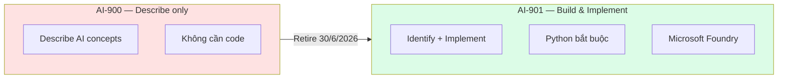
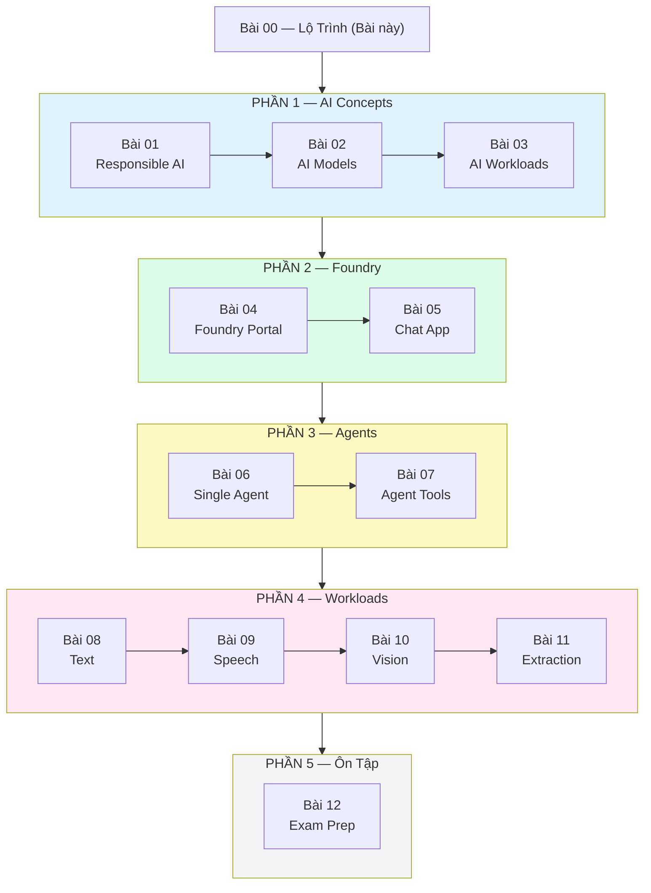

# Lộ Trình Ôn Thi AI-901

## Agenda

**Thời gian đọc ước tính:** ~8 phút

### Sau bài này, bạn sẽ:
- ✅ **Hiểu** được AI-901 khác gì AI-900 và tại sao Microsoft làm lại từ đầu
- ✅ **Nắm** được cấu trúc 2 domain và tỉ trọng điểm thi
- ✅ **Biết** cách ôn thi khi hết Azure free tier

### Yêu cầu đầu vào:
- 🔹 Python cơ bản (biết viết function, đọc được code)
- 🔹 Hiểu sơ về Cloud (biết khái niệm server, API)

---

## Vấn đề & Giải pháp

**Vấn đề:**
- AI-900 (kỳ thi cũ) chỉ hỏi lý thuyết "describe AI concepts" — không thực chiến
- Microsoft nhận ra thị trường cần developer biết *làm được*, không chỉ *nói được*
- Tài liệu ôn AI-901 tiếng Việt gần như chưa có

**Giải pháp (chuỗi tài liệu này):** Học song song lý thuyết + thực hành với Microsoft Foundry, có **2 track**: Azure subscription và Free tier.

---

## AI-901 là gì?

**Định nghĩa:** AI-901 (Microsoft Azure AI Fundamentals) là kỳ thi chứng chỉ nền tảng, đánh giá khả năng **hiểu khái niệm AI và triển khai giải pháp AI thực tế** trên nền tảng Microsoft Foundry bằng Python.

:::info Lịch sử ra đời
AI-901 thay thế AI-900, beta từ tháng 4/2026 và GA tháng 6/2026. AI-900 sẽ retire **30/6/2026**. Lý do: thị trường cần developer biết *build*, không chỉ *describe*.
:::



---

## Cấu Trúc Kỳ Thi

| Domain | Tỉ Trọng | Nội Dung |
|---|---|---|
| **Domain 1:** Identify AI concepts & responsibilities | **40–45%** | Responsible AI, AI models, AI workloads |
| **Domain 2:** Implement with Microsoft Foundry | **55–60%** | GenAI apps, Agents, Text/Speech/Vision/Extraction |

:::tip Chiến lược
Domain 2 chiếm hơn 55% → ưu tiên thực hành Foundry. Nhưng đừng bỏ Domain 1 — 40% là đủ để rớt nếu học qua loa.
:::

### Chi tiết Domain 1 — AI Concepts (40–45%)

```
1A. Responsible AI (6 nguyên tắc)
    → Fairness, Reliability & Safety, Privacy & Security
    → Inclusiveness, Transparency, Accountability

1B. AI Model Components & Configurations
    → Generative AI hoạt động thế nào?
    → Chọn model phù hợp theo use case
    → Deployment options (serverless, PTU, dedicated)

1C. AI Workloads
    → Text Analysis: NER, Sentiment, Key Phrase, Summarization
    → Speech: STT, TTS
    → Computer Vision & Image Generation
    → Information Extraction
    → Generative AI & Agentic AI
```

### Chi tiết Domain 2 — Microsoft Foundry (55–60%)

```
2A. Generative AI Apps & Agents
    → Prompt engineering (system/user prompts)
    → Deploy model trong Foundry portal
    → Build chat app bằng Foundry SDK (Python)
    → Create single-agent + build agent client app

2B. Text & Speech
    → Text analysis app với Azure AI Language
    → Spoken prompts với multimodal model
    → Azure Speech trong Foundry Tools

2C. Computer Vision & Image Generation
    → Visual input với multimodal model
    → Generate images với DALL-E

2D. Information Extraction
    → Azure Content Understanding (docs, forms, images, audio, video)
```

---

## Roadmap Bài Học



---

## Lịch Học 4 Tuần

| Tuần | Bài | Nội Dung | Lab Environment |
|---|---|---|---|
| **Tuần 1** | 00, 01, 02 | Overview, Responsible AI, AI Models | Không cần Azure |
| **Tuần 2** | 03, 04, 05 | Workloads, Foundry Portal, Chat App | Azure (tiết kiệm credit) |
| **Tuần 3** | 06, 07, 08 | Agent, Agent Tools, Text Analysis | **Dùng hết credit tại đây** |
| **Tuần 4** | 09, 10, 11, 12 | Speech, Vision, Extraction, Exam Prep | Microsoft Learn Sandbox |

---

## Học Khi Hết Azure Free Tier

| Môi Trường | Free | Dùng Để Học |
|---|---|---|
| **Microsoft Learn Sandbox** | ✅ | Lab chính thức, Azure thật ~60 phút/session |
| **Azure for Students** | ✅ Không cần credit card | $100 credit/năm nếu có email trường |
| **GitHub Codespaces** | ✅ 60h/tháng | Chạy Python code |
| **Google Colab** | ✅ | Python notebooks |
| **Groq API** | ✅ Free tier rộng | Thay GPT-4o test chat app |
| **ai.azure.com Foundry** | ✅ Một số model | Học Foundry Portal UI |

:::tip Microsoft Learn Sandbox — lựa chọn số 1
Vào bất kỳ module học trên `learn.microsoft.com`, bấm **"Activate sandbox"** → có Azure resource group thật, miễn phí, không cần thẻ credit.
:::

:::warning Đăng ký thi
Dùng **personal MSA account** (Outlook/Hotmail), không dùng work/school account. Record thi có thể bị mất khi rời tổ chức.
:::

---

## Thông Tin Thi

| Thông Tin | Chi Tiết |
|---|---|
| Tên kỳ thi | AI-901: Microsoft Azure AI Fundamentals |
| Điểm đạt | 700/1000 |
| Thời gian | ~65 phút |
| Đăng ký | Pearson VUE |
| Chứng chỉ | Microsoft Certified: Azure AI Fundamentals |

---

## Resources

- [AI-901 Exam Page](https://learn.microsoft.com/en-us/credentials/certifications/exams/ai-901/)
- [AI-901 Study Guide](https://aka.ms/AI901-StudyGuide) — Cập nhật 15/4/2026
- [Intro to AI in Azure Course](https://learn.microsoft.com/en-us/training/courses/ai-901t00)
- [Microsoft Foundry Portal](https://ai.azure.com)

---

*Made by Anh Tu - Share to be shared*
