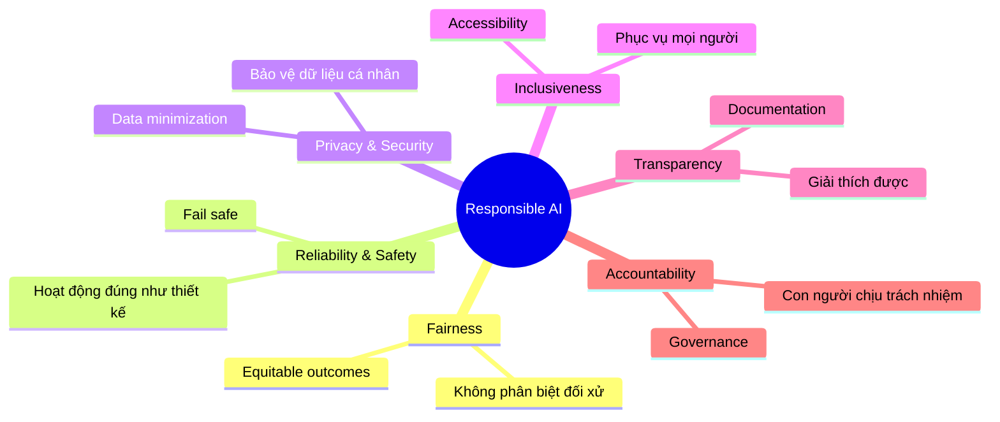

# Responsible AI — 6 Nguyên Tắc Microsoft

## Agenda

**Thời gian đọc ước tính:** ~12 phút  
**Domain kỳ thi:** Domain 1A — chiếm ~10–15% toàn bài thi

### Sau bài này, bạn sẽ:
- ✅ **Giải thích** được 6 nguyên tắc Responsible AI bằng ngôn ngữ đơn giản
- ✅ **Phân biệt** được từng nguyên tắc với ví dụ thực tế
- ✅ **Nhận ra** câu hỏi thi dạng "scenario" liên quan đến principle nào
- ✅ **Liên kết** Responsible AI với các công cụ Azure (Azure ML, Content Safety)

### Yêu cầu đầu vào:
- 🔹 Đã đọc Bài 00 (Overview)
- 🔹 Không cần Azure account cho bài này

---

## Vấn đề & Giải pháp

**Vấn đề:**
- AI có thể phân biệt đối xử (tuyển dụng thiên vị giới tính, nhận diện khuôn mặt kém chính xác với người da màu)
- AI có thể bị hack, fail theo cách nguy hiểm (xe tự lái nhận nhầm biển dừng)
- AI có thể thu thập dữ liệu cá nhân mà người dùng không hay biết
- Thiếu trách nhiệm giải trình khi AI gây hại

**Giải pháp của Microsoft:** Năm 2016, Microsoft công bố 6 nguyên tắc Responsible AI làm nền tảng cho mọi sản phẩm và dịch vụ AI. Đây không phải marketing — Microsoft có cả **Responsible AI Standard** (tài liệu nội bộ 30 trang) và **Office of Responsible AI** để enforce.

---

## 6 Nguyên Tắc Responsible AI

---

## Nguyên Tắc 1: Fairness (Công Bằng)

**Định nghĩa:** AI phải xử lý tất cả mọi người một cách công bằng và không tạo ra hoặc củng cố định kiến (bias) không công bằng.

**Giải phẫu định nghĩa:**
- *"Xử lý công bằng"* → Kết quả không bị ảnh hưởng bởi giới tính, chủng tộc, tuổi tác, tôn giáo
- *"Không củng cố bias"* → AI học từ dữ liệu lịch sử có thể có sẵn bias → phải kiểm soát

### Ví dụ thực tế

| Tình huống | Vi phạm Fairness | Giải pháp |
|---|---|---|
| AI tuyển dụng ưu tiên CV nam giới vì dataset training toàn người nam | ✅ Vi phạm | Cân bằng dataset, dùng fairness metrics |
| Nhận diện khuôn mặt độ chính xác 99% với người da trắng, 65% với người da màu | ✅ Vi phạm | Thu thập dữ liệu đại diện hơn |
| Chatbot ngân hàng từ chối khoản vay dựa trên mã zip code (proxy cho chủng tộc) | ✅ Vi phạm | Loại bỏ proxy variables |

### Công cụ Azure liên quan
- **Azure Machine Learning — Fairness Assessment:** Dashboard phân tích bias theo demographic groups
- **Azure AI Content Safety:** Phát hiện nội dung phân biệt đối xử

---

## Nguyên Tắc 2: Reliability & Safety (Đáng Tin Cậy & An Toàn)

**Định nghĩa:** AI phải hoạt động đáng tin cậy, an toàn, và nhất quán — kể cả trong các điều kiện bất ngờ, và phải thất bại một cách an toàn (fail safe).

**Giải phẫu định nghĩa:**
- *"Đáng tin cậy"* → Cho kết quả nhất quán, không ngẫu nhiên
- *"An toàn"* → Không gây hại khi hoạt động sai
- *"Fail safe"* → Khi lỗi, dừng lại an toàn thay vì làm điều nguy hiểm

### Ví dụ thực tế

| Tình huống | Nguyên tắc áp dụng |
|---|---|
| Xe tự lái nhận nhầm biển "STOP" do sticker dán lên → vẫn chạy thẳng | Fail safe bị vi phạm |
| AI chẩn đoán y tế đôi khi trả lời ngẫu nhiên với cùng 1 ảnh | Reliability bị vi phạm |
| AI phẫu thuật robot dừng lại và báo động khi sensor mất tín hiệu | ✅ Fail safe đúng |

:::warning Câu hỏi thi hay gặp
"Which principle is MOST relevant when an AI medical imaging system needs to operate consistently across different hospital equipment?" → **Reliability & Safety**
:::

---

## Nguyên Tắc 3: Privacy & Security (Riêng Tư & Bảo Mật)

**Định nghĩa:** AI phải bảo vệ quyền riêng tư và bảo mật dữ liệu cá nhân, áp dụng **data minimization** (chỉ thu thập dữ liệu thực sự cần thiết).

**Giải phẫu định nghĩa:**
- *"Bảo vệ quyền riêng tư"* → Người dùng biết dữ liệu nào được dùng, có quyền từ chối
- *"Data minimization"* → Không thu thập nhiều hơn mức cần thiết
- *"Bảo mật"* → Dữ liệu không bị rò rỉ hoặc bị tấn công

### Ví dụ thực tế

| Tình huống | Đánh giá |
|---|---|
| App AI dịch văn bản lưu lại toàn bộ nội dung người dùng nhập mà không thông báo | ✅ Vi phạm Privacy |
| Chatbot y tế mã hóa toàn bộ hội thoại, không lưu sau session | ✅ Tuân thủ |
| AI nhận diện cảm xúc trong cuộc họp mà không xin phép nhân viên | ✅ Vi phạm nghiêm trọng |

### Công cụ Azure liên quan
- **Azure Confidential Computing:** Xử lý dữ liệu nhạy cảm trong vùng bảo mật (TEE)
- **Microsoft Purview:** Quản lý data governance

---

## Nguyên Tắc 4: Inclusiveness (Bao Gồm Tất Cả)

**Định nghĩa:** AI phải trao quyền cho mọi người và phục vụ tất cả mọi đối tượng, bao gồm người khuyết tật, người cao tuổi, và các nền văn hóa khác nhau.

**Giải phẫu định nghĩa:**
- *"Trao quyền"* → AI giúp người yếu thế làm được điều họ không thể làm trước đây
- *"Mọi đối tượng"* → Không thiết kế chỉ cho người trẻ, người khỏe, người nói tiếng Anh

### Ví dụ thực tế

| AI Solution | Áp dụng Inclusiveness |
|---|---|
| Azure AI Speech — đọc văn bản thành giọng nói | Hỗ trợ người khiếm thị |
| Azure AI Vision — mô tả ảnh bằng ngôn ngữ tự nhiên | Hỗ trợ người mù |
| Azure AI Translator — 100+ ngôn ngữ | Phá rào cản ngôn ngữ |
| Cognitive Services hỗ trợ giọng nói nhận dạng chính xác với accent | Không phân biệt vùng miền |

:::note Liên hệ với Microsoft
Microsoft ra đời AI Accessibility ngay từ sản phẩm Windows với Narrator, Magnifier — Inclusiveness không phải thêm sau mà là **by design**.
:::

---

## Nguyên Tắc 5: Transparency (Minh Bạch)

**Định nghĩa:** AI phải có khả năng giải thích được — người dùng phải hiểu AI hoạt động thế nào, tại sao đưa ra quyết định đó, và giới hạn của nó là gì.

**Giải phẫu định nghĩa:**
- *"Giải thích được"* → Explainable AI (XAI) — có thể truy vết lý do quyết định
- *"Người dùng phải hiểu"* → Không cần giải thích toán học, nhưng cần human-readable reason
- *"Giới hạn"* → Thông báo rõ khi nào AI không chắc chắn

### Ví dụ thực tế

| Tình huống | Đánh giá |
|---|---|
| AI từ chối khoản vay nhưng không giải thích lý do | ✅ Vi phạm Transparency |
| AI chẩn đoán ung thư kèm highlight vùng ảnh làm cơ sở quyết định | ✅ Tuân thủ |
| Chatbot AI không tiết lộ mình là AI khi người dùng hỏi | ✅ Vi phạm nghiêm trọng |

### Công cụ Azure liên quan
- **Azure ML — Explainability Dashboard:** Hiển thị feature importance
- **Microsoft Transparency Notes:** Tài liệu mô tả khả năng và giới hạn của mỗi AI service
- **Model Cards:** Thẻ mô tả model, training data, intended use

---

## Nguyên Tắc 6: Accountability (Trách Nhiệm)

**Định nghĩa:** Con người phải chịu trách nhiệm về hoạt động và kết quả của hệ thống AI — phải có cơ chế quản trị rõ ràng, vai trò được định nghĩa, và giám sát liên tục.

**Giải phẫu định nghĩa:**
- *"Con người chịu trách nhiệm"* → AI không thể là "lý do" để né trách nhiệm
- *"Cơ chế quản trị"* → Ai là người quyết định AI làm gì? Ai kiểm tra?
- *"Giám sát liên tục"* → Không phải deploy xong là xong

### Ví dụ thực tế

| Tình huống | Đánh giá |
|---|---|
| Công ty nói "AI quyết định, chúng tôi không chịu trách nhiệm" | ✅ Vi phạm — con người luôn chịu trách nhiệm |
| Bệnh viện có AI advisory board review mọi model trước khi deploy | ✅ Tốt |
| AI bị hack tạo ra deepfake — không có ai chịu trách nhiệm | ✅ Vi phạm governance |

:::tip Human in the Loop
Accountability thường đi kèm khái niệm **Human in the Loop (HITL)** — con người luôn phải có khả năng override, kiểm tra, và dừng AI bất cứ lúc nào.
:::

---

## Tổng Hợp 6 Nguyên Tắc

| Nguyên Tắc | Câu hỏi cốt lõi | Từ khóa thi |
|---|---|---|
| **Fairness** | Có ai bị đối xử bất công không? | bias, discrimination, demographic |
| **Reliability & Safety** | AI có hoạt động đúng và an toàn không? | consistent, fail safe, unexpected |
| **Privacy & Security** | Dữ liệu cá nhân có được bảo vệ không? | personal data, consent, data minimization |
| **Inclusiveness** | Có ai bị loại trừ không? | accessibility, diverse, empower |
| **Transparency** | AI có giải thích được không? | explainable, understandable, limitations |
| **Accountability** | Ai chịu trách nhiệm khi AI sai? | governance, human oversight, responsible |

---

## Practice Questions

:::note Câu 1
**Scenario:** Một công ty triển khai AI tuyển dụng. Sau 6 tháng, họ nhận ra AI từ chối phần lớn CV của ứng viên nữ. Principle nào bị vi phạm?

**A.** Transparency  
**B.** Fairness ✅  
**C.** Accountability  
**D.** Inclusiveness

**Giải thích:** Đây là bias trong tuyển dụng dựa trên giới tính → Fairness. Không phải Inclusiveness vì Inclusiveness liên quan đến accessibility, không phải selection bias.
:::

:::note Câu 2
**Scenario:** AI chatbot chăm sóc sức khỏe lưu lại toàn bộ lịch sử hội thoại của bệnh nhân mà không thông báo. Principle nào bị vi phạm?

**A.** Fairness  
**B.** Reliability  
**C.** Privacy & Security ✅  
**D.** Transparency

**Giải thích:** Thu thập dữ liệu cá nhân không có consent → Privacy & Security.
:::

:::note Câu 3
**Scenario:** Công ty dùng AI để phê duyệt khoản vay. Khi khách hàng hỏi tại sao bị từ chối, AI chỉ trả lời "Yêu cầu không đủ điều kiện" mà không giải thích thêm. Principle nào bị vi phạm NHẤT?

**A.** Accountability  
**B.** Transparency ✅  
**C.** Fairness  
**D.** Reliability

**Giải thích:** Không giải thích lý do quyết định → Transparency. (Accountability cũng có thể liên quan nhưng câu hỏi hỏi principle NHẤT → Transparency là trực tiếp nhất)
:::

---

## Câu Hỏi Thảo Luận

> **"Nếu một AI hệ thống vừa vi phạm Fairness, vừa vi phạm Transparency — Microsoft sẽ ưu tiên fix cái nào trước?"**
>
> Không có câu trả lời tuyệt đối. Nhưng trong thực tế, **Safety → Fairness → Transparency → Accountability** thường là thứ tự ưu tiên vì Safety ảnh hưởng trực tiếp đến con người nhất. Đây là Trade-off: đôi khi hệ thống phải chọn giữa explainability (Transparency) và accuracy (Reliability) — model phức tạp hơn thường chính xác hơn nhưng khó giải thích hơn.

---

## Resources

- [Microsoft Responsible AI](https://www.microsoft.com/en-us/ai/responsible-ai)
- [2025 Responsible AI Transparency Report](https://www.microsoft.com/en-us/ai/responsible-ai/transparency-report)
- [Azure AI Content Safety](https://learn.microsoft.com/en-us/azure/ai-services/content-safety/)

---

*Made by Anh Tu - Share to be shared*
