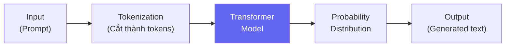
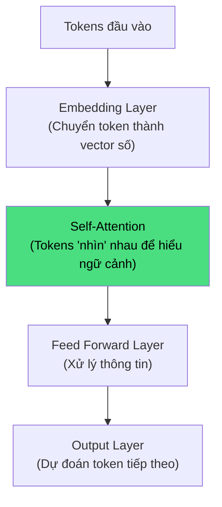
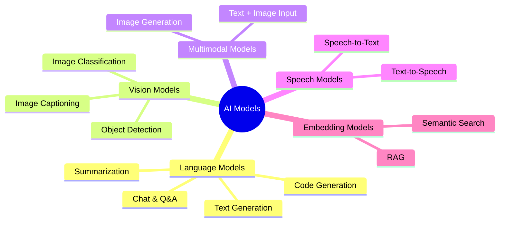
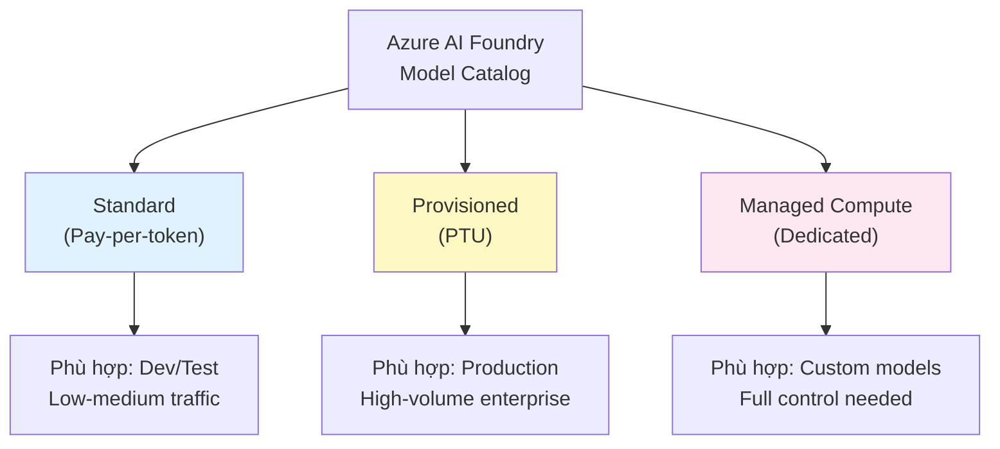

# AI Models — Hiểu Từ Gốc Rễ

## Agenda

**Thời gian đọc ước tính:** ~15 phút  
**Domain kỳ thi:** Domain 1B — chiếm ~10–15% toàn bài thi

### Sau bài này, bạn sẽ:
- ✅ **Giải thích** được Generative AI hoạt động thế nào (Transformer, token)
- ✅ **Phân loại** được model theo khả năng: text, vision, speech, multimodal
- ✅ **Chọn** đúng deployment option phù hợp với từng use case
- ✅ **Phân biệt** Standard vs PTU vs Managed Compute

### Yêu cầu đầu vào:
- 🔹 Đã đọc Bài 01 (Responsible AI)
- 🔹 Không cần Azure account cho bài này

---

## Vấn đề & Giải pháp

**Vấn đề:**
- AI tạo ra văn bản, hình ảnh, giọng nói — nhưng cơ chế bên trong là gì?
- Có hàng chục model trên Azure Model Catalog — chọn cái nào cho bài toán của mình?
- Deploy model lên production — Standard hay PTU? Tốn bao nhiêu?

**Giải pháp:** Hiểu rõ cách Generative AI hoạt động ở mức conceptual, biết phân loại model theo task, và biết khi nào dùng deployment option nào.

---

## Generative AI Hoạt Động Thế Nào?

**Định nghĩa:** Generative AI là nhóm model AI có khả năng **tạo ra nội dung mới** (văn bản, ảnh, âm thanh, code) dựa trên dữ liệu đã học và input từ người dùng.



### Tokenization — Đơn Vị Xử Lý Cơ Bản

**Token** là đơn vị văn bản nhỏ nhất mà model xử lý — có thể là 1 từ, 1 phần từ, hoặc 1 ký tự.

```
Câu: "Hello, world!"
Tokens: ["Hello", ",", " world", "!"]  → 4 tokens

Câu: "unhappiness"
Tokens: ["un", "happiness"]  → 2 tokens (subword tokenization)
```

:::note Tại sao token quan trọng với AI-901?
Billing của Azure AI = tính theo token (input tokens + output tokens). Hiểu token giúp bạn ước tính chi phí và hiểu tại sao context window có giới hạn.
:::

### Transformer Architecture — Tim Của Generative AI



**Self-Attention** là cơ chế then chốt: mỗi token "chú ý" đến các token khác để hiểu ngữ cảnh.

Ví dụ: Trong câu *"The animal didn't cross the street because **it** was too tired"* → self-attention giúp model hiểu "it" = "animal", không phải "street".

### Context Window

**Context window** = số token tối đa model có thể "nhớ" trong một lần xử lý.

| Model | Context Window |
|---|---|
| GPT-4o | 128,000 tokens (~96,000 từ) |
| GPT-4o-mini | 128,000 tokens |
| Phi-4 | 16,384 tokens |

:::warning Giới hạn quan trọng
Khi hội thoại dài hơn context window → model "quên" phần đầu. Đây là lý do chatbot đôi khi "quên" điều bạn nói ở đầu cuộc hội thoại.
:::

---

## Phân Loại Model Theo Khả Năng



### Chọn Model Theo Use Case

| Bạn cần làm gì? | Loại Model | Model Azure đề xuất |
|---|---|---|
| Chat, Q&A, viết lách | Language / Chat | GPT-4o, GPT-4o-mini |
| Phân tích code | Code | GPT-4o, Phi-4 |
| Phân tích ảnh, hiểu hình | Multimodal (vision) | GPT-4o (multimodal) |
| Tạo ảnh | Image Generation | DALL-E 3 |
| Nhận dạng giọng nói | Speech (STT) | Azure Whisper |
| Đọc văn bản thành giọng | Speech (TTS) | Azure Neural TTS |
| Tìm kiếm ngữ nghĩa | Embedding | text-embedding-3-large |
| App nhẹ, chi phí thấp | Small Language Model | Phi-4, Phi-3.5-mini |

:::tip Phi-4 — Lựa Chọn Cho Lab Tiết Kiệm
Microsoft Phi-4 là Small Language Model (SLM) mạnh, chi phí rẻ hơn ~15x so với GPT-4o. Phù hợp cho học tập và demo. Nhiều bài lab trong chuỗi này sẽ dùng Phi-4 để tiết kiệm credit.
:::

---

## Deployment Options Trong Microsoft Foundry

Khi deploy model trên Azure AI Foundry, có **3 nhóm chính**:



### Option 1: Standard — Pay Per Token

**Cơ chế:** Trả tiền theo số token xử lý (input + output).

```
Chi phí = (Input tokens × giá input) + (Output tokens × giá output)

Ví dụ GPT-4o (tháng 5/2026):
  Input: $2.50 / 1M tokens
  Output: $10.00 / 1M tokens

Một chat session ~500 tokens → ~$0.006
```

**Khi nào dùng:**
- ✅ Phát triển, testing, prototype
- ✅ Traffic không đều (burst traffic)
- ✅ Không cần SLA guarantee

**Routing options:**
- **Global** — tự động chọn datacenter có sẵn nhất (best availability, variable latency)
- **Data Zone** — chỉ xử lý trong zone chỉ định (US hoặc EU) — compliance
- **Regional** — chỉ xử lý trong region cụ thể (ví dụ East US)

### Option 2: Provisioned — PTU (Provisioned Throughput Units)

**Cơ chế:** Mua trước một lượng capacity cố định (PTU), thanh toán theo giờ bất kể dùng bao nhiêu.

```
PTU = đơn vị đo lường throughput (tokens/phút)
Billing = số PTU × giá/giờ (không phụ thuộc lượng call thực tế)
```

**Khi nào dùng:**
- ✅ Production với traffic cao và đều
- ✅ Cần latency ổn định, predictable
- ✅ Enterprise workload với SLA requirement
- ❌ Không nên dùng cho dev/test (lãng phí nếu idle)

:::warning Khi vượt PTU capacity
API trả về `HTTP 429 Too Many Requests`. Cần implement retry logic hoặc fallback sang Standard deployment.
:::

### Option 3: Managed Compute — Dedicated Endpoint

**Cơ chế:** Thuê hẳn compute (VM/GPU) để host model, trả tiền theo thời gian chạy.

**Khi nào dùng:**
- ✅ Custom model (fine-tuned, Hugging Face)
- ✅ Cần full control over runtime
- ✅ Partner models (NVIDIA NIMs, Cohere...)
- ❌ Không phù hợp với Azure managed models (GPT-4o, etc.)

### So Sánh 3 Options

| Tiêu Chí | Standard | Provisioned (PTU) | Managed Compute |
|---|---|---|---|
| **Billing** | Pay-per-token | Reserved capacity | Compute uptime |
| **Throughput** | Best effort | Guaranteed | Dedicated |
| **Latency** | Variable | Consistent | Predictable |
| **Use case** | Dev/Test, low-medium | Production, high-volume | Custom models |
| **Setup complexity** | Thấp | Trung bình | Cao |
| **Phù hợp AI-901 lab** | ✅ Nhất | ❌ Quá đắt để học | ❌ Phức tạp |

---

## Configuration Parameters Quan Trọng

Khi gọi model, có các tham số ảnh hưởng đến output:

| Tham Số | Mô Tả | Giá Trị |
|---|---|---|
| `temperature` | Độ sáng tạo/ngẫu nhiên | 0.0 (deterministic) → 2.0 (very random) |
| `max_tokens` | Giới hạn output token | Số nguyên dương |
| `top_p` | Nucleus sampling — kiểm soát diversity | 0.0 → 1.0 |
| `system_message` | Instruction cho model về role và behavior | String |

```python
# filename: chat_config_example.py

response = client.chat.completions.create(
    model="gpt-4o",
    messages=[
        # System message định nghĩa "tính cách" của model
        {"role": "system", "content": "You are a helpful Vietnamese AI tutor."},
        {"role": "user", "content": "Giải thích token là gì?"}
    ],
    # temperature=0 → output luôn nhất quán (tốt cho tasks cần chính xác)
    temperature=0,
    # Giới hạn output để tiết kiệm cost
    max_tokens=500
)
```

:::tip Trade-off Temperature
- `temperature = 0` → Deterministic, phù hợp cho: code generation, Q&A, fact extraction
- `temperature = 0.7–1.0` → Creative, phù hợp cho: creative writing, brainstorming
- `temperature > 1.5` → Rất random, ít dùng trong production
:::

---

## Practice Questions

:::note Câu 1
**Scenario:** Một startup cần deploy GPT-4o cho chatbot demo, traffic không đều (~100 requests/ngày). Deployment option nào phù hợp nhất?

**A.** Managed Compute  
**B.** Provisioned (PTU)  
**C.** Standard (Pay-per-token) ✅  
**D.** Developer Tier

**Giải thích:** Traffic thấp và không đều → Standard (pay-per-token) là hiệu quả nhất về chi phí. PTU lãng phí khi idle.
:::

:::note Câu 2
**Scenario:** Bạn cần model AI cho ứng dụng phân tích ảnh y tế VÀ trả lời câu hỏi về ảnh đó. Loại model nào phù hợp?

**A.** Language Model  
**B.** Speech Model  
**C.** Multimodal Model ✅  
**D.** Embedding Model

**Giải thích:** Phân tích ảnh + trả lời câu hỏi → cần model xử lý được cả image và text → Multimodal (GPT-4o vision).
:::

:::note Câu 3
**Scenario:** Bạn muốn dùng một fine-tuned model từ Hugging Face trong Azure AI Foundry. Deployment option nào bắt buộc phải dùng?

**A.** Standard Global  
**B.** Provisioned PTU  
**C.** Managed Compute ✅  
**D.** Standard Regional

**Giải thích:** Custom/Hugging Face models chỉ có thể deploy qua Managed Compute — đây là option duy nhất hỗ trợ custom runtime.
:::

---

## Câu Hỏi Thảo Luận

> **"Nếu temperature = 0 cho ra output hoàn toàn deterministic, tại sao không phải lúc nào cũng dùng temperature = 0?"**
>
> Trade-off: Deterministic tốt cho accuracy nhưng xấu cho creativity. Một AI viết blog với temperature = 0 sẽ tạo ra nội dung nhàm chán, lặp lại cấu trúc. Creative tasks cần một mức randomness nhất định để output đa dạng và tự nhiên hơn.

---

## Resources

- [Azure AI Foundry Model Catalog](https://ai.azure.com/explore/models)
- [Deployment Types Documentation](https://learn.microsoft.com/en-us/azure/ai-services/openai/how-to/deployment-types)
- [PTU Guide](https://learn.microsoft.com/en-us/azure/ai-services/openai/concepts/provisioned-throughput)

---

*Made by Anh Tu - Share to be shared*
