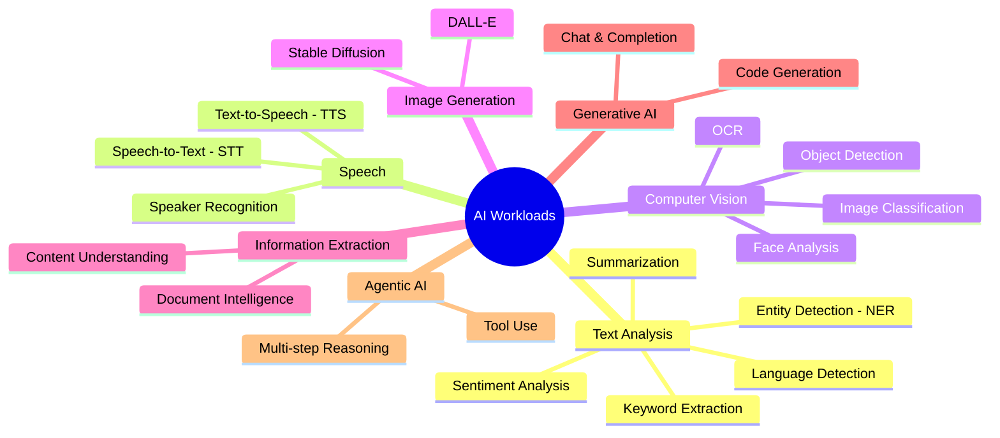
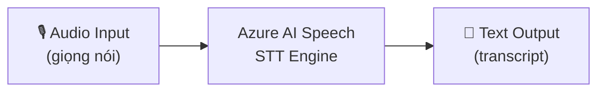
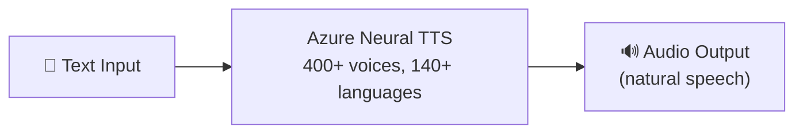
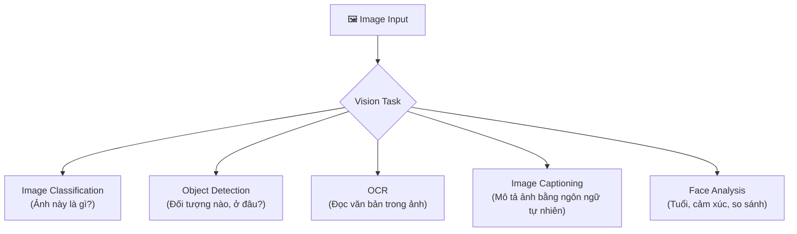
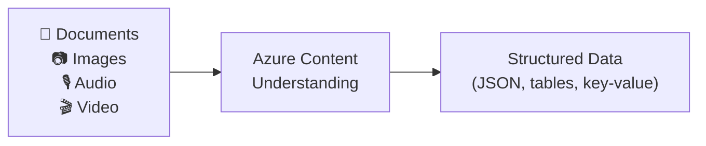
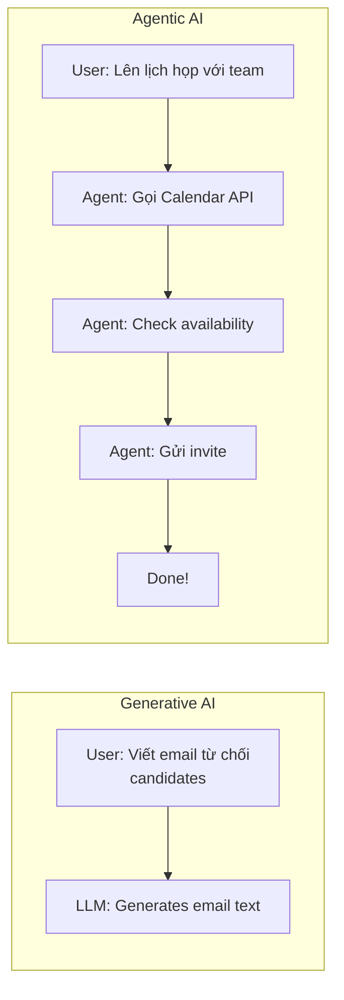

# AI Workloads — Bức Tranh Toàn Cảnh

## Agenda

**Thời gian đọc ước tính:** ~18 phút  
**Domain kỳ thi:** Domain 1C — chiếm ~15–20% toàn bài thi

### Sau bài này, bạn sẽ:
- ✅ **Phân biệt** được các loại AI workload và khi nào dùng cái nào
- ✅ **Mô tả** được các kỹ thuật Text Analysis: NER, Sentiment, KPE, Summarization
- ✅ **Giải thích** được Speech AI, Computer Vision, Information Extraction
- ✅ **Phân biệt** Generative AI vs Agentic AI

### Yêu cầu đầu vào:
- 🔹 Đã đọc Bài 02 (AI Models)
- 🔹 Không cần Azure account cho bài này

---

## Vấn đề & Giải pháp

**Vấn đề:**
- AI có thể làm rất nhiều thứ — nhưng mỗi loại bài toán cần một loại AI khác nhau
- Kỳ thi AI-901 hỏi: "Scenario này nên dùng AI workload gì?"
- Dễ nhầm giữa các khái niệm: NER vs Sentiment, STT vs TTS, Computer Vision vs Image Generation

**Giải pháp:** Bài này "giải phẫu" từng workload theo cùng một template: Là gì → Làm gì → Ví dụ → Azure service nào.

---

## Bức Tranh Toàn Cảnh AI Workloads



---

## Text Analysis

**Định nghĩa:** Text Analysis là nhóm kỹ thuật xử lý ngôn ngữ tự nhiên (NLP) để **rút trích ý nghĩa và thông tin có cấu trúc từ văn bản phi cấu trúc**.

Azure service: **Azure AI Language** (trong Foundry Tools)

### 1. Named Entity Recognition (NER) — Nhận Diện Thực Thể

**NER** phát hiện và phân loại các thực thể có tên trong văn bản (người, địa điểm, tổ chức, thời gian, tiền tệ...).

```
Input: "Nguyễn Văn A làm việc tại Microsoft Việt Nam ở Hà Nội từ năm 2020."

Output NER:
  "Nguyễn Văn A"   → Person
  "Microsoft Việt Nam" → Organization
  "Hà Nội"         → Location
  "năm 2020"        → DateTime
```

**Use cases:** Tự động tag bài báo, trích xuất thông tin từ hợp đồng, phân tích email.

### 2. Sentiment Analysis — Phân Tích Cảm Xúc

**Sentiment Analysis** xác định cảm xúc tổng thể của văn bản: Positive, Negative, Neutral, hoặc Mixed.

```
Input: "Sản phẩm tốt nhưng giao hàng rất chậm."

Output:
  Document sentiment: Mixed (0.35)
  Sentence 1: "Sản phẩm tốt"      → Positive (0.89)
  Sentence 2: "giao hàng rất chậm" → Negative (0.92)
```

:::note Aspect-Based Sentiment
Azure AI Language còn hỗ trợ **Opinion Mining** — phân tích sentiment theo từng khía cạnh cụ thể (aspect). Ví dụ: "food: positive, service: negative".
:::

**Use cases:** Phân tích review sản phẩm, giám sát social media, đo satisfaction khách hàng.

### 3. Key Phrase Extraction (KPE) — Rút Trích Từ Khóa

**KPE** xác định các cụm từ/khái niệm quan trọng nhất trong văn bản.

```
Input: "Azure AI Foundry cung cấp nền tảng unified để xây dựng
        các giải pháp AI enterprise với tính năng bảo mật cao."

Output Key Phrases:
  - "Azure AI Foundry"
  - "nền tảng unified"
  - "giải pháp AI enterprise"
  - "tính năng bảo mật cao"
```

**Use cases:** Tóm tắt topic của document, tạo tag tự động, search engine optimization.

### 4. Summarization — Tóm Tắt

**Summarization** rút gọn văn bản dài thành bản tóm tắt ngắn gọn.

| Loại | Mô Tả | Dùng Khi |
|---|---|---|
| **Extractive** | Chọn ra những câu quan trọng nhất trong văn bản gốc | Cần giữ nguyên từ ngữ gốc |
| **Abstractive** | Tạo ra văn bản tóm tắt mới (paraphrase) | Cần tóm tắt tự nhiên hơn |

**Use cases:** Tóm tắt báo cáo, tóm tắt cuộc họp, tóm tắt tài liệu pháp lý.

### 5. Language Detection — Nhận Dạng Ngôn Ngữ

Tự động phát hiện ngôn ngữ của văn bản + độ tin cậy.

```
Input: "こんにちは世界"
Output: Japanese (ja) — confidence: 0.99
```

### Tổng Hợp Text Analysis

| Kỹ Thuật | Câu Hỏi Cốt Lõi | Từ Khóa Nhận Ra |
|---|---|---|
| NER | Ai, cái gì, ở đâu, khi nào trong văn bản? | entities, extract, identify |
| Sentiment | Cảm xúc là gì? | positive, negative, opinion |
| KPE | Văn bản nói về chủ đề gì? | topics, keywords, main concepts |
| Summarization | Văn bản nói gì ngắn gọn? | condense, abstract, shorten |

---

## Speech AI

**Định nghĩa:** Speech AI là nhóm kỹ thuật xử lý **âm thanh giọng nói** — chuyển đổi qua lại giữa giọng nói và văn bản, hoặc nhận dạng người nói.

Azure service: **Azure AI Speech** (trong Foundry Tools)

### Speech-to-Text (STT) — Nhận Dạng Giọng Nói

Chuyển đổi audio giọng nói → văn bản.



**Tính năng nâng cao:**
- **Real-time transcription** — phiên âm trực tiếp trong cuộc gọi
- **Batch transcription** — xử lý file audio hàng loạt
- **Custom acoustic model** — fine-tune cho accent/domain cụ thể
- **Speaker diarization** — phân biệt "Ai nói gì" trong cuộc họp nhiều người

**Use cases:** Phụ đề tự động, ghi chép cuộc họp, voice command, call center analytics.

### Text-to-Speech (TTS) — Tổng Hợp Giọng Nói

Chuyển đổi văn bản → giọng nói tổng hợp.



**Tính năng:**
- **Neural voices** — giọng tự nhiên, ngữ điệu phù hợp ngữ cảnh
- **Custom voice** — tạo giọng nói theo thương hiệu riêng
- **SSML support** — điều chỉnh pitch, speed, pause bằng XML markup

**Use cases:** Audiobook, trợ lý ảo, navigation, accessibility cho người khiếm thị.

### Multimodal Speech (AI-901 mới)

AI-901 thêm khái niệm: **Respond to spoken prompts using a deployed multimodal model**

```
User nói: "Phân tích bức ảnh này" (audio)
         + gửi kèm file ảnh
→ GPT-4o multimodal nhận cả audio + image → trả lời
```

---

## Computer Vision

**Định nghĩa:** Computer Vision là nhóm kỹ thuật cho phép máy tính **hiểu và xử lý nội dung hình ảnh/video** — phân tích, phân loại, phát hiện đối tượng, đọc văn bản.

Azure services: **Azure AI Vision**, **GPT-4o (multimodal)**

### Các Tác Vụ Chính



| Tác Vụ | Mô Tả | Ví Dụ |
|---|---|---|
| **Image Classification** | Phân loại ảnh vào category | Ảnh này là chó, mèo hay xe? |
| **Object Detection** | Phát hiện + xác định vị trí (bounding box) | Xe ở tọa độ (x, y, w, h) |
| **OCR (Optical Character Recognition)** | Đọc văn bản từ ảnh, scan | Đọc hóa đơn, biển số xe |
| **Image Captioning** | Mô tả nội dung ảnh bằng ngôn ngữ tự nhiên | "Một người đàn ông đang đi xe đạp" |
| **Semantic Segmentation** | Phân loại từng pixel | Xe vs đường vs bầu trời |

### Image Generation

**Image Generation** tạo ra ảnh mới từ text prompt.

```
Prompt: "A futuristic city in Vietnam at sunset, digital art style"
→ DALL-E 3 generates: [ảnh được tạo ra]
```

Azure service: **Azure OpenAI DALL-E 3** (qua Foundry)

**Use cases:** Marketing content, game assets, product visualization, prototyping UI.

---

## Information Extraction

**Định nghĩa:** Information Extraction là kỹ thuật **tự động trích xuất dữ liệu có cấu trúc từ tài liệu phi cấu trúc** — PDF, hình ảnh, audio, video.

Azure service: **Azure Content Understanding** (mới trong AI-901)



### Các Use Case Chính

| Source | Extract What | Ví Dụ |
|---|---|---|
| **Documents / Forms** | Key-value pairs, tables | Trích xuất thông tin từ hóa đơn, hợp đồng |
| **Images** | Text, objects, data | Đọc biển số xe, scan passport |
| **Audio** | Transcript, entities, topics | Ghi chép cuộc họp, phân tích call center |
| **Video** | Scenes, objects, transcript | Tìm kiếm nội dung trong video dài |

:::note Content Understanding vs Document Intelligence
**Azure Document Intelligence** (trước đây là Form Recognizer) xử lý forms và documents.
**Azure Content Understanding** là service mới hơn, unified — xử lý được cả docs, images, audio, video trong một API.
AI-901 test **Content Understanding**.
:::

---

## Generative AI vs Agentic AI

Hai concept quan trọng và hay bị nhầm:



| Đặc Điểm | Generative AI | Agentic AI |
|---|---|---|
| **Cách hoạt động** | Input → một lần generate → output | Lập kế hoạch → nhiều bước → dùng tool → hoàn thành |
| **Tools** | Không dùng external tools | Gọi APIs, search web, chạy code |
| **Tự chủ** | Thấp (cần human prompt mỗi bước) | Cao (tự quyết định bước tiếp theo) |
| **Ví dụ** | ChatGPT viết bài | Agent đặt vé máy bay tự động |
| **Azure service** | Azure OpenAI completions | Azure AI Agent Service |

:::tip Nhớ cho thi
**Generative AI** = tạo ra content (text, image, audio)  
**Agentic AI** = thực hiện task nhiều bước, dùng tools, có mục tiêu rõ ràng
:::

---

## Tổng Hợp — Chọn Workload Đúng

| Scenario | Workload | Azure Service |
|---|---|---|
| Đọc cảm xúc review sản phẩm | Sentiment Analysis | Azure AI Language |
| Tìm tên người/công ty trong hợp đồng | NER | Azure AI Language |
| Rút gọn báo cáo 50 trang | Summarization | Azure AI Language |
| Phụ đề tự động cho video | Speech-to-Text | Azure AI Speech |
| Đọc hóa đơn PDF | Information Extraction | Azure Content Understanding |
| Nhận diện biển số xe | OCR / Computer Vision | Azure AI Vision |
| Tạo ảnh marketing từ mô tả | Image Generation | Azure OpenAI DALL-E |
| Chatbot trả lời câu hỏi | Generative AI | Azure OpenAI / Foundry |
| Bot đặt hàng tự động | Agentic AI | Azure AI Agent Service |

---

## Practice Questions

:::note Câu 1
**Scenario:** Công ty muốn tự động phân tích 10,000 email khách hàng để biết họ hài lòng hay không hài lòng về dịch vụ. Workload nào phù hợp?

**A.** Named Entity Recognition  
**B.** Sentiment Analysis ✅  
**C.** Key Phrase Extraction  
**D.** Image Classification

**Giải thích:** Hài lòng/không hài lòng = cảm xúc → Sentiment Analysis.
:::

:::note Câu 2
**Scenario:** Một ứng dụng cần tự động đọc và trích xuất thông tin từ hóa đơn PDF (tên người mua, tổng tiền, ngày). Workload nào phù hợp nhất?

**A.** Summarization  
**B.** Named Entity Recognition  
**C.** Information Extraction ✅  
**D.** Key Phrase Extraction

**Giải thích:** Trích xuất key-value từ documents có cấu trúc (forms, invoices) → Information Extraction / Azure Content Understanding. NER phát hiện entities trong free text — nhưng không phù hợp với structured forms.
:::

:::note Câu 3
**Scenario:** Bạn cần xây dựng AI assistant có thể tìm kiếm web, đọc email, và tự động đặt lịch họp. Loại AI workload nào phù hợp nhất?

**A.** Generative AI  
**B.** Computer Vision  
**C.** Agentic AI ✅  
**D.** Speech AI

**Giải thích:** Task nhiều bước, dùng tools (web search, email, calendar API) → Agentic AI. Generative AI đơn thuần chỉ generate content, không thực hiện action.
:::

---

## Câu Hỏi Thảo Luận

> **"Khi nào Extractive Summarization tốt hơn Abstractive Summarization?"**
>
> Trade-off quan trọng: **Extractive** giữ nguyên từ ngữ gốc → phù hợp khi accuracy và tính pháp lý quan trọng (hợp đồng, y tế, pháp luật). **Abstractive** tạo ra văn bản mới tự nhiên hơn → phù hợp cho người đọc phổ thông. Rủi ro của Abstractive: model có thể "hallucinate" — thêm thông tin không có trong văn bản gốc.

---

## Resources

- [Azure AI Language](https://learn.microsoft.com/en-us/azure/ai-services/language-service/)
- [Azure AI Speech](https://learn.microsoft.com/en-us/azure/ai-services/speech-service/)
- [Azure AI Vision](https://learn.microsoft.com/en-us/azure/ai-services/computer-vision/)
- [Azure Content Understanding](https://learn.microsoft.com/en-us/azure/ai-services/content-understanding/)

---

*Made by Anh Tu - Share to be shared*
