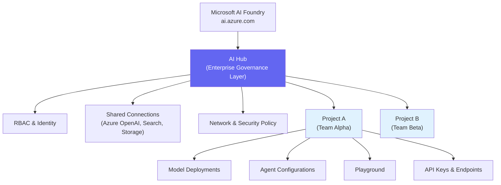
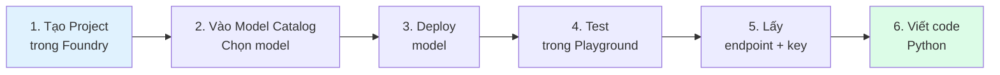
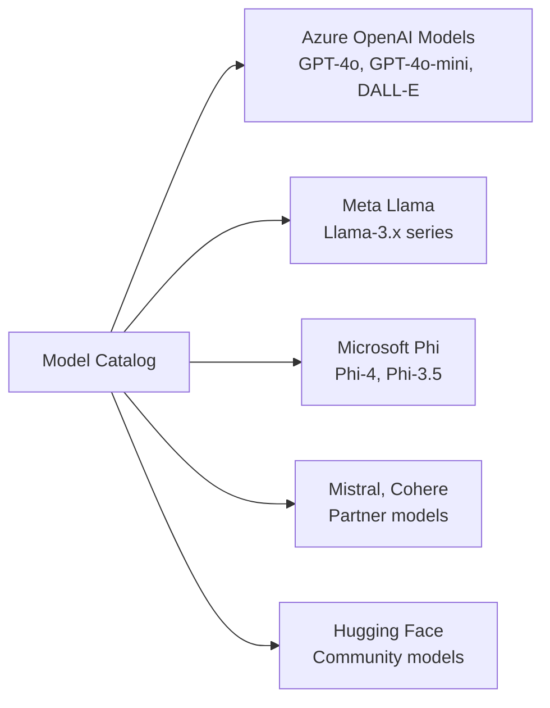

# Microsoft Foundry Portal — Tổng Quan

## Agenda

**Thời gian đọc ước tính:** ~15 phút  
**Domain kỳ thi:** Domain 2A — chiếm ~15–20% toàn bài thi

### Sau bài này, bạn sẽ:
- ✅ **Giải thích** được kiến trúc Hub & Project của Microsoft Foundry
- ✅ **Thực hiện** được flow: tạo Project → Deploy model → Test trong Playground
- ✅ **Lấy** được API endpoint + key để dùng trong code Python
- ✅ **Biết** cách access Foundry khi hết Azure free tier

### Yêu cầu đầu vào:
- 🔹 Đã đọc Bài 02 (AI Models — hiểu deployment options)
- 🔹 Azure account (hoặc Microsoft Learn Sandbox)

---

## Vấn đề & Giải pháp

**Vấn đề:**
- Muốn dùng GPT-4o → phải tự manage Azure OpenAI resource, endpoint, key, region, quota...
- Mỗi Azure AI service có portal riêng → phân tán, khó quản lý
- Thiếu môi trường thử nghiệm nhanh trước khi viết code

**Giải pháp:** Microsoft AI Foundry là **nền tảng unified** — một nơi để discover, deploy, test và build tất cả AI solutions trên Azure. Thay thế Azure AI Studio cũ.

---

## Kiến Trúc Foundry: Hub & Project

**Định nghĩa:** Microsoft AI Foundry tổ chức resources theo mô hình **Hub → Project**, trong đó Hub là lớp quản trị enterprise và Project là workspace làm việc thực tế.



### AI Hub — Lớp Quản Trị

**Hub** là "trung tâm điều hành" cho toàn bộ AI platform của một tổ chức:

| Chức Năng | Mô Tả |
|---|---|
| **RBAC** | Phân quyền: ai được làm gì |
| **Shared Connections** | Kết nối Azure OpenAI, AI Search, Storage Account dùng chung |
| **Networking** | Private endpoint, VNet integration |
| **Billing & Quota** | Quản lý budget và quota cho các team |

### Project — Workspace Làm Việc

**Project** là nơi developer thực sự làm việc:

| Chức Năng | Mô Tả |
|---|---|
| **Model Deployments** | Deploy và manage các model |
| **Playground** | Test model trực tiếp |
| **Agents** | Tạo và test AI agents |
| **Evaluation** | Đánh giá chất lượng model |
| **API Keys** | Lấy endpoint + key cho code |

:::tip Với AI-901 learning
Bạn chỉ cần tạo **1 Project** và làm mọi thứ trong đó. Hub thường được IT/DevOps setup sẵn trong enterprise — với mục đích học tập, không cần quan tâm Hub quá nhiều.
:::

---

## Flow Thực Tế: Từ Portal Đến Code



### Bước 1: Truy Cập Foundry

- **URL:** [ai.azure.com](https://ai.azure.com)
- **Đăng nhập:** Microsoft account (cần Azure subscription)
- **Free tier hết:** Dùng Microsoft Learn Sandbox → vẫn có Foundry portal access

### Bước 2: Tạo Project

```
1. Vào ai.azure.com
2. Click "New project"
3. Điền tên project (e.g., "ai901-practice")
4. Chọn Hub hoặc tạo Hub mới
5. Click "Create"
```

:::note Tạo lần đầu
Nếu chưa có Hub, Foundry sẽ hỏi tạo mới. Chọn region gần nhất (East US thường có quota tốt nhất).
:::

### Bước 3: Khám Phá Model Catalog

Model Catalog là nơi tập hợp 1,000+ models:



**Filter theo task:**
- Chat & Completion
- Embeddings
- Image Generation
- Audio & Speech

### Bước 4: Deploy Model

```
1. Chọn model (e.g., "gpt-4o-mini")
2. Click "Deploy"
3. Chọn deployment type: Standard (Global)
4. Đặt tên deployment: "gpt-4o-mini-deployment"
5. Click "Deploy"
6. Chờ status: Succeeded ✅
```

:::tip Chọn model cho học tập
- `gpt-4o-mini` → rẻ nhất, đủ mạnh cho hầu hết lab
- `Phi-4` → Microsoft Phi, rất rẻ, tốt cho coding tasks
- `text-embedding-3-small` → cho embedding/RAG labs
:::

### Bước 5: Test Trong Playground

Sau khi deploy, Playground cho phép test ngay mà không cần viết code:

```
System Message:
  "You are a helpful AI assistant that answers in Vietnamese."

User Message:
  "Giải thích AI là gì theo cách đơn giản nhất?"

→ Model response xuất hiện ngay lập tức
```

**Trong Playground, bạn có thể:**
- Chỉnh System Message (behavior của model)
- Điều chỉnh Temperature, Max Tokens
- Xem token count và cost estimate
- Click **"View Code"** → lấy code mẫu Python/REST

### Bước 6: Lấy Endpoint & Key

Sau khi deploy model, lấy thông tin để dùng trong code:

```
Project → Settings → Connections
  → Azure OpenAI endpoint: https://xxx.openai.azure.com/
  → API Key: xxxxxxxxxxxxxxxxxxxxxxxxxxxxxxxx
  → Deployment name: "gpt-4o-mini-deployment"
```

:::danger Bảo Mật API Key
Không bao giờ commit API key vào Git. Luôn dùng `.env` file và `.gitignore`. Key bị lộ → người khác dùng account của bạn, mất tiền.
:::

---

## Foundry SDK Overview

Foundry cung cấp SDK để tương tác từ code:

```python
# Cài đặt (chạy trong terminal)
# pip install azure-ai-inference azure-identity

# filename: foundry_hello.py
import os
from azure.ai.inference import ChatCompletionsClient
from azure.ai.inference.models import SystemMessage, UserMessage
from azure.core.credentials import AzureKeyCredential

# Endpoint và key lấy từ Foundry portal
endpoint = os.environ["AZURE_AI_ENDPOINT"]
key = os.environ["AZURE_AI_KEY"]

client = ChatCompletionsClient(
    endpoint=endpoint,
    credential=AzureKeyCredential(key)
)

response = client.complete(
    messages=[
        # System message: định nghĩa "tính cách" và nhiệm vụ của model
        SystemMessage("You are an AI tutor explaining concepts in Vietnamese."),
        UserMessage("Token trong AI là gì?")
    ],
    model="gpt-4o-mini-deployment",  # tên deployment, không phải tên model
    temperature=0.7,
    max_tokens=500
)

print(response.choices[0].message.content)
```

:::tip Foundry SDK vs Azure OpenAI SDK
AI-901 dùng **`azure-ai-inference`** (Foundry SDK mới) thay vì `openai` package cũ. Foundry SDK hỗ trợ nhiều model hơn (không chỉ OpenAI) và là hướng đi Microsoft khuyến nghị từ 2025.
:::

---

## Khi Hết Azure Free Tier

| Tình Huống | Giải Pháp |
|---|---|
| Hết 15 ngày free | Microsoft Learn Sandbox: vào module trên learn.microsoft.com → "Activate sandbox" |
| Muốn dùng Foundry UI | ai.azure.com vẫn access được (nhưng cần subscription để deploy) |
| Cần test code Python | Dùng Groq API (free) với openai-compatible endpoint |
| Là sinh viên | Đăng ký Azure for Students (email trường) → $100 credit/năm |

**Workaround với Groq (miễn phí):**

```python
# Groq API tương thích với OpenAI SDK
# pip install groq

from groq import Groq

# Lấy free API key tại: console.groq.com
client = Groq(api_key=os.environ["GROQ_API_KEY"])

response = client.chat.completions.create(
    # Llama 3.3 70B — mạnh tương đương GPT-4o, miễn phí
    model="llama-3.3-70b-versatile",
    messages=[
        {"role": "system", "content": "You are a helpful AI tutor."},
        {"role": "user", "content": "Token trong AI là gì?"}
    ]
)
print(response.choices[0].message.content)
```

---

## Practice Questions

:::note Câu 1
**Scenario:** Một team muốn nhiều developer cùng dùng Azure OpenAI resource, với mỗi developer có workspace riêng nhưng chia sẻ chung billing. Cấu trúc Foundry nào phù hợp?

**A.** Tạo nhiều Hub, mỗi developer một Hub  
**B.** Một Hub, nhiều Projects — mỗi developer một Project ✅  
**C.** Một Project dùng chung cho cả team  
**D.** Mỗi developer tạo Azure OpenAI resource riêng

**Giải thích:** Hub quản lý shared resources (billing, quota, security). Mỗi developer có Project riêng để có workspace cách ly nhưng vẫn inherit cấu hình từ Hub.
:::

:::note Câu 2
**Scenario:** Developer muốn test nhanh system prompt mới mà không cần viết code. Tính năng Foundry nào phù hợp?

**A.** Model Catalog  
**B.** Playground ✅  
**C.** Evaluations  
**D.** SDK

**Giải thích:** Playground = UI để test model trực tiếp, chỉnh parameters và system message mà không cần code.
:::

---

## Resources

- [Microsoft AI Foundry Portal](https://ai.azure.com)
- [Foundry Documentation](https://learn.microsoft.com/en-us/azure/ai-foundry/)
- [azure-ai-inference SDK](https://learn.microsoft.com/en-us/python/api/overview/azure/ai-inference-readme)
- [Groq API (free alternative)](https://console.groq.com)

---

*Made by Anh Tu - Share to be shared*
