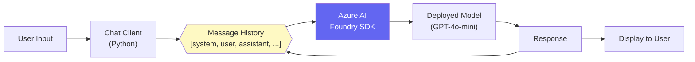

# Build Chat App với Foundry SDK

## Agenda

**Thời gian đọc ước tính:** ~20 phút  
**Domain kỳ thi:** Domain 2A — "Create a lightweight chat client application by using the Foundry SDK"

### Sau bài này, bạn sẽ:
- ✅ **Viết** được chat client app hoàn chỉnh bằng Python + Foundry SDK
- ✅ **Hiểu** vai trò của system prompt, user message, và assistant message
- ✅ **Implement** được streaming và chat history
- ✅ **Chạy** được lab với cả Azure và Groq (free alternative)

### Yêu cầu đầu vào:
- 🔹 Python ≥ 3.10 đã cài
- 🔹 Đã đọc Bài 04 (Foundry Portal)
- 🔹 Azure account **hoặc** Groq free API key

---

## Vấn đề & Giải pháp

**Vấn đề:**
- Gọi model trong Playground thì được, nhưng tích hợp vào application thật thì làm thế nào?
- Chat multi-turn cần "nhớ" lịch sử hội thoại — không phải gửi 1 tin nhắn đơn lẻ

**Giải pháp:** Azure AI Inference SDK cung cấp `ChatCompletionsClient` để build chat app với đầy đủ: system prompt, conversation history, streaming, và error handling.

---

## Kiến Trúc Chat App



**Key insight:** Multi-turn chat hoạt động bằng cách gửi **toàn bộ lịch sử hội thoại** lên API với mỗi request — model không "nhớ" gì, nó chỉ thấy những gì bạn gửi.

---

## Lab Setup

### Cài đặt dependencies

```bash
# Tạo virtual environment
python -m venv .venv
source .venv/bin/activate  # Mac/Linux
# .venv\Scripts\activate    # Windows

# Cài Foundry SDK
pip install azure-ai-inference python-dotenv
```

### Tạo file .env

```bash
# filename: .env
# Lấy từ Foundry portal → Project → Settings → Connections

# Azure track (dùng khi còn free tier)
AZURE_AI_ENDPOINT=https://your-project.openai.azure.com/
AZURE_AI_KEY=your-api-key-here
AZURE_AI_DEPLOYMENT=gpt-4o-mini-deployment

# Free track — Groq (dùng khi hết free tier)
GROQ_API_KEY=your-groq-key-here
```

:::danger
Thêm `.env` vào `.gitignore` ngay! Không commit key lên Git.
```bash
echo ".env" >> .gitignore
```
:::

---

## Lab 1: Chat Client Cơ Bản

```python
# filename: chat_basic.py

import os
from dotenv import load_dotenv
from azure.ai.inference import ChatCompletionsClient
from azure.ai.inference.models import SystemMessage, UserMessage
from azure.core.credentials import AzureKeyCredential

load_dotenv()

def create_client():
    """Khởi tạo client kết nối với Foundry endpoint."""
    return ChatCompletionsClient(
        endpoint=os.environ["AZURE_AI_ENDPOINT"],
        credential=AzureKeyCredential(os.environ["AZURE_AI_KEY"])
    )

def chat(client, user_input: str, system_prompt: str = "You are a helpful assistant."):
    """Gửi message đơn lẻ và nhận response."""
    response = client.complete(
        messages=[
            # System message: thiết lập "tính cách" và ngữ cảnh cho model
            SystemMessage(system_prompt),
            # User message: câu hỏi/yêu cầu của người dùng
            UserMessage(user_input)
        ],
        model=os.environ["AZURE_AI_DEPLOYMENT"],
        temperature=0.7,
        max_tokens=800
    )
    # Lấy nội dung từ response object
    return response.choices[0].message.content

if __name__ == "__main__":
    client = create_client()
    answer = chat(
        client,
        user_input="Giải thích context window trong LLM là gì?",
        system_prompt="Bạn là giảng viên AI, giải thích bằng tiếng Việt đơn giản."
    )
    print(answer)
```

**Chạy thử:**
```bash
python chat_basic.py
```

**Output mong đợi:**
```
Context window là giới hạn số lượng token mà model có thể "nhìn thấy" 
và xử lý trong một lần. Hãy tưởng tượng như một tờ giấy ghi chú có 
chiều dài cố định — model chỉ đọc được phần nằm trên tờ giấy đó...
```

---

## Lab 2: Multi-Turn Chat với History

```python
# filename: chat_multiturn.py

import os
from dotenv import load_dotenv
from azure.ai.inference import ChatCompletionsClient
from azure.ai.inference.models import (
    SystemMessage,
    UserMessage,
    AssistantMessage  # Lưu response của model vào history
)
from azure.core.credentials import AzureKeyCredential

load_dotenv()

class ChatSession:
    """
    Quản lý hội thoại multi-turn.
    Mỗi lần gửi request, toàn bộ history được gửi kèm
    → model "nhớ" được context của cuộc trò chuyện.
    """

    def __init__(self, system_prompt: str):
        self.client = ChatCompletionsClient(
            endpoint=os.environ["AZURE_AI_ENDPOINT"],
            credential=AzureKeyCredential(os.environ["AZURE_AI_KEY"])
        )
        self.model = os.environ["AZURE_AI_DEPLOYMENT"]

        # Khởi tạo history với system message
        self.history = [SystemMessage(system_prompt)]

    def send(self, user_input: str) -> str:
        """Gửi tin nhắn và cập nhật history."""
        # Thêm message mới của user vào history
        self.history.append(UserMessage(user_input))

        response = self.client.complete(
            messages=self.history,  # Gửi TOÀN BỘ history
            model=self.model,
            temperature=0.7,
            max_tokens=800
        )

        assistant_reply = response.choices[0].message.content

        # Lưu response của assistant vào history để lần sau model "nhớ"
        self.history.append(AssistantMessage(assistant_reply))

        return assistant_reply


if __name__ == "__main__":
    session = ChatSession(
        system_prompt="Bạn là trợ lý học tập AI-901, trả lời bằng tiếng Việt."
    )

    # Hội thoại multi-turn
    print("Bạn:", "Fairness trong Responsible AI là gì?")
    print("AI:", session.send("Fairness trong Responsible AI là gì?"))
    print()

    # Lần này model nhớ ngữ cảnh từ câu trước
    print("Bạn:", "Cho tôi một ví dụ thực tế về vi phạm nguyên tắc đó?")
    print("AI:", session.send("Cho tôi một ví dụ thực tế về vi phạm nguyên tắc đó?"))
```

---

## Lab 3: Streaming Response

Streaming hiển thị kết quả từng từ một (như ChatGPT), thay vì chờ toàn bộ response:

```python
# filename: chat_streaming.py

import os
from dotenv import load_dotenv
from azure.ai.inference import ChatCompletionsClient
from azure.ai.inference.models import SystemMessage, UserMessage
from azure.core.credentials import AzureKeyCredential

load_dotenv()

def stream_chat(user_input: str):
    client = ChatCompletionsClient(
        endpoint=os.environ["AZURE_AI_ENDPOINT"],
        credential=AzureKeyCredential(os.environ["AZURE_AI_KEY"])
    )

    # stream=True → nhận về generator thay vì full response
    stream = client.complete(
        messages=[
            SystemMessage("You are a helpful assistant."),
            UserMessage(user_input)
        ],
        model=os.environ["AZURE_AI_DEPLOYMENT"],
        stream=True  # Kích hoạt streaming
    )

    print("AI: ", end="", flush=True)
    for chunk in stream:
        if chunk.choices and chunk.choices[0].delta.content:
            # In từng chunk ra màn hình ngay lập tức
            print(chunk.choices[0].delta.content, end="", flush=True)
    print()  # Xuống dòng sau khi xong


if __name__ == "__main__":
    stream_chat("Giải thích 3 loại AI workload phổ biến nhất.")
```

---

## Free Track: Dùng Groq Thay Azure

Khi hết Azure free tier, Groq cung cấp API miễn phí tương thích với OpenAI SDK:

```python
# filename: chat_groq.py
# pip install groq python-dotenv

import os
from dotenv import load_dotenv
from groq import Groq

load_dotenv()

class ChatSessionGroq:
    """Phiên bản dùng Groq (free) thay Azure."""

    def __init__(self, system_prompt: str):
        # Groq API key: lấy miễn phí tại console.groq.com
        self.client = Groq(api_key=os.environ["GROQ_API_KEY"])
        # Llama 3.3 70B: mạnh tương đương GPT-4o, miễn phí trên Groq
        self.model = "llama-3.3-70b-versatile"
        self.history = [{"role": "system", "content": system_prompt}]

    def send(self, user_input: str) -> str:
        self.history.append({"role": "user", "content": user_input})

        response = self.client.chat.completions.create(
            model=self.model,
            messages=self.history
        )

        reply = response.choices[0].message.content
        self.history.append({"role": "assistant", "content": reply})
        return reply


if __name__ == "__main__":
    session = ChatSessionGroq("Bạn là AI tutor, trả lời bằng tiếng Việt.")
    print(session.send("Giải thích AI-901 là gì?"))
```

---

## Prompt Engineering Cơ Bản Cho AI-901

AI-901 kiểm tra khả năng viết **effective system và user prompts**:

| Loại Prompt | Mục Đích | Ví Dụ |
|---|---|---|
| **System Prompt** | Thiết lập role, tone, giới hạn | "Bạn là AI hỗ trợ học tập. Chỉ trả lời về AI/ML. Từ chối các câu hỏi ngoài chủ đề." |
| **User Prompt** | Câu hỏi/yêu cầu cụ thể | "Giải thích NER bằng ví dụ thực tế" |
| **Few-shot Prompt** | Cho ví dụ mẫu để model theo | "Phân loại cảm xúc:\nInput: 'Tôi rất thích sản phẩm này!' → Positive\nInput: 'Giao hàng chậm quá.' → ?" |

**System Prompt Best Practices:**
```
1. Khai báo role rõ ràng: "You are..."
2. Định nghĩa output format: "Answer in JSON format"
3. Đặt giới hạn: "Only answer questions about Azure AI"
4. Chỉ định ngôn ngữ: "Always respond in Vietnamese"
5. Xử lý edge case: "If you don't know, say 'I don't know'"
```

---

## Practice Questions

:::note Câu 1
**Scenario:** Bạn đang build chatbot multi-turn. Sau mỗi request, model "quên" context của cuộc hội thoại trước. Nguyên nhân là gì?

**A.** Model bị lỗi  
**B.** Temperature quá cao  
**C.** Không gửi message history vào mỗi API call ✅  
**D.** Context window quá nhỏ

**Giải thích:** LLM là stateless — nó không nhớ gì giữa các requests. Multi-turn hoạt động bằng cách gửi toàn bộ history `[system, user, assistant, user, ...]` vào mỗi API call.
:::

:::note Câu 2
**Scenario:** Bạn muốn chatbot luôn trả lời theo format JSON và chỉ trả lời về Azure AI. Nên đặt instruction này ở đâu?

**A.** User message  
**B.** System message ✅  
**C.** Max tokens parameter  
**D.** Temperature parameter

**Giải thích:** System message là nơi định nghĩa behavior, format, và giới hạn của model. User message là nơi người dùng đặt câu hỏi cụ thể.
:::

---

## Câu Hỏi Thảo Luận

> **"Tại sao multi-turn chat lại tốn nhiều token hơn single-turn?"**
>
> Vì mỗi request phải gửi kèm toàn bộ history. Cuộc hội thoại 10 lượt × 200 tokens/lượt = 2000 tokens chỉ để "tải lại ký ức" cho model. Đây là trade-off giữa **context (nhớ lịch sử) và cost (tốn token)**. Giải pháp: implement "sliding window" — chỉ giữ N messages gần nhất trong history.

---

## Resources

- [azure-ai-inference Python SDK](https://learn.microsoft.com/en-us/python/api/azure-ai-inference/)
- [Chat Completions Quickstart](https://learn.microsoft.com/en-us/azure/ai-services/openai/chatgpt-quickstart)
- [Groq Free API](https://console.groq.com) — Free alternative
- [Prompt Engineering Guide](https://learn.microsoft.com/en-us/azure/ai-services/openai/concepts/prompt-engineering)

---

*Made by Anh Tu - Share to be shared*
