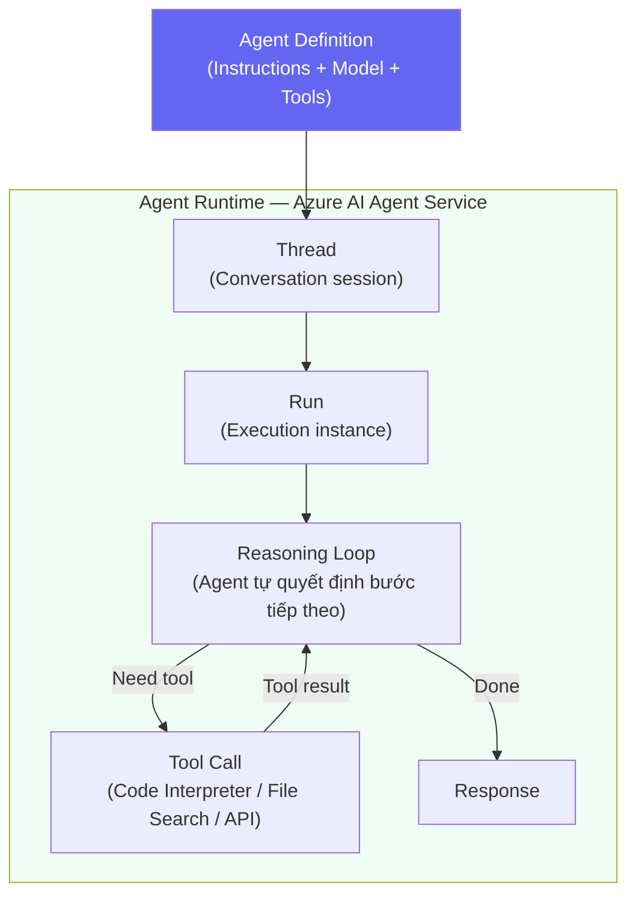
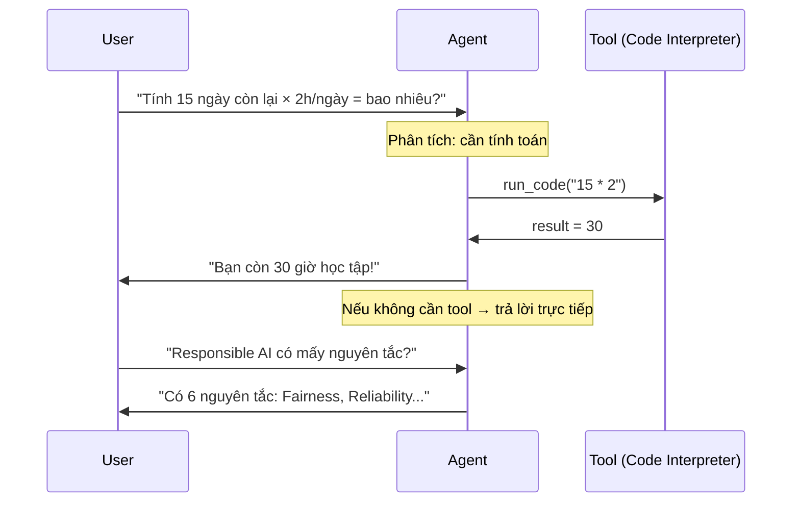

# Build Single AI Agent

## Agenda

**Thời gian đọc ước tính:** ~20 phút  
**Domain kỳ thi:** Domain 2A — "Create and test a single-agent solution in the Foundry portal" + "Create a lightweight client application for an agent"

### Sau bài này, bạn sẽ:
- ✅ **Giải thích** được 4 thành phần cốt lõi của AI Agent (Agent, Thread, Run, Tools)
- ✅ **Tạo** được agent trong Foundry portal
- ✅ **Viết** được Python client để tương tác với agent
- ✅ **Phân biệt** Agent Service vs ChatCompletions API

### Yêu cầu đầu vào:
- 🔹 Đã đọc Bài 05 (Build Chat App)
- 🔹 Azure account (hoặc Microsoft Learn Sandbox)

---

## Vấn đề & Giải pháp

**Vấn đề:**
- Chat App (Bài 05) chỉ generate text — không thể thực hiện action (search web, chạy code, đọc file)
- Mỗi request là stateless — không có "session" thật sự, phải tự quản lý history
- Muốn build assistant có thể: "Tính toán, tóm tắt file PDF, search knowledge base"

**Giải pháp:** **Azure AI Agent Service** cung cấp runtime stateful cho agent — quản lý thread (conversation history), kết nối tools, và thực hiện reasoning loop tự động.

---

## AI Agent Anatomy

**Định nghĩa:** AI Agent là hệ thống AI có khả năng **nhận mục tiêu, lập kế hoạch, sử dụng tools, và thực hiện nhiều bước tự chủ** để đạt được mục tiêu đó.



### 4 Thành Phần Cốt Lõi

| Thành Phần | Định Nghĩa | Tương tự |
|---|---|---|
| **Agent** | Định nghĩa: model + instructions + tools | "Cấu hình nhân viên" |
| **Thread** | Session hội thoại có lịch sử | "Cuộc trò chuyện" |
| **Run** | Một lần thực thi agent trên thread | "Lần agent trả lời" |
| **Tools** | Khả năng mở rộng: Code Interpreter, File Search, APIs | "Công cụ của nhân viên" |

:::note So sánh với Chat App
| | Chat App (Bài 05) | AI Agent |
|---|---|---|
| State | Stateless (bạn tự quản lý history) | Stateful (Thread tự quản lý) |
| Tools | Không có | Code Interpreter, File Search, APIs |
| Reasoning | Single step | Multi-step (tự lập kế hoạch) |
| Use case | Q&A, generate text | Automate tasks, agentic workflows |
:::

---

## Tạo Agent Trong Foundry Portal

### Bước 1: Vào Agents

```
ai.azure.com → Chọn Project → "Build" → "Agents" → "New Agent"
```

### Bước 2: Cấu Hình Agent

```yaml
Name: "AI-901 Study Assistant"

Model: gpt-4o-mini-deployment

Instructions: |
  Bạn là trợ lý học tập giúp người dùng ôn thi AI-901.
  Chỉ trả lời về Azure AI và AI fundamentals.
  Khi không chắc chắn, hãy nói "Tôi không chắc, vui lòng kiểm tra tài liệu chính thức."
  Luôn trả lời bằng tiếng Việt.

Tools:
  - Code Interpreter: ON  (để tính toán, phân tích data)
  - File Search: OFF      (sẽ bật ở Bài 07)
```

### Bước 3: Test Trong Playground

```
User: "Tính xem nếu mỗi ngày học 2 giờ, 4 tuần sẽ học được bao nhiêu giờ?"

Agent (với Code Interpreter):
  [Thinking: Cần tính toán → gọi Code Interpreter]
  [Code run: 2 * 7 * 4 = 56]
  "Bạn sẽ học được 56 giờ trong 4 tuần!"
```

---

## Python Client Cho Agent

### Setup

```bash
pip install azure-ai-projects azure-identity python-dotenv
```

```bash
# filename: .env
# Lấy từ Foundry portal → Project → Settings → Overview
AZURE_PROJECT_ENDPOINT=https://your-project.services.ai.azure.com/
```

### Lab: Agent Client Cơ Bản

```python
# filename: agent_client.py

import os
import time
from dotenv import load_dotenv
from azure.ai.projects import AIProjectClient
from azure.identity import DefaultAzureCredential

load_dotenv()

def create_agent_client():
    """Khởi tạo project client dùng Azure credential."""
    return AIProjectClient(
        endpoint=os.environ["AZURE_PROJECT_ENDPOINT"],
        # DefaultAzureCredential tự động detect: Azure CLI, env vars, managed identity
        credential=DefaultAzureCredential()
    )

def run_agent_session(client, agent_id: str, user_message: str) -> str:
    """
    Tạo thread mới, gửi message, chạy agent, và lấy response.
    Mỗi lần gọi function này = một lần tương tác với agent.
    """
    with client:
        agents = client.agents

        # Thread = session hội thoại
        # Tạo thread mới cho mỗi cuộc hội thoại
        thread = agents.threads.create()

        # Thêm message của user vào thread
        agents.threads.messages.create(
            thread_id=thread.id,
            role="user",
            content=user_message
        )

        # Tạo Run — agent bắt đầu xử lý
        run = agents.threads.runs.create(
            thread_id=thread.id,
            agent_id=agent_id
        )

        # Polling: chờ Run hoàn thành
        # Agent có thể mất nhiều bước (gọi tools) trước khi trả lời
        while run.status in ["queued", "in_progress", "requires_action"]:
            time.sleep(1)
            run = agents.threads.runs.get(
                thread_id=thread.id,
                run_id=run.id
            )

        if run.status != "completed":
            raise RuntimeError(f"Run failed with status: {run.status}")

        # Lấy messages từ thread — message cuối cùng của assistant là response
        messages = agents.threads.messages.list(thread_id=thread.id)
        for msg in messages:
            if msg.role == "assistant":
                return msg.content[0].text.value

        return "No response generated"


if __name__ == "__main__":
    client = create_agent_client()

    # Thay bằng Agent ID lấy từ Foundry portal
    AGENT_ID = "asst_xxxxxxxxxxxxxxxxxxxxxxxx"

    response = run_agent_session(
        client=client,
        agent_id=AGENT_ID,
        user_message="6 nguyên tắc Responsible AI của Microsoft là gì?"
    )
    print("Agent:", response)
```

### Lab: Multi-Turn Agent Session

```python
# filename: agent_multiturn.py

import os
import time
from dotenv import load_dotenv
from azure.ai.projects import AIProjectClient
from azure.identity import DefaultAzureCredential

load_dotenv()

class AgentSession:
    """
    Quản lý hội thoại multi-turn với AI Agent.
    Khác với ChatSession (Bài 05): Thread được tạo một lần,
    Agent Service tự quản lý history — không cần tự lưu history.
    """

    def __init__(self, agent_id: str):
        self.client = AIProjectClient(
            endpoint=os.environ["AZURE_PROJECT_ENDPOINT"],
            credential=DefaultAzureCredential()
        )
        self.agent_id = agent_id
        # Tạo thread một lần duy nhất cho toàn bộ session
        self.thread = self.client.agents.threads.create()
        print(f"Session started. Thread ID: {self.thread.id}")

    def chat(self, user_input: str) -> str:
        """Gửi message và nhận response từ agent."""
        agents = self.client.agents

        # Thêm message vào thread hiện tại (không tạo thread mới)
        agents.threads.messages.create(
            thread_id=self.thread.id,
            role="user",
            content=user_input
        )

        # Mỗi lần chat = tạo một Run mới trên cùng thread
        run = agents.threads.runs.create(
            thread_id=self.thread.id,
            agent_id=self.agent_id
        )

        # Chờ run hoàn thành
        while run.status in ["queued", "in_progress"]:
            time.sleep(1)
            run = agents.threads.runs.get(self.thread.id, run.id)

        # Lấy response mới nhất
        messages = agents.threads.messages.list(thread_id=self.thread.id)
        for msg in messages:
            if msg.role == "assistant":
                return msg.content[0].text.value
        return ""

    def close(self):
        """Dọn dẹp thread khi xong."""
        self.client.agents.threads.delete(self.thread.id)
        self.client.close()


if __name__ == "__main__":
    session = AgentSession(agent_id="asst_xxxxxxxxxxxxxxxxxxxxxxxx")

    print("Bạn:", "NER là gì?")
    print("Agent:", session.chat("NER là gì?"))
    print()

    # Agent nhớ context từ câu trước nhờ Thread
    print("Bạn:", "Cho tôi một ví dụ sử dụng nó trong thực tế?")
    print("Agent:", session.chat("Cho tôi một ví dụ sử dụng nó trong thực tế?"))

    session.close()
```

---

## Agent Reasoning Loop (Cách Agent Suy Nghĩ)



:::tip Điểm khác biệt với ChatCompletions
ChatCompletions = bạn gọi API → model trả lời → xong.  
Agent Service = model **tự quyết định** khi nào gọi tool, gọi tool gì, xử lý kết quả, rồi mới trả lời. Toàn bộ reasoning loop này diễn ra tự động phía server.
:::

---

## Practice Questions

:::note Câu 1
**Scenario:** Developer muốn tạo AI assistant có thể nhớ context suốt một phiên làm việc dài (nhiều câu hỏi). Cần tạo mấy Thread?

**A.** Một Thread cho mỗi câu hỏi  
**B.** Một Thread cho toàn bộ phiên ✅  
**C.** Không cần Thread — dùng Agent trực tiếp  
**D.** Một Thread cho mỗi tool call

**Giải thích:** Thread = session conversation. Một Thread duy trì context của toàn bộ phiên. Mỗi câu hỏi mới là một Run mới trên **cùng** Thread.
:::

:::note Câu 2
**Scenario:** Khi nào AI Agent cần thực hiện nhiều Run steps thay vì trả lời ngay?

**A.** Khi câu hỏi quá dài  
**B.** Khi agent cần gọi tools để hoàn thành task ✅  
**C.** Khi temperature quá thấp  
**D.** Khi context window đầy

**Giải thích:** Agent thực hiện nhiều steps khi nó quyết định cần gọi tool (Code Interpreter, File Search, API). Sau khi tool trả kết quả, agent tiếp tục reasoning → có thể gọi tool khác hoặc trả lời.
:::

---

## Câu Hỏi Thảo Luận

> **"Agent Service và việc tự implement chat loop có history — cái nào nên dùng trong production?"**
>
> Trade-off rõ ràng: **Tự implement** (Bài 05) cho phép full control, portable (không vendor lock-in), phù hợp khi chỉ cần text generation đơn giản. **Agent Service** tốt hơn khi cần tools, stateful conversation, và enterprise features (audit logs, monitoring). Cho AI-901, hiểu cả hai — nhưng kỳ thi test Agent Service nhiều hơn.

---

## Resources

- [Azure AI Agent Service Quickstart](https://learn.microsoft.com/en-us/azure/ai-services/agents/quickstart)
- [azure-ai-projects SDK](https://learn.microsoft.com/en-us/python/api/overview/azure/ai-projects-readme)
- [Agents Overview](https://learn.microsoft.com/en-us/azure/ai-services/agents/overview)

---

*Made by Anh Tu - Share to be shared*
