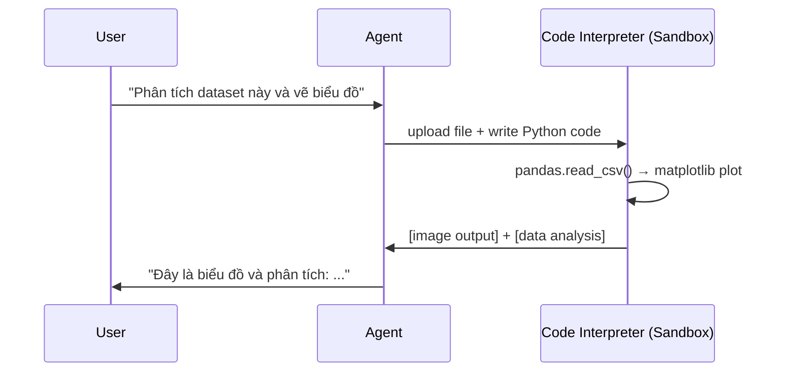
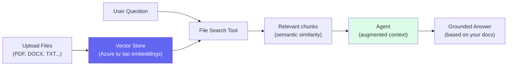

# Agent Tools — Code Interpreter & File Search

## Agenda

**Thời gian đọc ước tính:** ~18 phút  
**Domain kỳ thi:** Domain 2A — Tools là phần quan trọng nhất của Agentic AI

### Sau bài này, bạn sẽ:
- ✅ **Attach** được Code Interpreter và File Search vào agent
- ✅ **Hiểu** Code Interpreter hoạt động thế nào (sandbox execution)
- ✅ **Hiểu** File Search = managed RAG pipeline
- ✅ **Viết** Python code để agent tự động chọn và dùng tools

### Yêu cầu đầu vào:
- 🔹 Đã đọc Bài 06 (Build Agent — hiểu Agent/Thread/Run)
- 🔹 Azure account để lab

---

## Vấn đề & Giải pháp

**Vấn đề:**
- Agent chỉ có LLM brain → không thể tính toán chính xác, không thể đọc file
- LLM "hallucinate" khi tính toán số học phức tạp
- Muốn agent trả lời dựa trên tài liệu nội bộ (không phải kiến thức training)

**Giải pháp:** Tools mở rộng khả năng agent:
- **Code Interpreter** → chạy Python thật trong sandbox, kết quả chính xác 100%
- **File Search** → tự động build RAG từ file upload, agent search theo ngữ nghĩa

---

## Tool 1: Code Interpreter

**Định nghĩa:** Code Interpreter là tool cho phép agent **tự viết và chạy Python code** trong môi trường sandbox an toàn, xử lý kết quả, và dùng kết quả đó trong response.



**Capabilities:**
- Chạy Python code (pandas, numpy, matplotlib, scikit-learn...)
- Xử lý file đầu vào (CSV, Excel, JSON, PDF, images...)
- Generate output (charts, processed files, calculations)
- Self-correct: nếu code lỗi, agent tự debug và chạy lại

### Attach Code Interpreter Trong Portal

```
Foundry Portal → Project → Agents → [Chọn agent]
→ Tools → Code Interpreter → Toggle ON
```

### Attach Code Interpreter Bằng Python

```python
# filename: agent_code_interpreter.py

import os
from dotenv import load_dotenv
from azure.ai.projects import AIProjectClient
from azure.ai.projects.models import CodeInterpreterTool
from azure.identity import DefaultAzureCredential

load_dotenv()

client = AIProjectClient(
    endpoint=os.environ["AZURE_PROJECT_ENDPOINT"],
    credential=DefaultAzureCredential()
)

with client:
    # Tạo agent với Code Interpreter tool
    agent = client.agents.create_agent(
        model="gpt-4o-mini-deployment",
        name="Math & Data Agent",
        instructions="""
            Bạn là AI assistant chuyên phân tích dữ liệu và tính toán.
            Khi cần tính toán hoặc phân tích data, luôn dùng Code Interpreter.
            Không bao giờ tự tính toán trong đầu — để tránh sai số.
        """,
        # Khai báo tools agent được phép dùng
        tools=[CodeInterpreterTool()]
    )

    # Tạo thread
    thread = client.agents.threads.create()

    # Gửi yêu cầu tính toán
    client.agents.threads.messages.create(
        thread_id=thread.id,
        role="user",
        content="Tính tổng của dãy số từ 1 đến 100 và cho tôi biết giá trị trung bình."
    )

    # Chạy agent
    run = client.agents.threads.runs.create_and_process(
        thread_id=thread.id,
        agent_id=agent.id
    )

    # Lấy response
    messages = client.agents.threads.messages.list(thread_id=thread.id)
    for msg in messages:
        if msg.role == "assistant":
            print("Agent:", msg.content[0].text.value)
            break
```

**Output mong đợi:**
```
Agent: Tôi đã tính toán:
- Tổng từ 1 đến 100 = 5050
- Giá trị trung bình = 50.5

(Code đã chạy: sum(range(1, 101)) = 5050, mean = 5050/100 = 50.5)
```

:::tip Khi nào Code Interpreter tỏa sáng nhất?
- Tính toán số học phức tạp (LLM hay sai)
- Phân tích file CSV/Excel
- Tạo biểu đồ từ data
- Xử lý string phức tạp (regex, parsing)
:::

---

## Tool 2: File Search (Managed RAG)

**Định nghĩa:** File Search là tool cho phép agent **tìm kiếm ngữ nghĩa trong tập tài liệu** mà bạn upload, tự động xây dựng RAG (Retrieval-Augmented Generation) pipeline mà không cần setup vector database.



**Điều File Search làm tự động:**
1. Chunk documents thành đoạn nhỏ
2. Tạo embeddings cho mỗi chunk
3. Lưu vào Vector Store
4. Khi user hỏi → tìm chunks phù hợp nhất (cosine similarity)
5. Đưa vào context của agent

### Attach File Search Trong Portal

```
Foundry Portal → Agents → [Agent] → Tools → File Search → Toggle ON
→ "+ Add files" → Upload PDF/DOCX/TXT
→ Foundry tự tạo Vector Store và index
```

### Attach File Search Bằng Python

```python
# filename: agent_file_search.py

import os
from dotenv import load_dotenv
from azure.ai.projects import AIProjectClient
from azure.ai.projects.models import FileSearchTool, VectorStoreDataSource
from azure.identity import DefaultAzureCredential

load_dotenv()

client = AIProjectClient(
    endpoint=os.environ["AZURE_PROJECT_ENDPOINT"],
    credential=DefaultAzureCredential()
)

with client:
    # Bước 1: Upload file lên Vector Store
    # Ví dụ: upload tài liệu Responsible AI
    with open("responsible_ai_guide.pdf", "rb") as f:
        uploaded_file = client.agents.upload_file_and_poll(
            file=f,
            purpose="assistants"
        )

    # Bước 2: Tạo Vector Store từ file
    vector_store = client.agents.create_vector_store_and_poll(
        file_ids=[uploaded_file.id],
        name="AI-901 Study Materials"
    )

    # Bước 3: Tạo agent với File Search tool
    agent = client.agents.create_agent(
        model="gpt-4o-mini-deployment",
        name="AI-901 Knowledge Agent",
        instructions="""
            Bạn là trợ lý học tập AI-901.
            Luôn tìm kiếm trong tài liệu được cung cấp trước khi trả lời.
            Nếu không tìm thấy thông tin trong tài liệu, hãy nói rõ điều đó.
        """,
        tools=[FileSearchTool(vector_store_ids=[vector_store.id])]
    )

    # Bước 4: Test agent
    thread = client.agents.threads.create()
    client.agents.threads.messages.create(
        thread_id=thread.id,
        role="user",
        content="Nguyên tắc Transparency trong Responsible AI là gì?"
    )

    run = client.agents.threads.runs.create_and_process(
        thread_id=thread.id,
        agent_id=agent.id
    )

    messages = client.agents.threads.messages.list(thread_id=thread.id)
    for msg in messages:
        if msg.role == "assistant":
            print("Agent:", msg.content[0].text.value)
            # Xem citations (nguồn từ file nào, trang mấy)
            for annotation in msg.content[0].text.annotations:
                print(f"Source: {annotation.file_citation.file_id}")
            break
```

---

## Kết Hợp Cả Hai Tools

Agent có thể dùng cả Code Interpreter VÀ File Search trong cùng một session:

```python
agent = client.agents.create_agent(
    model="gpt-4o-mini-deployment",
    name="Super Study Agent",
    instructions="Trả lời câu hỏi dựa trên tài liệu. Dùng code khi cần tính toán.",
    tools=[
        CodeInterpreterTool(),
        FileSearchTool(vector_store_ids=[vector_store.id])
    ]
)
```

**Ví dụ workflow:**
```
User: "Từ tài liệu, lấy số liệu về AI adoption rate và vẽ biểu đồ"

Agent:
  1. File Search → tìm "AI adoption rate" trong tài liệu → lấy data
  2. Code Interpreter → viết matplotlib code → vẽ biểu đồ
  3. Return: biểu đồ + phân tích
```

---

## So Sánh Hai Tools

| Tiêu Chí | Code Interpreter | File Search |
|---|---|---|
| **Làm gì** | Chạy Python code | Tìm kiếm trong tài liệu |
| **Phù hợp** | Tính toán, data analysis, charts | Q&A từ documents |
| **Input** | Prompt + optional file | Prompt + vector store |
| **Độ chính xác** | 100% (code chạy thật) | Phụ thuộc chunking & embedding |
| **Cost** | Tính theo compute time | Tính theo storage + retrieval |
| **AI-901 lab** | ✅ Bắt buộc biết | ✅ Bắt buộc biết |

---

## Practice Questions

:::note Câu 1
**Scenario:** Agent cần tính NPV (Net Present Value) từ bảng Excel 500 dòng với formula phức tạp. Tool nào phù hợp?

**A.** File Search  
**B.** Code Interpreter ✅  
**C.** Chỉ cần LLM, không cần tool  
**D.** Function Calling

**Giải thích:** Tính toán tài chính phức tạp từ file → Code Interpreter đọc Excel và chạy financial formula. LLM không nên tự tính vì dễ sai.
:::

:::note Câu 2
**Scenario:** Company muốn chatbot có thể trả lời câu hỏi về 1,000 trang tài liệu nội bộ (policy, handbook). Tool nào phù hợp nhất?

**A.** Code Interpreter  
**B.** File Search ✅  
**C.** Function Calling  
**D.** Không cần tool, dùng system prompt

**Giải thích:** Q&A từ large document corpus → File Search (RAG). 1,000 trang không thể nhét vào context window, cần retrieval.
:::

---

## Câu Hỏi Thảo Luận

> **"File Search dùng RAG — vậy tại sao không tự build RAG từ đầu thay vì dùng File Search?"**
>
> Trade-off: **Tự build RAG** cho full control (chunking strategy, embedding model, vector DB) nhưng tốn công setup và maintain. **File Search** (managed RAG) setup trong vài phút, không cần manage infrastructure, nhưng ít customization. Với AI-901, dùng File Search. Với production enterprise, thường tự build RAG với Azure AI Search để control quality.

---

## Resources

- [Code Interpreter Guide](https://learn.microsoft.com/en-us/azure/ai-services/agents/how-to/tools/code-interpreter)
- [File Search Guide](https://learn.microsoft.com/en-us/azure/ai-services/agents/how-to/tools/file-search)
- [Vector Stores](https://learn.microsoft.com/en-us/azure/ai-services/agents/how-to/tools/file-search#vector-stores)

---

*Made by Anh Tu - Share to be shared*
