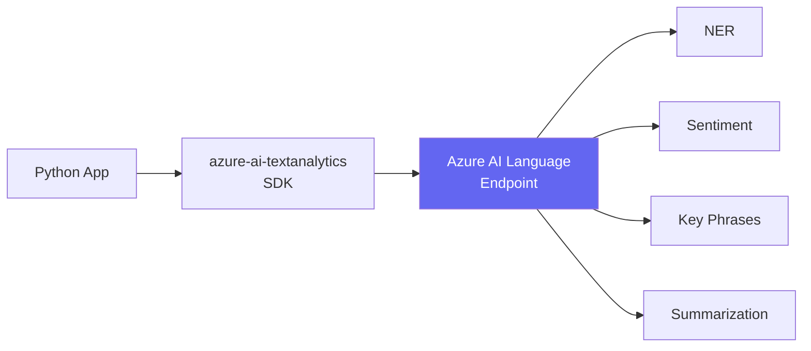

# Text Analysis với Azure AI Language

## Agenda

**Thời gian đọc ước tính:** ~15 phút  
**Domain kỳ thi:** Domain 2B — "Build a lightweight application that includes text analysis"

### Sau bài này, bạn sẽ:
- ✅ **Gọi** được Azure AI Language API bằng Python
- ✅ **Implement** được NER, Sentiment, KPE, Summarization trong một app
- ✅ **Chạy** được lab khi có và không có Azure subscription

### Yêu cầu đầu vào:
- 🔹 Đã đọc Bài 03 (AI Workloads — hiểu các kỹ thuật Text Analysis)
- 🔹 Azure account (hoặc dùng free alternative)

---

## Vấn đề & Giải pháp

**Vấn đề:** Hiểu lý thuyết NER, Sentiment... nhưng chưa biết implement thực tế như thế nào trong Python.

**Giải pháp:** `azure-ai-textanalytics` SDK cung cấp client đơn giản cho toàn bộ Azure AI Language features.

---

## Kiến Trúc



---

## Setup

```bash
pip install azure-ai-textanalytics python-dotenv
```

```bash
# filename: .env
# Lấy từ Azure Portal → Azure AI Language resource → Keys and Endpoint
AZURE_LANGUAGE_ENDPOINT=https://your-resource.cognitiveservices.azure.com/
AZURE_LANGUAGE_KEY=your-key-here
```

### Lấy Resource từ Foundry

```
Foundry Portal → Project → Settings → Connected Resources
→ "Azure AI services" → Copy Endpoint & Key
```

---

## Lab: Text Analysis App

```python
# filename: text_analysis_app.py

import os
from dotenv import load_dotenv
from azure.ai.textanalytics import TextAnalyticsClient
from azure.core.credentials import AzureKeyCredential

load_dotenv()

def create_client():
    return TextAnalyticsClient(
        endpoint=os.environ["AZURE_LANGUAGE_ENDPOINT"],
        credential=AzureKeyCredential(os.environ["AZURE_LANGUAGE_KEY"])
    )


def analyze_sentiment(client, texts: list[str]):
    """Phân tích cảm xúc: Positive / Negative / Neutral / Mixed."""
    results = client.analyze_sentiment(documents=texts)
    for i, doc in enumerate(results):
        print(f"\n[Sentiment] Text {i+1}:")
        print(f"  Overall: {doc.sentiment} (confidence: {doc.confidence_scores[doc.sentiment]:.2f})")
        for sentence in doc.sentences:
            print(f"  Sentence: '{sentence.text}' → {sentence.sentiment}")


def extract_named_entities(client, texts: list[str]):
    """Nhận diện thực thể: Person, Location, Organization, DateTime..."""
    results = client.recognize_entities(documents=texts)
    for i, doc in enumerate(results):
        print(f"\n[NER] Text {i+1}:")
        for entity in doc.entities:
            # Chỉ hiển thị entity có confidence cao
            if entity.confidence_score > 0.8:
                print(f"  '{entity.text}' → {entity.category} ({entity.confidence_score:.2f})")


def extract_key_phrases(client, texts: list[str]):
    """Rút trích từ khóa/chủ đề chính."""
    results = client.extract_key_phrases(documents=texts)
    for i, doc in enumerate(results):
        print(f"\n[Key Phrases] Text {i+1}:")
        print(f"  {', '.join(doc.key_phrases)}")


def summarize_text(client, texts: list[str]):
    """Tóm tắt văn bản (Extractive Summarization)."""
    # begin_* trả về poller — cần chờ vì summarization là async operation
    poller = client.begin_extract_summary(documents=texts)
    results = poller.result()
    for i, doc in enumerate(results):
        print(f"\n[Summary] Text {i+1}:")
        for sentence in doc.sentences:
            print(f"  {sentence.text}")


if __name__ == "__main__":
    client = create_client()

    # Dữ liệu mẫu: review sản phẩm
    sample_texts = [
        """Azure AI Foundry là nền tảng tuyệt vời của Microsoft, 
        cho phép developers xây dựng AI solutions dễ dàng.
        Tuy nhiên, chi phí đôi khi khá cao so với các alternatives khác.
        Team tại Hà Nội đã dùng nó từ tháng 1 năm 2025.""",

        """Tôi rất thất vọng với dịch vụ này. Giao hàng chậm 3 ngày
        và sản phẩm bị hỏng khi nhận. Customer service không phản hồi."""
    ]

    analyze_sentiment(client, sample_texts)
    extract_named_entities(client, sample_texts)
    extract_key_phrases(client, sample_texts)
    summarize_text(client, sample_texts)
```

**Output mong đợi:**
```
[Sentiment] Text 1:
  Overall: mixed (confidence: 0.71)
  Sentence: 'Azure AI Foundry là nền tảng tuyệt vời...' → positive
  Sentence: 'Tuy nhiên, chi phí đôi khi khá cao...' → negative

[NER] Text 1:
  'Azure AI Foundry' → Product (0.95)
  'Microsoft' → Organization (0.99)
  'Hà Nội' → Location (0.98)
  'tháng 1 năm 2025' → DateTime (0.92)

[Key Phrases] Text 1:
  Azure AI Foundry, nền tảng, Microsoft, developers, AI solutions, chi phí

[Summary] Text 1:
  Azure AI Foundry là nền tảng tuyệt vời của Microsoft, cho phép developers xây dựng AI solutions dễ dàng.
```

---

## Free Alternative: Dùng GPT-4o Thay Azure AI Language

Khi hết Azure free tier, có thể simulate Text Analysis bằng prompt engineering:

```python
# filename: text_analysis_groq.py
# Dùng Groq (free) để simulate text analysis tasks

from groq import Groq
import json

client = Groq(api_key=os.environ["GROQ_API_KEY"])

def groq_sentiment(text: str) -> dict:
    response = client.chat.completions.create(
        model="llama-3.3-70b-versatile",
        messages=[{
            "role": "system",
            "content": "Analyze sentiment. Return JSON: {sentiment: positive/negative/neutral/mixed, confidence: 0-1}"
        }, {
            "role": "user",
            "content": f"Analyze: {text}"
        }],
        response_format={"type": "json_object"}
    )
    return json.loads(response.choices[0].message.content)
```

:::warning Trade-off
Azure AI Language = purpose-built model, faster, cheaper per call, production-ready SLA.  
GPT-4o for NLP tasks = flexible nhưng đắt hơn, latency cao hơn. Chỉ dùng cho learning purposes.
:::

---

## Practice Questions

:::note Câu 1
**Scenario:** Bạn cần biết email khách hàng đề cập đến person, company, hay product nào. Service nào dùng?

**A.** Sentiment Analysis  
**B.** Named Entity Recognition ✅  
**C.** Key Phrase Extraction  
**D.** Summarization

**Giải thích:** NER phát hiện và phân loại thực thể (Person, Organization, Product...) trong văn bản.
:::

---

*Made by Anh Tu - Share to be shared*
