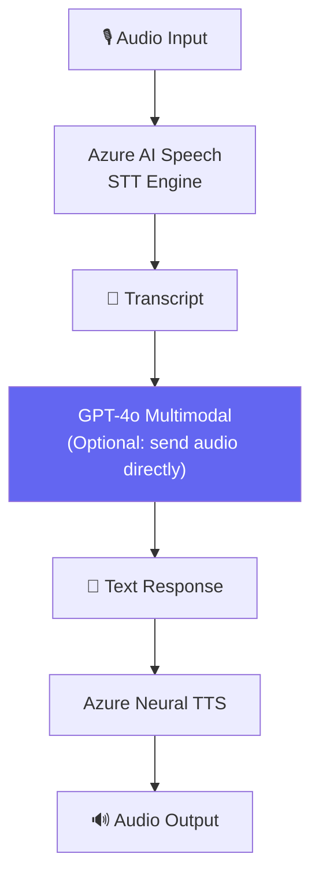

# Speech AI — STT, TTS & Multimodal

## Agenda

**Thời gian đọc ước tính:** ~15 phút  
**Domain kỳ thi:** Domain 2B — "Respond to spoken prompts by using a deployed multimodal model" + "Build a lightweight application by using Azure Speech in Foundry Tools"

### Sau bài này, bạn sẽ:
- ✅ **Implement** được Speech-to-Text (STT) bằng Azure Speech SDK
- ✅ **Implement** được Text-to-Speech (TTS)
- ✅ **Gửi** được spoken prompt tới multimodal model (GPT-4o)
- ✅ **Phân biệt** STT, TTS, và multimodal speech

### Yêu cầu đầu vào:
- 🔹 Đã đọc Bài 03 (AI Workloads — hiểu Speech concepts)
- 🔹 Azure account với Speech resource

---

## Vấn đề & Giải pháp

**Vấn đề:** Biết lý thuyết STT/TTS nhưng chưa biết implement. Kỳ thi AI-901 thêm mới: spoken prompt với multimodal model.

**Giải pháp:** Azure AI Speech SDK + GPT-4o multimodal audio capabilities.

---

## Kiến Trúc Speech AI



---

## Setup

```bash
pip install azure-cognitiveservices-speech azure-ai-inference python-dotenv
```

```bash
# filename: .env
AZURE_SPEECH_KEY=your-speech-key
AZURE_SPEECH_REGION=eastus
AZURE_AI_ENDPOINT=https://your-project.openai.azure.com/
AZURE_AI_KEY=your-ai-key
```

---

## Lab 1: Speech-to-Text (STT)

```python
# filename: speech_to_text.py

import os
import azure.cognitiveservices.speech as speechsdk
from dotenv import load_dotenv

load_dotenv()

def speech_to_text_from_mic() -> str:
    """Nhận dạng giọng nói từ microphone."""
    speech_config = speechsdk.SpeechConfig(
        subscription=os.environ["AZURE_SPEECH_KEY"],
        region=os.environ["AZURE_SPEECH_REGION"]
    )
    # Cấu hình ngôn ngữ nhận dạng
    speech_config.speech_recognition_language = "vi-VN"  # Tiếng Việt

    # Dùng mic mặc định của máy
    audio_config = speechsdk.audio.AudioConfig(use_default_microphone=True)

    recognizer = speechsdk.SpeechRecognizer(
        speech_config=speech_config,
        audio_config=audio_config
    )

    print("Đang nghe... Nói ngay!")
    result = recognizer.recognize_once_async().get()

    if result.reason == speechsdk.ResultReason.RecognizedSpeech:
        return result.text
    elif result.reason == speechsdk.ResultReason.NoMatch:
        return "Không nhận dạng được giọng nói"
    else:
        return f"Lỗi: {result.reason}"


def speech_to_text_from_file(audio_file: str) -> str:
    """Nhận dạng giọng nói từ file audio."""
    speech_config = speechsdk.SpeechConfig(
        subscription=os.environ["AZURE_SPEECH_KEY"],
        region=os.environ["AZURE_SPEECH_REGION"]
    )
    audio_config = speechsdk.audio.AudioConfig(filename=audio_file)

    recognizer = speechsdk.SpeechRecognizer(
        speech_config=speech_config,
        audio_config=audio_config
    )

    result = recognizer.recognize_once_async().get()
    return result.text if result.reason == speechsdk.ResultReason.RecognizedSpeech else ""


if __name__ == "__main__":
    # Test từ microphone
    text = speech_to_text_from_mic()
    print(f"Bạn nói: {text}")
```

---

## Lab 2: Text-to-Speech (TTS)

```python
# filename: text_to_speech.py

import os
import azure.cognitiveservices.speech as speechsdk
from dotenv import load_dotenv

load_dotenv()

def text_to_speech(text: str, output_file: str = None):
    """Chuyển văn bản thành giọng nói."""
    speech_config = speechsdk.SpeechConfig(
        subscription=os.environ["AZURE_SPEECH_KEY"],
        region=os.environ["AZURE_SPEECH_REGION"]
    )

    # Chọn voice: Azure có 400+ neural voices
    # Xem danh sách: https://aka.ms/speech/voices
    speech_config.speech_synthesis_voice_name = "vi-VN-NamMinhNeural"  # Giọng nam Việt Nam

    if output_file:
        # Lưu ra file audio
        audio_config = speechsdk.audio.AudioOutputConfig(filename=output_file)
    else:
        # Phát trực tiếp qua loa
        audio_config = speechsdk.audio.AudioOutputConfig(use_default_speaker=True)

    synthesizer = speechsdk.SpeechSynthesizer(
        speech_config=speech_config,
        audio_config=audio_config
    )

    result = synthesizer.speak_text_async(text).get()

    if result.reason == speechsdk.ResultReason.SynthesizingAudioCompleted:
        print(f"Đã synthesize: '{text[:50]}...'")
    else:
        print(f"Lỗi TTS: {result.reason}")


if __name__ == "__main__":
    text_to_speech(
        "Xin chào! Đây là ứng dụng Text-to-Speech sử dụng Azure AI Speech.",
        output_file="output.wav"
    )
```

---

## Lab 3: Spoken Prompt với Multimodal Model

AI-901 yêu cầu biết cách **gửi spoken input trực tiếp tới multimodal model**:

```python
# filename: multimodal_speech.py
# GPT-4o có thể nhận audio input trực tiếp (không cần STT riêng)

import os
import base64
from dotenv import load_dotenv
from openai import AzureOpenAI

load_dotenv()

def audio_to_text_with_gpt4o(audio_file_path: str) -> str:
    """
    Gửi file audio trực tiếp tới GPT-4o multimodal.
    GPT-4o tự transcribe và trả lời — không cần Azure Speech riêng.
    """
    client = AzureOpenAI(
        azure_endpoint=os.environ["AZURE_AI_ENDPOINT"],
        api_key=os.environ["AZURE_AI_KEY"],
        api_version="2025-01-01-preview"
    )

    # Encode audio file thành base64
    with open(audio_file_path, "rb") as f:
        audio_data = base64.b64encode(f.read()).decode("utf-8")

    response = client.chat.completions.create(
        model="gpt-4o-deployment",
        messages=[
            {
                "role": "user",
                "content": [
                    # Text instruction
                    {"type": "text", "text": "Lắng nghe audio và trả lời câu hỏi trong đó."},
                    # Audio input (base64 encoded)
                    {
                        "type": "input_audio",
                        "input_audio": {
                            "data": audio_data,
                            "format": "wav"  # hoặc "mp3", "ogg"
                        }
                    }
                ]
            }
        ]
    )

    return response.choices[0].message.content


if __name__ == "__main__":
    # Giả sử có file audio chứa câu hỏi
    answer = audio_to_text_with_gpt4o("question.wav")
    print("GPT-4o trả lời:", answer)
```

---

## So Sánh: Azure Speech vs GPT-4o Multimodal

| Tiêu Chí | Azure Speech (STT) | GPT-4o Multimodal |
|---|---|---|
| **Chức năng** | Chỉ transcribe audio → text | Transcribe + hiểu + trả lời |
| **Độ chính xác STT** | Cao hơn (purpose-built) | Tốt nhưng thấp hơn một chút |
| **Cost** | Rẻ hơn nhiều | Đắt hơn (GPT-4o pricing) |
| **Latency** | Thấp | Cao hơn |
| **Use case** | Real-time transcription, call center | Spoken Q&A, voice assistant |
| **AI-901 test** | ✅ Biết cả hai | ✅ Biết cả hai |

---

## Practice Questions

:::note Câu 1
**Scenario:** Call center muốn tự động ghi chép (transcribe) hàng nghìn cuộc gọi/ngày. Service nào phù hợp nhất?

**A.** GPT-4o Multimodal  
**B.** Azure Speech STT — Batch Transcription ✅  
**C.** Azure AI Language  
**D.** Azure Neural TTS

**Giải thích:** Batch transcription hàng nghìn file → Azure Speech (STT batch mode). GPT-4o multimodal đắt hơn nhiều và không tối ưu cho batch processing.
:::

:::note Câu 2
**Scenario:** Voice assistant cần nghe câu hỏi bằng audio và trả lời thông minh (không chỉ transcribe). Approach nào tốt nhất?

**A.** Azure Speech STT → send text to LLM → TTS  
**B.** GPT-4o Multimodal với audio input ✅  
**C.** Chỉ Azure Speech, không cần LLM  
**D.** Azure AI Language

**Giải thích:** Cả hai (A) và (B) đều đúng về mặt kỹ thuật, nhưng GPT-4o multimodal đơn giản hơn (one step). AI-901 test cả hai approach.
:::

---

*Made by Anh Tu - Share to be shared*
