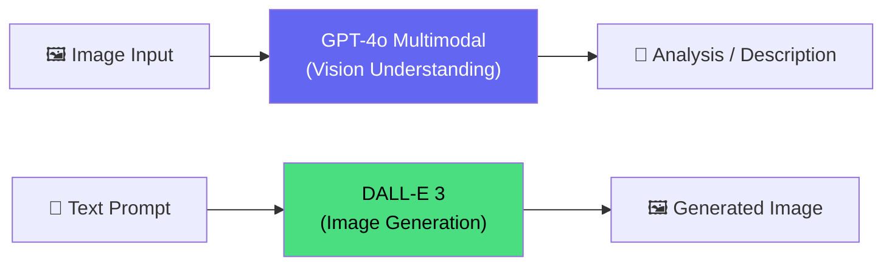

# Computer Vision & Image Generation

## Agenda

**Thời gian đọc ước tính:** ~15 phút  
**Domain kỳ thi:** Domain 2C — "Interpret visual input", "Create visual outputs", "Build a lightweight application with vision capabilities"

### Sau bài này, bạn sẽ:
- ✅ **Gửi** được image input tới GPT-4o multimodal để phân tích
- ✅ **Generate** được ảnh với DALL-E 3
- ✅ **Phân biệt** Computer Vision service vs GPT-4o vision

### Yêu cầu đầu vào:
- 🔹 Đã đọc Bài 03 (AI Workloads — hiểu Computer Vision concepts)
- 🔹 Azure account (DALL-E cần Azure OpenAI resource)

---

## Kiến Trúc



---

## Lab 1: Phân Tích Ảnh Với GPT-4o Vision

```python
# filename: vision_analysis.py

import os
import base64
from dotenv import load_dotenv
from azure.ai.inference import ChatCompletionsClient
from azure.ai.inference.models import (
    SystemMessage,
    UserMessage,
    ImageContentItem,
    TextContentItem,
    ImageUrl
)
from azure.core.credentials import AzureKeyCredential

load_dotenv()

client = ChatCompletionsClient(
    endpoint=os.environ["AZURE_AI_ENDPOINT"],
    credential=AzureKeyCredential(os.environ["AZURE_AI_KEY"])
)

def analyze_image_from_url(image_url: str, question: str) -> str:
    """Phân tích ảnh từ URL công khai."""
    response = client.complete(
        messages=[
            SystemMessage("Bạn là AI assistant phân tích hình ảnh bằng tiếng Việt."),
            UserMessage(content=[
                # Text question
                TextContentItem(text=question),
                # Image input qua URL
                ImageContentItem(image_url=ImageUrl(url=image_url))
            ])
        ],
        model=os.environ["AZURE_AI_DEPLOYMENT"],
        max_tokens=500
    )
    return response.choices[0].message.content


def analyze_image_from_file(image_path: str, question: str) -> str:
    """Phân tích ảnh từ file local (encode base64)."""
    with open(image_path, "rb") as f:
        image_data = base64.b64encode(f.read()).decode("utf-8")

    # Xác định MIME type từ extension
    ext = image_path.split(".")[-1].lower()
    mime_types = {"jpg": "image/jpeg", "jpeg": "image/jpeg", "png": "image/png", "gif": "image/gif"}
    mime_type = mime_types.get(ext, "image/jpeg")

    response = client.complete(
        messages=[
            SystemMessage("Mô tả chi tiết nội dung hình ảnh bằng tiếng Việt."),
            UserMessage(content=[
                TextContentItem(text=question),
                # Base64 encoded image
                ImageContentItem(image_url=ImageUrl(url=f"data:{mime_type};base64,{image_data}"))
            ])
        ],
        model=os.environ["AZURE_AI_DEPLOYMENT"],
        max_tokens=500
    )
    return response.choices[0].message.content


if __name__ == "__main__":
    # Test 1: Phân tích ảnh từ URL
    result = analyze_image_from_url(
        image_url="https://upload.wikimedia.org/wikipedia/commons/thumb/4/47/PNG_transparency_demonstration_1.png/280px-PNG_transparency_demonstration_1.png",
        question="Mô tả những gì bạn thấy trong ảnh này."
    )
    print("Vision Analysis:", result)
```

---

## Lab 2: Image Generation với DALL-E 3

```python
# filename: image_generation.py

import os
from dotenv import load_dotenv
from openai import AzureOpenAI

load_dotenv()

client = AzureOpenAI(
    azure_endpoint=os.environ["AZURE_AI_ENDPOINT"],
    api_key=os.environ["AZURE_AI_KEY"],
    api_version="2024-02-01"
)

def generate_image(prompt: str, style: str = "vivid") -> str:
    """
    Tạo ảnh từ text prompt dùng DALL-E 3.
    style: 'vivid' (artistic, dramatic) hoặc 'natural' (realistic)
    """
    response = client.images.generate(
        model="dall-e-3-deployment",  # tên deployment DALL-E 3
        prompt=prompt,
        n=1,
        size="1024x1024",  # 1024x1024, 1024x1792, 1792x1024
        style=style,
        quality="standard"  # 'standard' hoặc 'hd'
    )
    return response.data[0].url


if __name__ == "__main__":
    # Tạo ảnh minh họa cho tài liệu AI
    image_url = generate_image(
        prompt="""
        A futuristic AI assistant interface on a laptop screen in a modern office in Vietnam,
        showing neural network visualizations, clean and professional design,
        blue and purple color scheme, digital art style
        """,
        style="vivid"
    )
    print(f"Generated image URL: {image_url}")
    # Download và lưu nếu cần
```

---

## So Sánh: Azure AI Vision vs GPT-4o Vision

| Tiêu Chí | Azure AI Vision | GPT-4o Multimodal |
|---|---|---|
| **Chức năng** | Purpose-built: classify, detect, OCR | General: understand, reason, describe |
| **OCR** | ✅ Tốt hơn (chuyên dụng) | ✅ Tốt nhưng không chuyên |
| **Object Detection** | ✅ Với bounding boxes | ✅ Mô tả nhưng không có coordinates |
| **Image Understanding** | ❌ Hạn chế | ✅ Mạnh (reasoning, context) |
| **Cost** | Rẻ hơn | Đắt hơn |
| **AI-901 test** | ✅ Biết | ✅ Biết — focus nhiều hơn |

---

## Practice Questions

:::note Câu 1
**Scenario:** App cần đọc văn bản từ hình ảnh scan tài liệu cũ. Service nào phù hợp nhất?

**A.** DALL-E 3  
**B.** Azure AI Vision OCR hoặc Azure Content Understanding ✅  
**C.** Azure AI Speech  
**D.** Azure AI Language

**Giải thích:** Đọc text từ image = OCR → Azure AI Vision Read API hoặc Content Understanding. DALL-E tạo ảnh, không đọc.
:::

:::note Câu 2
**Scenario:** Marketing team muốn tạo ảnh quảng cáo từ mô tả văn bản. Cần gì?

**A.** Azure AI Vision  
**B.** Azure AI Language  
**C.** DALL-E 3 via Azure OpenAI ✅  
**D.** Azure Speech

**Giải thích:** Tạo ảnh từ text = Image Generation → DALL-E 3.
:::

---

*Made by Anh Tu - Share to be shared*
