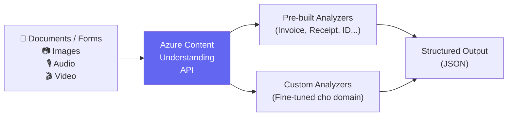

# Information Extraction — Content Understanding

## Agenda

**Thời gian đọc ước tính:** ~12 phút  
**Domain kỳ thi:** Domain 2D — "Extract information from documents, forms, images, audio, and video using Azure Content Understanding"

### Sau bài này, bạn sẽ:
- ✅ **Giải thích** được Azure Content Understanding là gì và khác gì Document Intelligence
- ✅ **Build** được app trích xuất thông tin từ documents và forms
- ✅ **Biết** cách extract từ images, audio, video

### Yêu cầu đầu vào:
- 🔹 Đã đọc Bài 03 (AI Workloads — hiểu Information Extraction concept)
- 🔹 Azure account

---

## Vấn đề & Giải pháp

**Vấn đề:** Hàng nghìn hóa đơn, hợp đồng, form PDF — cần trích xuất dữ liệu có cấu trúc mà không cần đọc thủ công.

**Giải pháp:** **Azure Content Understanding** — service unified extract data từ bất kỳ format nào (docs, images, audio, video) bằng pre-built và custom models.

---

## Azure Content Understanding là gì?



:::note Content Understanding vs Document Intelligence
**Azure Document Intelligence** (Form Recognizer cũ) = xử lý documents và forms.  
**Azure Content Understanding** = mới hơn, unified — xử lý docs + images + audio + video.  
**AI-901 focus: Content Understanding**.
:::

---

## Setup

```bash
pip install azure-ai-documentintelligence python-dotenv
# Hoặc dùng REST API trực tiếp cho Content Understanding
```

```bash
# filename: .env
AZURE_CONTENT_UNDERSTANDING_ENDPOINT=https://your-resource.cognitiveservices.azure.com/
AZURE_CONTENT_UNDERSTANDING_KEY=your-key
```

---

## Lab 1: Extract từ Document/Form

```python
# filename: extract_document.py

import os
import requests
from dotenv import load_dotenv

load_dotenv()

ENDPOINT = os.environ["AZURE_CONTENT_UNDERSTANDING_ENDPOINT"]
KEY = os.environ["AZURE_CONTENT_UNDERSTANDING_KEY"]

def analyze_invoice(document_url: str) -> dict:
    """
    Trích xuất thông tin từ hóa đơn (invoice).
    Content Understanding có pre-built analyzer cho invoice, receipt, ID...
    """
    headers = {
        "Ocp-Apim-Subscription-Key": KEY,
        "Content-Type": "application/json"
    }

    # Gửi document URL để phân tích
    body = {
        "url": document_url
    }

    # Content Understanding API endpoint
    analyze_url = f"{ENDPOINT}/contentunderstanding/analyzers/prebuilt-invoice:analyze?api-version=2024-12-01-preview"

    response = requests.post(analyze_url, headers=headers, json=body)
    response.raise_for_status()

    result = response.json()

    # Parse key fields từ invoice
    fields = result.get("result", {}).get("analyzeResult", {}).get("documents", [{}])[0].get("fields", {})

    extracted = {
        "vendor_name": fields.get("VendorName", {}).get("content", "N/A"),
        "invoice_date": fields.get("InvoiceDate", {}).get("content", "N/A"),
        "invoice_total": fields.get("InvoiceTotal", {}).get("content", "N/A"),
        "customer_name": fields.get("CustomerName", {}).get("content", "N/A"),
    }

    return extracted


if __name__ == "__main__":
    # Test với sample invoice từ Microsoft
    result = analyze_invoice(
        "https://raw.githubusercontent.com/Azure-Samples/cognitive-services-REST-api-samples/master/curl/form-recognizer/sample-invoice.pdf"
    )
    print("Extracted Invoice Data:")
    for key, value in result.items():
        print(f"  {key}: {value}")
```

**Output mong đợi:**
```
Extracted Invoice Data:
  vendor_name: Contoso Ltd.
  invoice_date: 11/15/2019
  invoice_total: $110.00
  customer_name: Microsoft Corp.
```

---

## Lab 2: Extract từ Image

```python
# filename: extract_from_image.py
# Trích xuất text và data từ image (bảng, biểu mẫu chụp ảnh)

import os
import base64
import requests
from dotenv import load_dotenv

load_dotenv()

def extract_from_image(image_path: str) -> dict:
    """Trích xuất text và cấu trúc từ image."""
    with open(image_path, "rb") as f:
        image_data = base64.b64encode(f.read()).decode("utf-8")

    headers = {
        "Ocp-Apim-Subscription-Key": os.environ["AZURE_CONTENT_UNDERSTANDING_KEY"],
        "Content-Type": "application/json"
    }

    body = {
        "base64Source": image_data
    }

    endpoint = os.environ["AZURE_CONTENT_UNDERSTANDING_ENDPOINT"]
    url = f"{endpoint}/contentunderstanding/analyzers/prebuilt-layout:analyze?api-version=2024-12-01-preview"

    response = requests.post(url, headers=headers, json=body)
    result = response.json()

    # Lấy tất cả text được nhận dạng
    pages = result.get("result", {}).get("analyzeResult", {}).get("pages", [])
    all_text = []
    for page in pages:
        for line in page.get("lines", []):
            all_text.append(line.get("content", ""))

    return {"extracted_text": "\n".join(all_text)}
```

---

## Các Analyzer Pre-built

| Analyzer | Extract gì | Use Case |
|---|---|---|
| `prebuilt-invoice` | Vendor, date, amount, items | Xử lý hóa đơn tự động |
| `prebuilt-receipt` | Merchant, items, total, tax | Báo cáo chi phí |
| `prebuilt-idDocument` | Name, DOB, ID number | KYC, onboarding |
| `prebuilt-businessCard` | Name, email, phone, company | CRM input |
| `prebuilt-layout` | Text, tables, key-value pairs | General documents |
| `prebuilt-read` | Text only (OCR) | Digitize printed text |

---

## Extract từ Audio & Video

AI-901 cũng test extraction từ audio/video — thường dùng Content Understanding hoặc kết hợp với Speech + LLM:

```python
# filename: extract_from_audio.py
# Trích xuất thông tin có cấu trúc từ audio (cuộc họp, phỏng vấn)

import os
import azure.cognitiveservices.speech as speechsdk
from dotenv import load_dotenv
from groq import Groq  # Dùng Groq cho analysis nếu hết Azure credit

load_dotenv()

def extract_meeting_insights(audio_file: str) -> dict:
    """
    Pipeline: Audio → STT transcript → LLM extraction → Structured data
    """
    # Bước 1: Speech-to-Text
    speech_config = speechsdk.SpeechConfig(
        subscription=os.environ["AZURE_SPEECH_KEY"],
        region=os.environ["AZURE_SPEECH_REGION"]
    )
    audio_config = speechsdk.audio.AudioConfig(filename=audio_file)
    recognizer = speechsdk.SpeechRecognizer(speech_config=speech_config, audio_config=audio_config)

    result = recognizer.recognize_once_async().get()
    transcript = result.text if result.reason == speechsdk.ResultReason.RecognizedSpeech else ""

    # Bước 2: Extract insights từ transcript bằng LLM
    groq_client = Groq(api_key=os.environ["GROQ_API_KEY"])

    response = groq_client.chat.completions.create(
        model="llama-3.3-70b-versatile",
        messages=[{
            "role": "system",
            "content": "Extract key information from meeting transcript. Return JSON with: action_items, decisions, participants, topics"
        }, {
            "role": "user",
            "content": f"Meeting transcript:\n{transcript}"
        }],
        response_format={"type": "json_object"}
    )

    import json
    return json.loads(response.choices[0].message.content)
```

---

## Practice Questions

:::note Câu 1
**Scenario:** Hospital cần tự động trích xuất thông tin bệnh nhân từ 10,000 form giấy đã scan (ảnh JPG). Service nào phù hợp?

**A.** Azure AI Language NER  
**B.** Azure Content Understanding (prebuilt-layout hoặc custom analyzer) ✅  
**C.** Azure AI Speech  
**D.** Azure Neural TTS

**Giải thích:** Trích xuất structured data từ scan forms → Content Understanding. NER phân tích free text, không phù hợp cho structured forms với layout.
:::

:::note Câu 2
**Scenario:** Cần trích xuất action items và decisions từ recording cuộc họp (MP3). Approach nào đúng?

**A.** Gửi MP3 trực tiếp vào Azure AI Language  
**B.** STT → transcript → Information Extraction / LLM ✅  
**C.** Dùng DALL-E để phân tích audio  
**D.** Azure AI Vision

**Giải thích:** Audio → STT (transcript) → Extract insights từ text. Audio không thể send trực tiếp vào Azure AI Language.
:::

---

*Made by Anh Tu - Share to be shared*
