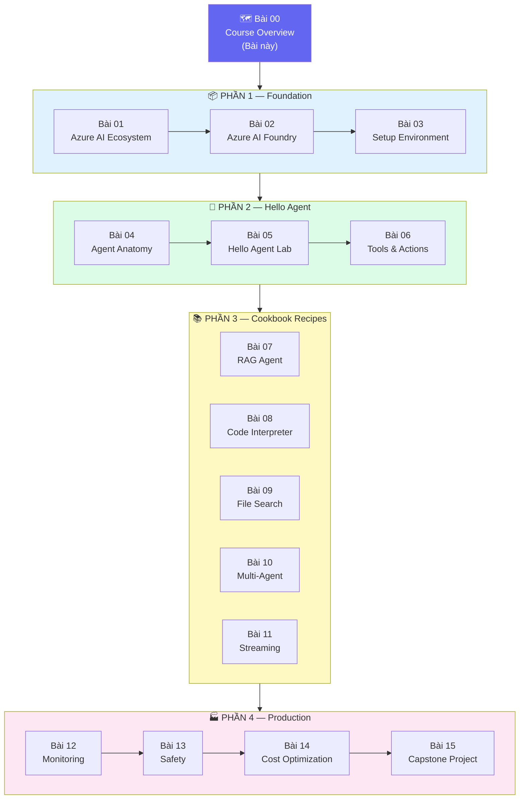

# 🗺️ Azure AI — Course Overview

## 📋 Agenda

**Thời gian đọc ước tính:** ~10 phút

### Sau khoá học này, bạn sẽ:
- ✅ **Hiểu** được kiến trúc Azure AI Foundry và vị trí của nó trong Cloud AI ecosystem
- ✅ **Build** được AI Agent hoàn chỉnh với Tool Use, RAG, và Streaming bằng Python
- ✅ **Orchestrate** được Multi-Agent System thuần Azure native (không cần framework ngoài)
- ✅ **Deploy** agent lên production với monitoring, safety guardrails, và cost optimization
- ✅ **Hoàn thành** Capstone Project: một AI Agent system production-ready

### Yêu cầu đầu vào (Prerequisites):
- 🔹 Python cơ bản (function, class, async/await)
- 🔹 Hiểu khái niệm GenAI/LLM cơ bản (prompt, token, context window)
- 🔹 Có Azure account (Free tier đủ cho hầu hết bài lab)
- 🔹 **Chưa cần** biết Azure hay Cloud trước

---

## ❓ Tại sao lại là Azure AI?

**Vấn đề với cách tiếp cận thông thường:**
- Gọi OpenAI API trực tiếp → không có enterprise security, không có monitoring, không scale được
- Tự build agent framework → tốn thời gian duy trì infrastructure, reinvent the wheel
- Dùng các framework phức tạp → over-engineering, hard to debug trong production

**Azure AI Foundry + Agent Service giải quyết:**
- **Managed runtime** — Azure lo infrastructure, bạn chỉ viết business logic
- **Enterprise-grade** — Entra ID auth, RBAC, VNet, audit logs built-in
- **Multi-model** — GPT-4o, Phi-4, Llama, Mistral... đổi model không cần refactor code
- **Integrated tooling** — AI Search, Code Interpreter, File Search tích hợp sẵn

:::info Thông tin quan trọng
Khoá học này sử dụng **Azure AI Agent Service** (cách tiếp cận mới nhất của Microsoft, 2025), không phải Azure OpenAI Assistants API cũ. Đây là hướng đi Microsoft khuyến nghị cho production.
:::

---

## 🗓️ Roadmap Khoá Học

---

## 🏗️ Tech Stack của khoá học

| Layer | Technology | Ghi chú |
|---|---|---|
| **Platform** | Azure AI Foundry | Hub + Project model |
| **Agent Runtime** | Azure AI Agent Service | Managed, production-ready |
| **Primary SDK** | `azure-ai-projects` (Python) | SDK chính cho toàn khoá |
| **Authentication** | `azure-identity` | DefaultAzureCredential |
| **RAG / Search** | Azure AI Search | Tích hợp native |
| **Models** | GPT-4o, GPT-4o-mini | Tuỳ bài lab |
| **Language** | Python ≥ 3.11 | Duy nhất, không TypeScript |

---

## 💰 Azure Cost Estimate

Toàn bộ khoá học ước tính **< $5 USD** nếu làm hết tất cả lab bài.

| Phần | Ước tính | Ghi chú |
|---|---|---|
| Phần 1 (Setup) | ~$0 | Chưa gọi model nhiều |
| Phần 2 (Hello Agent) | ~$0.05 | Vài chục GPT-4o calls |
| Phần 3 (Recipes) | ~$0.50 | Code Interpreter tốn hơn |
| Phần 4 (Production) | ~$1.00 | Capstone chạy nhiều |

:::tip Tiết kiệm cost
Dùng **GPT-4o-mini** thay GPT-4o trong các bài không yêu cầu reasoning phức tạp — rẻ hơn ~15 lần. Bài nào cần dùng gì sẽ note rõ.
:::

---

## 📖 Cách đọc khoá học này

### Nếu bạn là người mới hoàn toàn về Cloud AI
→ Đọc **tuần tự từ Bài 01**, không bỏ qua bài nào trong Phần 1.

### Nếu bạn đã biết Azure cơ bản
→ Skip Bài 01-02 (lý thuyết), bắt đầu từ **Bài 03** (setup môi trường).

### Nếu bạn muốn tra cứu một use case cụ thể
→ **Phần 3 (Bài 07-11)** thiết kế độc lập — mỗi recipe có thể đọc riêng lẻ.

### Ký hiệu trong khoá học

| Ký hiệu | Ý nghĩa |
|---|---|
| 💻 **Lab** | Có code chạy được, cần Azure account |
| 💰 **Cost** | Có Azure cost, note rõ ước tính |
| ⚠️ **Pitfall** | Lỗi hay gặp, cần chú ý |
| 💡 **Insight** | Kiến thức sâu hơn, optional |
| 🔑 **Key Point** | Điểm quan trọng nhất của bài |

---

## 🔗 Resources

- [Azure AI Foundry Documentation](https://learn.microsoft.com/en-us/azure/ai-studio/)
- [Azure AI Projects SDK (Python)](https://learn.microsoft.com/en-us/python/api/overview/azure/ai-projects-readme)
- [Azure AI Agent Service Quickstart](https://learn.microsoft.com/en-us/azure/ai-services/agents/quickstart)
- [Model Catalog](https://ai.azure.com/explore/models)

---

*Made by Anh Tu - Share to be shared*
