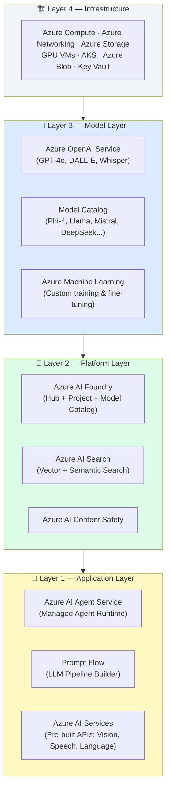
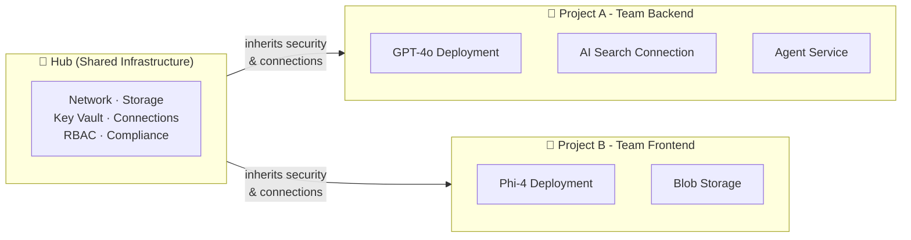
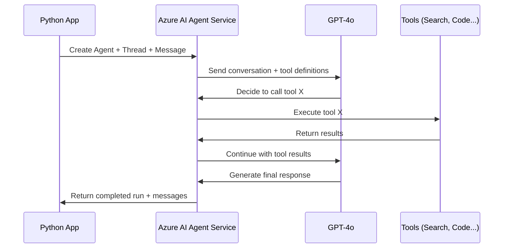
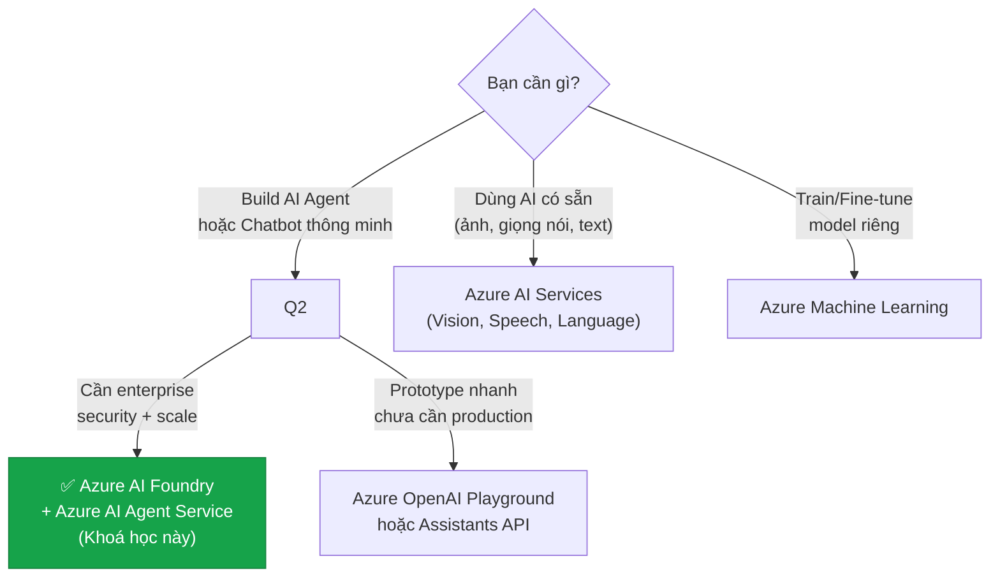
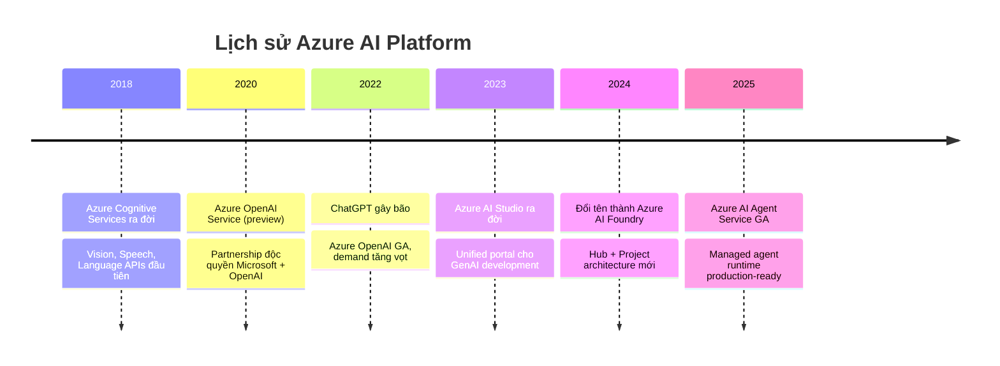

# Bài 01: Azure AI Ecosystem — Bức tranh toàn cảnh

## 📋 Agenda

**Thời gian đọc ước tính:** ~20 phút

### Sau bài này, bạn sẽ:
- ✅ **Vẽ được** bức tranh toàn cảnh Azure AI Stack từ Infrastructure đến Application layer
- ✅ **Phân biệt** được Azure AI Foundry vs Azure OpenAI vs Azure ML Studio (và khi nào dùng cái nào)
- ✅ **Giải thích** được tại sao Microsoft kiến trúc Azure AI theo cách này
- ✅ **Xác định** được vị trí của Azure AI Agent Service trong bức tranh lớn

### Yêu cầu đầu vào:
- 🔹 Đã đọc Bài 00 (Course Overview)

---

## ❓ Vấn đề & Giải pháp

**Vấn đề:**
- Azure có quá nhiều service AI — confusing khi mới bắt đầu
- Tên gần giống nhau: Azure OpenAI, Azure AI, Azure AI Studio, Azure ML... dễ nhầm
- Chọn sai service → tốn công refactor hoặc bị giới hạn tính năng sau này

**Giải pháp:**
Bài này cung cấp **Mental Model** rõ ràng về Azure AI Stack — giống như bản đồ trước khi vào rừng. Sau bài này, anh/chị sẽ biết chính xác mình đang dùng tool gì, tại sao dùng, và khi nào cần đổi sang tool khác.

---

## 📖 Azure AI Stack — Kiến trúc tổng quan

Microsoft tổ chức Azure AI theo **4 layer từ dưới lên**, mỗi layer phục vụ một nhóm đối tượng khác nhau:



:::info Chúng ta đang ở đâu trong khoá học?
Khoá học này tập trung vào **Layer 1 (Agent Service)** và **Layer 2 (AI Foundry)** - đây là nơi developer viết code và xây dựng ứng dụng. Layer 3-4 là infrastructure được Azure quản lý, chúng ta chỉ cần hiểu để đưa ra quyết định đúng.
:::

---

## 🧩 Giải phẫu từng Service

### 1. Azure AI Foundry — "Workbench" của AI Developer

**Định nghĩa:** Azure AI Foundry là unified platform cho toàn bộ AI development lifecycle — từ khám phá model, phát triển ứng dụng, đến deploy và govern AI agents trong môi trường enterprise.

> **Formerly known as:** Azure AI Studio (đổi tên năm 2024)

**Hai khái niệm core:**



- **Hub** = Tầng infrastructure chung. Một tổ chức có thể có 1 Hub, nhiều team dùng chung.
- **Project** = Workspace cho từng team/use-case. Inherit security từ Hub nhưng độc lập về resource.

**Bạn sẽ dùng Foundry để:**
- Deploy model (GPT-4o, Phi-4...)
- Quản lý Connection đến AI Search, Storage
- Create và test agents qua portal UI
- Monitor và evaluate agent performance

---

### 2. Azure OpenAI Service — "API Gateway" cho OpenAI Models

**Định nghĩa:** Azure OpenAI Service là managed service cung cấp access bảo mật đến các model của OpenAI (GPT-4o, DALL-E, Whisper) trên Azure infrastructure.

**Điểm quan trọng cần hiểu:**

| | Azure OpenAI | OpenAI API (trực tiếp) |
|---|---|---|
| **Data Privacy** | Dữ liệu không dùng để train model | Phụ thuộc tier |
| **Security** | Azure Entra ID, VNet, Private Endpoint | API Key only |
| **Compliance** | SOC2, ISO27001, HIPAA eligible | Hạn chế hơn |
| **Model** | Chỉ OpenAI models | Mọi OpenAI model |
| **Latency** | Deployment trong region bạn chọn | Global routing |

**🔑 Key Point:** Azure OpenAI **là một component** bên trong Azure AI Foundry, không phải service riêng biệt hoàn toàn. Khi bạn làm việc với Foundry, bạn đã đang dùng Azure OpenAI ở bên dưới.

---

### 3. Azure Machine Learning — "Lab" cho Data Scientists

**Định nghĩa:** Azure ML là platform MLOps đầy đủ cho data scientists — từ data prep, training, fine-tuning, đến deployment và monitoring custom models.

**Bạn cần Azure ML khi:**
- Fine-tune model trên dữ liệu riêng của tổ chức
- Train model custom từ đầu
- Cần full control về training infrastructure
- Quản lý experiment tracking và model versioning

**Khoá học này KHÔNG dùng Azure ML** vì chúng ta sử dụng pre-trained models (GPT-4o) thay vì train model mới.

---

### 4. Azure AI Agent Service — "Runtime" cho AI Agents

**Định nghĩa:** Azure AI Agent Service (hay Foundry Agent Service) là managed runtime chuyên biệt để build, deploy, và scale AI agents — các ứng dụng AI có thể tự lập kế hoạch, gọi tools, và thực thi các tác vụ đa bước.



**Vị trí trong bức tranh:** Agent Service là nơi developer tốn nhiều thời gian nhất. Nó abstract hoàn toàn complexity của việc quản lý conversation state, tool orchestration, và retry logic.

---

### 5. Azure AI Services — "Pre-built AI APIs"

Legacy services (trước khi có Foundry), bao gồm:
- **Azure AI Vision** — Image analysis, OCR
- **Azure AI Speech** — Speech-to-text, Text-to-speech
- **Azure AI Language** — Sentiment analysis, NER, Translation
- **Azure AI Content Safety** — Content moderation (chúng ta dùng bài 13)

**Khi nào dùng:** Cần AI functionality đơn giản, không cần LLM. Ví dụ: scan document để extract text (Vision OCR).

---

## 📊 Decision Tree — Chọn service nào?



---

## 🔄 So sánh: Azure AI Agent Service vs Azure OpenAI Assistants API

Đây là điểm **hay bị nhầm lẫn nhất** khi mới tiếp cận:

| Feature | Azure AI Agent Service | Azure OpenAI Assistants API |
|---|---|---|
| **Trạng thái** | ✅ GA, được khuyến nghị | ⚠️ Đang deprecate (8/2026) |
| **Models** | Mọi model trong Catalog | Chỉ OpenAI models |
| **Security** | Entra ID, VNet, RBAC | Chủ yếu API Key |
| **Multi-Agent** | ✅ Native support | ❌ Không |
| **Storage** | Bring Your Own Storage | Managed only |
| **Frameworks** | LangGraph, AutoGen, Custom | Hạn chế |
| **Production** | ✅ Production-ready | ⚠️ Phù hợp prototype |

:::warning Quan trọng
OpenAI đã thông báo **deprecate Assistants API vào tháng 8/2026** để chuyển sang kiến trúc mới (Responses API). Trên Azure, hướng đi được Microsoft khuyến nghị là **Azure AI Agent Service**. Đây là lý do khoá học này chọn Agent Service thay vì Assistants API.
:::

---

## 🕰️ Lịch sử Azure AI — Tại sao lại phức tạp như vậy?

Hiểu lịch sử giúp chúng ta hiểu tại sao có nhiều "layer" như vậy:



**Root Cause của sự phức tạp:** Mỗi wave AI mang đến một paradigm mới. Microsoft integrate các service từng thời kỳ vào một platform thống nhất (Foundry) thay vì rebuild từ đầu. Kết quả là có nhiều service với overlap nhau nhưng phục vụ use case khác nhau.

---

## 🚀 WHAT IF — Khi nào KHÔNG nên dùng Azure AI?

| Tình huống | Gợi ý thay thế |
|---|---|
| Startup nhỏ, cần ship nhanh, chưa cần enterprise | OpenAI API trực tiếp → đơn giản hơn |
| Team đã heavily invested vào AWS | Amazon Bedrock (tương đương) |
| Cần Gemini/Claude models | Google Vertex AI / Anthropic API |
| Budget rất hạn chế (< $10/tháng) | Ollama + local models |

⚠️ **Pitfall hay gặp:** Nhiều người bắt đầu với `openai` Python package trực tiếp, sau khi project lớn mới muốn chuyển lên Azure — việc refactor lúc đó tốn nhiều công hơn. Nếu biết trước sẽ chạy production trên Azure, hãy dùng `azure-ai-projects` ngay từ đầu.

---

## 💡 Key Takeaways

Trước khi sang Bài 02, hãy chắc chắn bạn nắm được 3 điểm này:

1. **Azure AI Foundry** = Platform tổng thể (Hub + Project + Model Catalog + Tooling)
2. **Azure AI Agent Service** = Managed runtime chạy AI agents — đây là focus của khoá học
3. **Azure OpenAI Service** = Component bên trong Foundry, cung cấp access đến GPT models

```
Foundry (Platform)
    └── Azure OpenAI (Model Access)
    └── AI Agent Service (Agent Runtime) ← Chúng ta ở đây
    └── AI Search (RAG/Vector)
    └── Content Safety (Guardrails)
```

---

## 💬 Câu hỏi thảo luận

> **"Nếu Azure AI Foundry bao gồm cả Azure OpenAI, tại sao Microsoft vẫn bán Azure OpenAI như một service riêng?"**
>
> *Gợi ý suy nghĩ:* Backward compatibility, pricing model, existing customers, và enterprise contracts là những yếu tố quyết định. Không phải mọi quyết định kiến trúc đều là kỹ thuật thuần túy — business context cũng quan trọng không kém.

---

## 🔗 Đọc thêm

- [What is Azure AI Foundry?](https://learn.microsoft.com/en-us/azure/ai-studio/what-is-ai-studio)
- [Azure AI Agent Service overview](https://learn.microsoft.com/en-us/azure/ai-services/agents/overview)
- [Migrate from Assistants API to Agent Service](https://learn.microsoft.com/en-us/azure/ai-services/agents/how-to/migration-overview)

**Bài tiếp theo:** Bài 02 — Azure AI Foundry Deep Dive →

---

*Made by Anh Tu - Share to be shared*
