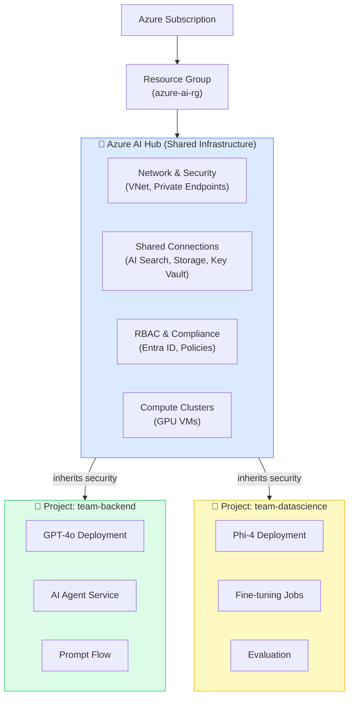
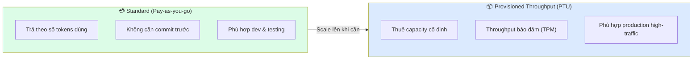
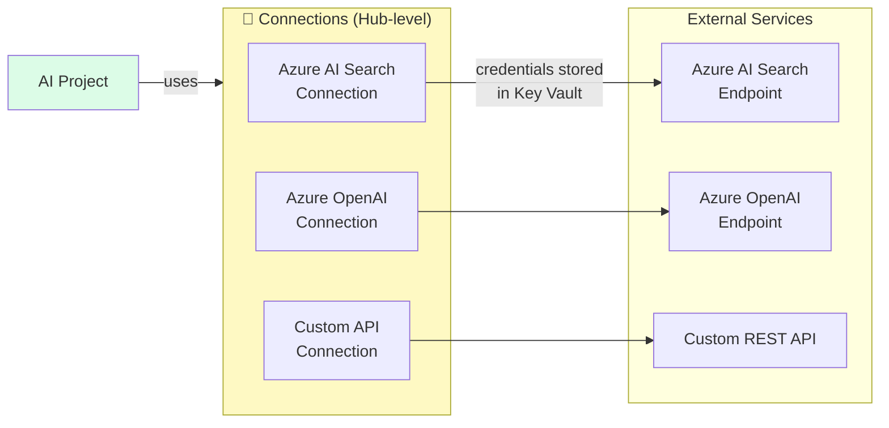
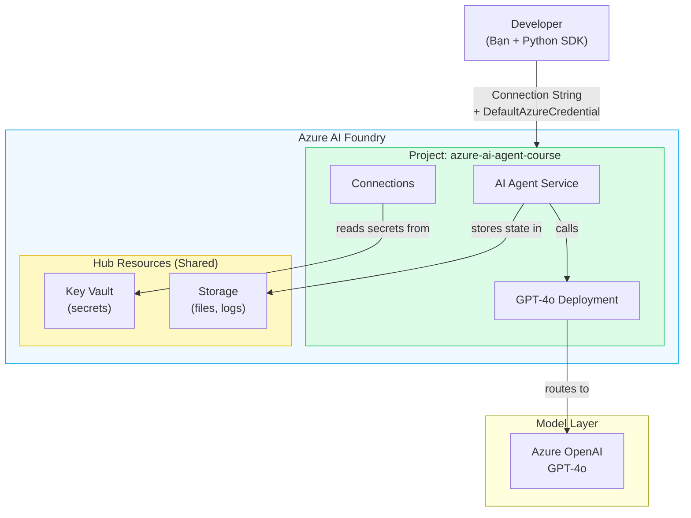

# Bài 02: Azure AI Foundry — Hub & Project Architecture

## 📋 Agenda

**Thời gian đọc ước tính:** ~25 phút

### Sau bài này, bạn sẽ:
- ✅ **Giải thích** được tại sao Azure AI Foundry dùng mô hình 2 tầng Hub + Project
- ✅ **Tạo** được Hub và Project đầu tiên trên Azure Portal
- ✅ **Deploy** model GPT-4o và test trong Chat Playground
- ✅ **Hiểu** được Connections, Deployments, và Resource Sharing

### Yêu cầu đầu vào:
- 🔹 Đã đọc Bài 01 (Azure AI Ecosystem)
- 🔹 Có Azure Account (Free tier OK)
- 🔹 Có quyền tạo Resource Group

---

## ❓ Vấn đề & Giải pháp

**Vấn đề khi tổ chức AI resources:**
- Một công ty có nhiều team (Backend, Frontend, Data Science) — mỗi team cần AI nhưng phải có security, billing, và compliance riêng
- Nếu share một Azure OpenAI endpoint chung → không có isolation, không kiểm soát được ai dùng gì
- Nếu mỗi team tạo resource riêng → duplicated cost, khó quản lý keys và credentials

**Giải pháp — Hub + Project Architecture:**
Azure AI Foundry giải quyết bằng mô hình 2 tầng: Hub quản lý infrastructure chung, Project tạo workspace cô lập cho từng team.

---

## 📖 Hub & Project — Kiến trúc 2 tầng

### Tổng quan kiến trúc



---

### Hub — Tầng Infrastructure chung

**Hub** là resource cha (parent) chứa toàn bộ shared infrastructure. Mọi Project tạo ra bên trong Hub sẽ **tự động kế thừa** settings từ Hub.

**Hub quản lý những gì:**

| Resource | Mô tả | Chia sẻ với |
|---|---|---|
| **Azure Storage** | Lưu artifacts, logs, datasets | Tất cả Projects |
| **Azure Key Vault** | Quản lý secrets, API keys | Tất cả Projects |
| **Azure Container Registry** | Docker images cho custom containers | Tất cả Projects |
| **Network (VNet)** | Private networking configuration | Tất cả Projects |
| **Entra ID RBAC** | Ai được phép làm gì | Per Project hoặc Hub-wide |

💡 **Insight:** Hub giống như "văn phòng trụ sở" của một công ty — có reception, security, network chung. Các Project giống như các "phòng ban" riêng biệt bên trong — có không gian làm việc độc lập nhưng dùng chung infrastructure.

---

### Project — Workspace cho team/use-case

**Project** là nơi bạn thực sự làm việc hàng ngày — deploy model, build agent, run experiments. Mỗi Project có:

- **Riêng của Project:** Model deployments, Agents, Threads, Evaluations, Prompt Flows
- **Kế thừa từ Hub:** Storage, Key Vault, Network, RBAC policies

**Khi nào tạo Project mới:**
- Team mới cần workspace riêng
- Use-case mới cần isolation (ví dụ: production vs staging)
- Cần billing tách biệt

---

## 💻 Lab 02-01: Tạo Hub & Project trên Azure Portal

### Bước 1: Truy cập Azure AI Foundry

1. Mở trình duyệt → https://ai.azure.com
2. Đăng nhập bằng Azure account
3. Click **"Create a project"** ở màn hình chính

:::tip
Lần đầu sử dụng AI Foundry, portal sẽ hướng dẫn tạo Hub và Project cùng một lúc — đây là cách đơn giản nhất.
:::

### Bước 2: Tạo Hub (tạo cùng Project)

Điền thông tin Hub:

```
Hub name:    azure-ai-hub-dev
Subscription: [chọn subscription của bạn]
Resource Group: azure-ai-rg (tạo mới)
Location:    East US 2  ← hoặc Southeast Asia (gần VN hơn)
```

:::warning Azure Region & Availability
Không phải mọi model đều available ở mọi region. **East US 2** và **Sweden Central** có nhiều model nhất hiện tại (4/2025). Nếu muốn latency thấp hơn từ Việt Nam, chọn **Southeast Asia** nhưng model catalog có thể bị hạn chế.
:::

### Bước 3: Tạo Project

```
Project name: azure-ai-agent-course
Hub:          azure-ai-hub-dev (vừa tạo)
```

Click **"Create"** → chờ ~2-3 phút để tạo xong.

### Bước 4: Verify Resources được tạo

Sau khi tạo xong, Azure tự động tạo các resources liên quan:

```
Resource Group: azure-ai-rg
├── azure-ai-hub-dev               (AI Hub)
├── azure-ai-agent-course          (AI Project)
├── aihub{hash}storage             (Storage Account)
├── aihub{hash}kv                  (Key Vault)
└── aihub{hash}acr                 (Container Registry)
```

💰 **Cost note:** Hub + Project không tốn phí tự nó — chi phí phát sinh khi bạn deploy model và gọi API.

---

## 📖 Model Deployments — Deploy GPT-4o

**Deployment** là việc "bật" một model trong Project của bạn, tạo ra một endpoint riêng để gọi. Có 2 loại deployment:



**Trong khoá học này:** Chúng ta dùng **Standard (Pay-as-you-go)** — đơn giản và phù hợp learning.

---

## 💻 Lab 02-02: Deploy GPT-4o

### Bước 1: Vào Model Catalog

Trong Project vừa tạo:
- Left sidebar → **"Models + endpoints"**
- Click **"+ Deploy model"** → **"Deploy base model"**

### Bước 2: Chọn model và deploy

```
Model:              gpt-4o
Deployment name:    gpt-4o-deployment
Deployment type:    Standard
Tokens per minute:  10K  ← đủ cho learning, giữ cost thấp
Content filter:     DefaultV2 (giữ nguyên)
```

Click **"Deploy"** → chờ ~1 phút.

### Bước 3: Test trong Chat Playground

- Left sidebar → **"Playgrounds"** → **"Chat"**
- Model: chọn `gpt-4o-deployment`
- System prompt: `"Bạn là trợ lý AI hữu ích."`
- Gửi message: `"Xin chào! Hãy giới thiệu bản thân."`

Nếu nhận được response → ✅ Deployment thành công!

---

## 📖 Connections — Kết nối External Services

**Connection** là cách AI Foundry lưu trữ credentials để kết nối với các Azure services khác (AI Search, Storage...) một cách an toàn — không cần hardcode API key.



### Lấy Project Connection String

Connection String là credential dùng để Python SDK kết nối đến Project. Tìm ở:

```
AI Foundry Portal → Project → Settings → Overview
→ "Project connection string" → Copy
```

Format của Connection String:
```
<endpoint>.api.azureml.ms;<subscription-id>;<resource-group>;<project-name>
```

---

## 📖 Tổng kết kiến trúc



---

## 🚀 WHAT IF — Pitfalls & Trade-offs

⚠️ **Pitfall #1: Region lock**
> Tạo Hub ở region sai → deploy model xong mới biết model không available ở region đó.
> **Fix:** Luôn check [Model availability by region](https://learn.microsoft.com/en-us/azure/ai-services/openai/concepts/models) trước khi tạo Hub.

⚠️ **Pitfall #2: Quota mặc định quá thấp**
> TPM (Tokens Per Minute) mặc định của Free tier rất thấp → API calls bị throttle.
> **Fix:** Request quota increase qua Azure Portal → Quotas. Với Free tier, 10K TPM là đủ cho learning.

⚠️ **Pitfall #3: Nhầm Hub với Project khi set permissions**
> Set RBAC ở Hub level → áp dụng cho tất cả Projects. Set ở Project level → chỉ cho Project đó.
> **Fix:** Với team nhỏ học tập, set permission ở Hub level cho đơn giản. Production thì cần phân quyền kỹ hơn.

| | Hub-level Permission | Project-level Permission |
|---|---|---|
| **Tác động** | Tất cả Projects | Một Project cụ thể |
| **Dùng khi** | Admin chung, shared services | Phân quyền từng team |
| **Risk** | Cao (broad access) | Thấp (isolated) |

---

## 💬 Câu hỏi thảo luận

> **"Trong thực tế, một tổ chức nên có bao nhiêu Hub?"**
>
> *Gợi ý:* Hub thường được phân theo môi trường (dev/staging/prod) hoặc theo business unit. Nhiều Hub quá → khó quản lý. Ít quá → mất isolation. Không có câu trả lời đúng tuyệt đối — trade-off giữa governance và agility.

---

## 🔗 Đọc thêm

- [Create Azure AI Foundry Hub](https://learn.microsoft.com/en-us/azure/ai-studio/how-to/create-azure-ai-resource)
- [Model availability by region](https://learn.microsoft.com/en-us/azure/ai-services/openai/concepts/models)
- [Quota management](https://learn.microsoft.com/en-us/azure/ai-studio/how-to/quota)

**Bài tiếp theo:** Bài 03 — Setup Environment →

---

*Made by Anh Tu - Share to be shared*
