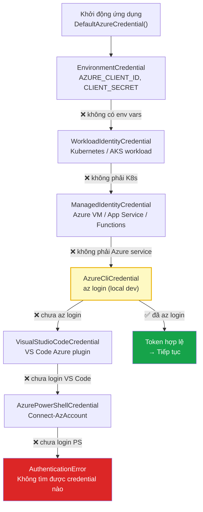

# Bài 03: Setup Environment — Python & Azure SDK

## 📋 Agenda

**Thời gian đọc ước tính:** ~20 phút

### Sau bài này, bạn sẽ:
- ✅ **Cài đặt** đầy đủ Python environment cho Azure AI development
- ✅ **Hiểu** cơ chế DefaultAzureCredential và tại sao KHÔNG hardcode API key
- ✅ **Verify** kết nối Python → Azure AI Foundry thành công bằng script test
- ✅ **Nắm** được cấu trúc project Python chuẩn cho khoá học này

### Yêu cầu đầu vào:
- 🔹 Đã hoàn thành Bài 02 — có Hub, Project, và GPT-4o deployment
- 🔹 Python ≥ 3.11 đã cài (kiểm tra: `python --version`)
- 🔹 Azure CLI đã cài (kiểm tra: `az --version`)

---

## ❓ Vấn đề & Giải pháp

**Vấn đề với cách setup sai:**
- Hardcode API key trong code → key bị leak khi push lên GitHub
- Dùng API key thay vì identity-based auth → không audit được ai gọi gì, không rotate key tự động
- Không có virtual environment → conflict giữa các project Python

**Giải pháp:**
- **`azure-identity` + `DefaultAzureCredential`**: Authentication qua Azure identity, không cần key
- **`.env` file + `python-dotenv`**: Config tách biệt khỏi code
- **Virtual environment**: Isolate dependencies per project

---

## 📖 DefaultAzureCredential — Cơ chế Authentication

**Định nghĩa:** `DefaultAzureCredential` là credential class tự động thử nhiều authentication method theo thứ tự ưu tiên, chọn method đầu tiên hoạt động được.

**Tại sao không dùng API Key?**

| | API Key | DefaultAzureCredential |
|---|---|---|
| **Bảo mật** | ❌ Key bị leak → mất toàn bộ access | ✅ Token tới hạn 1 giờ, auto-rotate |
| **Audit** | ❌ Không biết ai đang dùng key | ✅ Gắn với identity cụ thể trong Entra ID |
| **Management** | ❌ Phải rotate thủ công | ✅ Azure quản lý tự động |
| **Production** | ❌ Không recommended | ✅ Enterprise standard |

### Credential Chain — Thứ tự thử authentication



**🔑 Key Point cho local development:** Chỉ cần chạy `az login` một lần → `AzureCliCredential` sẽ tự động hoạt động. Không cần config thêm gì.

**🔑 Key Point cho production (Azure VM, App Service):** `ManagedIdentityCredential` tự động hoạt động — không cần config gì cả! Azure inject identity vào runtime.

---

## 💻 Lab 03-01: Cài đặt environment

### Bước 1: Tạo project folder và virtual environment

```bash
# Tạo thư mục project
mkdir azure-ai-agent-course
cd azure-ai-agent-course

# Tạo virtual environment
python -m venv .venv

# Kích hoạt virtual environment
# macOS/Linux:
source .venv/bin/activate

# Windows:
.venv\Scripts\activate

# Xác nhận đang dùng đúng Python
which python  # Phải show đường dẫn trong .venv
```

### Bước 2: Tạo requirements.txt

```bash
# filename: requirements.txt

# Azure AI core SDK - SDK chính của khoá học
azure-ai-projects>=1.0.0

# Authentication - Identity-based auth, không cần API key
azure-identity>=1.15.0

# Azure OpenAI client (dùng trong một số bài)
openai>=1.0.0

# Environment variables management
python-dotenv>=1.0.0

# Utilities
httpx>=0.24.0
```

```bash
# Cài đặt tất cả dependencies
pip install -r requirements.txt

# Verify cài đặt thành công
pip list | grep azure
```

Output mong đợi:
```
azure-ai-projects    1.0.0
azure-core           1.30.0
azure-identity       1.15.0
```

### Bước 3: Azure CLI login

```bash
# Đăng nhập Azure CLI (mở browser để xác thực)
az login

# Verify đăng nhập thành công
az account show

# Output mong đợi:
# {
#   "id": "xxxxxxxx-xxxx-xxxx-xxxx-xxxxxxxxxxxx",
#   "name": "Azure subscription 1",
#   "user": {
#     "name": "your@email.com",
#     "type": "user"
#   }
# }
```

:::info Nếu có nhiều subscription
```bash
# List tất cả subscriptions
az account list --output table

# Set subscription cần dùng
az account set --subscription "your-subscription-id"
```
:::

### Bước 4: Lấy Project Connection String

Vào **Azure AI Foundry Portal** (https://ai.azure.com):

```
Project (azure-ai-agent-course)
  → Settings (góc trái sidebar)
  → Overview tab
  → "Project connection string"
  → Copy toàn bộ string
```

Format: `<endpoint>.api.azureml.ms;<subscription-id>;<resource-group>;<project-name>`

### Bước 5: Tạo file `.env`

```bash
# filename: .env
# KHÔNG commit file này lên Git!

# Azure AI Foundry Project connection string
AZURE_AI_PROJECT_CONNECTION_STRING="<paste-connection-string-here>"

# (Optional) Tên deployment đã tạo ở Bài 02
AZURE_OPENAI_DEPLOYMENT_NAME="gpt-4o-deployment"
```

```bash
# filename: .gitignore
.env
.venv/
__pycache__/
*.pyc
.DS_Store
```

:::warning Quan trọng — Bảo mật
**KHÔNG BAO GIỜ** commit file `.env` lên GitHub. Thêm vào `.gitignore` ngay từ đầu. Connection string có thể chứa thông tin nhạy cảm về subscription của bạn.
:::

---

## 💻 Lab 03-02: Verification Script

Tạo script để kiểm tra toàn bộ setup:

```python
# filename: verify_setup.py
"""
Script xác minh kết nối Azure AI Foundry
Chạy: python verify_setup.py
"""

import os
import sys
from dotenv import load_dotenv

# Load .env file
load_dotenv()

def check_env_vars():
    """Kiểm tra biến môi trường bắt buộc"""
    print("📋 Kiểm tra Environment Variables...")
    
    required = ["AZURE_AI_PROJECT_CONNECTION_STRING"]
    missing = []
    
    for var in required:
        value = os.getenv(var)
        if not value:
            missing.append(var)
            print(f"  ❌ {var}: MISSING")
        else:
            # Chỉ show 20 ký tự đầu để tránh lộ thông tin
            preview = value[:30] + "..."
            print(f"  ✅ {var}: {preview}")
    
    return len(missing) == 0


def check_azure_connection():
    """Kiểm tra kết nối Azure AI Foundry"""
    print("\n🔌 Kiểm tra kết nối Azure AI Foundry...")
    
    try:
        from azure.ai.projects import AIProjectClient
        from azure.identity import DefaultAzureCredential
        
        conn_str = os.environ["AZURE_AI_PROJECT_CONNECTION_STRING"]
        
        # Tạo client
        client = AIProjectClient.from_connection_string(
            conn_str=conn_str,
            credential=DefaultAzureCredential()
        )
        print("  ✅ AIProjectClient khởi tạo thành công")
        
        return client
        
    except ImportError as e:
        print(f"  ❌ Import error: {e}")
        print("  → Chạy: pip install azure-ai-projects azure-identity")
        return None
    except Exception as e:
        print(f"  ❌ Connection error: {e}")
        print("  → Kiểm tra: az login và connection string")
        return None


def check_connections(client):
    """List các connections có trong Project"""
    print("\n🔗 Danh sách Connections trong Project...")
    
    try:
        connections = client.connections.list()
        conn_list = list(connections)
        
        if not conn_list:
            print("  ⚠️  Không có connection nào — bình thường nếu mới tạo Project")
        else:
            for conn in conn_list:
                print(f"  ✅ {conn.name} (type: {conn.connection_type})")
        
        return True
    except Exception as e:
        print(f"  ❌ Error listing connections: {e}")
        return False


def check_agent_service(client):
    """Kiểm tra Agent Service hoạt động"""
    print("\n🤖 Kiểm tra Azure AI Agent Service...")
    
    try:
        # List agents (sẽ trống nhưng confirm service accessible)
        agents = client.agents.list_agents()
        agent_list = list(agents)
        print(f"  ✅ Agent Service accessible — hiện có {len(agent_list)} agent(s)")
        return True
    except Exception as e:
        print(f"  ❌ Agent Service error: {e}")
        print("  → Kiểm tra role assignment: cần 'Azure AI User' role")
        return False


def main():
    print("=" * 50)
    print("🚀 Azure AI Setup Verification")
    print("=" * 50)
    
    # Step 1: Check env vars
    if not check_env_vars():
        print("\n❌ Setup chưa hoàn chỉnh — thiếu env vars")
        sys.exit(1)
    
    # Step 2: Check connection
    client = check_azure_connection()
    if not client:
        print("\n❌ Không thể kết nối Azure — xem lỗi phía trên")
        sys.exit(1)
    
    # Step 3: Check connections
    check_connections(client)
    
    # Step 4: Check agent service
    check_agent_service(client)
    
    print("\n" + "=" * 50)
    print("✅ Setup hoàn chỉnh! Sẵn sàng cho Bài 04.")
    print("=" * 50)


if __name__ == "__main__":
    main()
```

**Chạy verification:**
```bash
python verify_setup.py
```

**Output mong đợi khi thành công:**
```
==================================================
🚀 Azure AI Setup Verification
==================================================
📋 Kiểm tra Environment Variables...
  ✅ AZURE_AI_PROJECT_CONNECTION_STRING: <endpoint>.api.azureml.ms;xxxxxxx...

🔌 Kiểm tra kết nối Azure AI Foundry...
  ✅ AIProjectClient khởi tạo thành công

🔗 Danh sách Connections trong Project...
  ✅ Default_AzureOpenAI (type: azure_open_ai)

🤖 Kiểm tra Azure AI Agent Service...
  ✅ Agent Service accessible — hiện có 0 agent(s)

==================================================
✅ Setup hoàn chỉnh! Sẵn sàng cho Bài 04.
==================================================
```

---

## 📖 Cấu trúc Project Python chuẩn

Đây là cấu trúc folder sẽ dùng xuyên suốt khoá học:

```
azure-ai-agent-course/
├── .env                    ← Secrets (KHÔNG commit)
├── .gitignore
├── requirements.txt
├── verify_setup.py         ← Script kiểm tra từ bài này
│
├── part2-hello-agent/
│   ├── lab-05-hello-agent.py
│   └── lab-06-tool-agent.py
│
├── part3-recipes/
│   ├── lab-07-rag-agent.py
│   ├── lab-08-code-interpreter.py
│   ├── lab-09-file-search.py
│   ├── lab-10-multi-agent.py
│   └── lab-11-streaming.py
│
├── part4-production/
│   ├── lab-12-monitoring.py
│   ├── lab-13-safety.py
│   ├── lab-14-cost.py
│   └── capstone/
│
└── data/                   ← Sample files cho lab
    ├── hr-policy.pdf
    └── sales-2025.csv
```

---

## 🚀 WHAT IF — Troubleshooting

### Lỗi: `AuthenticationError: DefaultAzureCredential failed`

```bash
# Nguyên nhân: Chưa đăng nhập Azure CLI
az login

# Nếu nhiều tenant:
az login --tenant <tenant-id>
```

### Lỗi: `ResourceNotFoundError: Project not found`

```bash
# Nguyên nhân: Connection string sai hoặc subscription sai
# Kiểm tra subscription hiện tại:
az account show

# Đổi sang đúng subscription:
az account set --subscription "<subscription-id>"
```

### Lỗi: `PermissionError: Missing role assignment`

```
Azure Portal → AI Foundry Project
→ Access Control (IAM) → Add role assignment
→ Role: "Azure AI User"  (hoặc "Contributor")
→ Assign to: your email
```

⚠️ **Pitfall hay gặp:** Sau khi assign role, cần chờ **1-2 phút** để Azure propagate permissions. Nếu vẫn lỗi → logout và login lại Azure CLI:
```bash
az logout
az login
```

---

## 💬 Câu hỏi thảo luận

> **"DefaultAzureCredential chain thử nhiều method — nếu máy dev vô tình có cả `az login` lẫn environment variables, method nào được ưu tiên?"**
>
> *Gợi ý:* Nhìn lại diagram credential chain ở trên — `EnvironmentCredential` được thử **trước** `AzureCliCredential`. Điều này có thể gây unexpected behavior nếu env vars là credentials của service account production. Best practice: Trên máy dev, dùng `AzureCLICredential` explicitly thay vì `DefaultAzureCredential` nếu muốn chắc chắn.

---

## 🔗 Đọc thêm

- [azure-ai-projects SDK Reference](https://learn.microsoft.com/en-us/python/api/overview/azure/ai-projects-readme)
- [DefaultAzureCredential documentation](https://learn.microsoft.com/en-us/python/api/azure-identity/azure.identity.defaultazurecredential)
- [Azure AI Agent Service Quickstart (Python)](https://learn.microsoft.com/en-us/azure/ai-services/agents/quickstart?pivots=programming-language-python)

**Bài tiếp theo:** Bài 04 — Anatomy of an AI Agent →

---

*Made by Anh Tu - Share to be shared*
