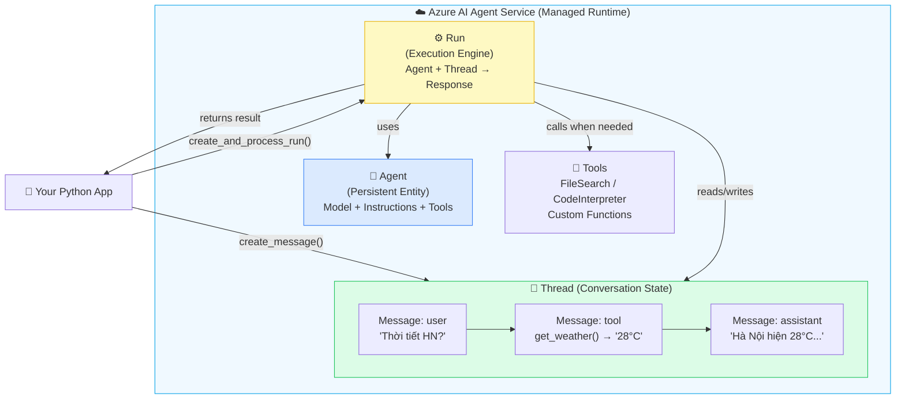
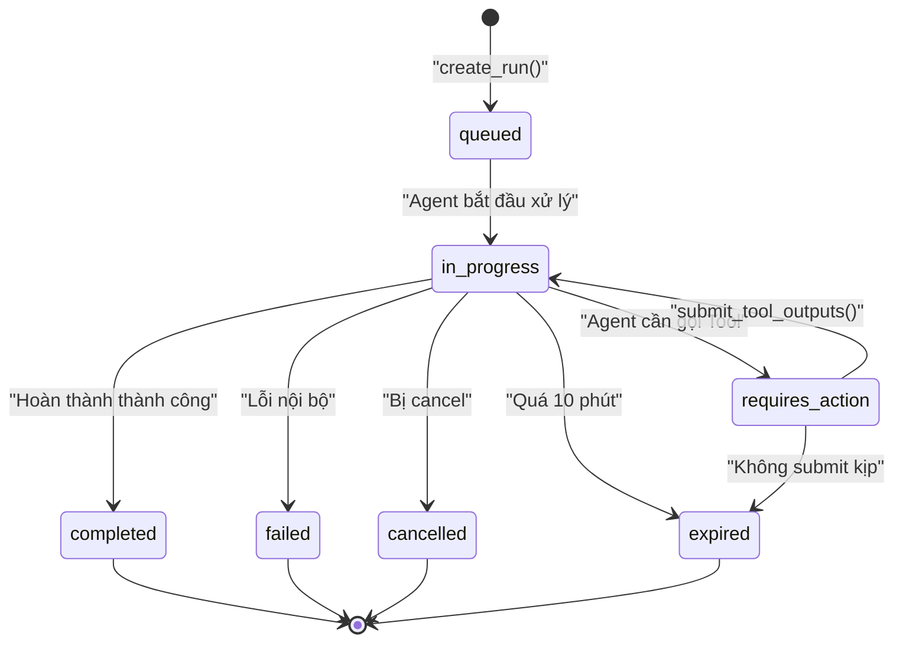
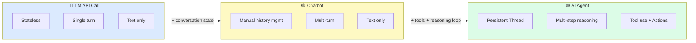

# Bài 04: Anatomy of an AI Agent — Giải phẫu Agent

## 📋 Agenda

**Thời gian đọc ước tính:** ~20 phút

### Sau bài này, bạn sẽ:
- ✅ **Định nghĩa** được AI Agent theo chuẩn Azure AI Agent Service
- ✅ **Giải phẫu** 5 thành phần cốt lõi: Agent, Thread, Message, Run, Tool
- ✅ **Đọc hiểu** Run State Machine và biết code cần xử lý ở state nào
- ✅ **Phân biệt** được khi nào dùng Agent, khi nào chỉ cần LLM call đơn giản

### Yêu cầu đầu vào:
- 🔹 Đã hoàn thành Bài 03 — setup environment chạy được
- 🔹 Hiểu khái niệm LLM cơ bản (prompt, completion, context window)

---

## ❓ Vấn đề & Giải pháp

**Vấn đề của LLM call thông thường:**
- Stateless — mỗi lần gọi API là bắt đầu lại từ đầu, không nhớ gì cả
- Passive — chỉ trả lời, không thể chủ động tra cứu thông tin hay thực hiện hành động
- Single-step — không thể tự chia nhỏ task phức tạp thành các bước

**Giải pháp — AI Agent Architecture:**
Agent giải quyết cả 3 vấn đề bằng cách thêm **State** (Thread), **Action** (Tools), và **Reasoning loop** (Run) vào trên nền LLM.

---

## 📖 Định nghĩa AI Agent

> **AI Agent** là một hệ thống phần mềm kết hợp một Language Model (LLM) với tập hợp các Tools và một persistent State, cho phép nó **tự lập kế hoạch** và **thực thi** các tác vụ đa bước một cách tự chủ để đạt được mục tiêu.

**Giải phẫu định nghĩa:**

| Từ khoá | Ý nghĩa |
|---|---|
| **Language Model** | "Bộ não" — GPT-4o xử lý ngôn ngữ và đưa ra quyết định |
| **Tools** | "Đôi tay" — khả năng tương tác với thế giới bên ngoài |
| **Persistent State** | "Bộ nhớ" — Thread lưu lại toàn bộ lịch sử hội thoại |
| **Tự lập kế hoạch** | ReAct loop — Reason → Act → Observe → Reason... |
| **Tác vụ đa bước** | Không giải quyết xong trong 1 LLM call |

---

## 📖 5 Thành phần cốt lõi



### 1. Agent — "Nhân vật" persistent

**Agent** là entity được định nghĩa một lần và tái sử dụng nhiều lần. Nó không chứa conversation state (state nằm ở Thread).

```python
agent = client.agents.create_agent(
    model="gpt-4o",            # Model backbone
    name="my-assistant",       # Display name (tuỳ chọn)
    instructions="...",        # System prompt — định hình personality
    tools=[...],               # Danh sách tools agent có thể dùng
)
# agent.id = "asst_abc123"  ← ID persistent, dùng lại nhiều lần
```

**🔑 Key Point:** Agent giống như "template nhân vật" — bạn tạo 1 lần, rồi có thể chạy với hàng nghìn Thread khác nhau.

---

### 2. Thread — "Bộ nhớ hội thoại"

**Thread** là persistent conversation session. Một Thread = một cuộc trò chuyện với một user.

```python
thread = client.agents.create_thread()
# thread.id = "thread_xyz789"  ← Lưu lại để continue conversation
```

**Thread lifecycle:**
- Tạo một lần khi user bắt đầu chat
- Tồn tại lâu dài (có thể days/weeks)
- Tự động truncate context khi quá dài (Azure lo phần này)

---

### 3. Message — "Tin nhắn"

**Message** là nội dung trong Thread. Có 3 loại role:

| Role | Ai tạo | Nội dung |
|---|---|---|
| `user` | App của bạn | Câu hỏi/yêu cầu từ người dùng |
| `assistant` | Agent Service | Phản hồi từ Agent |
| `tool` | Agent Service | Kết quả từ tool call |

```python
message = client.agents.create_message(
    thread_id=thread.id,
    role="user",
    content="Phân tích file sales.csv và cho tôi top 3 sản phẩm bán chạy"
)
```

---

### 4. Run — "Vòng thực thi"

**Run** là lần Agent "suy nghĩ và hành động" trên một Thread. Khi tạo Run, Agent Service sẽ:
1. Đọc toàn bộ Messages trong Thread (context)
2. Gửi đến Model (GPT-4o)
3. Nếu Model muốn gọi Tool → Execute tool → Tiếp tục
4. Khi xong → Lưu Message mới vào Thread

---

### 5. Tool — "Đôi tay"

**Tool** là khả năng Agent có thể thực hiện ngoài việc tạo text. Built-in tools của Azure:

| Tool | Chức năng | Bài học |
|---|---|---|
| `FileSearchTool` | Tìm kiếm trong vector store documents | Bài 07, 09 |
| `CodeInterpreterTool` | Viết và chạy Python trong sandbox | Bài 08 |
| `FunctionTool` | Gọi custom Python functions | **Bài 06** |

---

## 📖 Run State Machine — Trái tim của Agent

Đây là phần quan trọng nhất để hiểu cách interact với Agent Service đúng cách.



**Ý nghĩa từng state với code:**

| State | Ý nghĩa | Code cần làm |
|---|---|---|
| `queued` | Đang chờ trong queue | Chờ tiếp |
| `in_progress` | Agent đang "suy nghĩ" | Chờ tiếp |
| `requires_action` | ⚠️ Agent dừng, cần tool output | **Submit tool results** |
| `completed` | ✅ Xong — có thể đọc Messages | Đọc response |
| `failed` | ❌ Lỗi | Log error, xử lý |
| `expired` | ❌ Timeout (>10 phút) | Tạo Run mới |

### Polling vs create_and_process_run

**Cách 1 — `create_and_process_run()` (Khuyến nghị cho simple cases):**
```python
# SDK tự poll đến khi xong, xử lý tool calls nếu có
run = client.agents.create_and_process_run(
    thread_id=thread.id,
    agent_id=agent.id
)
# Khi dòng này return → run.status đã là "completed" hoặc terminal state
```

**Cách 2 — Manual polling loop (Cần thiết khi có custom tools):**
```python
import time

run = client.agents.create_run(thread_id=thread.id, agent_id=agent.id)

while run.status in ["queued", "in_progress", "requires_action"]:
    time.sleep(0.5)  # Tránh rate limiting

    if run.status == "requires_action":
        # Xử lý tool calls — sẽ học ở Bài 06
        tool_outputs = handle_tool_calls(run)
        run = client.agents.submit_tool_outputs_to_run(
            thread_id=thread.id,
            run_id=run.id,
            tool_outputs=tool_outputs
        )
    else:
        run = client.agents.get_run(thread_id=thread.id, run_id=run.id)

print(f"Final status: {run.status}")
```

---

## 📖 So sánh: LLM Call vs Chatbot vs Agent



| | LLM API Call | Chatbot | AI Agent |
|---|---|---|---|
| **State** | ❌ Stateless | Manual | ✅ Thread (managed) |
| **Memory** | ❌ Mỗi call độc lập | Manual history | ✅ Persistent |
| **Action** | ❌ Chỉ text | ❌ Chỉ text | ✅ Tools + Functions |
| **Reasoning** | Single step | Single step | ✅ Multi-step loop |
| **Cost** | Thấp nhất | Thấp | Cao hơn |
| **Dùng khi** | Summarize, translate | Q&A đơn giản | Complex tasks |

---

## 🚀 WHAT IF — Khi nào KHÔNG cần Agent?

⚠️ **Đừng over-engineer!** Agent phù hợp khi:
- Task cần **nhiều bước** (research → analyze → write)
- Cần **tra cứu thông tin** từ documents/APIs
- Cần **persistent memory** giữa các session

❌ **Không cần Agent khi:**
- Chỉ cần translate hoặc summarize một đoạn text → dùng LLM call trực tiếp
- Q&A đơn giản không cần context dài → dùng chatbot pattern
- Batch processing không cần state → dùng completions API

**Trade-off:** Agent phức tạp hơn và tốn cost hơn LLM call thuần. Chỉ dùng khi task thực sự cần tool use hoặc multi-step reasoning.

---

## 💬 Câu hỏi thảo luận

> **"Thread lưu conversation state — nhưng context window của GPT-4o có giới hạn. Chuyện gì xảy ra khi Thread quá dài?"**
>
> *Gợi ý:* Azure AI Agent Service có built-in truncation strategy. Khi Thread vượt context window, Service tự động xử lý — nhưng bạn có thể control strategy này qua `truncation_strategy` parameter khi tạo Run. Sẽ học ở Bài 14 (Cost Optimization).

---

**Bài tiếp theo:** Bài 05 — Hello Agent Lab →

---

*Made by Anh Tu - Share to be shared*
