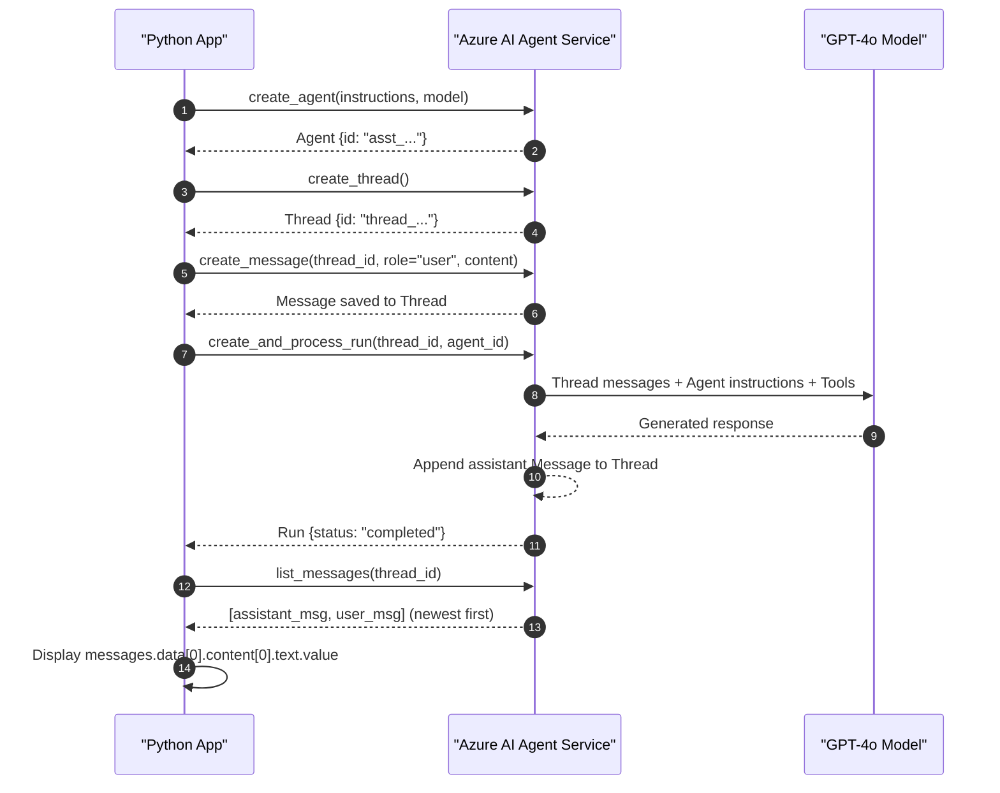
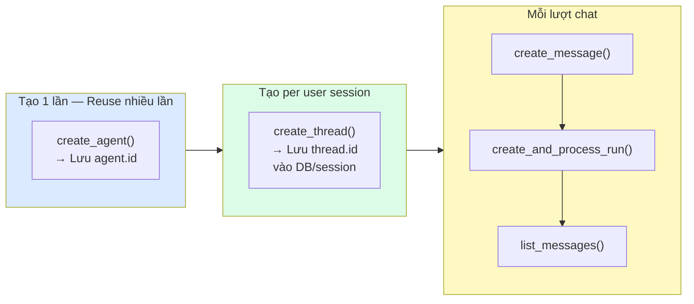

# Bài 05: Hello Agent — Build Agent đầu tiên

## 📋 Agenda

**Thời gian đọc ước tính:** ~25 phút | 💻 Lab

### Sau bài này, bạn sẽ:
- ✅ **Chạy được** AI Agent hoàn chỉnh end-to-end bằng Python
- ✅ **Thực hiện** multi-turn conversation — agent nhớ context từ lượt trước
- ✅ **Handle** các run status khác nhau khi có lỗi
- ✅ **Hiểu** best practices về cleanup và resource management

### Yêu cầu đầu vào:
- 🔹 Đã hoàn thành Bài 03 — `verify_setup.py` chạy thành công
- 🔹 Đã hoàn thành Bài 04 — hiểu Thread, Message, Run, State Machine
- 💰 **Azure cost:** ~$0.02-0.05

---

## ❓ Vấn đề & Giải pháp

**Mục tiêu của bài:** Biến kiến thức lý thuyết từ Bài 04 thành code chạy được. Bài này xây dựng từng bước, giải thích **tại sao** code được viết như vậy, không chỉ "copy-paste rồi chạy".

---

## 💻 Lab 05-01: Hello Agent cơ bản

Tạo file mới trong project folder:

```python
# filename: part2-hello-agent/lab-05-hello-agent.py
"""
Lab 05-01: Hello Agent - End-to-end example
Mục tiêu: Create agent → Thread → Message → Run → Read response
"""

import os
from dotenv import load_dotenv
from azure.ai.projects import AIProjectClient
from azure.identity import DefaultAzureCredential

load_dotenv()


def create_client() -> AIProjectClient:
    """Khởi tạo AI Project Client — tái sử dụng cho tất cả lab"""
    return AIProjectClient.from_connection_string(
        conn_str=os.environ["AZURE_AI_PROJECT_CONNECTION_STRING"],
        credential=DefaultAzureCredential()
    )


def main():
    client = create_client()
    
    # ── BƯỚC 1: Tạo Agent ──────────────────────────────────────────
    # Agent là "nhân vật" persistent — tạo 1 lần, dùng nhiều lần
    agent = client.agents.create_agent(
        model="gpt-4o",  # Hoặc "gpt-4o-mini" để tiết kiệm cost
        name="azure-tech-assistant",
        instructions="""Bạn là trợ lý kỹ thuật chuyên về Azure AI.
        Hãy trả lời ngắn gọn, chính xác bằng tiếng Việt.
        Với câu hỏi kỹ thuật, luôn kèm ví dụ code ngắn gọn.""",
    )
    print(f"✅ Agent created: {agent.id}")

    # ── BƯỚC 2: Tạo Thread ──────────────────────────────────────────
    # Thread = 1 cuộc trò chuyện. Lưu thread.id để continue conversation
    thread = client.agents.create_thread()
    print(f"✅ Thread created: {thread.id}")

    # ── BƯỚC 3: Add Message vào Thread ─────────────────────────────
    client.agents.create_message(
        thread_id=thread.id,
        role="user",
        content="Azure AI Agent Service là gì? Giải thích trong 3 bullet points.",
    )
    print("✅ Message added to thread")

    # ── BƯỚC 4: Tạo và chạy Run ────────────────────────────────────
    # create_and_process_run() = tạo run + tự động poll cho đến khi xong
    print("⏳ Running agent...")
    run = client.agents.create_and_process_run(
        thread_id=thread.id,
        agent_id=agent.id
    )
    print(f"✅ Run completed with status: {run.status}")

    # ── BƯỚC 5: Đọc Response ───────────────────────────────────────
    if run.status == "completed":
        messages = client.agents.list_messages(thread_id=thread.id)
        
        # messages.data trả về theo thứ tự mới nhất trước
        # data[0] = tin nhắn mới nhất = response của agent
        latest_message = messages.data[0]
        
        print("\n" + "─" * 50)
        print("🤖 Agent Response:")
        print("─" * 50)
        print(latest_message.content[0].text.value)
        print("─" * 50)

    elif run.status == "failed":
        # Hiện error để debug
        print(f"❌ Run failed: {run.last_error}")

    # ── BƯỚC 6: Cleanup ────────────────────────────────────────────
    # Best practice: Xoá agent sau khi dùng xong trong lab/testing
    # Production: Giữ agent để reuse qua nhiều Thread
    client.agents.delete_agent(agent.id)
    print(f"\n🧹 Agent deleted: {agent.id}")


if __name__ == "__main__":
    main()
```

**Chạy:**
```bash
python part2-hello-agent/lab-05-hello-agent.py
```

**Output mong đợi:**
```
✅ Agent created: asst_abc123xyz
✅ Thread created: thread_def456uvw
✅ Message added to thread
⏳ Running agent...
✅ Run completed with status: completed

──────────────────────────────────────────────────
🤖 Agent Response:
──────────────────────────────────────────────────
Azure AI Agent Service là gì? Đây là 3 điểm chính:

• **Managed runtime**: Dịch vụ Azure quản lý toàn bộ...
• **Tool orchestration**: Agent có thể tự động gọi...
• **Enterprise-grade**: Tích hợp Azure security...
──────────────────────────────────────────────────
🧹 Agent deleted: asst_abc123xyz
```

---

## 📖 Request Flow — Điều gì xảy ra bên trong?



---

## 💻 Lab 05-02: Multi-turn Conversation

Agent nhớ context từ các lượt trước — đây là điểm khác biệt với LLM call thông thường:

```python
# filename: part2-hello-agent/lab-05-multiturn.py
"""
Lab 05-02: Multi-turn conversation
Chứng minh Agent nhớ context nhờ Thread
"""

import os
from dotenv import load_dotenv
from azure.ai.projects import AIProjectClient
from azure.identity import DefaultAzureCredential

load_dotenv()


def ask_agent(client: AIProjectClient, thread_id: str, agent_id: str, question: str) -> str:
    """Helper: Gửi câu hỏi và nhận response trong 1 hàm"""
    # Add user message
    client.agents.create_message(
        thread_id=thread_id,
        role="user",
        content=question
    )
    
    # Run agent
    run = client.agents.create_and_process_run(
        thread_id=thread_id,
        agent_id=agent_id
    )
    
    if run.status != "completed":
        return f"[Error: Run ended with status '{run.status}']"
    
    # Lấy message mới nhất (index 0 = newest)
    messages = client.agents.list_messages(thread_id=thread_id)
    return messages.data[0].content[0].text.value


def main():
    client = AIProjectClient.from_connection_string(
        conn_str=os.environ["AZURE_AI_PROJECT_CONNECTION_STRING"],
        credential=DefaultAzureCredential()
    )

    # Tạo agent và thread một lần
    agent = client.agents.create_agent(
        model="gpt-4o",
        name="context-aware-assistant",
        instructions="Trợ lý kỹ thuật Azure. Nhớ mọi thông tin trong cuộc trò chuyện."
    )
    thread = client.agents.create_thread()

    print("💬 Bắt đầu multi-turn conversation...\n")

    # Turn 1: Giới thiệu context
    q1 = "Tôi đang học về Azure AI Agent Service và muốn build một Customer Support Bot."
    print(f"👤 Turn 1: {q1}")
    r1 = ask_agent(client, thread.id, agent.id, q1)
    print(f"🤖 Agent: {r1}\n")

    # Turn 2: Tham chiếu đến context cũ
    q2 = "Cho use case tôi vừa mô tả, nên dùng FileSearch hay Code Interpreter?"
    print(f"👤 Turn 2: {q2}")
    r2 = ask_agent(client, thread.id, agent.id, q2)
    print(f"🤖 Agent: {r2}\n")

    # Turn 3: Tiếp tục chain của reasoning
    q3 = "OK, bây giờ cho tôi biết cần cài những package gì để bắt đầu."
    print(f"👤 Turn 3: {q3}")
    r3 = ask_agent(client, thread.id, agent.id, q3)
    print(f"🤖 Agent: {r3}\n")

    # Chứng minh: Thread đang chứa 6 messages (3 user + 3 assistant)
    all_messages = client.agents.list_messages(thread_id=thread.id)
    print(f"📊 Thread hiện có {len(all_messages.data)} messages")
    print("   (3 user + 3 assistant — agent nhớ toàn bộ context!)")

    # Cleanup
    client.agents.delete_agent(agent.id)


if __name__ == "__main__":
    main()
```

---

## 💻 Lab 05-03: Error Handling

Xử lý các trường hợp Run không hoàn thành thành công:

```python
# filename: part2-hello-agent/lab-05-error-handling.py
"""
Lab 05-03: Proper error handling cho Agent runs
"""

import os
from dataclasses import dataclass
from dotenv import load_dotenv
from azure.ai.projects import AIProjectClient
from azure.identity import DefaultAzureCredential
from azure.core.exceptions import HttpResponseError

load_dotenv()

# Terminal states — Run không thể tiếp tục từ các state này
TERMINAL_STATES = {"completed", "failed", "cancelled", "expired"}


@dataclass
class AgentResponse:
    success: bool
    content: str
    run_status: str
    error_message: str = ""


def run_agent_safely(
    client: AIProjectClient,
    thread_id: str,
    agent_id: str,
    user_message: str
) -> AgentResponse:
    """
    Wrapper an toàn cho agent run — handle tất cả error cases
    """
    try:
        # Add message
        client.agents.create_message(
            thread_id=thread_id,
            role="user",
            content=user_message
        )
        
        # Run agent
        run = client.agents.create_and_process_run(
            thread_id=thread_id,
            agent_id=agent_id
        )
        
        # Handle theo từng terminal state
        if run.status == "completed":
            messages = client.agents.list_messages(thread_id=thread_id)
            content = messages.data[0].content[0].text.value
            return AgentResponse(success=True, content=content, run_status="completed")
        
        elif run.status == "failed":
            error_info = f"{run.last_error.code}: {run.last_error.message}" if run.last_error else "Unknown error"
            return AgentResponse(
                success=False,
                content="",
                run_status="failed",
                error_message=error_info
            )
        
        elif run.status == "expired":
            # Run expired (>10 phút) — thường do tool call không được submit kịp
            return AgentResponse(
                success=False,
                content="",
                run_status="expired",
                error_message="Run expired after 10 minutes. Reduce tool execution time."
            )
        
        else:
            return AgentResponse(
                success=False,
                content="",
                run_status=run.status,
                error_message=f"Unexpected terminal status: {run.status}"
            )

    except HttpResponseError as e:
        # Azure API errors (rate limit, quota, permission...)
        return AgentResponse(
            success=False,
            content="",
            run_status="error",
            error_message=f"Azure API error {e.status_code}: {e.message}"
        )


def main():
    client = AIProjectClient.from_connection_string(
        conn_str=os.environ["AZURE_AI_PROJECT_CONNECTION_STRING"],
        credential=DefaultAzureCredential()
    )
    
    agent = client.agents.create_agent(
        model="gpt-4o",
        name="robust-agent",
        instructions="Trợ lý kỹ thuật hữu ích."
    )
    thread = client.agents.create_thread()

    # Test với message bình thường
    response = run_agent_safely(
        client, thread.id, agent.id,
        "Azure AI Foundry được ra mắt năm nào?"
    )
    
    if response.success:
        print(f"✅ Success:\n{response.content}")
    else:
        print(f"❌ Failed [{response.run_status}]: {response.error_message}")
    
    client.agents.delete_agent(agent.id)


if __name__ == "__main__":
    main()
```

---

## 📖 Best Practices — Agent & Thread Lifecycle



| Điều nên làm | Điều nên tránh |
|---|---|
| ✅ Tái sử dụng Agent qua nhiều Thread | ❌ Tạo Agent mới mỗi request → tốn quota |
| ✅ Lưu `thread.id` trong database/session | ❌ Tạo Thread mới mỗi turn → mất context |
| ✅ Xoá Agent khi project kết thúc | ❌ Để Agent tồn đọng → khó quản lý |
| ✅ Handle `failed`/`expired` status | ❌ Assume run luôn `completed` |

---

## 🚀 WHAT IF

⚠️ **Pitfall #1: `messages.data[0]` không phải lúc nào cũng là assistant message**

Nếu vừa add user message rồi list ngay (chưa run), `data[0]` sẽ là user message. Cách an toàn hơn:

```python
messages = client.agents.list_messages(thread_id=thread.id)
for msg in messages.data:
    if msg.role == "assistant":  # Lọc chỉ assistant messages
        print(msg.content[0].text.value)
        break
```

⚠️ **Pitfall #2: Agent bị rate limit**

`create_and_process_run()` sẽ throw exception nếu bị rate limit. Thêm retry logic:

```python
from tenacity import retry, wait_exponential, stop_after_attempt

@retry(wait=wait_exponential(min=1, max=60), stop=stop_after_attempt(3))
def run_with_retry(client, thread_id, agent_id):
    return client.agents.create_and_process_run(
        thread_id=thread_id,
        agent_id=agent_id
    )
```

---

## 💬 Câu hỏi thảo luận

> **"Trong production, nên lưu `thread_id` ở đâu để có thể tiếp tục conversation khi user quay lại?"**
>
> *Gợi ý:* Thread là stateful resource sống trên Azure — chỉ cần lưu `thread_id` (string) là đủ để resume. Thông thường lưu vào: database (gắn với user_id), Redis (cho active sessions), hoặc JWT token (nếu session ngắn). Thread không bao giờ expire tự động — bạn phải chủ động delete khi không cần.

---

**Bài tiếp theo:** Bài 06 — Tools & Actions →

---

*Made by Anh Tu - Share to be shared*
