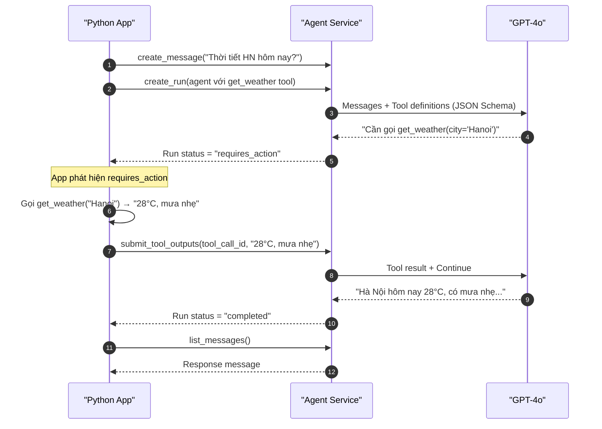

# Bài 06: Tools & Actions — Trao quyền cho Agent

## 📋 Agenda

**Thời gian đọc ước tính:** ~30 phút | 💻 Lab

### Sau bài này, bạn sẽ:
- ✅ **Định nghĩa** FunctionTool với JSON Schema cho Agent
- ✅ **Implement** tool execution loop xử lý `requires_action` state
- ✅ **Build** Weather Agent với custom tool hoạt động end-to-end
- ✅ **Handle** multiple tools trong cùng một Run

### Yêu cầu đầu vào:
- 🔹 Đã hoàn thành Bài 05 — Hello Agent chạy được
- 🔹 Hiểu Run State Machine (Bài 04)
- 💰 **Azure cost:** ~$0.03-0.08

---

## ❓ Vấn đề & Giải pháp

**Vấn đề của Agent không có Tools:**
- Agent chỉ biết những gì được train trong model (knowledge cutoff)
- Không thể lấy real-time data (thời tiết, giá chứng khoán, trạng thái đơn hàng)
- Không thể thực hiện actions (gửi email, ghi database, gọi API)

**Giải pháp — Function Calling:**
Định nghĩa hàm Python dưới dạng JSON Schema → Agent biết hàm đó tồn tại → Khi cần, Agent "yêu cầu" app gọi hàm → App gọi hàm thật → Trả kết quả về → Agent formulate response.

---

## 📖 Cơ chế Function Calling

**🔑 Key Point:** Agent KHÔNG trực tiếp chạy code Python của bạn. Agent chỉ tạo ra một "yêu cầu gọi hàm" dạng JSON, app của bạn phải tự thực thi hàm đó và submit kết quả lại.



---

## 📖 Anatomy của một Tool Definition

Tool được định nghĩa theo JSON Schema — đây là "hợp đồng" giữa Agent và hàm Python của bạn:

```python
# Tool schema — Agent dùng description để quyết định WHEN và HOW gọi tool
weather_tool = {
    "type": "function",
    "function": {
        # Tên phải khớp CHÍNH XÁC với key trong tool_handlers (bước thực thi)
        "name": "get_weather",
        
        # Description quan trọng nhất — LLM đọc cái này để quyết định có gọi không
        # Viết rõ ràng, cụ thể về khi nào nên dùng tool này
        "description": "Lấy thông tin thời tiết hiện tại của một thành phố cụ thể. "
                       "Dùng khi người dùng hỏi về thời tiết, nhiệt độ, hay điều kiện khí hậu.",
        
        # Parameters theo JSON Schema format
        "parameters": {
            "type": "object",
            "properties": {
                "city": {
                    "type": "string",
                    "description": "Tên thành phố bằng tiếng Anh (ví dụ: Hanoi, Ho Chi Minh City, Da Nang)"
                },
                "unit": {
                    "type": "string",
                    "enum": ["celsius", "fahrenheit"],
                    "description": "Đơn vị nhiệt độ. Mặc định là celsius."
                }
            },
            "required": ["city"]  # Chỉ city là bắt buộc, unit là optional
        }
    }
}
```

---

## 💻 Lab 06-01: Weather Agent

### Bước 1: Định nghĩa tools và hàm thực thi

```python
# filename: part2-hello-agent/lab-06-tool-agent.py
"""
Lab 06: Function Calling Agent — Weather + Exchange Rate
"""

import os
import json
import time
from dotenv import load_dotenv
from azure.ai.projects import AIProjectClient
from azure.identity import DefaultAzureCredential

load_dotenv()

# ── PHẦN 1: Định nghĩa tool schemas ────────────────────────────────

WEATHER_TOOL = {
    "type": "function",
    "function": {
        "name": "get_weather",
        "description": "Lấy thông tin thời tiết hiện tại của một thành phố. "
                       "Dùng khi người dùng hỏi về thời tiết hoặc nhiệt độ.",
        "parameters": {
            "type": "object",
            "properties": {
                "city": {
                    "type": "string",
                    "description": "Tên thành phố tiếng Anh (ví dụ: Hanoi, Da Nang)"
                }
            },
            "required": ["city"]
        }
    }
}

EXCHANGE_TOOL = {
    "type": "function",
    "function": {
        "name": "get_exchange_rate",
        "description": "Lấy tỷ giá hối đoái hiện tại giữa hai loại tiền tệ.",
        "parameters": {
            "type": "object",
            "properties": {
                "from_currency": {"type": "string", "description": "Mã tiền tệ gốc, ví dụ: USD"},
                "to_currency": {"type": "string", "description": "Mã tiền tệ đích, ví dụ: VND"}
            },
            "required": ["from_currency", "to_currency"]
        }
    }
}


# ── PHẦN 2: Implement các hàm thực tế ──────────────────────────────
# Trong production, đây sẽ là real API calls

def get_weather(city: str) -> dict:
    """Mock: Trong production thay bằng OpenWeather API hoặc tương đương"""
    mock_data = {
        "hanoi": {"temp": 28, "condition": "Mưa nhẹ", "humidity": 82},
        "ho chi minh city": {"temp": 33, "condition": "Nắng", "humidity": 65},
        "da nang": {"temp": 30, "condition": "Có mây", "humidity": 70},
        "hue": {"temp": 27, "condition": "Nhiều mây", "humidity": 78},
    }
    city_lower = city.lower()
    data = mock_data.get(city_lower, {"temp": 25, "condition": "Không có dữ liệu", "humidity": 0})
    return {
        "city": city,
        "temperature_celsius": data["temp"],
        "condition": data["condition"],
        "humidity_percent": data["humidity"]
    }


def get_exchange_rate(from_currency: str, to_currency: str) -> dict:
    """Mock: Trong production dùng ExchangeRate-API hoặc Vietcombank API"""
    mock_rates = {
        ("USD", "VND"): 25400,
        ("EUR", "VND"): 27800,
        ("JPY", "VND"): 170,
        ("USD", "EUR"): 0.92,
    }
    key = (from_currency.upper(), to_currency.upper())
    rate = mock_rates.get(key, None)
    if rate:
        return {"from": from_currency, "to": to_currency, "rate": rate, "note": "Mock data"}
    return {"error": f"Không có tỷ giá {from_currency}/{to_currency}"}


# ── PHẦN 3: Tool handler mapping ───────────────────────────────────
# Map tên tool → hàm Python tương ứng
TOOL_HANDLERS = {
    "get_weather": lambda args: get_weather(**args),
    "get_exchange_rate": lambda args: get_exchange_rate(**args),
}


# ── PHẦN 4: Tool execution loop ────────────────────────────────────

def execute_tool_calls(run, client: AIProjectClient, thread_id: str):
    """
    Xử lý requires_action state:
    1. Extract tool calls từ run
    2. Thực thi từng tool
    3. Submit kết quả về Agent Service
    """
    tool_calls = run.required_action.submit_tool_outputs.tool_calls
    tool_outputs = []

    for tc in tool_calls:
        tool_name = tc.function.name
        # Agent trả về arguments dưới dạng JSON string — cần parse
        arguments = json.loads(tc.function.arguments)

        print(f"  🔧 Calling tool: {tool_name}({arguments})")

        if tool_name in TOOL_HANDLERS:
            result = TOOL_HANDLERS[tool_name](arguments)
        else:
            result = {"error": f"Unknown tool: {tool_name}"}

        print(f"  ✅ Tool result: {result}")

        tool_outputs.append({
            "tool_call_id": tc.id,
            # Output PHẢI là string — dùng json.dumps cho dict
            "output": json.dumps(result, ensure_ascii=False)
        })

    # Submit tất cả tool outputs cùng một lúc
    return client.agents.submit_tool_outputs_to_run(
        thread_id=thread_id,
        run_id=run.id,
        tool_outputs=tool_outputs
    )


def run_agent_with_tools(
    client: AIProjectClient,
    thread_id: str,
    agent_id: str,
    user_message: str
) -> str:
    """
    Manual polling loop — cần thiết khi có custom tools
    create_and_process_run() không handle custom functions
    """
    # Add user message
    client.agents.create_message(
        thread_id=thread_id,
        role="user",
        content=user_message
    )

    # Tạo run (không dùng create_and_process_run vì cần tự xử lý requires_action)
    run = client.agents.create_run(
        thread_id=thread_id,
        agent_id=agent_id
    )

    # Polling loop
    print(f"⏳ Run started: {run.id}")
    while run.status in ["queued", "in_progress", "requires_action"]:
        time.sleep(0.8)  # Tránh rate limiting
        run = client.agents.get_run(thread_id=thread_id, run_id=run.id)
        print(f"   Status: {run.status}")

        if run.status == "requires_action":
            print("🎯 Agent needs tool execution!")
            run = execute_tool_calls(run, client, thread_id)

    # Đọc response
    if run.status == "completed":
        messages = client.agents.list_messages(thread_id=thread_id)
        return messages.data[0].content[0].text.value
    else:
        return f"[Error: Run ended with status '{run.status}']"


# ── PHẦN 5: Main ───────────────────────────────────────────────────

def main():
    client = AIProjectClient.from_connection_string(
        conn_str=os.environ["AZURE_AI_PROJECT_CONNECTION_STRING"],
        credential=DefaultAzureCredential()
    )

    # Tạo agent với 2 tools
    agent = client.agents.create_agent(
        model="gpt-4o",
        name="utility-agent",
        instructions="""Bạn là trợ lý thông minh có thể:
        1. Tra cứu thời tiết hiện tại của các thành phố
        2. Xem tỷ giá hối đoái
        
        Luôn dùng tools để lấy thông tin thực tế thay vì đoán.
        Trả lời bằng tiếng Việt, rõ ràng và thân thiện.""",
        tools=[WEATHER_TOOL, EXCHANGE_TOOL]
    )

    thread = client.agents.create_thread()

    # Test 1: Hỏi thời tiết
    print("\n" + "=" * 60)
    print("Test 1: Hỏi thời tiết")
    print("=" * 60)
    response1 = run_agent_with_tools(
        client, thread.id, agent.id,
        "Thời tiết Hà Nội và Đà Nẵng hôm nay thế nào?"
    )
    print(f"\n🤖 Response:\n{response1}")

    # Test 2: Hỏi câu hỏi kết hợp cả 2 tools
    print("\n" + "=" * 60)
    print("Test 2: Kết hợp 2 tools")
    print("=" * 60)
    response2 = run_agent_with_tools(
        client, thread.id, agent.id,
        "Tôi có 500 USD. Đổi sang VND được bao nhiêu? Và thời tiết TP.HCM hôm nay là gì?"
    )
    print(f"\n🤖 Response:\n{response2}")

    # Cleanup
    client.agents.delete_agent(agent.id)
    print("\n🧹 Done!")


if __name__ == "__main__":
    main()
```

---

## 📖 Hiểu sâu — Tool Description là chìa khóa

**Tool description ảnh hưởng trực tiếp đến chất lượng Tool Use của Agent.** GPT-4o đọc description để quyết định:
1. **Khi nào** gọi tool này?
2. **Tham số nào** cần truyền vào?

```python
# ❌ BAD description — quá mơ hồ
"description": "Get weather"

# ✅ GOOD description — rõ ràng use case và format
"description": "Lấy thông tin thời tiết hiện tại của một thành phố. "
               "Dùng khi người dùng hỏi về thời tiết, nhiệt độ, độ ẩm, hoặc điều kiện khí hậu. "
               "Không dùng cho dự báo thời tiết tương lai."
```

---

## 🚀 WHAT IF — Pitfalls & Advanced Patterns

⚠️ **Pitfall #1: Quên parse JSON arguments**

Agent trả về `tc.function.arguments` dưới dạng **string JSON**, không phải dict:
```python
# ❌ Sai — arguments là string, không phải dict
result = get_weather(tc.function.arguments)

# ✅ Đúng — parse trước khi unpack
arguments = json.loads(tc.function.arguments)
result = get_weather(**arguments)
```

⚠️ **Pitfall #2: Tool output phải là string**

```python
# ❌ Sai — dict không được chấp nhận
{"tool_call_id": tc.id, "output": {"temp": 28}}

# ✅ Đúng — serialize thành string
{"tool_call_id": tc.id, "output": json.dumps({"temp": 28})}
```

⚠️ **Pitfall #3: Agent có thể gọi cùng 1 tool nhiều lần**

Một Run có thể có nhiều `requires_action` — ví dụ: Agent gọi `get_weather("Hanoi")` → nhận kết quả → quyết định gọi tiếp `get_weather("Da Nang")`. Polling loop đã handle case này (loop tiếp tục cho đến khi `completed`).

---

## 💬 Câu hỏi thảo luận

> **"Nếu tool của bạn cần 30 giây để chạy (ví dụ: generate report phức tạp), làm sao tránh run bị expired?"**
>
> *Gợi ý:* Azure AI Run expires sau 10 phút — nếu tool execution mất nhiều thời gian, cần implement async pattern: run tool background → lưu kết quả tạm → submit khi xong. Ngoài ra, có thể chia task lớn thành nhiều tool calls nhỏ hơn. Trade-off giữa complexity của implementation và user experience.

---

**Bài tiếp theo:** Bài 07 — Recipe: RAG Agent với Azure AI Search →

---

*Made by Anh Tu - Share to be shared*
