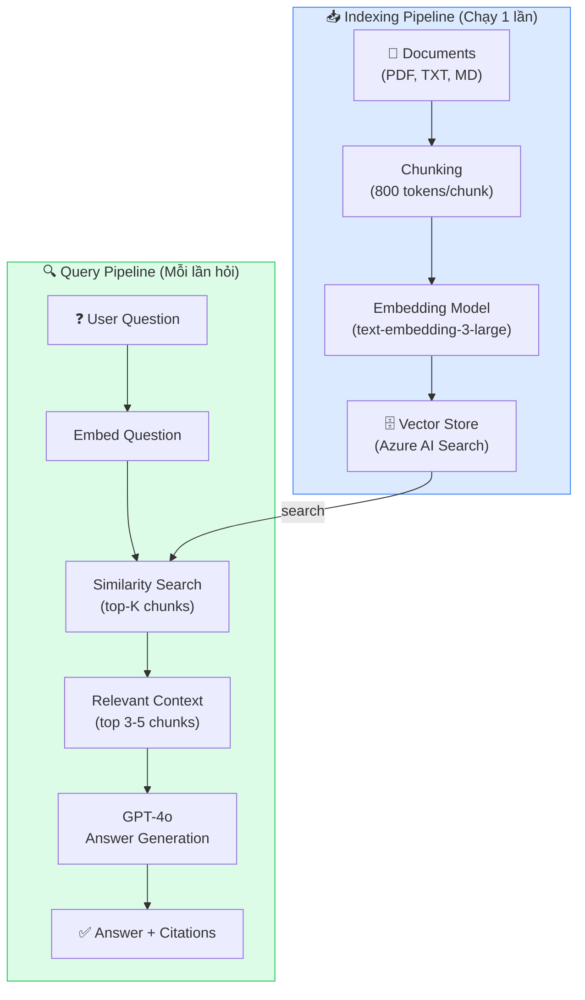
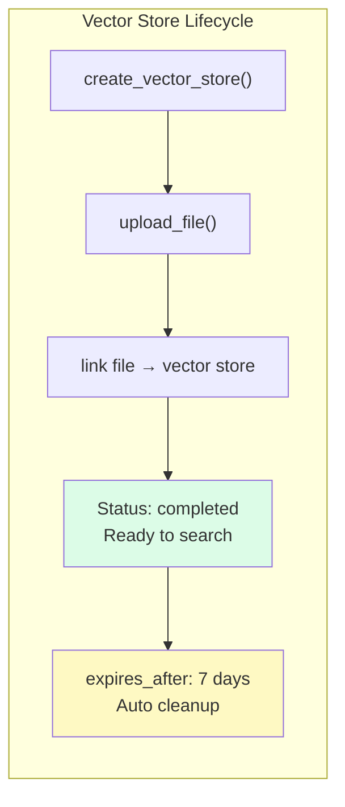

# Bài 07: Recipe — RAG Agent với Azure AI Search

## 📋 Agenda

**Thời gian đọc ước tính:** ~30 phút | 💻 Lab

### Sau bài này, bạn sẽ:
- ✅ **Hiểu** kiến trúc RAG và tại sao Agent cần external knowledge
- ✅ **Tạo** Vector Store và upload documents bằng Python SDK
- ✅ **Build** Customer Support Agent trả lời dựa trên knowledge base thực tế
- ✅ **Parse** citations từ response để biết agent lấy thông tin từ đâu

### Yêu cầu đầu vào:
- 🔹 Đã hoàn thành Bài 06 — hiểu Tools pattern
- 💰 **Azure cost:** ~$0.05-0.10 (embeddings + GPT calls)

---

## ❓ Vấn đề & Giải pháp

**Vấn đề khi Agent không có external knowledge:**
- GPT-4o có knowledge cutoff — không biết chính sách nội bộ, sản phẩm mới, hay tài liệu riêng của công ty
- Context window có giới hạn — không thể nhét toàn bộ tài liệu vào prompt
- Tài liệu cập nhật liên tục — không thể fine-tune model mỗi lần update

**Giải pháp — RAG (Retrieval-Augmented Generation):**
Thay vì nhét toàn bộ tài liệu vào prompt, **chỉ lấy những đoạn liên quan** và đưa vào context. Agent Service xử lý toàn bộ việc này qua `FileSearchTool` + Vector Store.

---

## 📖 RAG Architecture



**Trong Azure AI Agent Service:** Chunking, Embedding, và Search đều được xử lý tự động bởi `FileSearchTool`. Bạn chỉ cần upload file và gắn tool vào agent.

---

## 📖 FileSearchTool & Vector Store

**Vector Store** là nơi Azure lưu trữ embedded documents. Mỗi Vector Store có:
- Một tập files đã được indexed
- Expiration policy (tự cleanup)
- Chunking configuration (tuỳ chỉnh được)



---

## 💻 Lab 07: Customer Support RAG Agent

### Bước 1: Chuẩn bị sample documents

Tạo folder `data/` và file tài liệu mẫu:

```markdown
<!-- filename: data/product-faq.md -->
# Chính sách đổi trả sản phẩm

## Điều kiện đổi trả
- Sản phẩm còn trong thời hạn bảo hành (12 tháng từ ngày mua)
- Sản phẩm không có dấu hiệu hư hỏng do người dùng
- Có hoá đơn mua hàng đầy đủ

## Quy trình đổi trả
1. Liên hệ hotline 1800-xxxx hoặc email support@company.com
2. Cung cấp mã đơn hàng và mô tả vấn đề
3. Nhân viên xác nhận trong 24 giờ làm việc
4. Gửi sản phẩm về địa chỉ kho (phí ship do công ty hỗ trợ)
5. Nhận hàng đổi hoặc hoàn tiền trong 3-5 ngày làm việc

## Sản phẩm không được đổi trả
- Phần mềm đã kích hoạt bản quyền
- Sản phẩm có dấu ấn cá nhân hoá (khắc tên, in logo)
- Phụ kiện tiêu hao (pin, cable bị đứt do sử dụng)
```

```markdown
<!-- filename: data/shipping-policy.md -->
# Chính sách vận chuyển

## Thời gian giao hàng
- Nội thành Hà Nội và TP.HCM: 1-2 ngày làm việc
- Các tỉnh thành khác: 3-5 ngày làm việc
- Vùng sâu vùng xa: 5-7 ngày làm việc

## Phí vận chuyển
- Đơn hàng trên 500.000 VNĐ: Miễn phí ship toàn quốc
- Đơn hàng dưới 500.000 VNĐ: 30.000 VNĐ/đơn

## Theo dõi đơn hàng
Tra cứu tại: tracking.company.com
Hoặc nhập mã vận đơn trong app mobile
```

### Bước 2: Code RAG Agent hoàn chỉnh

```python
# filename: part3-recipes/lab-07-rag-agent.py
"""
Recipe 07: RAG Agent với FileSearchTool
Mục tiêu: Agent trả lời từ documents, có citation
"""

import os
import time
from pathlib import Path
from dotenv import load_dotenv
from azure.ai.projects import AIProjectClient
from azure.ai.projects.models import FileSearchTool
from azure.identity import DefaultAzureCredential

load_dotenv()


def create_client() -> AIProjectClient:
    return AIProjectClient.from_connection_string(
        conn_str=os.environ["AZURE_AI_PROJECT_CONNECTION_STRING"],
        credential=DefaultAzureCredential()
    )


def upload_documents(client: AIProjectClient, file_paths: list[str]) -> list[str]:
    """Upload multiple documents và trả về list file IDs"""
    file_ids = []
    for file_path in file_paths:
        print(f"  📤 Uploading: {Path(file_path).name}")
        with open(file_path, "rb") as f:
            uploaded = client.agents.upload_file_and_poll(
                file=f,
                purpose="assistants"  # Purpose cho agent usage
            )
        file_ids.append(uploaded.id)
        print(f"     ✅ File ID: {uploaded.id}")
    return file_ids


def create_vector_store(client: AIProjectClient, name: str, file_ids: list[str]):
    """Tạo Vector Store và index các file đã upload"""
    print(f"\n🗄️  Creating vector store: '{name}'")

    vector_store = client.agents.create_vector_store_and_poll(
        file_ids=file_ids,
        name=name,
        # Tự động xoá sau 7 ngày không dùng
        expires_after={
            "anchor": "last_active_at",
            "days": 7
        }
    )

    print(f"  ✅ Vector store ready: {vector_store.id}")
    print(f"  📊 Status: {vector_store.status}")
    print(f"  📁 Files indexed: {vector_store.file_counts.completed}/{vector_store.file_counts.total}")
    return vector_store


def build_support_agent(client: AIProjectClient, vector_store_id: str):
    """Tạo Customer Support Agent với FileSearch"""

    # Gắn vector store vào FileSearchTool
    file_search = FileSearchTool(vector_store_ids=[vector_store_id])

    agent = client.agents.create_agent(
        model="gpt-4o",
        name="customer-support-agent",
        instructions="""Bạn là nhân viên hỗ trợ khách hàng chuyên nghiệp.

QUAN TRỌNG:
- Chỉ trả lời dựa trên tài liệu chính sách đã được cung cấp
- Nếu không tìm thấy thông tin trong tài liệu, hãy nói thật và đề nghị khách gọi hotline
- Luôn trích dẫn nguồn khi trả lời
- Trả lời lịch sự, rõ ràng bằng tiếng Việt""",
        tools=file_search.definitions,  # FileSearchTool definitions
        tool_resources=file_search.resources  # Link đến vector store
    )

    print(f"\n🤖 Support agent created: {agent.id}")
    return agent


def parse_citations(messages) -> str:
    """Extract response text và citations từ messages"""
    latest = messages.data[0]
    full_text = ""
    citations = []

    for content in latest.content:
        if content.type == "text":
            text_value = content.text.value

            # Parse annotations để lấy citations
            for ann in content.text.annotations or []:
                if ann.type == "file_citation":
                    # Tìm file name từ file_id
                    citation_ref = f"[nguồn: {ann.file_citation.file_id[:8]}...]"
                    text_value = text_value.replace(ann.text, citation_ref)
                    citations.append({
                        "quote": ann.file_citation.quote[:100] + "...",
                        "file_id": ann.file_citation.file_id
                    })

            full_text = text_value

    return full_text, citations


def ask_support(client, thread_id, agent_id, question):
    """Gửi câu hỏi support và nhận response với citations"""
    print(f"\n❓ Khách hàng hỏi: {question}")

    client.agents.create_message(
        thread_id=thread_id,
        role="user",
        content=question
    )

    run = client.agents.create_and_process_run(
        thread_id=thread_id,
        agent_id=agent_id
    )

    if run.status == "completed":
        messages = client.agents.list_messages(thread_id=thread_id)
        response_text, citations = parse_citations(messages)

        print(f"\n💬 Agent:\n{response_text}")

        if citations:
            print(f"\n📚 Nguồn tham khảo ({len(citations)} đoạn):")
            for i, c in enumerate(citations, 1):
                print(f"   [{i}] \"{c['quote']}\"")
    else:
        print(f"❌ Run failed: {run.status}")


def main():
    client = create_client()

    # ── BƯỚC 1: Upload documents ──────────────────────────────────
    print("=" * 60)
    print("📥 Bước 1: Upload documents")
    print("=" * 60)

    # Tạo sample files nếu chưa có
    sample_files = [
        "data/product-faq.md",
        "data/shipping-policy.md"
    ]
    # (Giả sử các file đã được tạo theo hướng dẫn ở phần trên)

    file_ids = upload_documents(client, sample_files)

    # ── BƯỚC 2: Tạo Vector Store ──────────────────────────────────
    print("\n" + "=" * 60)
    print("🗄️  Bước 2: Create Vector Store")
    print("=" * 60)

    vector_store = create_vector_store(
        client,
        name="company-support-kb",
        file_ids=file_ids
    )

    # ── BƯỚC 3: Tạo Support Agent ─────────────────────────────────
    print("\n" + "=" * 60)
    print("🤖 Bước 3: Create Support Agent")
    print("=" * 60)

    agent = build_support_agent(client, vector_store.id)
    thread = client.agents.create_thread()

    # ── BƯỚC 4: Test Q&A ──────────────────────────────────────────
    print("\n" + "=" * 60)
    print("💬 Bước 4: Test Q&A")
    print("=" * 60)

    questions = [
        "Tôi mua sản phẩm 2 tháng trước, muốn đổi thì được không?",
        "Phí ship bao nhiêu với đơn hàng 300k?",
        "Quy trình đổi trả gồm mấy bước?",
        "Công ty có hỗ trợ giao hàng đến vùng núi không?"
    ]

    for q in questions:
        ask_support(client, thread.id, agent.id, q)
        print()

    # ── Cleanup ───────────────────────────────────────────────────
    client.agents.delete_vector_store(vector_store.id)
    client.agents.delete_agent(agent.id)
    print("\n🧹 Cleanup done!")


if __name__ == "__main__":
    main()
```

---

## 📖 FileSearchTool API — Deep Dive

### Cú pháp khởi tạo đúng

```python
from azure.ai.projects.models import FileSearchTool

# Cách 1: Gắn vector store khi create tool
file_search = FileSearchTool(vector_store_ids=["vs_xxx", "vs_yyy"])

# Khi gắn vào agent, phải truyền CẢ HAI:
agent = client.agents.create_agent(
    ...,
    tools=file_search.definitions,    # ← Tool definitions (JSON schema)
    tool_resources=file_search.resources  # ← Vector store references
)
```

### Chunking Strategy (tuỳ chỉnh)

```python
# Tuỳ chỉnh cách chia document thành chunks
vector_store = client.agents.create_vector_store(
    name="custom-chunked-kb",
    file_ids=file_ids,
    chunking_strategy={
        "type": "static",
        "static": {
            "max_chunk_size_tokens": 600,  # Nhỏ hơn → precision cao hơn
            "chunk_overlap_tokens": 100    # Overlap để không mất context
        }
    }
)
```

**Trade-off chunking:**

| Chunk Size | Recall | Precision | Context |
|---|---|---|---|
| Nhỏ (300-500 tokens) | ✅ Tốt | ⚠️ Có thể thiếu context | Nhiều chunks |
| Trung bình (600-800 tokens) | ✅ Cân bằng | ✅ Cân bằng | **Recommended** |
| Lớn (1000+ tokens) | ⚠️ Có thể miss | ✅ Đủ context | Ít chunks |

---

## 🚀 WHAT IF — Pitfalls & Tips

⚠️ **Pitfall #1: Quên `tool_resources` khi tạo agent**

```python
# ❌ Sai — chỉ có tools, thiếu tool_resources → agent không biết vector store nào
agent = client.agents.create_agent(tools=file_search.definitions)

# ✅ Đúng — cần cả hai
agent = client.agents.create_agent(
    tools=file_search.definitions,
    tool_resources=file_search.resources
)
```

⚠️ **Pitfall #2: Vector store chưa hoàn thành indexing**

```python
# Dùng create_vector_store_and_poll() thay vì create_vector_store()
# _and_poll versions tự động chờ cho đến khi indexing xong
vector_store = client.agents.create_vector_store_and_poll(...)
# Khi return → status đã là "completed"
```

⚠️ **Pitfall #3: File format không được hỗ trợ**

FileSearchTool hỗ trợ: `.md`, `.txt`, `.pdf`, `.docx`, `.pptx`, `.html`, `.json`

❌ Không hỗ trợ: `.xlsx`, `.csv` (dùng Code Interpreter cho file data)

---

## 💬 Câu hỏi thảo luận

> **"Nếu knowledge base có 10,000 tài liệu, làm sao tổ chức Vector Stores cho hiệu quả?"**
>
> *Gợi ý:* Không nên nhét tất cả vào 1 Vector Store lớn. Cân nhắc phân theo domain (HR policies, Product docs, Technical specs) → mỗi agent specialist có vector store riêng. Kết hợp với pattern Multi-Agent (Bài 10): orchestrator điều hướng câu hỏi đến đúng specialist.

---

**Bài tiếp theo:** Bài 08 — Recipe: Code Interpreter Agent →

---

*Made by Anh Tu - Share to be shared*
