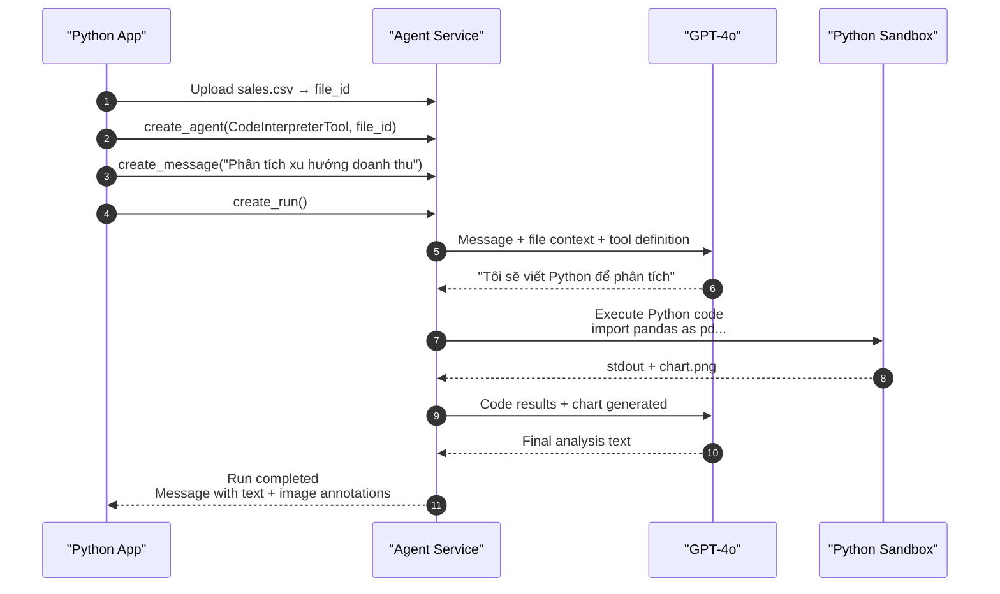

# Bài 08: Recipe — Code Interpreter Agent

## 📋 Agenda

**Thời gian đọc ước tính:** ~25 phút | 💻 Lab

### Sau bài này, bạn sẽ:
- ✅ **Hiểu** cơ chế Code Interpreter — sandbox Python trong Azure
- ✅ **Upload** data file và yêu cầu agent phân tích tự động
- ✅ **Nhận** code output, table, và chart (PNG) từ agent
- ✅ **Build** Data Analysis Agent hoàn chỉnh end-to-end

### Yêu cầu đầu vào:
- 🔹 Đã hoàn thành Bài 06 — hiểu Tools pattern
- 💰 **Azure cost:** ~$0.10-0.15 (Code Interpreter tốn hơn FileSearch)

---

## ❓ Vấn đề & Giải pháp

**Vấn đề phân tích dữ liệu với LLM thuần:**
- LLM không thể thực sự tính toán — chỉ predict text trông như kết quả
- Không thể đọc và xử lý file CSV/Excel
- Không thể tạo biểu đồ visualization

**Giải pháp — Code Interpreter Tool:**
Agent được cung cấp một **sandboxed Python environment** trên Azure. Agent tự viết code Python, chạy thực tế, và trả kết quả về. Không phải "predict" — là **execute thật**.

---

## 📖 Code Interpreter — Cơ chế hoạt động



**Điểm khác biệt vs Function Calling:**
- **Function Calling (Bài 06):** Agent yêu cầu → App thực thi → App submit kết quả
- **Code Interpreter:** Agent tự viết code → Azure Sandbox thực thi → Không cần app làm gì thêm

---

## 💻 Lab 08: Data Analysis Agent

### Bước 1: Tạo sample CSV data

```python
# filename: scripts/create-sample-data.py
"""Tạo file data mẫu cho lab"""

import csv
from pathlib import Path

Path("data").mkdir(exist_ok=True)

# Sales data mẫu
with open("data/sales_2025.csv", "w", newline="", encoding="utf-8") as f:
    writer = csv.writer(f)
    writer.writerow(["month", "region", "product", "revenue", "units"])
    writer.writerows([
        ["Jan", "HN", "Laptop", 150000000, 5],
        ["Jan", "HCM", "Laptop", 200000000, 7],
        ["Jan", "HN", "Phone", 80000000, 20],
        ["Jan", "HCM", "Phone", 120000000, 30],
        ["Feb", "HN", "Laptop", 180000000, 6],
        ["Feb", "HCM", "Laptop", 210000000, 7],
        ["Feb", "HN", "Phone", 90000000, 22],
        ["Feb", "HCM", "Phone", 140000000, 35],
        ["Mar", "HN", "Laptop", 220000000, 7],
        ["Mar", "HCM", "Laptop", 280000000, 9],
        ["Mar", "HN", "Phone", 110000000, 28],
        ["Mar", "HCM", "Phone", 160000000, 40],
        ["Apr", "HN", "Laptop", 195000000, 6],
        ["Apr", "HCM", "Laptop", 240000000, 8],
        ["Apr", "HN", "Phone", 95000000, 24],
        ["Apr", "HCM", "Phone", 148000000, 37],
    ])

print("✅ data/sales_2025.csv created")
```

### Bước 2: Code Interpreter Agent hoàn chỉnh

```python
# filename: part3-recipes/lab-08-code-interpreter.py
"""
Recipe 08: Code Interpreter Agent — Data Analysis
Mục tiêu: Upload CSV → Agent tự phân tích → Nhận insights + chart
"""

import os
from pathlib import Path
from dotenv import load_dotenv
from azure.ai.projects import AIProjectClient
from azure.ai.projects.models import CodeInterpreterTool
from azure.identity import DefaultAzureCredential

load_dotenv()


def create_client() -> AIProjectClient:
    return AIProjectClient.from_connection_string(
        conn_str=os.environ["AZURE_AI_PROJECT_CONNECTION_STRING"],
        credential=DefaultAzureCredential()
    )


def upload_data_file(client: AIProjectClient, file_path: str):
    """Upload data file cho Code Interpreter sử dụng"""
    print(f"📤 Uploading data file: {Path(file_path).name}")
    with open(file_path, "rb") as f:
        uploaded = client.agents.upload_file_and_poll(
            file=f,
            purpose="assistants"
        )
    print(f"   ✅ File ID: {uploaded.id}")
    return uploaded


def save_output_files(client: AIProjectClient, messages, output_dir: str = "output"):
    """
    Parse message annotations để lấy và lưu các file output
    (charts, generated data, etc.)
    """
    Path(output_dir).mkdir(exist_ok=True)
    saved_files = []

    for msg in messages.data:
        if msg.role != "assistant":
            continue

        for content in msg.content:
            if content.type == "image_file":
                # Lưu chart/image được tạo bởi Code Interpreter
                file_id = content.image_file.file_id
                file_content = client.agents.get_file_content(file_id)

                output_path = Path(output_dir) / f"chart_{file_id[:8]}.png"
                with open(output_path, "wb") as f:
                    f.write(file_content.read())

                saved_files.append(str(output_path))
                print(f"   💾 Chart saved: {output_path}")

            elif content.type == "text":
                # In text response
                print(f"\n💬 Agent Analysis:\n{content.text.value}")

    return saved_files


def run_analysis(client, thread_id, agent_id, question):
    """Chạy analysis request"""
    print(f"\n❓ Request: {question}")
    print("⏳ Agent đang viết và chạy Python code...")

    client.agents.create_message(
        thread_id=thread_id,
        role="user",
        content=question
    )

    run = client.agents.create_and_process_run(
        thread_id=thread_id,
        agent_id=agent_id
    )

    if run.status == "completed":
        messages = client.agents.list_messages(thread_id=thread_id)
        return save_output_files(client, messages)
    else:
        print(f"❌ Run failed: {run.status} — {run.last_error}")
        return []


def main():
    client = create_client()

    # ── BƯỚC 1: Upload data ───────────────────────────────────────
    print("=" * 60)
    print("📥 Bước 1: Upload Data File")
    print("=" * 60)

    data_file = upload_data_file(client, "data/sales_2025.csv")

    # ── BƯỚC 2: Tạo Code Interpreter Agent ───────────────────────
    print("\n" + "=" * 60)
    print("🤖 Bước 2: Create Code Interpreter Agent")
    print("=" * 60)

    # Code Interpreter cần file_ids khi tạo agent
    code_interpreter = CodeInterpreterTool(file_ids=[data_file.id])

    agent = client.agents.create_agent(
        model="gpt-4o",
        name="data-analyst-agent",
        instructions="""Bạn là Data Analyst chuyên nghiệp.
        
Khi phân tích dữ liệu:
1. Luôn bắt đầu bằng khám phá cơ bản (shape, columns, sample data)
2. Tính summary statistics cho numeric columns
3. Tạo visualization phù hợp (bar chart, line chart...)
4. Đưa ra insights cụ thể và actionable recommendations
5. Sử dụng pandas, matplotlib; format số tiền theo VNĐ
6. Trả lời bằng tiếng Việt""",
        tools=code_interpreter.definitions,
        tool_resources=code_interpreter.resources
    )

    thread = client.agents.create_thread()
    print(f"✅ Agent: {agent.id} | Thread: {thread.id}")

    # ── BƯỚC 3: Chạy phân tích ────────────────────────────────────
    print("\n" + "=" * 60)
    print("📊 Bước 3: Run Analysis Tasks")
    print("=" * 60)

    # Task 1: Overview và summary
    run_analysis(
        client, thread.id, agent.id,
        "Hãy khám phá dataset này: cho tôi biết cấu trúc, các cột, "
        "và thống kê tổng quan về doanh thu."
    )

    # Task 2: Trend analysis với chart
    run_analysis(
        client, thread.id, agent.id,
        "Vẽ biểu đồ cột so sánh doanh thu theo tháng, "
        "phân chia màu theo region (HN vs HCM). "
        "Nhận xét xu hướng."
    )

    # Task 3: Product performance
    run_analysis(
        client, thread.id, agent.id,
        "Sản phẩm nào đóng góp nhiều doanh thu nhất? "
        "Tính % đóng góp và vẽ pie chart."
    )

    # ── Cleanup ───────────────────────────────────────────────────
    client.agents.delete_agent(agent.id)
    print("\n🧹 Cleanup done! Charts saved to output/ folder")


if __name__ == "__main__":
    main()
```

---

## 📖 Xử lý Output Types

Agent Code Interpreter có thể trả về nhiều loại content. Cách parse đúng:

```python
def process_message_content(client, message):
    """Parse tất cả content types từ một assistant message"""
    results = {"text": "", "charts": [], "files": []}

    for content in message.content:

        if content.type == "text":
            # Text response (kèm annotations nếu có)
            results["text"] = content.text.value

        elif content.type == "image_file":
            # Chart hoặc image được generate
            file_id = content.image_file.file_id
            file_bytes = client.agents.get_file_content(file_id).read()
            results["charts"].append({
                "file_id": file_id,
                "bytes": file_bytes
            })

    return results
```

---

## 🚀 WHAT IF — Pitfalls & Tips

⚠️ **Pitfall #1: File IDs phải được truyền khi tạo Agent, không phải khi tạo Message**

```python
# ❌ Sai — file_ids trong message không cho Code Interpreter access
client.agents.create_message(
    thread_id=thread.id,
    role="user",
    content="Analyze this",
    file_ids=[file.id]  # Không work cho Code Interpreter
)

# ✅ Đúng — file_ids trong CodeInterpreterTool khi tạo agent
code_interpreter = CodeInterpreterTool(file_ids=[file.id])
agent = client.agents.create_agent(
    tools=code_interpreter.definitions,
    tool_resources=code_interpreter.resources
)
```

⚠️ **Pitfall #2: Code Interpreter không có internet access**

Sandbox hoàn toàn isolated — không thể `pip install` thêm packages hay call external APIs. Chỉ dùng được các libraries pre-installed: `pandas`, `numpy`, `matplotlib`, `scikit-learn`, `scipy`.

⚠️ **Pitfall #3: File size limit**

Code Interpreter có giới hạn file size (512MB). Với large datasets, cân nhắc aggregate trước khi upload.

---

## 💬 Câu hỏi thảo luận

> **"Code Interpreter chạy Python trong sandbox — làm sao biết code được generate có chạy đúng không? Agent có thể tự debug không?"**
>
> *Gợi ý:* Có! Agent Service cho phép Agent **nhìn thấy stdout/stderr** từ code execution. Nếu code bị lỗi, agent sẽ tự động sửa và chạy lại — đây là ReAct loop thực sự. Bạn có thể observe điều này qua Run Steps: mỗi tool call = 1 step, mỗi code execution = 1 step với output.

---

**Bài tiếp theo:** Bài 09 — Recipe: File Search Agent →

---

*Made by Anh Tu - Share to be shared*
