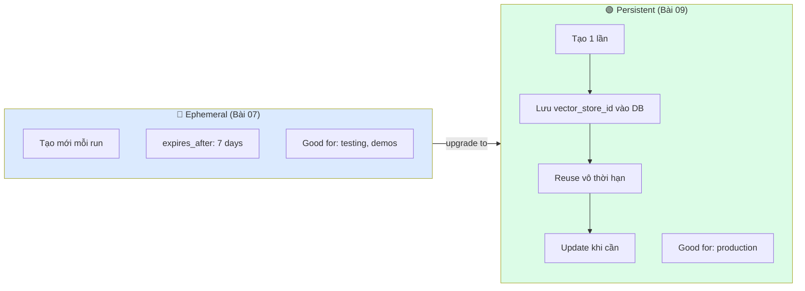
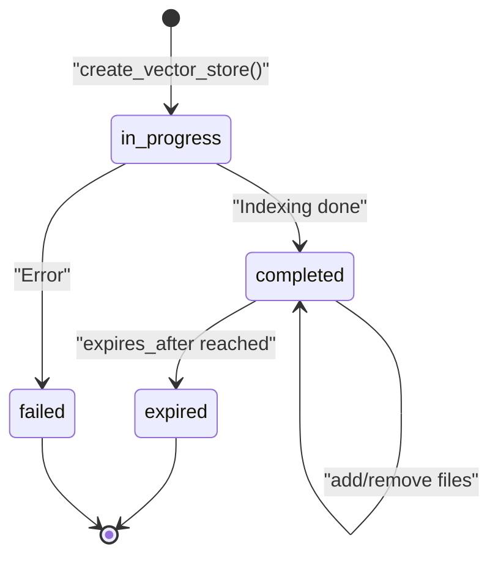

# Bài 09: Recipe — File Search Agent nâng cao

## 📋 Agenda

**Thời gian đọc ước tính:** ~20 phút | 💻 Lab

### Sau bài này, bạn sẽ:
- ✅ **Phân biệt** FileSearch (Bài 07) vs các advanced patterns trong bài này
- ✅ **Implement** Persistent Vector Store — tạo 1 lần, tái sử dụng nhiều phiên
- ✅ **Update** documents trong Vector Store mà không tạo lại từ đầu
- ✅ **Query** metadata để filter tài liệu trước khi search

### Yêu cầu đầu vào:
- 🔹 Đã hoàn thành Bài 07 — hiểu FileSearch cơ bản
- 💰 **Azure cost:** ~$0.03-0.05

---

## ❓ Vấn đề & Giải pháp

**Vấn đề với pattern Bài 07:**
- Tạo Vector Store mới mỗi lần chạy → mất thời gian indexing, tốn chi phí
- Không cập nhật được tài liệu khi chính sách thay đổi
- Không thể phân biệt tài liệu theo loại/domain khi search

**Bài này giải quyết:**
- Persistent Vector Store: tạo 1 lần, reuse theo vector_store_id
- Incremental update: add/remove file mà không recreate
- Metadata filtering: search trong subset tài liệu cụ thể

---

## 📖 Persistent vs Ephemeral Vector Store



---

## 💻 Lab 09: Persistent Knowledge Base Manager

```python
# filename: part3-recipes/lab-09-persistent-kb.py
"""
Recipe 09: Persistent Vector Store — Production Pattern

Workflow:
  1. Lần đầu: Tạo Vector Store → lưu ID → index docs
  2. Lần sau: Load từ ID đã lưu → reuse ngay
  3. Khi có tài liệu mới: Add file vào VS hiện có
"""

import os
import json
from pathlib import Path
from dotenv import load_dotenv
from azure.ai.projects import AIProjectClient
from azure.ai.projects.models import FileSearchTool
from azure.identity import DefaultAzureCredential

load_dotenv()

# File lưu trữ Vector Store ID (thay bằng database trong production)
STATE_FILE = "data/kb_state.json"


def load_state() -> dict:
    """Load trạng thái KB từ file (production: dùng database)"""
    if Path(STATE_FILE).exists():
        with open(STATE_FILE) as f:
            return json.load(f)
    return {}


def save_state(state: dict):
    """Lưu trạng thái KB"""
    Path("data").mkdir(exist_ok=True)
    with open(STATE_FILE, "w") as f:
        json.dump(state, f, indent=2)


def get_or_create_vector_store(client: AIProjectClient, name: str) -> str:
    """
    Production pattern:
    - Nếu đã có vector_store_id → verify còn tồn tại → reuse
    - Nếu chưa có hoặc đã bị xoá → tạo mới
    """
    state = load_state()

    if "vector_store_id" in state:
        vs_id = state["vector_store_id"]
        try:
            # Verify vector store còn tồn tại trên Azure
            vs = client.agents.get_vector_store(vs_id)
            if vs.status != "expired":
                print(f"♻️  Reusing existing Vector Store: {vs_id}")
                print(f"   Status: {vs.status} | Files: {vs.file_counts.completed}")
                return vs_id
        except Exception:
            print("⚠️  Saved vector store not found — creating new one")

    # Tạo mới
    print(f"🆕 Creating new Vector Store: '{name}'")
    vs = client.agents.create_vector_store(name=name)
    state["vector_store_id"] = vs.id
    state["name"] = name
    save_state(state)
    print(f"   ✅ Created: {vs.id}")
    return vs.id


def add_document(client: AIProjectClient, vector_store_id: str, file_path: str):
    """Thêm document mới vào Vector Store hiện có"""
    print(f"\n📎 Adding document: {Path(file_path).name}")

    with open(file_path, "rb") as f:
        file_obj = client.agents.upload_file_and_poll(
            file=f, purpose="assistants"
        )

    # Link file vào vector store hiện có
    batch = client.agents.create_vector_store_file_batch_and_poll(
        vector_store_id=vector_store_id,
        file_ids=[file_obj.id]
    )

    print(f"   ✅ Document indexed: {batch.file_counts.completed}/{batch.file_counts.total}")
    return file_obj.id


def list_vector_store_files(client: AIProjectClient, vector_store_id: str):
    """List tất cả files trong Vector Store"""
    files = client.agents.list_vector_store_files(vector_store_id=vector_store_id)
    print(f"\n📁 Files in Vector Store ({vector_store_id[:12]}...):")
    for f in files.data:
        print(f"   - {f.id[:8]}... | Status: {f.status}")
    return files.data


def remove_document(client: AIProjectClient, vector_store_id: str, file_id: str):
    """Xoá document khỏi Vector Store (không xoá file gốc)"""
    client.agents.delete_vector_store_file(
        vector_store_id=vector_store_id,
        file_id=file_id
    )
    print(f"🗑️  Removed file {file_id[:8]}... from vector store")


def create_kb_agent(client: AIProjectClient, vector_store_id: str):
    """Tạo agent với persistent knowledge base"""
    file_search = FileSearchTool(vector_store_ids=[vector_store_id])

    agent = client.agents.create_agent(
        model="gpt-4o",
        name="kb-agent",
        instructions="""Trợ lý tra cứu tài liệu.
Chỉ trả lời dựa trên tài liệu đã được index.
Luôn dẫn nguồn cụ thể.
Nếu không có thông tin → nói thẳng, không đoán.""",
        tools=file_search.definitions,
        tool_resources=file_search.resources
    )
    return agent


def main():
    client = AIProjectClient.from_connection_string(
        conn_str=os.environ["AZURE_AI_PROJECT_CONNECTION_STRING"],
        credential=DefaultAzureCredential()
    )

    print("=" * 60)
    print("🗄️  Persistent Knowledge Base Manager")
    print("=" * 60)

    # ── BƯỚC 1: Get or create Vector Store ───────────────────────
    vs_id = get_or_create_vector_store(client, "company-kb-prod")

    # ── BƯỚC 2: Add documents (chỉ cần chạy khi có tài liệu mới) ─
    # Kiểm tra xem đã có files chưa
    existing = list_vector_store_files(client, vs_id)

    if len(existing) == 0:
        print("\n📥 No documents found — adding initial documents...")
        add_document(client, vs_id, "data/product-faq.md")
        add_document(client, vs_id, "data/shipping-policy.md")
    else:
        print(f"\n✅ KB already has {len(existing)} documents — ready to use!")

    # ── BƯỚC 3: Sử dụng agent ─────────────────────────────────────
    agent = create_kb_agent(client, vs_id)
    thread = client.agents.create_thread()

    # Demo queries
    queries = [
        "Sản phẩm nào không được đổi trả?",
        "Tôi ở tỉnh lẻ, mua hàng 600k sẽ mất bao lâu và phí bao nhiêu?"
    ]

    for q in queries:
        print(f"\n❓ {q}")
        client.agents.create_message(thread_id=thread.id, role="user", content=q)
        run = client.agents.create_and_process_run(thread_id=thread.id, agent_id=agent.id)
        if run.status == "completed":
            msgs = client.agents.list_messages(thread_id=thread.id)
            print(f"💬 {msgs.data[0].content[0].text.value}")

    # ── Cleanup agent (giữ lại Vector Store!) ─────────────────────
    client.agents.delete_agent(agent.id)
    print(f"\n✅ Done! Vector Store {vs_id} preserved for next session.")
    print("   Run script again to see it reuse the existing KB.")


if __name__ == "__main__":
    main()
```

---

## 📖 Vector Store Lifecycle Management



**Production checklist:**

| Task | Khi nào | Code |
|---|---|---|
| Tạo VS | 1 lần duy nhất | `create_vector_store_and_poll()` |
| Lưu VS ID | Ngay sau khi tạo | DB / config file |
| Add document mới | Khi policy update | `create_vector_store_file_batch_and_poll()` |
| Remove document cũ | Khi policy lỗi thời | `delete_vector_store_file()` |
| Monitor status | Định kỳ | `get_vector_store()` |

---

## 🚀 WHAT IF

⚠️ **Pitfall: `create_vector_store` vs `create_vector_store_and_poll`**

```python
# ❌ Dùng create_vector_store rồi dùng ngay → status có thể vẫn là "in_progress"
vs = client.agents.create_vector_store(name="kb")
# vs.status có thể = "in_progress" ← chưa ready!

# ✅ Dùng _and_poll để chờ indexing xong
vs = client.agents.create_vector_store_and_poll(name="kb")
# vs.status = "completed" ← guaranteed ready
```

---

**Bài tiếp theo:** Bài 10 — Recipe: Multi-Agent System →

---

*Made by Anh Tu - Share to be shared*
