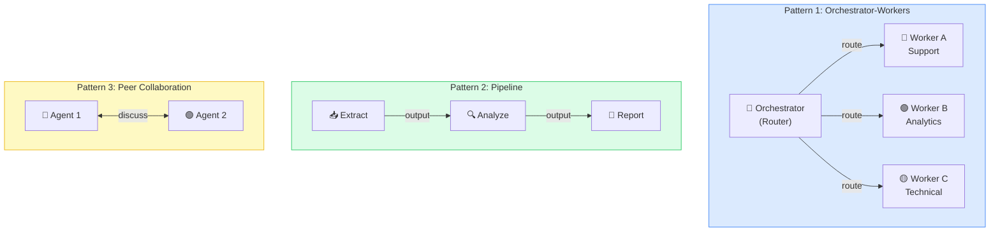
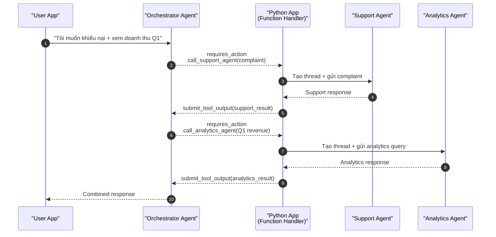

# Bài 10: Recipe — Multi-Agent System (Azure Native)

## 📋 Agenda

**Thời gian đọc ước tính:** ~35 phút | 💻 Lab (Bài phức tạp nhất Sprint 3)

### Sau bài này, bạn sẽ:
- ✅ **Hiểu** tại sao cần Multi-Agent và các pattern phổ biến
- ✅ **Implement** Orchestrator → Specialist pattern hoàn toàn bằng Azure native
- ✅ **Build** hệ thống gồm 3 agents: Orchestrator + Support + Analytics
- ✅ **Handle** communication giữa agents qua FunctionTool

### Yêu cầu đầu vào:
- 🔹 Đã hoàn thành Bài 06 (FunctionTool) + Bài 07 (FileSearch)
- 💰 **Azure cost:** ~$0.15-0.30 (nhiều agents chạy song song)

---

## ❓ Vấn đề & Giải pháp

**Vấn đề của Single Agent:**
- Một agent làm tất cả → system prompt quá phức tạp → model bị "confused"
- Không thể chuyên sâu: agent vừa giỏi customer support vừa giỏi data analytics?
- Context window chật → không nhét được tất cả tools và instructions

**Giải pháp — Multi-Agent (Divide & Conquer):**
Chia hệ thống thành các agent **chuyên biệt** (specialists), mỗi agent làm tốt một việc. Một **orchestrator** phân tích request và điều phối đến đúng specialist.

---

## 📖 Multi-Agent Patterns



**Bài này implement Pattern 1: Orchestrator-Workers** — phổ biến nhất trong production customer service, helpdesk, và enterprise automation.

---

## 📖 Azure Native Multi-Agent — Cơ chế giao tiếp

Không có SDK đặc biệt cho multi-agent trong Azure AI Agent Service. Communication được implement thông qua **FunctionTool**: Orchestrator gọi "tool" thực chất là Python function gọi đến Specialist Agent API.



---

## 💻 Lab 10: 3-Agent Customer Intelligence System

```python
# filename: part3-recipes/lab-10-multi-agent.py
"""
Recipe 10: Multi-Agent System — Azure Native
Agents:
  - Orchestrator: Phân tích request, điều phối đến specialist
  - SupportAgent: Xử lý khiếu nại, câu hỏi chính sách
  - AnalyticsAgent: Trả lời câu hỏi về data và metrics
"""

import os
import json
import time
from dotenv import load_dotenv
from azure.ai.projects import AIProjectClient
from azure.identity import DefaultAzureCredential

load_dotenv()


# ════════════════════════════════════════════════════════════
# PHẦN 1: Specialist Agents
# ════════════════════════════════════════════════════════════

def create_support_agent(client: AIProjectClient):
    """Support Specialist — xử lý khiếu nại và câu hỏi chính sách"""
    return client.agents.create_agent(
        model="gpt-4o",
        name="support-specialist",
        instructions="""Bạn là chuyên viên hỗ trợ khách hàng cấp cao.
        
Chuyên môn:
- Xử lý khiếu nại và phàn nàn của khách hàng
- Giải thích chính sách đổi trả, bảo hành
- Đề xuất giải pháp win-win cho khách hàng và công ty

Phong cách: Đồng cảm, kiên nhẫn, chuyên nghiệp.
Luôn xác nhận vấn đề trước khi đưa ra giải pháp."""
    )


def create_analytics_agent(client: AIProjectClient):
    """Analytics Specialist — trả lời câu hỏi về metrics và data"""
    return client.agents.create_agent(
        model="gpt-4o",
        name="analytics-specialist",
        instructions="""Bạn là chuyên gia phân tích dữ liệu kinh doanh.
        
Chuyên môn:
- Giải thích số liệu, KPIs, metrics
- Phân tích xu hướng và so sánh kỳ
- Đưa ra recommendations dựa trên data

Mock data bạn có (ngày 23/04/2025):
- Doanh thu Q1/2025: 2.5 tỷ VNĐ (tăng 18% so với Q1/2024)
- Doanh thu Q2/2025 (đến hiện tại): 1.8 tỷ VNĐ
- Top sản phẩm: Laptop (45%), Phone (35%), Accessories (20%)
- NPS Score: 72/100
- Tỷ lệ đổi trả: 3.2%

Luôn dẫn nguồn data và thời điểm cập nhật."""
    )


# ════════════════════════════════════════════════════════════
# PHẦN 2: Specialist Runner
# ════════════════════════════════════════════════════════════

def run_specialist(
    client: AIProjectClient,
    agent_id: str,
    question: str,
    specialist_name: str
) -> str:
    """
    Chạy một specialist agent với câu hỏi cụ thể.
    Mỗi call tạo thread mới — stateless per call.
    """
    print(f"   🔀 Routing to {specialist_name}...")

    thread = client.agents.create_thread()
    client.agents.create_message(
        thread_id=thread.id,
        role="user",
        content=question
    )
    run = client.agents.create_and_process_run(
        thread_id=thread.id,
        agent_id=agent_id
    )

    if run.status == "completed":
        messages = client.agents.list_messages(thread_id=thread.id)
        return messages.data[0].content[0].text.value
    else:
        return f"[{specialist_name} error: {run.status}]"


# ════════════════════════════════════════════════════════════
# PHẦN 3: Orchestrator Setup
# ════════════════════════════════════════════════════════════

def create_orchestrator(
    client: AIProjectClient,
    support_id: str,
    analytics_id: str
):
    """
    Orchestrator Agent:
    - Phân tích intent của user request
    - Gọi đúng specialist(s) qua FunctionTool
    - Tổng hợp kết quả thành unified response
    """

    # Tool definitions cho orchestrator gọi specialist
    call_support_tool = {
        "type": "function",
        "function": {
            "name": "call_support_agent",
            "description": "Gọi Support Specialist để xử lý khiếu nại, câu hỏi về chính sách, "
                           "bảo hành, đổi trả. Dùng khi request liên quan đến vấn đề khách hàng.",
            "parameters": {
                "type": "object",
                "properties": {
                    "question": {
                        "type": "string",
                        "description": "Câu hỏi hoặc vấn đề cần Support Specialist xử lý"
                    }
                },
                "required": ["question"]
            }
        }
    }

    call_analytics_tool = {
        "type": "function",
        "function": {
            "name": "call_analytics_agent",
            "description": "Gọi Analytics Specialist để trả lời câu hỏi về doanh thu, metrics, "
                           "KPIs, xu hướng kinh doanh. Dùng khi request liên quan đến số liệu.",
            "parameters": {
                "type": "object",
                "properties": {
                    "question": {
                        "type": "string",
                        "description": "Câu hỏi về data hoặc metrics cần Analytics Specialist trả lời"
                    }
                },
                "required": ["question"]
            }
        }
    }

    agent = client.agents.create_agent(
        model="gpt-4o",
        name="orchestrator",
        instructions="""Bạn là Orchestrator — người điều phối hệ thống AI.

Nhiệm vụ:
1. Phân tích request của người dùng
2. Xác định loại vấn đề: Support (khiếu nại, chính sách) hay Analytics (số liệu, metrics)
3. Gọi đúng specialist(s) để xử lý — có thể gọi cả hai nếu request phức tạp
4. Tổng hợp kết quả từ các specialists thành response thống nhất, mạch lạc

QUAN TRỌNG:
- Luôn sử dụng tools thay vì tự trả lời trực tiếp
- Nếu cần cả hai specialists, gọi tuần tự và tổng hợp
- Trình bày kết quả rõ ràng, phân biệt từng vấn đề""",
        tools=[call_support_tool, call_analytics_tool]
    )

    return agent


# ════════════════════════════════════════════════════════════
# PHẦN 4: Tool Execution Handler
# ════════════════════════════════════════════════════════════

def handle_orchestrator_tool_calls(
    run,
    client: AIProjectClient,
    thread_id: str,
    support_agent_id: str,
    analytics_agent_id: str
):
    """Xử lý tool calls từ Orchestrator — gọi specialist tương ứng"""
    tool_calls = run.required_action.submit_tool_outputs.tool_calls
    tool_outputs = []

    for tc in tool_calls:
        args = json.loads(tc.function.arguments)
        tool_name = tc.function.name

        if tool_name == "call_support_agent":
            result = run_specialist(
                client, support_agent_id,
                args["question"],
                "Support Specialist"
            )
        elif tool_name == "call_analytics_agent":
            result = run_specialist(
                client, analytics_agent_id,
                args["question"],
                "Analytics Specialist"
            )
        else:
            result = f"Unknown specialist: {tool_name}"

        tool_outputs.append({
            "tool_call_id": tc.id,
            "output": result
        })

    return client.agents.submit_tool_outputs_to_run(
        thread_id=thread_id,
        run_id=run.id,
        tool_outputs=tool_outputs
    )


def orchestrate(
    client: AIProjectClient,
    thread_id: str,
    orchestrator_id: str,
    support_id: str,
    analytics_id: str,
    user_message: str
) -> str:
    """Main orchestration loop"""
    print(f"\n👤 User: {user_message}")

    client.agents.create_message(
        thread_id=thread_id,
        role="user",
        content=user_message
    )

    run = client.agents.create_run(thread_id=thread_id, agent_id=orchestrator_id)

    while run.status in ["queued", "in_progress", "requires_action"]:
        time.sleep(0.8)
        run = client.agents.get_run(thread_id=thread_id, run_id=run.id)

        if run.status == "requires_action":
            run = handle_orchestrator_tool_calls(
                run, client, thread_id, support_id, analytics_id
            )

    if run.status == "completed":
        messages = client.agents.list_messages(thread_id=thread_id)
        return messages.data[0].content[0].text.value
    return f"[Error: {run.status}]"


# ════════════════════════════════════════════════════════════
# PHẦN 5: Main
# ════════════════════════════════════════════════════════════

def main():
    client = AIProjectClient.from_connection_string(
        conn_str=os.environ["AZURE_AI_PROJECT_CONNECTION_STRING"],
        credential=DefaultAzureCredential()
    )

    print("=" * 65)
    print("🏗️  Building Multi-Agent Customer Intelligence System")
    print("=" * 65)

    # Tạo tất cả agents
    print("\n🤖 Creating specialist agents...")
    support_agent = create_support_agent(client)
    analytics_agent = create_analytics_agent(client)
    print(f"   ✅ Support:    {support_agent.id}")
    print(f"   ✅ Analytics:  {analytics_agent.id}")

    print("\n🎯 Creating orchestrator...")
    orchestrator = create_orchestrator(client, support_agent.id, analytics_agent.id)
    print(f"   ✅ Orchestrator: {orchestrator.id}")

    # Thread dùng chung cho orchestrator
    thread = client.agents.create_thread()

    print("\n" + "=" * 65)
    print("💬 Testing Multi-Agent System")
    print("=" * 65)

    # Test 1: Pure support question
    r1 = orchestrate(
        client, thread.id, orchestrator.id,
        support_agent.id, analytics_agent.id,
        "Máy tính tôi mua 13 tháng rồi bị hỏng màn hình, có được bảo hành không?"
    )
    print(f"\n🤖 Orchestrator:\n{r1}")

    print("\n" + "-" * 65)

    # Test 2: Pure analytics question
    r2 = orchestrate(
        client, thread.id, orchestrator.id,
        support_agent.id, analytics_agent.id,
        "Doanh thu Q1/2025 tăng trưởng bao nhiêu so với năm ngoái?"
    )
    print(f"\n🤖 Orchestrator:\n{r2}")

    print("\n" + "-" * 65)

    # Test 3: Hybrid — cần cả hai specialists
    r3 = orchestrate(
        client, thread.id, orchestrator.id,
        support_agent.id, analytics_agent.id,
        "Tôi muốn đổi trả sản phẩm, đồng thời cho tôi biết "
        "tỷ lệ đổi trả của công ty hiện tại là bao nhiêu?"
    )
    print(f"\n🤖 Orchestrator:\n{r3}")

    # Cleanup
    for agent in [support_agent, analytics_agent, orchestrator]:
        client.agents.delete_agent(agent.id)
    print("\n🧹 All agents cleaned up!")


if __name__ == "__main__":
    main()
```

---

## 🚀 WHAT IF — Trade-offs & Khi nào dùng Multi-Agent?

### Khi nào NÊN dùng Multi-Agent:

| Scenario | Lý do |
|---|---|
| Task domains hoàn toàn khác nhau (support vs analytics) | Mỗi agent focused, instructions không conflict |
| System prompt > 4000 tokens | Chia để mỗi agent có prompt súc tích |
| Cần specialization sâu (code review + security scan + test gen) | Mỗi expert làm tốt việc của mình |

### Khi nào KHÔNG nên:

> ⚠️ Đừng over-engineer! Nếu một agent với tools đủ xử lý task → dùng single agent. Multi-agent tốn latency (nhiều round trips) và tiền (nhiều LLM calls).

---

## 💬 Câu hỏi thảo luận

> **"Orchestrator gọi specialists tuần tự hay song song? Làm sao tối ưu latency khi cần cả hai?"**
>
> *Gợi ý:* Pattern này gọi tuần tự (sequential) — đơn giản nhưng chậm khi cần nhiều specialists. Để parallel, orchestrator cần submit tất cả `tool_calls` một lúc (Azure cho phép multiple tool calls trong một `requires_action`). Python app handle tất cả song song bằng `asyncio` hoặc `ThreadPoolExecutor`. Trade-off: phức tạp hơn nhưng latency giảm đáng kể.

---

**Bài tiếp theo:** Bài 11 — Recipe: Streaming Response →

---

*Made by Anh Tu - Share to be shared*
