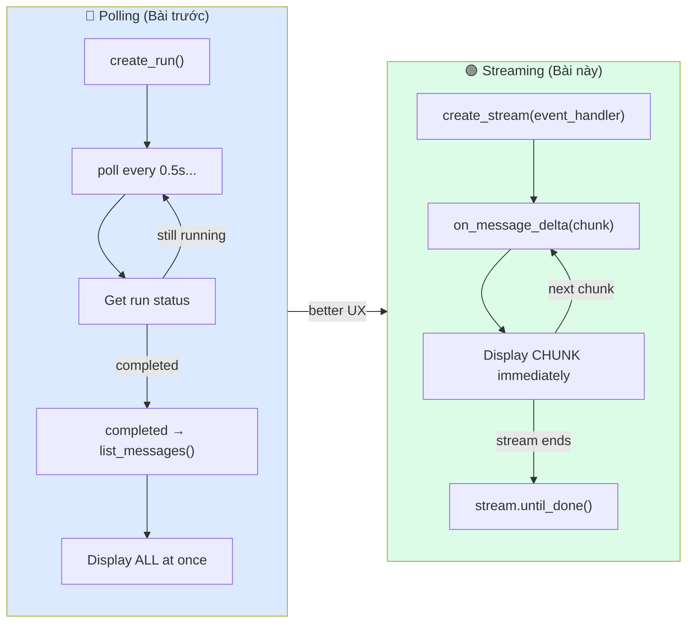

# Bài 11: Recipe — Streaming Response

## 📋 Agenda

**Thời gian đọc ước tính:** ~20 phút | 💻 Lab

### Sau bài này, bạn sẽ:
- ✅ **Implement** AgentEventHandler để stream response real-time
- ✅ **Handle** các event types: message delta, tool calls, run events
- ✅ **Build** typing effect trong terminal và chuẩn bị cho web UI
- ✅ **Biết** khi nào nên dùng streaming vs polling

### Yêu cầu đầu vào:
- 🔹 Đã hoàn thành Bài 05 — Hello Agent
- 💰 **Azure cost:** Tương đương polling, không tốn thêm

---

## ❓ Vấn đề & Giải pháp

**Vấn đề với polling approach (Bài 05-10):**
- User phải chờ đến khi **toàn bộ** response được generate xong mới nhìn thấy gì
- Với response dài (~1000 tokens), có thể chờ 10-15 giây màn hình trắng
- UX kém — user không biết agent đang suy nghĩ hay bị lỗi

**Giải pháp — Streaming:**
Nhận từng token ngay khi model generate ra, hiển thị ngay lập tức như "typing effect". Cải thiện UX đáng kể mà không tốn thêm chi phí.

---

## 📖 Streaming Architecture



---

## 📖 Streaming Events — Thứ tự xuất hiện

Khi agent chạy với streaming, các events xuất hiện theo thứ tự:

```
on_thread_run_created    → Run đã được tạo
on_thread_run_in_progress → Run đang chạy
on_message_created       → Bắt đầu generate message
on_message_delta         → 🔥 Chunk của text (HAY DÙNG NHẤT)
on_message_delta         → chunk...
on_message_delta         → chunk...
on_message_done          → Message hoàn thành
on_thread_run_completed  → Run completed
```

Nếu có tool call:
```
on_thread_run_requires_action → Agent cần tool
on_tool_call_created          → Tool được gọi
on_tool_call_done             → Tool hoàn thành
on_thread_run_in_progress     → Tiếp tục sau tool
on_message_delta              → Generate response
```

---

## 💻 Lab 11-01: Basic Streaming

```python
# filename: part3-recipes/lab-11-streaming.py
"""
Recipe 11: Streaming Agent Response
Part 1: Basic streaming với typing effect
Part 2: Streaming với tool calls
"""

import os
import sys
import time
from dotenv import load_dotenv
from azure.ai.projects import AIProjectClient
from azure.ai.projects.models import (
    AgentEventHandler,
    MessageDeltaChunk,
    ThreadRun,
    RunStep,
)
from azure.identity import DefaultAzureCredential

load_dotenv()


# ── PHẦN 1: Streaming Event Handler ────────────────────────────────

class StreamingHandler(AgentEventHandler):
    """
    Custom event handler để xử lý streaming events.
    Override các methods cần thiết.
    """

    def __init__(self, show_thinking: bool = False):
        super().__init__()
        self.show_thinking = show_thinking
        self.full_response = ""      # Accumulate full response
        self.current_tool = None     # Track tool đang chạy

    def on_message_delta(self, delta: MessageDeltaChunk) -> None:
        """
        🔥 Event quan trọng nhất — gọi mỗi khi có chunk text mới
        delta.text.value chứa nội dung mới của chunk
        """
        if delta.text:
            chunk = delta.text.value
            self.full_response += chunk
            # In ngay lập tức, không newline, flush buffer
            print(chunk, end="", flush=True)

    def on_thread_run_completed(self, run: ThreadRun) -> None:
        """Gọi khi run hoàn thành"""
        print()  # Newline sau response
        if self.show_thinking:
            print(f"\n[Run completed: {run.id}]")

    def on_thread_run_failed(self, run: ThreadRun) -> None:
        """Gọi khi run thất bại"""
        print(f"\n\n❌ Run failed: {run.last_error}")

    def on_run_step_created(self, step: RunStep) -> None:
        """Gọi khi có run step mới (tool call hoặc message creation)"""
        if self.show_thinking and step.type == "tool_calls":
            print(f"\n[🔧 Tool call initiated...]", end="", flush=True)

    def on_run_step_done(self, step: RunStep) -> None:
        """Gọi khi run step hoàn thành"""
        if self.show_thinking and step.type == "tool_calls":
            print(f"[Done]", flush=True)


def stream_agent_response(
    client: AIProjectClient,
    thread_id: str,
    agent_id: str,
    user_message: str,
    show_thinking: bool = False
) -> str:
    """
    Gửi message và stream response real-time.
    Returns: full response text
    """
    client.agents.create_message(
        thread_id=thread_id,
        role="user",
        content=user_message
    )

    handler = StreamingHandler(show_thinking=show_thinking)

    print("\n🤖 Agent: ", end="", flush=True)

    # create_stream() thay vì create_and_process_run()
    with client.agents.create_stream(
        thread_id=thread_id,
        agent_id=agent_id,
        event_handler=handler
    ) as stream:
        stream.until_done()

    return handler.full_response


def demo_basic_streaming():
    """Demo 1: Basic streaming — typing effect"""
    client = AIProjectClient.from_connection_string(
        conn_str=os.environ["AZURE_AI_PROJECT_CONNECTION_STRING"],
        credential=DefaultAzureCredential()
    )

    agent = client.agents.create_agent(
        model="gpt-4o",
        name="streaming-agent",
        instructions="Trợ lý kỹ thuật. Trả lời chi tiết, có cấu trúc rõ ràng."
    )
    thread = client.agents.create_thread()

    print("=" * 60)
    print("🌊 Demo 1: Basic Streaming")
    print("=" * 60)

    questions = [
        "Giải thích RAG là gì trong 5 bullet points ngắn gọn.",
        "Tiếp tục, so sánh RAG với Fine-tuning."
    ]

    for q in questions:
        print(f"\n👤 User: {q}")
        response = stream_agent_response(client, thread.id, agent.id, q)
        print(f"\n[Received {len(response)} chars]")

    client.agents.delete_agent(agent.id)
```

### Lab 11-02: Streaming với Tool Calls

```python
# Tiếp file lab-11-streaming.py

import json

class StreamingWithToolsHandler(AgentEventHandler):
    """
    Handler nâng cao: Stream response + xử lý tool calls inline
    """

    def __init__(self, tool_handlers: dict):
        super().__init__()
        self.tool_handlers = tool_handlers
        self.full_response = ""
        self._pending_tool_calls = []

    def on_message_delta(self, delta: MessageDeltaChunk) -> None:
        if delta.text:
            chunk = delta.text.value
            self.full_response += chunk
            print(chunk, end="", flush=True)

    def on_thread_run_requires_action(self, run: ThreadRun) -> None:
        """
        Với streaming + tools: requires_action vẫn xảy ra
        Cần submit tool outputs để stream tiếp tục
        """
        print(f"\n[🔧 Tool execution needed...]", end="", flush=True)
        # Note: Tool outputs phải được submit qua client bên ngoài handler
        # Xem pattern trong demo_streaming_with_tools()

    def on_thread_run_completed(self, run: ThreadRun) -> None:
        print()

    def on_thread_run_failed(self, run: ThreadRun) -> None:
        print(f"\n❌ {run.last_error}")


def demo_streaming_with_tools():
    """Demo 2: Streaming với tool execution"""
    client = AIProjectClient.from_connection_string(
        conn_str=os.environ["AZURE_AI_PROJECT_CONNECTION_STRING"],
        credential=DefaultAzureCredential()
    )

    # Tool definition
    time_tool = {
        "type": "function",
        "function": {
            "name": "get_current_time",
            "description": "Lấy thời gian hiện tại tại Việt Nam",
            "parameters": {"type": "object", "properties": {}, "required": []}
        }
    }

    def get_current_time() -> str:
        from datetime import datetime, timezone, timedelta
        vn_tz = timezone(timedelta(hours=7))
        now = datetime.now(vn_tz)
        return now.strftime("%H:%M:%S ngày %d/%m/%Y (Vietnam)")

    agent = client.agents.create_agent(
        model="gpt-4o",
        name="streaming-tool-agent",
        instructions="Trợ lý biết tra cứu thời gian thực.",
        tools=[time_tool]
    )
    thread = client.agents.create_thread()

    print("\n" + "=" * 60)
    print("🌊 Demo 2: Streaming + Tool Calls")
    print("=" * 60)

    question = "Mấy giờ rồi? Và hãy giải thích cách timezone hoạt động."
    print(f"\n👤 User: {question}")

    client.agents.create_message(thread_id=thread.id, role="user", content=question)

    # Với tool calls trong streaming, cần handle requires_action event
    # Cách đơn giản: dùng create_stream với event_handler tích hợp submit_tool_outputs
    handler = StreamingWithToolsHandler(tool_handlers={"get_current_time": get_current_time})

    print("\n🤖 Agent: ", end="", flush=True)

    with client.agents.create_stream(
        thread_id=thread.id,
        agent_id=agent.id,
        event_handler=handler
    ) as stream:
        stream.until_done()

    client.agents.delete_agent(agent.id)


if __name__ == "__main__":
    demo_basic_streaming()
    demo_streaming_with_tools()
```

---

## 📖 Streaming trong Web Context (FastAPI + SSE)

Streaming đặc biệt hữu ích khi tích hợp vào web app qua **Server-Sent Events (SSE)**:

```python
# filename: web/api.py (FastAPI example)
from fastapi import FastAPI
from fastapi.responses import StreamingResponse
from azure.ai.projects.models import AgentEventHandler, MessageDeltaChunk

app = FastAPI()

class SSEHandler(AgentEventHandler):
    def __init__(self):
        super().__init__()
        self.chunks = []  # Buffer tạm

    def on_message_delta(self, delta: MessageDeltaChunk) -> None:
        if delta.text:
            self.chunks.append(delta.text.value)

@app.get("/chat/stream")
async def stream_chat(message: str):
    async def generate():
        handler = SSEHandler()
        # Chạy streaming trong thread để không block async loop
        # ... setup client, agent, thread ...
        
        # Yield từng chunk dưới dạng SSE
        with client.agents.create_stream(
            thread_id=thread.id,
            agent_id=agent.id,
            event_handler=handler
        ) as stream:
            stream.until_done()

        for chunk in handler.chunks:
            yield f"data: {chunk}\n\n"

        yield "data: [DONE]\n\n"

    return StreamingResponse(generate(), media_type="text/event-stream")
```

**Frontend nhận SSE:**
```javascript
const eventSource = new EventSource('/chat/stream?message=Hello');
eventSource.onmessage = (e) => {
    if (e.data === '[DONE]') { eventSource.close(); return; }
    document.getElementById('response').textContent += e.data;
};
```

---

## 🚀 WHAT IF — Polling vs Streaming?

| | Polling | Streaming |
|---|---|---|
| **UX** | ⚠️ Chờ toàn bộ response | ✅ Typing effect realtime |
| **Complexity** | ✅ Đơn giản | ⚠️ Handler class |
| **Tool handling** | ✅ Dễ (manual loop) | ⚠️ Event-based |
| **Dùng khi** | Batch processing, scripts | Web UI, chatbots |
| **Long response** | ❌ UX kém | ✅ Luôn dùng streaming |

**Rule of thumb:** 
- **Script / background job** → Polling (`create_and_process_run`)
- **Chatbot UI / web** → Streaming (`create_stream`)

---

## 💬 Câu hỏi thảo luận

> **"Streaming có giúp reduce cost không? Hay chỉ improve UX thôi?"**
>
> *Gợi ý:* Streaming **không** giảm cost — token cost giống nhau dù streaming hay không. Lợi ích thuần túy là UX: user nhận response sớm hơn và biết agent đang hoạt động. Tuy nhiên, streaming có thể giúp **detect error sớm hơn** (fail fast) thay vì chờ 15 giây rồi mới biết lỗi → gián tiếp tiết kiệm thời gian user.

---

*Made by Anh Tu - Share to be shared*
