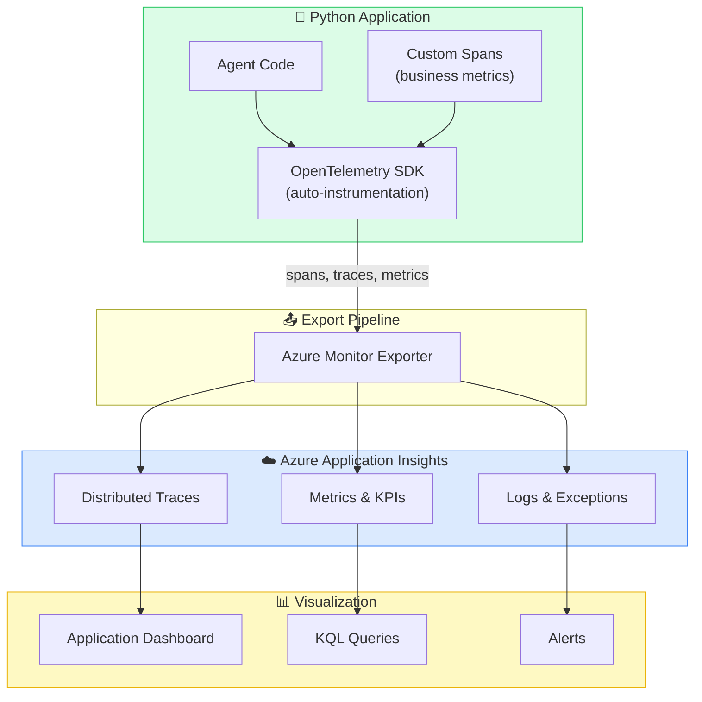

# Bài 12: Monitoring & Tracing — Nhìn thấy Agent đang làm gì

## 📋 Agenda

**Thời gian đọc ước tính:** ~25 phút | 💻 Lab

### Sau bài này, bạn sẽ:
- ✅ **Hiểu** tại sao observability quan trọng với AI Agent production
- ✅ **Cấu hình** OpenTelemetry + Azure Application Insights
- ✅ **Trace** từng bước agent: tool calls, LLM latency, errors
- ✅ **Tạo** custom spans để đo business metrics

### Yêu cầu đầu vào:
- 🔹 Đã hoàn thành Bài 05 — Hello Agent
- 🔹 Có Application Insights resource (tạo mới hoặc dùng existing)
- 💰 **Azure cost:** Application Insights — 5GB/tháng free tier

---

## ❓ Vấn đề & Giải pháp

**Vấn đề khi không có observability:**
- Agent chạy sai → không biết sai ở bước nào (tool call? LLM reasoning? network?)
- Latency cao → không biết thời gian bị mất ở đâu
- Chi phí tăng bất thường → không biết agent nào, user nào dùng nhiều nhất
- Production incident → không có log đủ để debug

**Giải pháp — Observability Stack:**
Dùng **OpenTelemetry** (chuẩn ngành) + **Azure Application Insights** (storage và query), kết hợp với AI-specific tracing từ `azure-ai-projects`.

---

## 📖 Observability Architecture



---

## 💻 Lab 12-01: Setup Monitoring

### Bước 1: Cài đặt packages

```bash
pip install azure-monitor-opentelemetry opentelemetry-sdk opentelemetry-api
```

Thêm vào `requirements.txt`:
```
azure-monitor-opentelemetry>=1.0.0
opentelemetry-sdk>=1.20.0
opentelemetry-api>=1.20.0
```

### Bước 2: Lấy Application Insights Connection String

```
Azure Portal → Application Insights resource
  → Overview → Connection String → Copy
```

Hoặc tạo mới:
```
Azure Portal → Create resource → Application Insights
  → Region: same as AI Foundry Hub
  → Resource Mode: Workspace-based
```

Thêm vào `.env`:
```bash
APPLICATIONINSIGHTS_CONNECTION_STRING="InstrumentationKey=xxx-xxx;IngestionEndpoint=https://..."
```

### Bước 3: Code monitoring hoàn chỉnh

```python
# filename: part4-production/lab-12-monitoring.py
"""
Lab 12: Monitoring & Tracing với OpenTelemetry + Application Insights
"""

import os
import time
from dotenv import load_dotenv

# ── Setup Monitoring TRƯỚC KHI import azure-ai-projects ────────────
# Thứ tự quan trọng: configure_azure_monitor phải được gọi sớm nhất
from azure.monitor.opentelemetry import configure_azure_monitor
from opentelemetry import trace
from opentelemetry.trace import StatusCode

load_dotenv()

# Kích hoạt export đến Application Insights
configure_azure_monitor(
    connection_string=os.environ["APPLICATIONINSIGHTS_CONNECTION_STRING"],
    # Cho phép ghi lại nội dung prompt/response (chứa PII — cân nhắc production)
    # Mặc định: False (chỉ ghi metadata, không ghi content)
)

# Bật content recording nếu cần debug (không dùng production với PII)
os.environ["AZURE_TRACING_GEN_AI_CONTENT_RECORDING_ENABLED"] = "false"

# ── Import sau khi setup ────────────────────────────────────────────
from azure.ai.projects import AIProjectClient
from azure.identity import DefaultAzureCredential

# Tracer cho custom spans
tracer = trace.get_tracer("azure-ai-agent-course")


def create_client() -> AIProjectClient:
    client = AIProjectClient.from_connection_string(
        conn_str=os.environ["AZURE_AI_PROJECT_CONNECTION_STRING"],
        credential=DefaultAzureCredential(),
        # Enable SDK-level telemetry
        telemetry_config={"trace_content": False}  # toggle True để trace content
    )
    return client


def run_with_custom_tracing(client: AIProjectClient, user_id: str, query: str):
    """
    Chạy agent với custom spans để đo business metrics
    """
    # Custom span bao bọc toàn bộ agent workflow
    with tracer.start_as_current_span("agent-workflow") as span:
        # Gắn business attributes vào span
        span.set_attribute("user.id", user_id)
        span.set_attribute("query.length", len(query))
        span.set_attribute("agent.version", "1.0")

        start_time = time.time()

        try:
            # Tạo agent
            with tracer.start_as_current_span("create-agent"):
                agent = client.agents.create_agent(
                    model="gpt-4o",
                    name="monitored-agent",
                    instructions="Trợ lý kỹ thuật Azure. Trả lời ngắn gọn."
                )

            # Tạo thread và message
            with tracer.start_as_current_span("setup-thread"):
                thread = client.agents.create_thread()
                client.agents.create_message(
                    thread_id=thread.id,
                    role="user",
                    content=query
                )

            # Chạy agent — span này sẽ tự động có child spans từ SDK
            with tracer.start_as_current_span("run-agent") as run_span:
                run = client.agents.create_and_process_run(
                    thread_id=thread.id,
                    agent_id=agent.id
                )
                run_span.set_attribute("run.status", run.status)
                run_span.set_attribute("run.id", run.id)

            # Đọc response
            if run.status == "completed":
                messages = client.agents.list_messages(thread_id=thread.id)
                response = messages.data[0].content[0].text.value

                # Ghi metrics vào span
                duration_ms = (time.time() - start_time) * 1000
                span.set_attribute("response.length", len(response))
                span.set_attribute("duration.ms", duration_ms)
                span.set_status(StatusCode.OK)

                return response
            else:
                span.set_status(StatusCode.ERROR, f"Run failed: {run.status}")
                return None

        except Exception as e:
            # Span sẽ tự record exception
            span.set_status(StatusCode.ERROR, str(e))
            span.record_exception(e)
            raise
        finally:
            # Cleanup luôn được gọi
            client.agents.delete_agent(agent.id)


def demo_monitoring():
    """Demo monitoring với nhiều requests"""
    client = create_client()

    test_cases = [
        ("user-001", "Azure AI Foundry có bao nhiêu tầng kiến trúc?"),
        ("user-002", "DefaultAzureCredential chain thử mấy method?"),
        ("user-001", "FileSearchTool khác CodeInterpreterTool ở điểm gì?"),
    ]

    print("🔭 Running monitored agent calls...")
    print("   (Check Application Insights in ~2-3 minutes)\n")

    for user_id, query in test_cases:
        print(f"📤 [{user_id}] {query[:50]}...")
        response = run_with_custom_tracing(client, user_id, query)
        if response:
            print(f"✅ Response: {response[:80]}...\n")
        else:
            print(f"❌ Failed\n")

    print("📊 Trace data sent to Application Insights!")
    print("   → Portal: Application Insights → Transaction search")
    print("   → Filter by: Custom events, or search by operation name")


if __name__ == "__main__":
    demo_monitoring()
```

---

## 📖 Tracing Waterfall — Đọc trace trong App Insights

Một agent run sẽ tạo ra trace tương tự:

```
▼ agent-workflow (220ms)
  ├── create-agent (45ms)
  ├── setup-thread (12ms)
  └── run-agent (163ms)
        ├── [SDK] chat.completions (gpt-4o) (118ms)
        │     ├── prompt_tokens: 245
        │     └── completion_tokens: 87
        └── [SDK] agents.run_step (38ms)
```

**Custom attributes để query trong KQL:**

```kusto
// KQL: Tìm các request chậm hơn 5 giây
dependencies
| where name == "agent-workflow"
| where customDimensions["duration.ms"] > 5000
| project timestamp, customDimensions["user.id"], duration
| order by duration desc

// KQL: Token usage theo user
dependencies
| where name == "chat.completions"
| project user_id = customDimensions["user.id"],
          prompt_tokens = toint(customDimensions["gen_ai.usage.prompt_tokens"]),
          completion_tokens = toint(customDimensions["gen_ai.usage.completion_tokens"])
| summarize total_tokens = sum(prompt_tokens + completion_tokens) by user_id
```

---

## 📖 Alert Rules — Phát hiện sự cố tự động

Cấu hình alerts trong Application Insights:

```
Application Insights → Alerts → + Create alert rule

Alert 1: High Failure Rate
  Signal: Failed requests
  Threshold: > 5% trong 5 phút
  Action: Email to on-call engineer

Alert 2: High Latency
  Signal: Server response time (P95)
  Threshold: > 10 seconds
  Action: Slack notification

Alert 3: Quota Approaching
  Signal: Custom metric "token_usage_pct"
  Threshold: > 80% of TPM limit
  Action: PagerDuty alert
```

---

## 🚀 WHAT IF — Pitfalls

⚠️ **Pitfall #1: `configure_azure_monitor()` phải được gọi trước các imports khác**

```python
# ❌ Sai — instrumentation sẽ không capture được
from azure.ai.projects import AIProjectClient
from azure.monitor.opentelemetry import configure_azure_monitor
configure_azure_monitor()  # Quá muộn!

# ✅ Đúng — gọi ngay sau load_dotenv()
load_dotenv()
configure_azure_monitor()
from azure.ai.projects import AIProjectClient
```

⚠️ **Pitfall #2: Content recording và PII**

Setting `AZURE_TRACING_GEN_AI_CONTENT_RECORDING_ENABLED=true` ghi lại toàn bộ prompt và response — bao gồm cả thông tin nhạy cảm của user. Chỉ bật trong development, **không bao giờ bật trong production** trừ khi có DPA (Data Protection Agreement) rõ ràng.

---

## 💬 Câu hỏi thảo luận

> **"OpenTelemetry là chuẩn mở — nghĩa là trace data có thể export đến nhiều backend. Ngoài Application Insights, bạn có thể dùng backend nào khác?"**
>
> *Gợi ý:* Grafana (qua Tempo), Jaeger, Zipkin, Datadog, New Relic — tất cả đều support OTLP protocol. Thay `configure_azure_monitor()` bằng `OTLPSpanExporter` là xong. Đây là lý do tại sao OpenTelemetry được industry adopt rộng: vendor-neutral, không bị lock-in.

---

**Bài tiếp theo:** Bài 13 — Content Safety & Responsible AI →

---

*Made by Anh Tu - Share to be shared*
