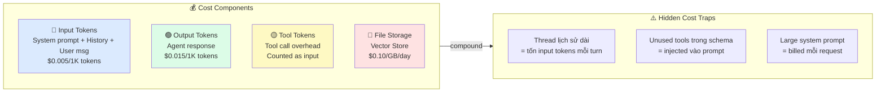
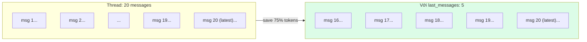

# Bài 14: Cost Optimization & Quota Management

## 📋 Agenda

**Thời gian đọc ước tính:** ~25 phút | 💻 Lab

### Sau bài này, bạn sẽ:
- ✅ **Hiểu** cấu trúc chi phí của Azure AI Agent (token × price)
- ✅ **Implement** retry với exponential backoff khi bị rate limit
- ✅ **Kiểm soát** token budget per request với `max_prompt_tokens`
- ✅ **Tính toán** cost thực tế và build token usage tracker

### Yêu cầu đầu vào:
- 🔹 Đã hoàn thành Bài 05 — Hello Agent
- 🔹 Hiểu khái niệm token từ Bài 01

---

## ❓ Vấn đề & Giải pháp

**Bài toán thực tế trong production:**
- Bill Azure tháng đầu: $50 → tháng sau: $500 → không biết tại sao
- Agent bị throttle (`429 Too Many Requests`) vào giờ cao điểm → user experience kém
- Thread dài 50 turns → mỗi request gửi toàn bộ history → tốn token không cần thiết

**Giải pháp:**
- Token budget: giới hạn input/output tokens per request
- Exponential backoff: retry thông minh khi bị rate limit
- Truncation strategy: chỉ giữ N turns gần nhất trong context
- Usage tracking: biết chính xác agent nào tốn bao nhiêu

---

## 📖 Cấu trúc chi phí Azure AI Agent



**Ước tính chi phí thực tế:**

| Scenario | Tokens/request | Requests/ngày | Chi phí/tháng |
|---|---|---|---|
| Simple Q&A | ~500 | 100 | ~$2.25 |
| RAG Agent | ~2,000 | 100 | ~$9 |
| Multi-turn (50 turns) | ~8,000 | 50 | ~$18 |
| Code Interpreter | ~3,000 | 50 | ~$6.75 |

*Giá GPT-4o tham khảo 2025 — kiểm tra tại [Azure pricing calculator](https://azure.microsoft.com/pricing/calculator)*

---

## 💻 Lab 14-01: Token Budget Control

```python
# filename: part4-production/lab-14-cost-optimization.py
"""
Lab 14: Cost Optimization — Token Budget, Retry, Truncation, Usage Tracking
"""

import os
import time
import random
from dataclasses import dataclass, field
from dotenv import load_dotenv
from azure.ai.projects import AIProjectClient
from azure.identity import DefaultAzureCredential
from azure.core.exceptions import HttpResponseError

load_dotenv()


# ── PHẦN 1: Token Usage Tracker ────────────────────────────────────

@dataclass
class TokenUsageTracker:
    """Track token usage và tính cost per session"""

    # Giá tham khảo GPT-4o (USD per 1K tokens)
    INPUT_PRICE_PER_1K = 0.005
    OUTPUT_PRICE_PER_1K = 0.015

    total_prompt_tokens: int = 0
    total_completion_tokens: int = 0
    request_count: int = 0
    run_ids: list = field(default_factory=list)

    def record(self, run):
        """Ghi lại usage từ một Run object"""
        if run.usage:
            self.total_prompt_tokens += run.usage.prompt_tokens
            self.total_completion_tokens += run.usage.completion_tokens
            self.request_count += 1
            self.run_ids.append(run.id)

    @property
    def total_cost_usd(self) -> float:
        input_cost = (self.total_prompt_tokens / 1000) * self.INPUT_PRICE_PER_1K
        output_cost = (self.total_completion_tokens / 1000) * self.OUTPUT_PRICE_PER_1K
        return input_cost + output_cost

    def report(self):
        print(f"\n{'─'*45}")
        print(f"📊 Token Usage Report")
        print(f"{'─'*45}")
        print(f"  Requests:          {self.request_count}")
        print(f"  Prompt tokens:     {self.total_prompt_tokens:,}")
        print(f"  Completion tokens: {self.total_completion_tokens:,}")
        print(f"  Total tokens:      {self.total_prompt_tokens + self.total_completion_tokens:,}")
        print(f"  Estimated cost:    ${self.total_cost_usd:.4f} USD")
        per_req = self.total_cost_usd / max(self.request_count, 1)
        print(f"  Cost per request:  ${per_req:.5f} USD")
        print(f"{'─'*45}")


# ── PHẦN 2: Exponential Backoff Retry ──────────────────────────────

def run_with_retry(
    client: AIProjectClient,
    thread_id: str,
    agent_id: str,
    max_retries: int = 3,
    base_delay: float = 1.0
):
    """
    Retry với exponential backoff khi gặp 429 Rate Limit.
    Formula: delay = base_delay * (2^attempt) + random jitter
    """
    for attempt in range(max_retries):
        try:
            run = client.agents.create_and_process_run(
                thread_id=thread_id,
                agent_id=agent_id
            )
            return run

        except HttpResponseError as e:
            if e.status_code == 429:  # Too Many Requests
                if attempt == max_retries - 1:
                    raise  # Hết lần retry → raise

                # Exponential backoff + jitter
                delay = base_delay * (2 ** attempt) + random.uniform(0, 0.5)

                # Dùng Retry-After header của Azure nếu có
                retry_after = e.response.headers.get("Retry-After")
                if retry_after:
                    delay = max(delay, float(retry_after))

                print(f"  ⏳ Rate limited. Retry {attempt + 1}/{max_retries} in {delay:.1f}s...")
                time.sleep(delay)
            else:
                raise  # Lỗi khác → raise ngay

    raise Exception("Max retries exceeded")


# ── PHẦN 3: Token Budget Control ────────────────────────────────────

def run_with_token_budget(
    client: AIProjectClient,
    thread_id: str,
    agent_id: str,
    max_prompt_tokens: int = 2000,  # Giới hạn input
    max_completion_tokens: int = 500  # Giới hạn output
):
    """
    Kiểm soát token budget để tránh chi phí bất ngờ.
    Nếu thread quá dài → truncation strategy tự động kick in.
    """
    run = client.agents.create_and_process_run(
        thread_id=thread_id,
        agent_id=agent_id,
        max_prompt_tokens=max_prompt_tokens,
        max_completion_tokens=max_completion_tokens,
        # Truncation strategy khi prompt > max_prompt_tokens
        truncation_strategy={
            "type": "last_messages",
            "last_messages": 5  # Chỉ giữ 5 messages gần nhất
        }
    )
    return run


# ── PHẦN 4: Cost-Aware Agent Runner ─────────────────────────────────

class CostAwareAgentRunner:
    """
    Full-featured runner với:
    - Token budget control
    - Exponential backoff retry
    - Usage tracking
    - Cost alerts
    """

    def __init__(
        self,
        client: AIProjectClient,
        agent_id: str,
        budget_usd: float = 1.0,  # Alert khi cost vượt ngưỡng này
        max_prompt_tokens: int = 3000,
        max_completion_tokens: int = 800
    ):
        self.client = client
        self.agent_id = agent_id
        self.budget_usd = budget_usd
        self.max_prompt_tokens = max_prompt_tokens
        self.max_completion_tokens = max_completion_tokens
        self.tracker = TokenUsageTracker()

    def ask(self, thread_id: str, question: str) -> str:
        """Ask agent với full cost control"""
        self.client.agents.create_message(
            thread_id=thread_id,
            role="user",
            content=question
        )

        # Retry wrapper bọc budget-aware run
        for attempt in range(3):
            try:
                run = client.agents.create_and_process_run(
                    thread_id=thread_id,
                    agent_id=self.agent_id,
                    max_prompt_tokens=self.max_prompt_tokens,
                    max_completion_tokens=self.max_completion_tokens,
                    truncation_strategy={
                        "type": "last_messages",
                        "last_messages": 8
                    }
                )
                break
            except HttpResponseError as e:
                if e.status_code == 429 and attempt < 2:
                    time.sleep(2 ** attempt + random.random())
                else:
                    raise

        # Track usage
        self.tracker.record(run)

        # Budget alert
        if self.tracker.total_cost_usd > self.budget_usd:
            print(f"⚠️  COST ALERT: ${self.tracker.total_cost_usd:.4f} > budget ${self.budget_usd}")

        if run.status == "completed":
            messages = self.client.agents.list_messages(thread_id=thread_id)
            return messages.data[0].content[0].text.value

        return f"[Error: {run.status}]"

    def report(self):
        self.tracker.report()


# ── PHẦN 5: Demo ─────────────────────────────────────────────────────

def demo_cost_optimization():
    client = AIProjectClient.from_connection_string(
        conn_str=os.environ["AZURE_AI_PROJECT_CONNECTION_STRING"],
        credential=DefaultAzureCredential()
    )

    agent = client.agents.create_agent(
        model="gpt-4o",
        name="cost-aware-agent",
        instructions="Trợ lý kỹ thuật. Trả lời súc tích, tối đa 150 từ."
    )

    runner = CostAwareAgentRunner(
        client=client,
        agent_id=agent.id,
        budget_usd=0.10,       # Alert khi vượt $0.10
        max_prompt_tokens=2000,
        max_completion_tokens=400
    )

    thread = client.agents.create_thread()

    questions = [
        "RAG là gì? Giải thích trong 3 câu.",
        "Tiếp tục, RAG khác Fine-tuning ở điểm nào?",
        "Khi nào nên dùng RAG, khi nào nên Fine-tune?",
        "Cho tôi ví dụ use case cụ thể cho từng cái.",
        "Tóm tắt toàn bộ cuộc trò chuyện trong 2 câu."
    ]

    print("=" * 55)
    print("💰 Cost-Aware Agent Demo")
    print("=" * 55)

    for q in questions:
        print(f"\n❓ {q}")
        response = runner.ask(thread.id, q)
        usage = runner.tracker
        print(f"💬 {response[:100]}...")
        print(f"   [Tokens so far: {usage.total_prompt_tokens + usage.total_completion_tokens:,}]")

    runner.report()
    client.agents.delete_agent(agent.id)


if __name__ == "__main__":
    demo_cost_optimization()
```

---

## 📖 Token Optimization Techniques

### 1. System Prompt Optimization

```python
# ❌ Bloated system prompt — 300 tokens không cần thiết
instructions = """
Bạn là một trợ lý AI thông minh và hữu ích. Bạn luôn trả lời một cách
lịch sự và chuyên nghiệp. Bạn không bao giờ nói điều gì có hại hay gây
khó chịu cho người dùng. Khi người dùng hỏi câu hỏi, bạn hãy cố gắng...
(tiếp tục dài dòng)
"""

# ✅ Súc tích — 50 tokens, hiệu quả như nhau
instructions = "Trợ lý kỹ thuật Azure. Trả lời chính xác, súc tích bằng tiếng Việt."
```

### 2. Tool Schema Optimization

```python
# ❌ Tool description quá dài = tốn nhiều token "overhead" mỗi request
"description": "Đây là function để lấy thời tiết. Bạn nên dùng function này khi
người dùng hỏi về thời tiết, nhiệt độ, độ ẩm, áp suất, hay bất kỳ thông tin
khí hậu nào. Function này hỗ trợ các thành phố trên toàn thế giới..."

# ✅ Ngắn gọn, đủ ý
"description": "Get current weather for a city. Use for weather/temperature queries."
```

### 3. Truncation Strategy



---

## 🚀 WHAT IF — Cost Red Flags

```python
# 🔴 Red Flag 1: Tạo agent mới mỗi request
for question in questions:
    agent = client.agents.create_agent(...)  # ❌ Nhân chi phí tạo agent
    ...

# 🔴 Red Flag 2: Thread không bao giờ bị truncate
run = client.agents.create_and_process_run(
    thread_id=long_thread_id,
    agent_id=agent.id
    # ❌ Thread 100 turns = ~30K tokens input mỗi lần!
)

# 🟢 Fix: Reuse agent + truncation strategy
run = client.agents.create_and_process_run(
    thread_id=thread_id,
    agent_id=REUSED_AGENT_ID,
    max_prompt_tokens=3000,
    truncation_strategy={"type": "last_messages", "last_messages": 6}
)
```

---

## 💬 Câu hỏi thảo luận

> **"Khi nào nên tạo Thread mới thay vì tiếp tục Thread cũ?"**
>
> *Gợi ý:* Tạo Thread mới khi: (1) User bắt đầu chủ đề hoàn toàn khác — context cũ không còn relevant, (2) Thread đã quá 50-100 turns — lợi ích của context không còn bù đắp cho chi phí tokens, (3) Stateless query không cần history (batch processing, one-shot analysis). Trade-off: Thread mới = mất context; Thread cũ = tốn tokens tăng dần.

---

**Bài tiếp theo:** Bài 15 — Capstone Project →

---

*Made by Anh Tu - Share to be shared*
