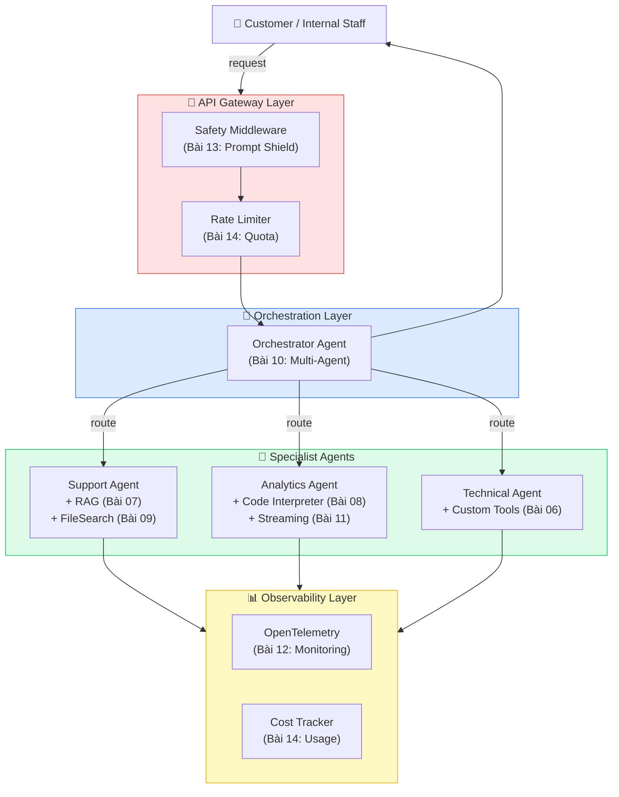
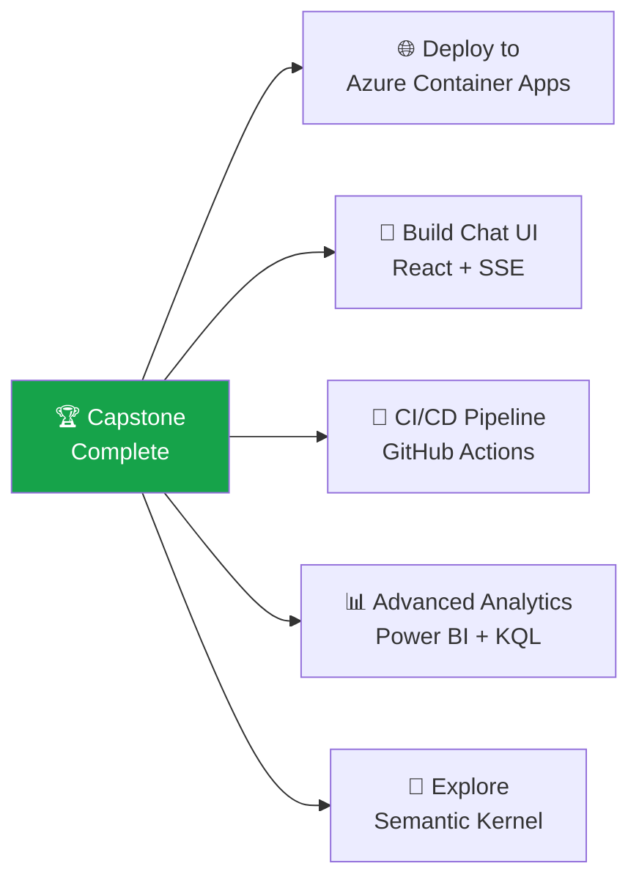

# Bài 15: Capstone — Enterprise Customer Intelligence System

## 📋 Agenda

**Thời gian đọc ước tính:** ~45 phút | 💻 Full Project

### Mục tiêu Capstone:
- ✅ **Tích hợp** toàn bộ kiến thức từ 14 bài học vào một hệ thống hoàn chỉnh
- ✅ **Deploy** Production-ready system lên Azure AI Foundry
- ✅ **Implement** tất cả production concerns: Safety, Monitoring, Cost, Multi-Agent
- ✅ **Hoàn thành** khoá học với portfolio project có thể demo

---

## 📖 Tổng kết hành trình

```mermaid
graph LR
    subgraph F["Part 1: Foundation"]
        B00["Bài 00<br>Overview"]
        B01["Bài 01<br>Ecosystem"]
        B02["Bài 02<br>Foundry"]
        B03["Bài 03<br>Setup"]
    end

    subgraph H["Part 2: Hello Agent"]
        B04["Bài 04<br>Anatomy"]
        B05["Bài 05<br>Hello Agent"]
        B06["Bài 06<br>Tools"]
    end

    subgraph R["Part 3: Recipes"]
        B07["Bài 07<br>RAG"]
        B08["Bài 08<br>Code Interpreter"]
        B09["Bài 09<br>File Search"]
        B10["Bài 10<br>Multi-Agent"]
        B11["Bài 11<br>Streaming"]
    end

    subgraph P["Part 4: Production"]
        B12["Bài 12<br>Monitoring"]
        B13["Bài 13<br>Safety"]
        B14["Bài 14<br>Cost"]
        B15["Bài 15<br>🏆 Capstone"]
    end

    F --> H --> R --> P

    style B15 fill:#16a34a,color:#fff,stroke:#15803d
    style F fill:#dbeafe,stroke:#3b82f6
    style H fill:#dcfce7,stroke:#22c55e
    style R fill:#fef9c3,stroke:#eab308
    style P fill:#fee2e2,stroke:#ef4444
```



---

## 🏗️ Capstone Architecture

**Hệ thống:** Enterprise Customer Intelligence Platform



---

## 💻 Capstone Implementation

### Bước 1: Project Setup

```bash
# Tạo capstone project folder
mkdir capstone
cd capstone

# Khởi tạo virtual environment
python -m venv .venv
source .venv/bin/activate

# Cài đặt tất cả dependencies
pip install \
    azure-ai-projects \
    azure-identity \
    azure-ai-contentsafety \
    azure-monitor-opentelemetry \
    opentelemetry-sdk \
    python-dotenv \
    tenacity
```

```bash
# .env cho capstone
AZURE_AI_PROJECT_CONNECTION_STRING="..."
AZURE_CONTENT_SAFETY_ENDPOINT="..."
AZURE_CONTENT_SAFETY_KEY="..."
APPLICATIONINSIGHTS_CONNECTION_STRING="..."
```

### Bước 2: Core Infrastructure

```python
# filename: capstone/infrastructure.py
"""
Capstone: Shared infrastructure — client, monitoring, safety
Tất cả modules khác import từ đây
"""

import os
from dotenv import load_dotenv
from azure.monitor.opentelemetry import configure_azure_monitor
from opentelemetry import trace

load_dotenv()

# Setup monitoring TRƯỚC mọi thứ khác (Bài 12)
if os.getenv("APPLICATIONINSIGHTS_CONNECTION_STRING"):
    configure_azure_monitor()

from azure.ai.projects import AIProjectClient
from azure.ai.contentsafety import ContentSafetyClient
from azure.ai.contentsafety.models import ShieldPromptOptions
from azure.core.credentials import AzureKeyCredential
from azure.identity import DefaultAzureCredential

tracer = trace.get_tracer("capstone")


def get_project_client() -> AIProjectClient:
    return AIProjectClient.from_connection_string(
        conn_str=os.environ["AZURE_AI_PROJECT_CONNECTION_STRING"],
        credential=DefaultAzureCredential()
    )


def get_safety_client() -> ContentSafetyClient | None:
    endpoint = os.getenv("AZURE_CONTENT_SAFETY_ENDPOINT")
    key = os.getenv("AZURE_CONTENT_SAFETY_KEY")
    if endpoint and key:
        return ContentSafetyClient(
            endpoint=endpoint,
            credential=AzureKeyCredential(key)
        )
    return None


def is_safe_input(safety_client: ContentSafetyClient, user_input: str) -> bool:
    """Quick safety check — trả về True nếu an toàn"""
    if not safety_client:
        return True
    try:
        result = safety_client.shield_prompt(
            options=ShieldPromptOptions(user_prompt=user_input)
        )
        if result.user_prompt_analysis and result.user_prompt_analysis.attack_detected:
            return False
    except Exception:
        pass  # Fail open
    return True
```

### Bước 3: Specialist Agents

```python
# filename: capstone/specialists.py
"""
Capstone: Tạo và quản lý Specialist Agents
"""

from azure.ai.projects import AIProjectClient
from azure.ai.projects.models import FileSearchTool, CodeInterpreterTool


def create_support_agent(client: AIProjectClient, vector_store_id: str = None):
    """
    Support Agent: RAG + Persistent KB
    Xử lý: khiếu nại, câu hỏi chính sách, warranty
    """
    tools = []
    tool_resources = {}

    if vector_store_id:
        fs = FileSearchTool(vector_store_ids=[vector_store_id])
        tools.extend(fs.definitions)
        tool_resources.update(fs.resources)

    return client.agents.create_agent(
        model="gpt-4o",
        name="support-specialist-v1",
        instructions="""Chuyên viên hỗ trợ khách hàng cấp cao.
        
Chuyên môn: Khiếu nại, chính sách đổi trả, bảo hành, câu hỏi sản phẩm.
Attitude: Đồng cảm, kiên nhẫn, solution-oriented.
Rule: Chỉ trả lời dựa trên knowledge base. Không tự bịa chính sách.
Format: Xác nhận vấn đề → Giải pháp → Next steps.""",
        tools=tools,
        tool_resources=tool_resources if tool_resources else None
    )


def create_analytics_agent(client: AIProjectClient, data_file_id: str = None):
    """
    Analytics Agent: Code Interpreter + Streaming
    Xử lý: metrics, báo cáo, phân tích xu hướng
    """
    tools = []
    tool_resources = {}

    ci = CodeInterpreterTool(file_ids=[data_file_id] if data_file_id else [])
    tools.extend(ci.definitions)
    tool_resources.update(ci.resources)

    return client.agents.create_agent(
        model="gpt-4o",
        name="analytics-specialist-v1",
        instructions="""Data Analyst chuyên về business intelligence.

Chuyên môn: Metrics, KPIs, trend analysis, report generation.
Approach: Always start with data exploration → statistics → insights → recommendations.
Format: Markdown với tables và bullet points. Số liệu VNĐ format với dấu chấm ngăn cách.""",
        tools=tools,
        tool_resources=tool_resources if tool_resources else None
    )


def create_technical_agent(client: AIProjectClient):
    """
    Technical Agent: Custom tools cho real-time data
    Xử lý: thông tin kỹ thuật, tích hợp thứ 3, troubleshoot
    """
    # Tool definitions (mock production APIs)
    system_status_tool = {
        "type": "function",
        "function": {
            "name": "get_system_status",
            "description": "Kiểm tra trạng thái hoạt động của các hệ thống: website, API, payment gateway.",
            "parameters": {
                "type": "object",
                "properties": {
                    "system": {
                        "type": "string",
                        "enum": ["website", "api", "payment", "all"],
                        "description": "Hệ thống cần kiểm tra"
                    }
                },
                "required": ["system"]
            }
        }
    }

    order_lookup_tool = {
        "type": "function",
        "function": {
            "name": "lookup_order",
            "description": "Tra cứu thông tin đơn hàng theo mã đơn.",
            "parameters": {
                "type": "object",
                "properties": {
                    "order_id": {
                        "type": "string",
                        "description": "Mã đơn hàng, format: ORD-XXXXXXXX"
                    }
                },
                "required": ["order_id"]
            }
        }
    }

    return client.agents.create_agent(
        model="gpt-4o",
        name="technical-specialist-v1",
        instructions="""Kỹ sư hỗ trợ kỹ thuật và vận hành.

Chuyên môn: Troubleshoot, tra cứu đơn hàng, kiểm tra hệ thống.
Approach: Systematic diagnosis → Root cause → Fix → Prevention.
Important: Luôn dùng tools để lấy data thực tế, không đoán.""",
        tools=[system_status_tool, order_lookup_tool]
    )
```

### Bước 4: Orchestrator + Main System

```python
# filename: capstone/system.py
"""
Capstone: Enterprise Customer Intelligence System — Main Orchestrator
"""

import os
import json
import time
import random
from opentelemetry import trace
from azure.core.exceptions import HttpResponseError

from infrastructure import get_project_client, get_safety_client, is_safe_input, tracer
from specialists import create_support_agent, create_analytics_agent, create_technical_agent

SAFE_FALLBACK = "Xin lỗi, không thể xử lý yêu cầu lúc này. Vui lòng thử lại sau."

MOCK_TOOLS = {
    "get_system_status": lambda args: {
        "system": args.get("system", "all"),
        "status": "operational",
        "uptime_pct": 99.97,
        "last_incident": "None in past 30 days"
    },
    "lookup_order": lambda args: {
        "order_id": args.get("order_id"),
        "status": "Đang vận chuyển",
        "estimated_delivery": "25/04/2025",
        "carrier": "Giao Hàng Nhanh",
        "tracking": "GHN123456789"
    }
}


def execute_tools(run, client, thread_id):
    """Handle tool calls cho Technical Agent"""
    tool_calls = run.required_action.submit_tool_outputs.tool_calls
    outputs = []
    for tc in tool_calls:
        args = json.loads(tc.function.arguments)
        handler = MOCK_TOOLS.get(tc.function.name)
        result = handler(args) if handler else {"error": f"Unknown tool: {tc.function.name}"}
        outputs.append({"tool_call_id": tc.id, "output": json.dumps(result, ensure_ascii=False)})

    return client.agents.submit_tool_outputs_to_run(
        thread_id=thread_id, run_id=run.id, tool_outputs=outputs
    )


def run_specialist(client, agent_id, question, support_thread=None):
    """Chạy specialist agent, handle tool calls nếu cần"""
    thread = client.agents.create_thread() if not support_thread else support_thread

    client.agents.create_message(thread_id=thread.id, role="user", content=question)
    run = client.agents.create_run(thread_id=thread.id, agent_id=agent_id)

    while run.status in ["queued", "in_progress", "requires_action"]:
        time.sleep(0.5)
        run = client.agents.get_run(thread_id=thread.id, run_id=run.id)
        if run.status == "requires_action":
            run = execute_tools(run, client, thread.id)

    if run.status == "completed":
        msgs = client.agents.list_messages(thread_id=thread.id)
        return msgs.data[0].content[0].text.value
    return f"[Specialist error: {run.status}]"


def create_orchestrator(client, support_id, analytics_id, technical_id):
    """Orchestrator với routing logic cho 3 specialists"""
    tools = [
        {
            "type": "function",
            "function": {
                "name": "route_to_support",
                "description": "Route đến Support Specialist. Dùng cho: khiếu nại, đổi trả, bảo hành, câu hỏi chính sách sản phẩm.",
                "parameters": {"type": "object", "properties": {"question": {"type": "string"}}, "required": ["question"]}
            }
        },
        {
            "type": "function",
            "function": {
                "name": "route_to_analytics",
                "description": "Route đến Analytics Specialist. Dùng cho: doanh thu, metrics, KPIs, báo cáo, phân tích data.",
                "parameters": {"type": "object", "properties": {"question": {"type": "string"}}, "required": ["question"]}
            }
        },
        {
            "type": "function",
            "function": {
                "name": "route_to_technical",
                "description": "Route đến Technical Specialist. Dùng cho: tra cứu đơn hàng, trạng thái hệ thống, troubleshoot kỹ thuật.",
                "parameters": {"type": "object", "properties": {"question": {"type": "string"}}, "required": ["question"]}
            }
        }
    ]

    agent_map = {
        "route_to_support": support_id,
        "route_to_analytics": analytics_id,
        "route_to_technical": technical_id
    }

    return client.agents.create_agent(
        model="gpt-4o",
        name="orchestrator-v1",
        instructions="""Smart Router cho Customer Intelligence System.

Nhiệm vụ: Phân tích request → Route đến đúng specialist(s) → Tổng hợp response.

Routing rules:
- Support: khiếu nại, chính sách, bảo hành, câu hỏi sản phẩm
- Analytics: doanh thu, số liệu, KPI, báo cáo, phân tích
- Technical: tra cứu đơn hàng, hệ thống up/down, troubleshoot

Nếu request liên quan nhiều domain → gọi nhiều specialists.
Luôn tổng hợp kết quả thành response mạch lạc, có cấu trúc.""",
        tools=tools
    ), agent_map


class CustomerIntelligenceSystem:
    """Main entry point cho toàn bộ hệ thống"""

    def __init__(self):
        print("🏗️  Initializing Customer Intelligence System...")
        self.client = get_project_client()
        self.safety = get_safety_client()

        # Tạo specialists
        print("   Creating specialists...")
        self.support = create_support_agent(self.client)
        self.analytics = create_analytics_agent(self.client)
        self.technical = create_technical_agent(self.client)

        # Tạo orchestrator
        print("   Creating orchestrator...")
        self.orchestrator, self.agent_map = create_orchestrator(
            self.client,
            self.support.id,
            self.analytics.id,
            self.technical.id
        )

        self.main_thread = self.client.agents.create_thread()
        print("✅ System ready!\n")

    def process(self, user_message: str) -> str:
        """Process user request qua full production pipeline"""
        with tracer.start_as_current_span("customer-intelligence-request") as span:
            span.set_attribute("request.length", len(user_message))

            # Layer 1: Safety check
            if not is_safe_input(self.safety, user_message):
                span.set_attribute("safety.blocked", True)
                return SAFE_FALLBACK

            # Main orchestration
            self.client.agents.create_message(
                thread_id=self.main_thread.id,
                role="user",
                content=user_message
            )
            run = self.client.agents.create_run(
                thread_id=self.main_thread.id,
                agent_id=self.orchestrator.id,
                max_prompt_tokens=4000,
                max_completion_tokens=1000,
                truncation_strategy={"type": "last_messages", "last_messages": 10}
            )

            while run.status in ["queued", "in_progress", "requires_action"]:
                time.sleep(0.5)
                run = self.client.agents.get_run(
                    thread_id=self.main_thread.id, run_id=run.id
                )
                if run.status == "requires_action":
                    # Handle orchestrator tool calls (routing)
                    tool_calls = run.required_action.submit_tool_outputs.tool_calls
                    outputs = []
                    for tc in tool_calls:
                        args = json.loads(tc.function.arguments)
                        specialist_id = self.agent_map.get(tc.function.name)
                        if specialist_id:
                            result = run_specialist(self.client, specialist_id, args["question"])
                        else:
                            result = "Unknown route"
                        outputs.append({"tool_call_id": tc.id, "output": result})

                    run = self.client.agents.submit_tool_outputs_to_run(
                        thread_id=self.main_thread.id,
                        run_id=run.id,
                        tool_outputs=outputs
                    )

            if run.status == "completed":
                msgs = self.client.agents.list_messages(thread_id=self.main_thread.id)
                return msgs.data[0].content[0].text.value

            return SAFE_FALLBACK

    def cleanup(self):
        """Xoá tất cả agents sau khi xong"""
        for agent in [self.support, self.analytics, self.technical, self.orchestrator]:
            self.client.agents.delete_agent(agent.id)
        print("\n🧹 All agents cleaned up!")


def main():
    system = CustomerIntelligenceSystem()

    test_requests = [
        "Máy tính tôi mua 11 tháng bị lỗi màn hình, tôi cần đổi trả.",
        "Doanh thu Q1/2025 tăng bao nhiêu % so với năm ngoái?",
        "Đơn hàng ORD-20250423 của tôi đang ở đâu? Website có đang hoạt động không?",
        "Tôi vừa khiếu nại và muốn biết tỷ lệ đổi trả của công ty hiện tại."  # hybrid
    ]

    print("=" * 65)
    print("🚀 Enterprise Customer Intelligence System — Demo")
    print("=" * 65)

    for request in test_requests:
        print(f"\n👤 Customer: {request}")
        response = system.process(request)
        print(f"\n🤖 System:\n{response}")
        print("─" * 65)

    system.cleanup()


if __name__ == "__main__":
    main()
```

---

## 🎓 Graduation Checklist

Trước khi submit Capstone, kiểm tra:

| Hạng mục | Bài học | Đã implement? |
|---|---|---|
| Azure AI Foundry Hub + Project | Bài 02 | ☐ |
| Python env + DefaultAzureCredential | Bài 03 | ☐ |
| Agent với System Prompt tốt | Bài 04, 05 | ☐ |
| Ít nhất 1 Custom Tool | Bài 06 | ☐ |
| RAG với Vector Store | Bài 07 | ☐ |
| Code Interpreter hoặc File Search | Bài 08, 09 | ☐ |
| Multi-Agent Orchestration | Bài 10 | ☐ |
| Streaming output | Bài 11 | ☐ |
| OpenTelemetry Monitoring | Bài 12 | ☐ |
| Safety check (Prompt Shield) | Bài 13 | ☐ |
| Token budget + Retry logic | Bài 14 | ☐ |
| Error handling đầy đủ | Bài 05, 14 | ☐ |
| Cleanup (delete agents/stores) | Bài 05 | ☐ |

---

## 🚀 Next Steps

**Bạn đã hoàn thành khoá học!** Các hướng phát triển tiếp theo:



**Resources để tiếp tục:**
- [Azure AI Foundry Documentation](https://learn.microsoft.com/en-us/azure/ai-studio/)
- [azure-ai-projects GitHub Examples](https://github.com/Azure/azure-sdk-for-python/tree/main/sdk/ai/azure-ai-projects/samples)
- [Azure AI Agent Service Cookbook](https://learn.microsoft.com/en-us/azure/ai-services/agents/)
- [Semantic Kernel Documentation](https://learn.microsoft.com/en-us/semantic-kernel/)

---

> 🎉 **Chúc mừng!** Bạn đã đi từ "chưa dùng Cloud AI bao giờ" đến việc build và deploy một Enterprise-grade Multi-Agent System trên Azure. Đây là nền tảng vững chắc để bắt đầu hành trình AI Engineering thực chiến.

---

*Made by Anh Tu - Share to be shared*
